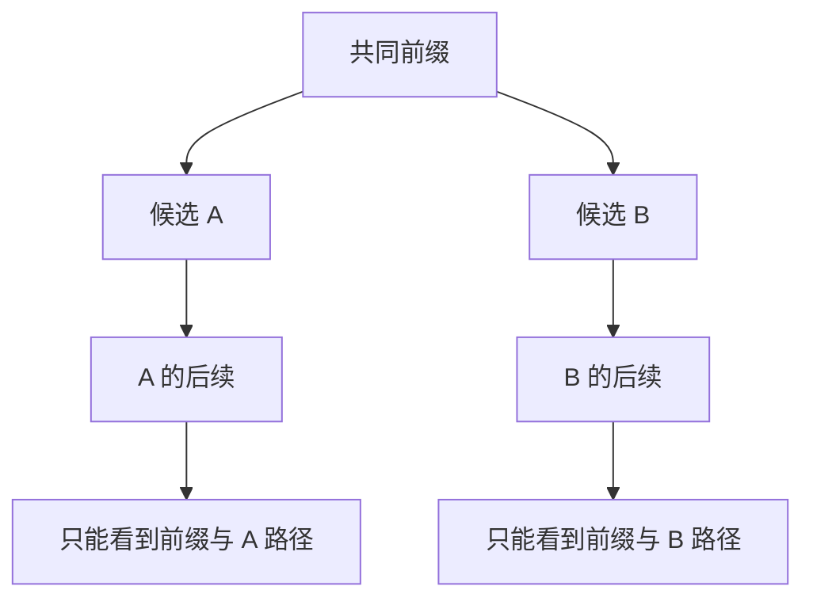

独立 Draft 很像另请一位助手：它便宜，却得自己重新理解整段历史。那能不能让助手直接利用主编已经做过的理解？Target 的隐藏状态已经包含丰富信息，**在这些信息上加小头、接轻量网络，可能比从 Token 开始再跑一个完整模型更划算。**

第五章总览把这类路线放在“Self-Draft”里。本节沿用这个入口，但会区分具体结构：Medusa 添加多预测头，EAGLE 使用适配 Target 的草稿网络，它们通常都需要训练或专用 checkpoint。不能把“复用 Target 信息”理解成“现成模型无需任何准备就能自我起草”。

<!-- more -->

## 📑 目录

- [1. Self-Draft：复用什么，增加什么](#1-self-draft复用什么增加什么)
- [2. Medusa：一次隐藏状态，多个未来预测头](#2-medusa一次隐藏状态多个未来预测头)
- [3. Draft Tree 与 Tree Attention](#3-draft-tree-与-tree-attention)
- [4. EAGLE：从特征出发的轻量草稿](#4-eagle从特征出发的轻量草稿)
- [5. EAGLE-2：把树预算花在更有把握的路径上](#5-eagle-2把树预算花在更有把握的路径上)
- [6. EAGLE-3：改变训练约束与输入信息](#6-eagle-3改变训练约束与输入信息)
- [7. 动手实验：兄弟节点为什么不能互相看见](#7-动手实验兄弟节点为什么不能互相看见)
- [8. 验收与部署：树形计算不自动保证无损](#8-验收与部署树形计算不自动保证无损)
- [总结](#-总结)
- [自我检验清单](#-自我检验清单)
- [参考资料](#-参考资料)

---

## 1. Self-Draft：复用什么，增加什么

“Self-Draft”在不同文献里范围并不完全相同。有的通过跳过 Target 的部分层提议，有的复用隐藏状态但增加辅助模块。本节关注提纲中的 Medusa 与 EAGLE 家族。

| 📊 路线 | 复用的信息 | 新增部分 | 主要准备 |
|---|---|---|---|
| 独立 Draft | Token 历史 | 完整的小模型 | 选择兼容模型 |
| Medusa | Target 当前隐藏状态 | 多个预测头 | 训练未来位置预测 |
| EAGLE / EAGLE-2 | Target 高层特征、Token 信息 | 轻量特征草稿网络 | Target 对应的草稿训练 |
| EAGLE-3 | Target 多层特征与 Token 信息 | 适配的草稿网络 | 改进训练与多步使用方式 |

这些方法改善的是 Proposer。Target 仍需验证候选；辅助模块的权重、激活和缓存也要算入预算。

🔑 **核心概念**：**复用表示，减少重复理解；保留验收，让最终输出由 Target 决定。** 是否严格保分布，还要看具体的采样与接受规则。

---

## 2. Medusa：一次隐藏状态，多个未来预测头

### 2.1 多头怎样减少草稿延迟

普通 LM Head 把当前隐藏状态映射成下一 Token 的分布。Medusa 在同一隐藏状态上附加多个小头，各自学习更远位置的 Token 预测。

可以把第 $k$ 个辅助预测写成：

$$
q^{(k)}=\operatorname{softmax}(g_k(h))
$$

其中 $h$ 是 Target 提供的表示，$g_k$ 是学习到的小模块。普通 LM Head 负责下一位置，辅助头面向更远偏移；代码实现的头编号与偏移约定要单独核对。

这些头可以一起算，不像传统自回归 Draft 必须串行跑多个小模型步骤。但更远的位置只基于当前表示预测，尚未逐一看到未来实际选中的 Token，因此相关性和不确定性处理会更难。

### 2.2 多个候选怎样组成树

如果每个头只选一个 Token，前面错一次，整条候选链很容易断。Medusa 可以为不同偏移保留多个候选，把可能的续写组织成树，让 Target 同时验证多个分支。

这不是无代价地把每头 Top-k 的笛卡尔积全部展开：如果每层都有 $b$ 个分支，深度为 $d$，节点数会迅速增长。需要限制树的大小与结构。

### 2.3 Medusa-1 与 Medusa-2 的基准不同

[Medusa 论文](https://arxiv.org/abs/2401.10774)区分两种训练方式：

- **Medusa-1**：冻结原骨干，主要训练额外预测头。
- **Medusa-2**：骨干与预测头共同训练，获得更适合草稿预测的表示。

第二种方式已经修改 Target 本身。即使对训练后的 Target 使用精确验收，也不能据此宣称输出分布与训练前模型完全相同。

用一个类比：只给主编配助手，与连主编的写作习惯一起重新训练，是两种变化。评测时必须说清“对照的原模型”究竟是哪一个。

---

## 3. Draft Tree 与 Tree Attention

### 3.1 树表示的是不同历史

同一个前缀之后可能是 `return`，也可能是 `raise`；后面的候选分别属于两个不同历史。Tree Attention 让每个节点只看共同前缀和**自己的祖先路径**。



把节点展平成一个数组后，不能直接套普通下三角 Mask。否则后放的 B 分支会读到 A 分支，把原本互斥的续写当成共同历史。

### 3.2 Position ID 也按路径深度

同一层的兄弟节点代表同一个序列位置，应按深度设置位置，而不是按展平后的数组编号不断递增。Mask 管“看谁”，Position ID 管“在什么位置”，两者都必须正确。

所有节点可以读取已有共同前缀的 KV；候选部分则遵守树形祖先关系。最终只提交一条通过验收的连续路径，其他分支的临时 KV 失效。

📌 **关键点**：Tree Attention 是批量计算多条候选历史的办法。它既没有把所有分支拼成一段真实文本，也没有赋予“任挑一条看起来好的路径”以正确性保证。

---

## 4. EAGLE：从特征出发的轻量草稿

### 4.1 为什么研究特征空间

独立小模型从 Token 重新跑网络，可能重复做了 Target 已经完成的工作。EAGLE 利用 Target 的高层表示，用更轻的网络自回归预测后续特征，再转成 Token 候选。

特征保留了语义信息，可以给草稿更好的起点；但“当前特征”并不唯一决定随机采样后要走向哪个未来。不同 Token 分支会对应不同的后续表示。

### 4.2 Token 信息处理未来不确定性

[EAGLE 论文](https://arxiv.org/abs/2401.15077)不仅讨论特征预测，还把已选择的 Token 信息纳入草稿输入，用它约束所预测的未来。不能把它简化成“不看 Token，一直线性外推隐藏状态”。

它仍有一个专门训练的小网络，输出候选仍交给 Target 验证。较准确的草稿可能提高接受前缀长度，但结构、隐藏维度、特征层和训练 Target 都必须匹配。

⚠️ **注意**：EAGLE checkpoint 不是一个可以随意挂到任意 8B 模型上的通用附件。相同参数规模、相似模型名，都不能替代来源与版本检查。

---

## 5. EAGLE-2：把树预算花在更有把握的路径上

### 5.1 固定树为什么浪费

固定结构对每轮使用同样的深度和分支数。但有的历史只有一条明显续写，适合走深；有的历史早期就有多个可能分支，适合分配宽度。

[EAGLE-2](https://arxiv.org/abs/2406.16858)利用草稿置信度与接受可能性的关系，动态扩展和重排候选树，把有限节点预算用于更有希望的部分。

### 5.2 不能只看当前节点的置信度

一个节点自身置信度为 0.95，但祖先只可能有 0.1 的接受机会，它被最终提交的机会仍然很小。树上路径必须从根连续通过，常用的近似评分考虑沿途置信度乘积：

$$
v(u)\approx\prod_{j\in\operatorname{path}(u)}c_j
$$

$c_j$ 是草稿置信度，$v(u)$ 是路径价值的估计。它帮助分配搜索预算，但不是取代 Target 的精确验收概率。

### 5.3 校准是经验关系，不是数学恒等式

论文观察到草稿置信度与实际接受率具有相关性，才能据此动态扩树。新模型、新温度或新任务下仍需验证这个关系。

“置信度 0.8”不表示任何场景都保证 80% 接受。EAGLE-2 的重点在推理时的树构建，并不是把第 5.1 节的接受公式改成直接按置信度放行。

---

## 6. EAGLE-3：改变训练约束与输入信息

EAGLE-3 不只是“EAGLE-2 的树再大一点”。[论文](https://arxiv.org/abs/2503.01840)强调了三类变化：

1. **不再强制草稿输出拟合 Target 的特定未来特征**，把目标更多转向 Token 预测。
2. **融合不同层的信息**，而不是只依赖单一高层特征。
3. **Training-time Test**：在训练中引入更接近实际多步草稿使用的过程，使训练方式适应推理时自己的中间表示。

这里的“Test”不是拿业务评测集参与训练，也不是部署时重新训练 Target；它描述训练过程中模拟草稿在测试阶段怎样继续预测。

可以这样理解：要求助手先逐笔复刻主编的脑内草图，再写文本，会限制它的表达；放宽这个约束，同时让它在训练中练习多步续写，可能更适合真正的任务。

📌 **关键点**：EAGLE、EAGLE-2、EAGLE-3 不是单纯按年份排列的三个开关。它们分别涉及草稿表示、树搜索和训练设计，部署必须使用相应产物与实现。

---

## 7. 动手实验：兄弟节点为什么不能互相看见

下面只生成树形 Mask，不做 Attention。节点 0 是根，1 和 2 是兄弟，3 属于 1，4 属于 2；共同的已提交历史不包含在这个小矩阵中。

```python
parents = [-1, 0, 0, 1, 2]
mask = [[0] * len(parents) for _ in parents]
depth = [0] * len(parents)

for node, parent in enumerate(parents):
    assert parent < node
    depth[node] = 0 if parent == -1 else depth[parent] + 1
    cursor = node
    while cursor != -1:
        mask[node][cursor] = 1
        cursor = parents[cursor]

print("候选树的相对 Position ID:", depth)
for row in mask:
    print(row)
assert mask[3] == [1, 1, 0, 1, 0]
assert mask[4] == [1, 0, 1, 0, 1]
assert depth[1] == depth[2] == 1
```

节点 4 在数组中排得晚，却不能看见节点 1 和节点 3。用普通下三角 Mask 会把这些兄弟分支错误地暴露给它。

真实实现还要加入共同前缀、缓存块表、不同请求的树边界，并适配 Attention Kernel。这个例子检验的是数据流约束，不是生产 Kernel。

---

## 8. 验收与部署：树形计算不自动保证无损

### 8.1 Medusa 的 Typical Acceptance 要单独看

Medusa 讨论精确采样，也提出 Typical Acceptance：基于 Target 概率与阈值接受“合理候选”，以提高接受长度。这类近似策略可能保持任务质量，但**不能直接套用标准 Rejection Sampling 的严格保分布证明**。

对冻结骨干、联合训练、贪心匹配、精确随机采样和 Typical Acceptance，评测报告应逐项写明；“用了 Medusa”本身无法回答输出保证。

### 8.2 Token 验证、并行前向与 Block Verification

要分清三件事：

- **并行前向**：一次 Target 调用计算多个位置或树节点。
- **标准 Token 级验收**：候选从前往后按接受规则核验，首个拒绝即停止。
- **Block Verification**：联合考虑整块的验收与修正，是另一类采样算法。

[Block Verification 论文](https://arxiv.org/abs/2403.10444)研究在保分布条件下提高预期提交长度。它不是“把几个 Token 放进同一个 Tensor”就自动得到的效果，也不是 Medusa 或 EAGLE-3 的同义词。使用时必须配套相应概率规则与框架实现。

### 8.3 框架支持与论文结构是两张表

vLLM 的 `method="eagle"`、`method="eagle3"` 是加载与执行约定。论文中的动态树、具体 Mask 和候选搜索，不应被推断为所有后端都会逐项复现。

部署时核对 Target revision、辅助 checkpoint、特征层、词表、dtype、量化配置和实际后端。树节点更多还会增加验证计算与临时 KV，应由性能曲线决定预算。

---

## 📝 总结

- Target 表示可以帮助便宜地生成草稿，但辅助模块通常需要训练和专用产物。
- Medusa 多头并行预测不同未来偏移，避免逐步运行独立 Draft。
- Medusa-1 冻结骨干，Medusa-2 联合训练，二者的质量基准需要区分。
- Tree Attention 只允许共同前缀与祖先路径，Position ID 按深度设置。
- EAGLE 使用特征与 Token 信息，不能简化成无条件特征外推。
- EAGLE-2 依据路径置信度动态分配树预算，置信度不是最终验收规则。
- EAGLE-3 改变特征约束、输入融合和训练过程，不只是加深树。
- Typical Acceptance、标准验收与 Block Verification 的保证不同，框架支持也要分别确认。

## 🎯 自我检验清单

- 能说明复用 Target 表示与独立小模型的差别
- 能解释 Medusa 多头怎样提议更远位置，以及为什么存在不确定性
- 能区分 Medusa-1 与 Medusa-2 的训练与对照基准
- 能画出 Tree Attention 的祖先关系并给兄弟节点正确的位置编号
- 能解释 EAGLE 为什么需要 Token 信息与匹配的辅助模型
- 能说明路径置信度乘积为什么比只看叶子置信度更合理
- 能列出 EAGLE-3 相对前两代的主要变化
- 能区分并行验证计算、Token 级验收和 Block Verification
- 能说明“任务质量相近”为什么不等于“严格保分布”

## 📚 参考资料

- [Medusa: Simple LLM Inference Acceleration Framework with Multiple Decoding Heads（Cai et al., 2024）](https://arxiv.org/abs/2401.10774)
- [FasterDecoding — Medusa 官方实现](https://github.com/FasterDecoding/Medusa)
- [EAGLE: Speculative Sampling Requires Rethinking Feature Uncertainty（Li et al., 2024）](https://arxiv.org/abs/2401.15077)
- [EAGLE-2: Faster Inference of Language Models with Dynamic Draft Trees（Li et al., 2024）](https://arxiv.org/abs/2406.16858)
- [EAGLE-3: Scaling up Inference Acceleration of Large Language Models via Training-Time Test（Li et al., 2025）](https://arxiv.org/abs/2503.01840)
- [Safe AI Lab — EAGLE 官方实现](https://github.com/SafeAILab/EAGLE)
- [Block Verification Accelerates Speculative Decoding（Sun et al., 2024）](https://arxiv.org/abs/2403.10444)
- [vLLM — EAGLE Draft Models](https://docs.vllm.ai/en/stable/features/speculative_decoding/eagle/)
