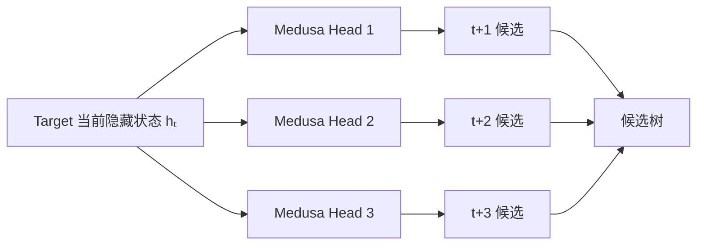
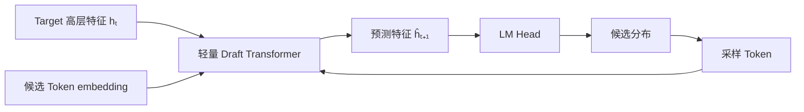

独立 Draft Model 需要第二套完整 Transformer。Self-Draft 的核心问题是：

> Target 已经算出了高质量隐藏状态，能否只加少量模块，就从这些状态中提取多个未来候选？

Medusa、EAGLE 和 MTP 都回答“可以”，但它们并不是同一种结构：

- Medusa 从同一隐藏状态用多个 Head 预测不同未来位置。
- EAGLE 用轻量模块在特征/Token 条件下继续自回归。
- EAGLE-2/3 改进动态树和训练目标。
- MTP 把多 Token 预测能力直接训练进主模型 checkpoint。

它们最终都会遇到同一个系统难点：多个候选如何构成树，Target 如何用正确 mask 一次验证，哪些 KV 可以提交，未选路径如何回收。

<!-- more -->

## 1. 为什么候选要从链扩展成树

经典 Draft Model 产生一条链：

```text
the → cat → sits → on
```

若第二位 `cat` 被拒绝，后面全部浪费。

假设 Proposer 在第一位的概率为：

```text
the: 0.45
a:   0.35
one: 0.10
...
```

只选 `the` 会丢掉 `a` 这条也很可能被 Target 接受的路径。若额外 Head 或轻量 Draft 能廉价地产生多个候选，就可构造树：

```text
root
├── the
│   ├── cat
│   │   ├── sits
│   │   └── runs
│   └── dog
└── a
    ├── cat
    └── dog
```

Target 一次验证所有节点，再选出一条合法路径。

### 1.1 树解决了什么

树提高的是：

$$
P(\text{至少有一条长路径与 Target 一致})
$$

它用“宽度”对抗早期分支不确定性，用“深度”追求一次提交更多 Token。

### 1.2 树制造了什么成本

若每层保留 \(b\) 个分支，深度 \(d\)，完整树节点数为：

$$
N_{\text{tree}}
=\sum_{i=1}^{d}b^i
=\frac{b^{d+1}-b}{b-1}
$$

宽度 4、深度 5 就有：

$$
4+16+64+256+1024=1364
$$

Target 验证 1364 个节点显然不划算。因此实际系统要在固定节点预算下剪枝，而不是构造完整笛卡尔积。

---

## 2. Tree Attention 的因果语义

普通 causal attention 中，位置 \(i\) 可以看见所有更早位置。把树节点打包成一条数组后，“数组中更早”不等于“自己的祖先”。

假设打包顺序：

```text
index 0: the        parent=root
index 1: a          parent=root
index 2: cat        parent=the
index 3: dog        parent=the
index 4: cat        parent=a
```

节点 `index 4: cat` 应看见：

```text
真实历史 + a + 自己
```

不能看见：

```text
the、the→cat、the→dog
```

### 2.1 Mask 定义

记节点 \(u\) 的祖先集合为 \(\operatorname{Anc}(u)\)。树 mask：

$$
M_{uv}=
\begin{cases}
0, & v\in\operatorname{Anc}(u)\cup\{u\}\\
-\infty, & \text{otherwise}
\end{cases}
$$

对真实历史前缀 KV，则所有树节点都可见。

### 2.2 一个显式矩阵

对上述 5 个节点，只看树内可见性：

| Query \ Key | the | a | the→cat | the→dog | a→cat |
|---|---:|---:|---:|---:|---:|
| the | ✓ |  |  |  |  |
| a |  | ✓ |  |  |  |
| the→cat | ✓ |  | ✓ |  |  |
| the→dog | ✓ |  |  | ✓ |  |
| a→cat |  | ✓ |  |  | ✓ |

若错误地使用普通下三角 causal mask，`a→cat` 会读到前面四个节点，发生跨分支信息泄漏。此时 Target logits 不再对应：

$$
p(\cdot\mid\text{真实历史},a)
$$

而对应一个从未存在的混合前缀，验证结果失去概率意义。

### 2.3 Position ID

树节点的 position 由路径深度决定，而不是打包数组下标。

```text
真实前缀长度 = t
depth 1 节点 position = t
depth 2 节点 position = t+1
depth 3 节点 position = t+2
```

同一深度的多个兄弟共享逻辑 position。对 RoPE 模型，若直接使用 packed index，会给不同分支错误旋转位置。

---

## 3. 树节点的 KV 路径

Target 验证每个树节点时都会产生该节点的 K/V。逻辑上，一条路径的 KV 是：

```text
共享历史 KV
+ root→当前节点祖先 KV
+ 当前节点 KV
```

### 3.1 为什么不能简单按数组连续存储解释路径

packed buffer 可能是：

```text
[the, a, cat_under_the, dog_under_the, cat_under_a]
```

但 `cat_under_a` 的逻辑 KV 链不是 buffer 前四项，而是：

```text
[共享历史] + [a] + [cat_under_a]
```

Attention backend 需要通过 block table、slot mapping 或 tree metadata 找到正确祖先。

### 3.2 Commit

假设最终接受路径：

```text
root → a → cat
```

应：

1. 把 `a` 和 `cat_under_a` 标为已提交。
2. 将其 KV 变成请求后续 Decode 的连续逻辑前缀。
3. 释放 `the` 分支和其他兄弟节点的 KV slot。
4. 更新序列长度和 position。
5. 同步 Proposer 状态。

### 3.3 Rollback

若只接受 `a`，其子节点都不能保留。KV 回滚错误常表现为：

- 后续输出在固定位置开始异常；
- batch=1 正常，高并发错乱；
- 长序列后出现非法内存或 OOM；
- baseline 与 speculative 贪心输出不一致。

树式投机的正确性不仅是验收公式，还是 mask、position、slot 和回收四者一致。

---

## 4. Medusa：多个 Head 并行看未来

普通 LM Head 从当前隐藏状态 \(h_t\) 预测下一 Token：

$$
P(x_{t+1}\mid x_{\le t})
=\operatorname{softmax}(W_{\text{LM}}h_t)
$$

Medusa 添加多个 Head：

$$
P_k(x_{t+k}\mid x_{\le t})
=\operatorname{softmax}(W_k f_k(h_t))
$$

其中 \(k=1,\ldots,K\)，\(f_k\) 通常是轻量层。

### 4.1 结构直觉



所有 Head 可并行运行，Draft 延迟很低。

### 4.2 独立远期预测的局限

Head 3 试图预测 \(x_{t+3}\)，却没有看到真实的 \(x_{t+1},x_{t+2}\)。它实际学习的是边缘化后的远期分布：

$$
P(x_{t+3}\mid x_{\le t})
=\sum_{x_{t+1},x_{t+2}}
P(x_{t+1:t+3}\mid x_{\le t})
$$

当未来分支多时，远期 Head 不确定性迅速增大。

例如：

```text
The animal is a ...
```

若第一位可能是 `cat/dog/bird`，第三位的合理 Token 强依赖第一二位。多个独立 Head 的 top-k 不能随意组合成所有路径。

---

## 5. Medusa 候选树如何构造

假设三个 Head 各取 top-2：

```text
Head 1: [the, a]
Head 2: [cat, dog]
Head 3: [sits, runs]
```

笛卡尔积有 \(2^3=8\) 条深度 3 路径。更大 top-k 和深度会指数增长。

### 5.1 预设树

Medusa 常使用 tree choices，预先规定保留哪些分支形状：

```text
[0]          # Head1 top-1
[1]          # Head1 top-2
[0,0]        # Head1 top-1 → Head2 top-1
[0,1]        # Head1 top-1 → Head2 top-2
[0,0,0]      # 最可能的深链
```

这相当于把节点预算更多给高排名路径。

### 5.2 验证

构树后：

1. 按父节点关系打包 Token。
2. 生成 tree attention mask。
3. 设置逻辑 position。
4. Target 一次前向得到每个节点 logits。
5. 从根开始选择可接受分支。

不同 Medusa 实现可能使用 greedy、typical acceptance 或其他规则。只有严格满足 5.1 概率条件的路径才能声称保持原 Target 分布。

### 5.3 Medusa-1 与 Medusa-2

Medusa-1：

- 冻结 Backbone。
- 只训练额外 Heads。
- 训练成本较低。
- 不改变主模型参数。

Medusa-2：

- Backbone 与 Heads 联合微调。
- 候选预测可能更强。
- 需要平衡主任务与多步预测损失。
- 不当训练可能改变 Target 本身的质量。

“在线不加载第二套模型”不意味着离线训练免费。

---

## 6. EAGLE：在特征空间继续自回归

EAGLE 认为直接预测远期离散 Token 很难，而 Target 的高层特征已经包含丰富上下文。它训练轻量 Draft 模块，预测下一步特征，并结合向前错位的 Token embedding。

概念结构：



与 Medusa 的关键差异：

- Medusa 的多个 Head 主要从同一 \(h_t\) 独立预测不同 offset。
- EAGLE 的 Draft 模块沿候选路径自回归，后一步显式依赖前一步候选。

### 6.1 为什么要输入 Token embedding

只预测下一特征会遇到 feature uncertainty：相似隐藏特征可能对应不同离散 Token 分支。将采样出的 Token embedding 输入下一步，可以告诉 Draft：

```text
上一轮实际选择了哪条离散路径
```

从而减少特征演化的歧义。

### 6.2 为什么它比完整 Draft 轻

完整 Draft 要从 Token 序列重新经过许多 Transformer 层。EAGLE 直接复用 Target 已计算的高层语义，只学习局部演化：

$$
(\hat h_{t+1},q_{t+1})
=g_\phi(h_t,e(x_t))
$$

模块层数和参数量通常远小于 Target。

### 6.3 仍然是专用权重

EAGLE Draft 与 Target 的：

- hidden size；
- layer feature；
- vocabulary；
- LM Head；
- model revision；

紧密耦合。不能把“同架构、同尺寸”的 EAGLE 权重随意接到另一个微调版本。即使能加载，特征分布偏移也可能让接受率崩溃。

---

## 7. EAGLE 的树生成

EAGLE 可沿多条路径滚动轻量 Draft：

```text
第 1 层：从 root 取 top-k
第 2 层：扩展保留的第 1 层节点
第 3 层：继续扩展高分路径
```

路径分数常可抽象为：

$$
s(v_{1:d})
=\prod_{i=1}^{d}
q(v_i\mid v_{<i},h_t)
$$

为避免下溢，工程中通常累加 log probability：

$$
\log s
=\sum_{i=1}^{d}\log q(v_i\mid\cdots)
$$

固定预算下，可以：

- 每层固定宽度；
- 全局保留 top-N 路径；
- 用静态 tree choices；
- 用动态优先队列扩展。

Target 验证阶段与第 2 节的 tree mask/KV 语义相同。

---

## 8. EAGLE-2：动态草稿树

静态树假设所有上下文都适合同样的宽深分配，但实际差异很大：

```text
"1 + 1 ="          高置信、适合向深处扩
"Write a story"    分支多、适合保留宽度
```

EAGLE-2 使用 Draft 置信度近似节点被接受的价值，并动态构树。

### 8.1 Expansion

维护候选前沿：

```python
def expand(root, node_budget):
    frontier = MaxHeap()
    frontier.push(root, score=0.0)  # log probability
    nodes = []

    while frontier and len(nodes) < node_budget:
        parent = frontier.pop()
        for token, logprob in draft_topk(parent):
            child = Node(
                token=token,
                parent=parent,
                depth=parent.depth + 1,
                score=parent.score + logprob,
            )
            nodes.append(child)
            frontier.push(child, score=child.score)
            if len(nodes) == node_budget:
                break

    return nodes
```

### 8.2 Reranking

扩展出来的节点还需：

- 去除重复路径；
- 保证父节点一定在子节点前；
- 在固定 Verify budget 下重排；
- 生成紧凑 packed layout。

### 8.3 动态树的代价

- top-k 与优先队列控制开销；
- batch 内每个请求树形状不同；
- CUDA Graph 捕获更难；
- 置信度在领域外可能失准；
- 更高 Draft 分数不等于更高 Target 接受率。

所以动态树也要测 calibration：

```text
按 Draft score 分桶 → 统计真实 Target 接受概率
```

若高分桶不再对应高接受，动态预算会分配错误。

---

## 9. EAGLE-3：直接优化多步 Token 预测

原始 EAGLE 以特征预测为重要中间目标。EAGLE-3 进一步强调两个变化：

1. 融合 Target 多层特征。
2. 通过 training-time test 直接优化推理时的多步 Token 预测。

### 9.1 多层特征融合

不同层包含不同信息：

```text
低层：词法、局部模式
中层：句法、结构
高层：语义、任务意图
```

抽象表示：

$$
z_t
=F(h_t^{(\ell_1)},h_t^{(\ell_2)},h_t^{(\ell_3)})
$$

EAGLE-3 Draft 从融合特征 \(z_t\) 直接预测后续 Token。

### 9.2 Training-time Test

普通 teacher forcing 训练时，下一步总看到真实前一步；推理时，下一步看到的是 Draft 自己采出的候选。这造成 exposure bias。

Training-time test 在训练中展开 Draft 自己的多步路径：

```text
训练第 1 步预测
→ 用自己的第 1 步结果构造第 2 步输入
→ 继续预测第 2/3/... 步
→ 对真实推理路径计算损失
```

这样优化目标更接近部署时“连续起草若干步”的行为。

### 9.3 部署代价

EAGLE-3 仍需：

- 与 Target 精确匹配的 speculator 权重；
- 抽取多个层的 hidden states；
- 融合模块；
- Draft 自回归与候选树；
- 专用加载和 kernel 路径。

多层特征可能增加 Target forward 的输出/保存成本，必须计入端到端测量。

---

## 10. MTP：把 Proposer 训练进主模型

Multi-Token Prediction 在预训练或后训练阶段加入未来多 Token 目标：

$$
\mathcal L
=\mathcal L_{\text{next-token}}
+\sum_{k=2}^{D}
\lambda_k\mathcal L_k
$$

其中：

$$
\mathcal L_k
=-\log P_k(x_{t+k}\mid x_{\le t},\text{module state})
$$

MTP 既可能用于改善训练信号，也可能把附加模块保留到推理时作为 Proposer。

### 10.1 并行 Head 型

从同一隐藏状态并行预测多个 offset，结构接近 Medusa：

```text
hₜ → head1: xₜ₊₁
   → head2: xₜ₊₂
   → head3: xₜ₊₃
```

优点是并行，缺点是远期 Head 缺少中间离散条件。

### 10.2 顺序 MTP 模块

DeepSeek-V3 一类设计使用顺序 MTP：

```text
主模型 hidden
→ MTP module 1 + future token embedding
→ MTP module 2 + next future token embedding
→ ...
```

模块可共享 embedding 和 output head，保留更强的条件链。

### 10.3 为什么 MTP 不是配置魔法

对任意旧 checkpoint 写：

```json
{"method":"mtp","num_speculative_tokens":1}
```

不会凭空生成 MTP 权重。必须同时满足：

1. checkpoint 内存在兼容 MTP 模块或 assistant checkpoint；
2. config 描述这些模块；
3. vLLM 实现该模型类型；
4. 权重加载、KV 共享和验证路径匹配。

---

## 11. MTP 的 KV 与共享

不同模型家族的 MTP 实现不同，不能统一假设“完全无额外 KV”。

可能设计：

- MTP 模块只消费 Target hidden state，不维护长历史 KV。
- MTP 模块有自己的轻量 KV。
- Assistant 层与 Target 共享部分 KV Cache。
- 多个 MTP 深度顺序执行并产生临时状态。

例如 vLLM v0.27.1 的 Gemma 4 assistant 走 `Gemma4MTPModel`，assistant layers 与 Target 共享 KV Cache；它不是通用 Draft Model。

部署前应检查：

```text
额外权重多少？
是否额外分配 KV？
KV 是否与 Target 共享？
最大支持深度是多少？
是否支持当前量化和并行方式？
```

---

## 12. 统一的树式验证实现

无论 Proposer 来源是什么，系统骨架可抽象为：

```python
def tree_speculative_round(req, proposer, target, budget):
    # 节点必须记录 token、parent、depth、proposal score
    nodes = proposer.build_tree(
        committed_tokens=req.tokens,
        target_features=req.hidden_states,
        node_budget=budget,
    )

    packed = pack_tree(nodes)
    # packed.tokens
    # packed.parent_ids
    # packed.position_ids
    # packed.tree_mask
    # packed.slot_mapping

    scores, candidate_kv = target.verify_tree(
        historical_kv=req.target_kv,
        token_ids=packed.tokens,
        position_ids=packed.position_ids,
        attention_mask=packed.tree_mask,
        slot_mapping=packed.slot_mapping,
    )

    accepted_nodes, correction = select_path(
        nodes=nodes,
        target_scores=scores,
        sampling_state=req.sampling_state,
    )

    req.target_kv.commit_path(accepted_nodes, correction)
    req.target_kv.free_other_nodes(nodes, accepted_nodes)
    proposer.sync_after_commit(req, accepted_nodes, correction)
```

### 12.1 必须保持的五个不变量

1. 每个节点只看真实历史和自己的祖先。
2. position ID 等于真实前缀长度加路径深度。
3. 子节点的 parent 必须存在且先于提交。
4. 只有最终接受路径 KV 可进入下一轮。
5. 采样验证规则必须与声称的正确性保证一致。

---

## 13. 训练成本对比

### 13.1 Medusa-1

训练：

- 冻结 Target。
- 保存或在线计算 hidden states。
- 训练多个未来 Head。

成本较低，但远期预测上限受固定 \(h_t\) 约束。

### 13.2 Medusa-2

训练：

- 联合更新 Backbone 和 Heads。
- 需要主 LM loss 与辅助 loss 配比。
- 需要质量回归评估。

成本高，且产生新的 Target checkpoint。

### 13.3 EAGLE/EAGLE-3

训练：

- 读取 Target 中间特征；
- 训练轻量自回归模块；
- 多步展开；
- EAGLE-3 融合多层并进行 training-time test。

数据和 Target revision 必须匹配。自有 SFT/LoRA 模型若特征变化明显，现成 EAGLE 权重可能不再适用。

### 13.4 MTP

训练：

- 在主模型训练目标中加入多 Token 模块；
- 增加训练 FLOPs 和激活；
- 需要从预训练/继续训练阶段设计。

部署最简，但前置训练侵入最大。已有模型通常无法低成本补成“原生 MTP”。

---

## 14. 在线部署成本对比

| 路线 | 在线额外权重 | Draft 串行性 | 候选结构 | Target 耦合 | 主要在线风险 |
|---|---:|---:|---|---|---|
| Medusa | 小 | 低 | 预设树常见 | 高 | 树节点膨胀 |
| EAGLE | 小 | 有，模块轻 | 链/树 | 很高 | 专用权重与特征 |
| EAGLE-2 | 小 | 有 | 动态树 | 很高 | 构树与 shape |
| EAGLE-3 | 小 | 有 | 动态/静态树 | 很高 | 多层特征与兼容 |
| 原生 MTP | checkpoint 内 | 依结构 | 链/树 | 原生 | 模型类型支持 |

“Self-Draft”只表示不加载第二套完整 LLM，不表示：

- 零训练；
- 零额外显存；
- 零 KV；
- 零 Verify；
- 任意模型兼容。

---

## 15. 与 Continuous Batching 的交互

树式投机会把每个请求扩成多个验证节点。

若请求数为 \(B\)，平均树节点为 \(N\)：

$$
B_{\text{effective}}
\approx B\cdot N
$$

### 15.1 低并发

- GPU 有空闲计算能力。
- 树验证提高算术强度。
- 长接受路径降低 Target 串行轮数。

### 15.2 高并发

- 普通 Decode 已形成大 batch。
- 树节点挤占其他请求 Token Budget。
- 动态树造成 shape 不稳定。
- 高峰吞吐可能下降。

### 15.3 适应策略

- 限制 node budget；
- batch 增大时降深或关闭；
- 对高接受请求使用更大树；
- 将 Prefill 和 tree verify 置于统一 SLO 调度；
- 记录每请求树节点利用率。

---

## 16. 与量化、并行和长上下文的交互

### 16.1 量化

Target 量化会：

- 加快基线 Decode；
- 改变 Verify kernel；
- 轻微改变 logits，进而改变分支选择；
- 影响隐藏特征分布。

EAGLE 权重若在 BF16 Target 特征上训练，接入量化 Target 后要重新验证接受率与质量。结构兼容不等于统计兼容。

### 16.2 Tensor Parallel

树节点增多会扩大每轮本地计算；Draft Head/模块的 vocab logits 可能需要 all-gather。vLLM 可对部分 greedy non-tree 路径做 local argmax reduction，但树式多候选通常仍有自己的通信要求。

### 16.3 Pipeline Parallel

PP 会增加每轮流水线 bubble 与候选传递复杂度。兼容性按版本变化；vLLM v0.27.1 文档仅明确 `<=0.15.0` 不可组合，不能据此推导所有模型/方法在 0.27.1 都已完全验证。

### 16.4 长上下文

Tree Verify 每个节点都要读共享历史 KV。树分支共享逻辑历史，但 Attention 对每个 query 仍需访问相关 KV。上下文越长：

- Attention 带宽越高；
- 候选节点临时 KV 越多；
- Verify 不再只是“多读一次权重”；
- 最优树预算可能下降。

---

## 17. 实验：树不是越大越好

对固定模型和数据，扫描：

```text
深度：1 / 2 / 3 / 5 / 8
节点预算：4 / 8 / 16 / 32 / 64
并发：1 / 8 / 32 / 饱和点
上下文：512 / 4K / 32K
```

记录：

- 平均树节点数；
- 最终提交路径长度；
- 被提交节点 / 被验证节点比；
- 每深度存活率；
- Draft tree build 时间；
- Target verify 时间；
- KV 临时峰值；
- TPOT 与 goodput。

### 17.1 树利用率

定义：

$$
U_{\text{tree}}
=\frac{\text{最终接受 Draft 节点数}}
{\text{总验证树节点数}}
$$

它不是唯一指标，但能识别“接受长度提高一点，却验证了大量旁支”的情况。

### 17.2 Calibration

对 EAGLE-2/3 的路径分数分桶：

| Draft score 桶 | 平均预测分数 | Target 实际存活率 |
|---|---:|---:|
| 0.9–1.0 | 0.94 |  |
| 0.7–0.9 | 0.81 |  |
| 0.5–0.7 | 0.60 |  |
| <0.5 | 0.31 |  |

若预测分数与实际接受率严重偏离，动态构树的依据已失效。

### 17.3 正确性

至少包含：

- greedy baseline Token ID 对照；
- 随机采样分布检查；
- 不同树 shape；
- batch 内一部分请求提前 EOS；
- 长上下文跨 KV block；
- structured output mask；
- OOM 后恢复和取消请求。

---

## 18. 如何选择

### 有原生 MTP checkpoint

先测 vLLM 已支持的 `method: mtp`，从深度 1 开始。它通常部署最简单，但仍要确认模型支持的 MTP 深度和并行/量化组合。

### 有精确匹配的 EAGLE-3 权重

适合通用低延迟场景。重点核对：

- Target revision；
- hidden layer 映射；
- tokenizer；
- draft TP；
- 节点预算；
- 高并发退化点。

### 自有微调模型且能训练

- 只愿训练少量参数：先评估 Medusa-1。
- 需要更强多步条件关系：评估 EAGLE 类。
- 能改主训练流程：再考虑原生 MTP。

### 无法训练附加权重

退回同家族独立 Draft、N-gram 或 Suffix。Self-Draft 不是必须项。

---

## 19. 原理—实现—实验—边界闭环

### 原理

Self-Draft 复用 Target 特征或原生附加模块，以较低在线成本产生多个未来候选；候选树用宽度提升命中概率。

### 实现

- Medusa：多个 offset Head。
- EAGLE：特征/Token 条件下轻量自回归。
- EAGLE-2：置信度驱动动态树。
- EAGLE-3：多层特征 + training-time test + 直接 Token 目标。
- MTP：checkpoint 原生多 Token 模块。

所有树式方案都必须正确生成 parent、mask、position、slot mapping 和提交路径。

### 实验

扫描深度与节点预算，测 tree utilization、calibration、逐位置存活、Verify/KV 成本、低高并发性能和输出正确性。

### 边界

- 远期独立 Head 不知道中间真实 Token。
- 动态树依赖 Draft 置信度校准。
- EAGLE 权重与 Target revision 高度耦合。
- MTP 不能由配置凭空产生。
- 树越大，Verify、KV、调度与通信成本越高。

---

## 📝 总结

- Medusa 用多个轻量 Head 并行预测未来 offset，再把高价值组合成候选树。
- EAGLE 在 Target 特征基础上轻量自回归，保留候选间条件关系。
- EAGLE-2 动态分配树预算；EAGLE-3 用多层特征和多步训练直接优化 Token 提案。
- MTP 把多 Token 能力放进模型 checkpoint，但只有引擎支持的原生模型才能启用。
- Tree Attention 的 mask 必须只允许“真实历史 + 自己祖先”，position 必须按路径深度设置。
- 最终只提交一条接受路径的 KV，其他分支必须释放。
- 训练成本、专用权重、树 Verify 和临时 KV 都属于 Self-Draft 的真实代价。

## 🎯 自我检验清单

- 能画出链式候选和树式候选的差别。
- 能手写一个 5 节点 tree attention 可见矩阵。
- 能解释 packed index 为什么不能直接当 position ID。
- 能说明树节点 KV 如何提交和回收。
- 能区分 Medusa 的独立 offset Head 与 EAGLE 自回归 Draft。
- 能解释 EAGLE-2 动态树为什么依赖 calibration。
- 能说出 EAGLE-3 的多层融合与 training-time test。
- 能判断某 checkpoint 是否具备原生 MTP 前置条件。
- 能设计节点预算、并发和上下文长度三维实验。

## 📚 参考资料

1. Cai et al., [Medusa: Simple LLM Inference Acceleration Framework with Multiple Decoding Heads](https://proceedings.mlr.press/v235/cai24b.html), ICML 2024.
2. Li et al., [EAGLE: Speculative Sampling Requires Rethinking Feature Uncertainty](https://arxiv.org/abs/2401.15077), 2024.
3. Li et al., [EAGLE-2: Faster Inference of Language Models with Dynamic Draft Trees](https://aclanthology.org/2024.emnlp-main.422/), EMNLP 2024.
4. Li et al., [EAGLE-3: Scaling up Inference Acceleration of Large Language Models via Training-Time Test](https://arxiv.org/abs/2503.01840), 2025.
5. Gloeckle et al., [Better & Faster Large Language Models via Multi-token Prediction](https://arxiv.org/abs/2404.19737), 2024.
6. DeepSeek-AI, [DeepSeek-V3 Technical Report](https://arxiv.org/abs/2412.19437), 2024.
7. vLLM v0.27.1, [EAGLE Draft Models](https://docs.vllm.ai/en/v0.27.1/features/speculative_decoding/eagle/).
8. vLLM v0.27.1, [MTP](https://docs.vllm.ai/en/v0.27.1/features/speculative_decoding/mtp/).
