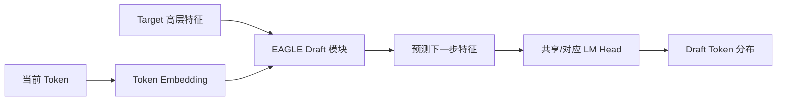
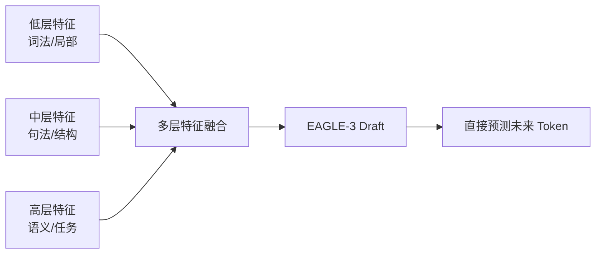

独立 Draft Model 像另外招聘一名编辑：通用，但要多占一张办公桌，还要保证两人的词典一致。Self-Draft 则像给主编装上“快速草拟插件”：复用 Target 的隐藏特征、词嵌入或额外预测模块，尽量避免维护第二套完整模型。

“Self-Draft”不是单一算法，而是一组设计路线。本节把 Medusa、EAGLE 系列和 MTP 放在同一张地图里理解。

<!-- more -->

## 1. 从链到树：为什么需要多个候选

经典 Draft Model 每个位置只采一个 Token，形成一条链：

```text
the → cat → sits → on
```

如果第二个 Token `cat` 被拒绝，后面的 `sits → on` 全部作废。

Self-Draft 常能廉价地产生每个位置的多个高概率候选，于是可以组成树：

```text
the
├── cat ── sits
│   └── runs
└── dog ── runs
    └── sits
```

Target 使用 **tree attention** 在一次前向中验证多个分支。每个节点只能看到从根到自己的祖先，不能偷看兄弟分支。


树能提高“至少有一条路径命中”的机会，但节点越多，Verify 的 Token 数与临时 KV 占用也越大。因此问题从“猜几个”升级为：

> 在固定验证预算下，树的宽度、深度和节点应该怎样分配？

---

## 2. Medusa：在模型上增加多只头

Medusa 在冻结或联合训练的 Backbone 上增加多个轻量 decoding heads。第 \(k\) 个 Head 试图预测未来第 \(k\) 个 Token。

普通 LM Head 预测：

$$
P(x_{t+1}\mid x_{\le t})
$$

Medusa 的额外 Head 近似预测：

$$
P_k(x_{t+k}\mid x_{\le t}),\quad k=2,3,\ldots
$$

直觉上，主编读到当前句子后，同时写下“下一个词”“下下个词”“第三个词”的候选清单。

### 2.1 从 Head 候选组合成树

```text
Head 1: [the, a]
Head 2: [cat, dog]
Head 3: [sits, runs]
```

不能无脑组合所有路径，因为节点数随宽度和深度指数增长。Medusa 通常用预设树只保留如 `the→cat→sits`、`the→dog→runs` 等有价值路径，再由 Target 一次验证。

### 2.2 Medusa-1 与 Medusa-2

- **Medusa-1**：冻结原模型，只训练额外 Heads。接入成本低，目标是保留原模型能力并获得无损加速。
- **Medusa-2**：Heads 与 Backbone 联合微调，预测能力更强，但需要专门训练配方来避免主模型能力退化。

训练成本不应被忽略：Self-Draft 省掉的是在线第二套完整模型，不代表离线训练免费。

### 2.3 Medusa 的优势

- 额外参数比完整 Draft Model 少。
- 不需要两套 Tokenizer 或两个完整 KV Cache。
- 多个 Head 天然并行，Draft 延迟低。
- 分布式 Target 上通常比外置 Draft 更容易集成。

### 2.4 Medusa 的限制

- 独立预测远期 Token 时缺少中间真实 Token，位置越远不确定性越大。
- 固定 Draft Tree 不能针对当前上下文分配节点。
- 每个目标模型或微调版本需要兼容的 Medusa 权重。
- “typical acceptance”等近似接受规则可提高接受率，却不等同于 5.1 的严格分布保持，应明确质量目标。

---

## 3. EAGLE：在特征空间自回归

EAGLE 的出发点是：直接猜离散 Token 很难，而 Target 倒数第二层的连续特征可能更容易预测。

它让轻量 Draft 模块在**特征层**自回归，并结合向前错一位的 Token 序列，缓解“同一特征可能对应多个后续 Token”的不确定性。



与完整 Draft Model 相比，EAGLE 模块更小，并复用了 Target 已算出的强语义特征。与 Medusa 独立 Heads 相比，它保留了候选之间的自回归条件关系。

### 3.1 为什么特征复用可能更准

Target 已经把长上下文压进隐藏状态。Draft 不必从 Token 序列重新做几十层 Transformer，只需学习“这个高层状态接下来如何演化”。

可以把它类比为：

- 完整 Draft：助理从头读全部材料再写。
- Medusa：主编同时报出未来几个位置的答案。
- EAGLE：主编交出思路草图，助理沿着思路继续推演。

### 3.2 仍然需要专用权重

EAGLE 不是“任意模型开一个开关就有”。Draft 模块要针对 Target 架构与隐藏表示训练，模型版本不匹配可能无法加载，或者接受率明显下降。

---

## 4. EAGLE-2：让草稿树随上下文变化

原始 EAGLE 常使用静态 Draft Tree：每层放多少节点在部署前确定。它隐含假设“同一深度的候选价值差不多”。

现实不是这样：

- `1 + 1 =` 后面的高置信路径很窄，可以向深处扩。
- 开放式故事开头分支很多，盲目深挖某一条路径容易浪费。

EAGLE-2 观察到 Draft 模型的置信度与真实接受率具有较好的校准关系，因此用置信度近似节点价值，动态构树。

### 4.1 两阶段思路

1. **Expansion**：优先扩展高价值叶节点，让树随当前上下文生长。
2. **Reranking**：在固定节点预算下重排和筛选候选，再交给 Target 验证。

```python
def build_dynamic_tree(root, node_budget):
    frontier = PriorityQueue()
    frontier.push(root, priority=1.0)
    nodes = []

    while frontier and len(nodes) < node_budget:
        parent = frontier.pop_max()
        for token, prob in draft_topk(parent):
            child = extend(parent, token)
            child.value = parent.value * prob
            frontier.push(child, priority=child.value)
            nodes.append(child)
            if len(nodes) == node_budget:
                break

    return rerank_and_pack(nodes)
```

这是概念伪代码，不是论文实现的逐行复刻。关键是**把验证预算给当前上下文最可能被接受的节点**。

### 4.2 动态树的 trade-off

- 好处：相同验证节点数下，期望接受长度更高。
- 成本：构树、优先队列或 GPU top-k 会增加控制开销。
- 风险：置信度若在新领域失准，节点预算可能分配错误。
- 结论：动态策略也要在真实领域检查 calibration，而不只看论文平均值。

---

## 5. EAGLE-3：直接预测 Token

EAGLE-3 对原始路线做了两个重要改变。

第一，它不再要求 Draft 显式预测 Target 的下一步特征，而是通过 **training-time test** 的多步展开，直接优化未来 Token 预测。

第二，它不只复用 Target 顶层附近的单层特征，而是融合低层、中层和高层特征，获得不同抽象级别的信息。



### 5.1 Training-time test 的直觉

训练时只教“一步预测”，测试时却让 Draft 连续滚动多步，会产生 exposure bias：后一步看到的是自己前一步的预测误差。

Training-time test 在训练中模拟这种多步滚动，让 Draft 练习真实推理时会遇到的输入分布。

### 5.2 不要把论文峰值当部署承诺

EAGLE-3 论文报告的最高加速来自特定模型、任务、硬件和框架。你的服务最终还受 batch、TP、上下文长度与 kernel 支持影响。正确表述应是“提供更强 Proposer 的可能”，而不是“打开后固定 6.5 倍”。

---

## 6. MTP：把多 Token 预测练进模型

Multi-Token Prediction（MTP）把“预测更远未来”加入模型训练目标。它既可以改善训练信号，也可以把附加模块留到推理时作为内置 Proposer。

一种抽象损失是：

$$
\mathcal{L}_{\text{MTP}}
=\sum_{k=1}^{D}\lambda_k
\operatorname{CE}\left(
P_k(x_{t+k}\mid x_{\le t}),x_{t+k}
\right)
$$

其中 \(D\) 是预测深度，\(\lambda_k\) 控制远期目标权重。

### 6.1 并行 Heads 与顺序 MTP

MTP 不只有一种结构。

- **并行 Heads**：多个 Head 从同一隐藏状态预测不同 offset，结构像 Medusa。
- **顺序模块**：下一深度结合上一深度表示与未来 Token embedding，保留更完整的因果链。

DeepSeek-V3 技术报告采用顺序 MTP 模块，并共享 embedding 与 output head。报告明确说明：这些模块可在普通推理时丢弃，也可复用于 speculative decoding。

### 6.2 “模型支持 MTP”是前置条件

不能给任意旧 checkpoint 配置 `method: mtp` 就凭空获得 MTP。必须满足：

- 权重中包含兼容的 MTP 模块或 assistant checkpoint。
- 推理引擎实现了该模型家族的 MTP 路径。
- 模型配置能正确描述深度、共享层与输出头。

当前 vLLM 对兼容模型使用 `{"method":"mtp","num_speculative_tokens":1}`；`1` 是谨慎起点，不是所有模型的最优值，完整命令见 5.5。

---

## 7. 统一伪代码与验证

无论 Proposer 来自多头、特征模块还是 MTP，系统骨架都可统一成：

```python
def self_draft_step(request, proposer, target, budget):
    # proposer 可输出一条链，也可输出带父节点关系的树
    draft_nodes = proposer.propose(
        hidden_states=request.target_hidden_states,
        token_ids=request.committed_tokens,
        node_budget=budget,
    )

    packed_tokens, tree_mask, positions = pack_tree(draft_nodes)

    target_scores = target.verify(
        token_ids=packed_tokens,
        attention_mask=tree_mask,
        position_ids=positions,
        kv_cache=request.target_kv,
    )

    accepted_path = rejection_sample_tree(
        draft_nodes=draft_nodes,
        target_scores=target_scores,
        sampling_state=request.sampling_state,
    )

    commit(request, accepted_path)
    rollback_unaccepted_kv(request, draft_nodes, accepted_path)
```

Tree attention 的 mask 必须确保：

```text
节点可见：历史已确认前缀 + 自己的祖先
节点不可见：兄弟节点 + 其他分支的后代
```

否则候选会读取“不属于自己路径”的未来 Token，验证结果就不再对应合法的自回归条件分布。

---

## 8. 方案选择与 trade-off

| 方案 | Proposer 来源 | Draft 串行性 | 额外权重 | 树策略 | 主要门槛 |
|---|---|---:|---:|---|---|
| Medusa | Target 上的多个 Heads | 低 | 小 | 常为预设树 | 训练 Heads |
| EAGLE | 高层特征自回归 | 有，但模块小 | 小 | 静态树 | Target 专用权重 |
| EAGLE-2 | 同 EAGLE | 有 | 小 | 动态树 | 校准与构树 |
| EAGLE-3 | 多层融合后直接预测 Token | 有 | 小 | 可配树验证 | 新训练配方与兼容 |
| MTP | 模型原生附加模块 | 依结构而定 | 已随 checkpoint | 链或树 | 模型家族原生支持 |

### 8.1 选择顺序

1. 模型 checkpoint 原生带 MTP：先测官方支持的 MTP 路径。
2. 有与 Target 精确匹配的 EAGLE-3/EAGLE 权重：通常是强通用候选。
3. 需要给自有微调模型加速且可训练：在 Medusa Heads 与 EAGLE Draft 之间比较训练和部署成本。
4. 不愿训练附加权重：退回独立 Draft 或 N-gram。

### 8.2 三个容易误判的点

- **Self-Draft 不占显存？** 仍有额外 Heads、Draft 模块、树节点 KV 与工作区。
- **有 Target 特征就高接受？** 权重仍须适配 Target，领域偏移会破坏校准。
- **候选越多越好？** 树越大 Verify 越像小 Prefill，高 batch 下会挤占正常请求预算。

---

## 📝 总结

- Self-Draft 复用 Target 的特征或附加模块，减少第二套完整模型的在线成本。
- Medusa 用多个预测 Heads 并行提出未来不同位置的候选，再用树验证组合。
- EAGLE 在特征层自回归，借 Target 强特征降低 Draft 开销。
- EAGLE-2 根据置信度动态分配 Draft Tree 节点，适应上下文难度。
- EAGLE-3 改为直接 Token 预测，并融合多层 Target 特征，通过训练时多步展开贴近推理。
- MTP 把多 Token 目标纳入训练；只有带兼容模块且引擎支持的模型才能直接使用。
- 所有路线最终仍要正确构造因果树 mask，并由 Target 执行严格或明确标注的近似验证。

## 🎯 自我检验清单

- 能解释链式 Draft 为什么会因早期拒绝浪费后部候选。
- 能说明 tree attention 的可见性规则。
- 能区分 Medusa-1 与 Medusa-2。
- 能说清 EAGLE 为何选择特征级自回归。
- 能解释 EAGLE-2 的动态树如何利用置信度。
- 能列出 EAGLE-3 相对原始 EAGLE 的两项主要变化。
- 能区分并行多头与顺序 MTP 模块。
- 能说明为什么任意 checkpoint 不能仅靠配置变成 MTP 模型。

## 📚 参考资料

1. Cai et al., [Medusa: Simple LLM Inference Acceleration Framework with Multiple Decoding Heads](https://proceedings.mlr.press/v235/cai24b.html), ICML 2024.
2. Li et al., [EAGLE: Speculative Sampling Requires Rethinking Feature Uncertainty](https://arxiv.org/abs/2401.15077), 2024.
3. Li et al., [EAGLE-2: Faster Inference of Language Models with Dynamic Draft Trees](https://aclanthology.org/2024.emnlp-main.422/), EMNLP 2024.
4. Li et al., [EAGLE-3: Scaling up Inference Acceleration of Large Language Models via Training-Time Test](https://arxiv.org/abs/2503.01840), 2025.
5. Gloeckle et al., [Better & Faster Large Language Models via Multi-token Prediction](https://arxiv.org/abs/2404.19737), 2024.
6. DeepSeek-AI, [DeepSeek-V3 Technical Report](https://arxiv.org/abs/2412.19437), 2024.
7. vLLM, [EAGLE Draft Models](https://docs.vllm.ai/en/latest/features/speculative_decoding/eagle/), 官方文档。
8. vLLM, [MTP](https://docs.vllm.ai/en/latest/features/speculative_decoding/mtp/), 官方文档。
