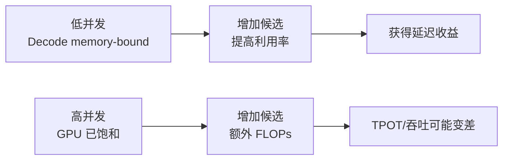

投机解码最吸引人的宣传是“一次生成多个 Token”。但真正部署时，常见结果从明显加速到毫无收益，甚至变慢。

原因是它没有消灭工作，而是重新打包工作：少做几轮昂贵的串行 Target Decode，多做 Draft、批量 Verify、候选 KV、验收与回滚。收益取决于整个系统，而不只取决于接受率。

<!-- more -->

## 1. 一张完整成本账单

普通解码生成 \(N\) 个 Token 的时间近似为：

$$
T_{\text{base}}\approx N\cdot T_{\text{decode}}
$$

投机解码若每轮平均提交 \(\mathbb{E}[L]\) 个 Token，需要约 \(N/\mathbb{E}[L]\) 轮：

$$
T_{\text{spec}}\approx
\frac{N}{\mathbb{E}[L]}
\left(
T_{\text{draft}}
+T_{\text{verify}}
+T_{\text{accept}}
+T_{\text{schedule}}
+T_{\text{rollback}}
\right)
$$

因此：

$$
S=
\frac{T_{\text{base}}}{T_{\text{spec}}}
\approx
\frac{\mathbb{E}[L]T_{\text{decode}}}
{T_{\text{draft}}+T_{\text{verify}}+T_{\text{system}}}
$$

其中 `system` 至少包括：

- Draft 与 Target 之间的数据准备。
- tree/sequence attention metadata 构造。
- logits 处理与拒绝采样。
- KV Cache 提交、裁剪与回收。
- batch 中不同接受长度的整理。
- 分布式通信与 CPU/GPU 同步。

📌 **关键点**：论文里的“平均接受 Token 数”只决定分子；工程实现的所有开销都在分母。

### 1.1 临界条件

投机有收益的必要条件是：

$$
T_{\text{draft}}+T_{\text{verify}}+T_{\text{system}}
<
\mathbb{E}[L]T_{\text{decode}}
$$

这个不等式比“接受率超过 80%”更有用，因为同样 80% 接受率在不同 GPU、batch 和 Draft 上可能给出相反结果。

---

## 2. Memory Bound 何时变成优势

单请求普通 Decode 常见流程是：

1. 为一个新 Token 读取大量 Target 权重。
2. 做一次利用率不高的矩阵乘。
3. 提交一个 Token。
4. 下一步再次读取权重。

投机 Verify 把多个候选组成较宽的输入。读取同一份权重后，可对多个 Token 做计算，提高算术强度：

$$
\text{Arithmetic Intensity}
=\frac{\text{FLOPs}}{\text{Bytes moved}}
$$

候选数从 1 增加到 \(K\) 时，FLOPs 上升，但模型权重读取不必严格增加 \(K\) 倍。若原来受 HBM 带宽限制，这种“多算一点、少串行搬几遍”可能很划算。

用货运类比：

- 普通 Decode：每次派一辆大卡车只送一个包裹。
- Spec Verify：卡车仍要跑，但一次装上几个候选包裹。
- 接受率高：多数包裹都送到了正确地址。
- 接受率低：包裹装得满，却大多被退回。

### 2.1 最有利的典型状态

最有利的组合是：小 batch、长输出、memory-bound Target、轻量高接受 Proposer、高效 Verify kernel，以及尚未饱和的 GPU。

---

## 3. Compute Bound 何时吞掉收益

随着并发增大，普通 Decode batch 已经能把 GPU 的 Tensor Cores 喂饱。此时 Target 不再主要等待权重搬运，而逐渐 compute-bound。

投机 Verify 对 batch 中每个请求加入 \(K\) 个候选，等效验证规模近似为：

$$
B_{\text{verify}}\approx B_{\text{requests}}\times K
$$

例如 128 个请求、每个验证 5 个候选，相当于一步处理约 640 个 Draft Token，尚未计树节点和额外 Target Token。



### 3.1 为什么低 QPS 与高 QPS 结论不同

低 QPS 时目标通常是单请求 latency，GPU 有空闲槽位可承接 Verify。

高 QPS 时目标通常是 goodput；普通 Continuous Batching 已在多个请求间摊薄权重读取。投机候选会挤占原本可服务的新请求 Token。

因此必须分别压测：

- 单请求 TPOT。
- 小并发 P50/P95。
- 饱和 QPS 下的总 tokens/s。
- 满足 SLO 的最大 goodput。

只报告“batch=1 快了 2 倍”不足以证明在线服务容量提升。

---

## 4. 显存与 KV Cache 边界

### 4.1 独立 Draft 的静态显存

独立 Draft Model 通常需要：

- Draft 权重。
- Draft KV Cache。
- Draft 的 logits、workspace 与 CUDA Graph 捕获空间。

如果 Target 原本刚好放进 GPU，加入 Draft 可能迫使：

- 降低 `gpu_memory_utilization` 留出空间。
- 减少 Target KV Cache block。
- 降低 `max_num_seqs` 或 `max_model_len`。
- 把 Draft 放到其他 GPU，引入通信。

最终可能出现“单请求更快，但可并发请求数更少”。

### 4.2 候选 KV 的动态显存

Target Verify 要为候选 Token 写入 KV。若只接受前缀，未接受部分必须回滚或释放。

粗略估算每层、每 Token 的 KV 字节：

$$
M_{\text{KV/token}}
=2\cdot L\cdot H_{\text{kv}}\cdot d_{\text{head}}\cdot b
$$

其中 2 代表 K 与 V，\(L\) 是层数，\(H_{\text{kv}}\) 是 KV Heads，\(b\) 是每元素字节数。

树验证还可能包含多条共享祖先的分支节点。即使逻辑上共享前缀，每个候选节点的新增 KV 仍要有存放位置。

### 4.3 显存机会成本

应比较两种用法：

- 把 4 GB 给 Draft，提高单请求 Decode 速度。
- 把 4 GB 给 Target KV Cache，提高并发与可服务上下文。

在线系统里，后者有时能带来更高 goodput。显存不是只看“装得下”，而是看它本可以用于什么。

---

## 5. 并发与调度边界

Continuous Batching 允许每一步重新组批。普通 Decode 请求通常每步预算 1 个 Token；投机请求可能一次申请多个验证 Token。

一个简化 Token Budget：

$$
\sum_r K_r
+\sum_j P_j
\le B_{\text{token}}
$$

其中：

- \(K_r\) 是请求 \(r\) 本轮验证 Token 数。
- \(P_j\) 是同时执行的 Prefill Chunk Token 数。
- \(B_{\text{token}}\) 是一步总预算。

### 5.1 三种调度冲突

**冲突一：投机深度不一致。**  
不同请求接受率不同，固定 \(K\) 会让简单请求不够深、困难请求浪费多。

**冲突二：与 Prefill 抢预算。**  
长 Prompt 的 Chunked Prefill 和 Spec Verify 都是多 Token 工作，会竞争同一步预算。

**冲突三：batch 形状不稳定。**  
每个请求接受长度不同，下一步的序列状态与候选数量变化，可能增加 padding、metadata 和 CUDA Graph 形状管理成本。

### 5.2 动态投机深度

理想调度器会根据：

- 当前 batch size。
- 最近接受率。
- GPU 利用率。
- 剩余 Token Budget。
- 请求优先级和 TPOT SLO。

动态选择 \(K_r\)，甚至在高负载时关闭投机。

```python
def choose_spec_depth(batch_size, recent_acceptance, gpu_busy):
    if gpu_busy > 0.95 or batch_size >= 128: return 0
    if recent_acceptance >= 0.85:
        return 5
    if recent_acceptance >= 0.65: return 2
    return 0
```

这是策略示例，不是 vLLM 默认算法。它表达一个重要思想：**投机是可按负载降级的优化，不应成为不可变的请求语义。**

---

## 6. 负载、采样与接受率

### 6.1 高接受率场景

- 代码补全：语法、缩进和局部重复强。
- 摘要与文档问答：答案常复制输入片段。
- 结构化模板：JSON、SQL、日志、固定格式。
- 同家族 Draft 与 Target 能力接近。
- 低温度或贪心生成：分布更尖锐。

### 6.2 低接受率场景

- 高温度创意写作：可选后续很多。
- 开放对话：措辞分支大。
- Draft 与 Target 领域或微调版本不匹配。
- Tokenizer/词表映射受限。
- 长推理中出现 Draft 不擅长的数学或工具格式。

### 6.3 温度为何影响接受

温度变换：

$$
p_T(x)=
\frac{\exp(z_x/T)}
{\sum_y\exp(z_y/T)}
$$

较低 \(T\) 让分布更尖，若 Draft 与 Target 的 top choice 一致，接受率通常更高。较高 \(T\) 让尾部 Token 更常被采到，Draft/Target 的分布差异更容易暴露。

但“低温一定更快”也不是定律。若 Draft 与 Target 的最高概率 Token 本就不同，尖锐分布反而会稳定地产生拒绝。

### 6.4 输出长度决定摊销

投机主要优化 Decode。总请求时延：

$$
T_{\text{request}}
=T_{\text{queue}}+T_{\text{prefill}}+T_{\text{decode}}
$$

若 Prompt 32K、输出 20 Token，Prefill 和排队占主导；即使 Decode 快 2 倍，总时延也只小幅下降。

若 Prompt 200 Token、输出 2000 Token，Decode 占比高，收益更容易显现。

---

## 7. 与其他优化组合

- **量化**减少带宽和显存，也改变基线速度、Verify 曲线与接受率；加速比不能相乘。
- **Prefix Cache**优化 Prefill，投机优化 Decode，阶段不同且可组合。
- **Chunked Prefill**与 Spec Verify 竞争 Token Budget，组合时重点观察 P99。
- **TP/PP**改变每步通信与 Draft 放置成本；框架兼容性随版本变化，必须按安装版本核对。

## 8. 决策与实验框架

### 8.1 先问四个问题

1. Decode 是否占端到端时延的大头？
2. 低并发时 GPU 是否明显 memory-bound？
3. 是否有便宜且高接受的 Proposer？
4. 额外显存若改给 KV Cache，是否更有价值？

若前两项都是否，投机通常不是第一优先级。

### 8.2 最小实验矩阵

| 维度 | 建议取值 |
|---|---|
| 方法 | baseline / ngram / draft / self-draft |
| 深度 | 1 / 2 / 3 / 5 |
| 并发 | 1 / 8 / 32 / 饱和点 |
| Prompt | 短 / 中 / 长 |
| Output | 短 / 长 |
| 采样 | greedy / 生产 temperature+top_p |
| 数据集 | 代码 / 对话 / 业务真实请求 |

每组至少记录：

- TTFT、TPOT P50/P95/P99。
- output tokens/s 与 request throughput。
- 平均接受率、平均接受长度。
- Draft、Verify 与其他阶段耗时。
- GPU 利用率、HBM 带宽、显存与 KV Cache 占用。
- 结果正确性或分布一致性检查。

上线门槛应同时约束 P95 TPOT 改善、饱和 goodput、P99 TTFT、可服务并发和输出质量，具体阈值由业务 SLO 决定。

## 📝 总结
- 收益由期望提交长度与完整轮次成本共同决定，接受率只是其中一项。
- 低并发 memory-bound 最有利；高并发 compute-bound 时额外 Verify 会损害吞吐。
- Draft/KV 占显存且 Spec Verify 争夺 Token Budget，所有组合优化都必须实测。
- 最终以真实负载下的 goodput、尾延迟、显存和质量共同决策。

## 🎯 自我检验清单

- 能写出投机加速的临界不等式。
- 能解释 memory-bound Decode 为什么适合批量 Verify。
- 能解释高 batch 下 \(B\times K\) 如何使 Verify compute-bound。
- 能列出独立 Draft 与候选树的显存组成。
- 能说明投机请求如何消耗统一 Token Budget。
- 能判断长 Prompt 短输出为何收益有限。
- 能解释组合加速比为何不能直接相乘，并设计真实实验矩阵。

## 📚 参考资料

1. Leviathan et al., [Fast Inference from Transformers via Speculative Decoding](https://proceedings.mlr.press/v202/leviathan23a.html), ICML 2023.
2. Chen et al., [Accelerating Large Language Model Decoding with Speculative Sampling](https://arxiv.org/abs/2302.01318), 2023.
3. Liu et al., [How Speculative Can Speculative Decoding Be?](https://arxiv.org/abs/2401.07851), 2024.
4. vLLM, [Speculative Decoding](https://docs.vllm.ai/en/latest/features/speculative_decoding/), 官方文档。
