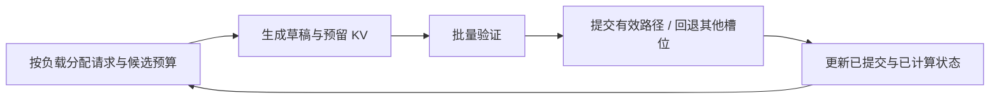

“草稿接受率有 80%，是不是就一定快？”这是投机解码最容易误判的地方。接受率只回答猜得怎么样，没回答猜一遍花多久、验证多长的草稿、额外缓存挤掉了多少请求。**有效 Token 增加了，轮耗时也增加了，只有把两边相除才知道收益。**

本节从一个简化账本出发，再把真实服务中的并发、长上下文、量化和调度放回来。目标不是给出一个通用的最佳投机长度，而是让你能解释“为什么这组条件下更快，换一组条件却不值得”。

<!-- more -->

## 📑 目录

- [1. 先定义收益：一次轮次提交多少](#1-先定义收益一次轮次提交多少)
- [2. 性能账本：从接受前缀推导加速条件](#2-性能账本从接受前缀推导加速条件)
- [3. 投机长度：多猜几个何时变成浪费](#3-投机长度多猜几个何时变成浪费)
- [4. 代码与对话：任务标签不是性能结论](#4-代码与对话任务标签不是性能结论)
- [5. 高并发与长上下文：空余算力会变化](#5-高并发与长上下文空余算力会变化)
- [6. 与量化叠加：先明确正确性基准](#6-与量化叠加先明确正确性基准)
- [7. 调度与流式输出：一次推进变长以后](#7-调度与流式输出一次推进变长以后)
- [8. 动手算账与部署门槛](#8-动手算账与部署门槛)
- [总结](#-总结)
- [自我检验清单](#-自我检验清单)
- [参考资料](#-参考资料)

---

## 1. 先定义收益：一次轮次提交多少

一轮有 $\gamma$ 个候选，令 $K\in\{0,\ldots,\gamma\}$ 为连续接受前缀长度。在没有 EOS 或输出上限截断的完整轮里，提交长度为：

$$
L=K+1
$$

“加一”是首个拒绝位置的修正 Token，或全部接受后的额外 Token。即使没有候选被接受，也能推进一步；但不代表这一步只花了普通 Decode 的时间。

📌 **关键点**：至少推进一个 Token，是正确性与进度保证。它没有保证 Draft 加验证不会比直接生成这个 Token 更贵。

---

## 2. 性能账本：从接受前缀推导加速条件

### 2.1 不用独立假设的提交长度公式

对非负整数 $K$，有尾概率恒等式：

$$
\mathbb E[L]=1+\sum_{i=1}^{\gamma}\Pr(K\ge i)
$$

令 $a_i$ 表示“前 $i-1$ 个候选都已接受”的条件下，第 $i$ 个也接受的概率，则由条件概率链式法则：

$$
\Pr(K\ge i)=\prod_{j=1}^{i}a_j
$$

这里没有要求不同位置独立。若再做简化，令这些条件概率都等于 $a$：

$$
\mathbb E[L]=1+a+\cdots+a^\gamma
=\frac{1-a^{\gamma+1}}{1-a}\quad(a\ne1)
$$

$a=1$ 时极限为 $\gamma+1$。对动态长度和候选树，要根据实际提出的候选、路径概率或观测长度统计，不能硬套固定链公式。

### 2.2 分母要算完整轮

令基线每 Token 平均耗时为 $T_0$，投机轮平均耗时为：

$$
T_{\text{round}}=T_{\text{draft}}+T_{\text{verify}}+T_{\text{other}}
$$

$T_{\text{other}}$ 包含采样、缓存维护、同步、调度等成本。在单请求稳定 Decode、同样条件且忽略边界轮的简化账本里：

$$
S\approx\frac{T_0\,\mathbb E[L]}{\mathbb E[T_{\text{round}}]}
$$

要得到加速，就需要 $\mathbb E[T_{\text{round}}]<T_0\mathbb E[L]$。长期测量应使用**总提交 Token / 总耗时**，而不是把每轮的速度比做无权平均。

### 2.3 为什么验证不是免费的

一次验证多个 Token 可以复用权重读取，提高算术强度。但计算量、Attention、候选 KV 和 Logits 处理仍会增加。$T_{\text{verify}}$ 不应永远设为 $T_0$，特别是在候选长、Batch 大或上下文长时。

用一个类比：主编审一段稿比亲自逐字写快，但审十页不等于审一句话的时间。助手写稿时间也要一起算。

---

## 3. 投机长度：多猜几个何时变成浪费

在固定 $a$ 的简化模型中，增加第 $\gamma+1$ 个候选，预期提交长度只增加：

$$
\Delta\mathbb E[L]=a^{\gamma+1}
$$

长度越深，前面全部通过的机会越小。收益递减，但 Draft 和验证成本不一定递减。

一个直观例子：$a=0.8$ 时，第一个额外候选能增加 0.8 个预期 Token，第八个只能增加约 0.168 个。如果验证这一个位置的成本太高，就不值得继续加深。

### 3.1 深度与宽度是两种预算

链式投机主要调深度；树式提议还要调分支宽度。更宽的树可能增加找到有效路径的机会，却要计算更多未提交的节点。报告“投机深度 4”还不够，要同时记录验证节点数。

### 3.2 动态策略不是只看接受率

动态长度可以结合历史接受情况、草稿置信度、请求长度和当前负载。但负载高时，再准确的额外候选也可能挤占其他请求的算力。

好的策略在目标上优化“单位时间推进多少合格输出”，而不是单独最大化接受率。第 5.3 节的路径置信度与本节的时间账本，应一起使用。

---

## 4. 代码与对话：任务标签不是性能结论

总览提到代码常有高接受率、开放对话可能收益有限，可以当作实验假设。更准确的解释是**重复模式与分布匹配不同**：

| 📊 现象 | 可能有利的原因 | 仍会失败的情况 |
|---|---|---|
| 代码编辑 | 原文件大段保留，标识符重复 | 修改集中且续写方向变化大 |
| 结构化抽取 | 输出复制输入，格式较固定 | Prompt 不含所需答案或格式约束不兼容 |
| 相似 Agent 轨迹 | 重复步骤和相似续写多 | 工具返回改变了后续选择 |
| 开放对话 | 强 Draft 仍可能匹配 Target | 多样表达让便宜草稿频繁被否决 |

不能只用一个复制题代表所有代码，也不能用一个高温创作题代表所有对话。温度、Top-p、模型对齐和 Prompt 分布都会影响接受情况。

⚠️ **注意**：随机输入适合控制性能变量，却通常不保留真实业务的历史重复结构。比较 N-gram/Suffix 的业务收益时，需要实际 Prompt，不能只靠随机 Token Benchmark。

---

## 5. 高并发与长上下文：空余算力会变化

### 5.1 Continuous Batching 已经利用了一部分空闲

低并发时，每步只处理少数请求，Target 可能有较多空余计算能力。并发增加后，Continuous Batching 让一次权重读取服务更多请求，普通 Decode 的效率本身就在提高。

此时追加候选，可能从“利用空余算力”变成“与其他请求争计算”。因此低并发 TPOT 提升，不保证饱和吞吐同比提升。

但高并发也不是必然无效：更好的 Draft、并行草稿与适合的 Kernel 仍可能有收益。应按请求负载与长度画曲线，不能用一条经验把所有方案排除。

### 5.2 长上下文增加读写与临时状态

长历史下，每个验证位置都需要计算 Attention，候选还占用额外 KV。独立 Draft 的缓存也随上下文增长。

设当前批中有 $B$ 个请求、每个预留约 $\gamma$ 个候选位置，额外 Target KV 数据的粗略上界账本为：

$$
M_{\text{candidate}}\approx B\gamma\times m_{\text{KV/token}}
$$

这里忽略分页取整、额外 lookahead 槽位、共享前缀和树布局。它用于说明新增项，真正显存容量以引擎分配与日志为准。

### 5.3 抢占会把纸面收益吃掉

Draft 权重或临时缓存减少可用 KV 空间后，可能触发更多抢占、重算或降低接纳容量。单轮验证更快，整个请求完成反而更慢，并不矛盾。

记录接受长度时，还要记录 KV 容量、抢占、成功请求数与实际吞吐，才能看到服务层面的代价。

---

## 6. 与量化叠加：先明确正确性基准

### 6.1 量化 Draft 与量化 Target 不同

- **只量化 Draft**：改变提议分布 $q$。精确验收且使用真实提议概率时，最终仍以未量化 Target 的 $p$ 为准；主要改变的是速度与接受情况。
- **量化 Target**：改变验证基准为 $p_{\text{quant}}$。投机解码不会把它恢复成原始高精度模型。
- **近似验收再叠加量化**：需要分别分析两种变化，不能仅凭“Target 还在验证”宣称无损。

若实际采样用了量化后的 $q$，却在验收中使用另一套旧概率，标准证明就不再适用。隐藏层辅助头也可能依赖训练时的特征分布，换 Target 量化方案后应重新核对。

### 6.2 加速比通常不能直接相乘

量化已经减少 Target 权重带宽成本，可能让验证的额外计算更突出；它也可能释放显存，为更多候选和请求提供空间。两者改变的是同一个系统中的瓶颈。

所以“量化快 1.5 倍、投机快 2 倍”不能直接承诺组合快 3 倍。应对原始基线、仅量化、仅投机、组合方案分别测量，并写明质量基准。

📌 **关键点**：第 4 章的精度账本和第 5 章的采样保证，需要在同一个 Target 上对齐，才能谈组合收益。

---

## 7. 调度与流式输出：一次推进变长以后

### 7.1 调度器不再只处理一个新位置

引擎需要为候选预留位置、分配 Token 预算，再根据接受长度更新实际历史。不同请求的候选长度、接受前缀和剩余输出限制都可能不同。


```mermaid
graph LR
    S["按负载分配请求与候选预算"] --> P["生成草稿与预留 KV"]
    P --> V["批量验证"]
    V --> C["提交有效路径 / 回退其他槽位"]
    C --> U["更新已提交与已计算状态"]
    U --> S
```

这与 Continuous Batching、Chunked Prefill、CUDA Graph 形状和异步执行相互影响。兼容性应以所用版本的文档与日志为准，不能把历史版本的限制当成永久规律。

### 7.2 TPOT 变小，不等于每次出字更均匀

投机解码可能在一次验证后返回多个 Token，然后下一轮等待较久。用户看到的流式输出会更像“成段涌出”。

- **TPOT** 看一次请求首 Token 后的平均每 Token 时间。
- **ITL / 返回间隔** 看流式结果之间的停顿，可能受每个 chunk 包含多少 Token 影响。
- **TTFT** 还包含排队与 Prefill；减少 Decode 轮数不一定改善首 Token。

应同时保留 TTFT、TPOT、流式停顿与端到端时间，不能只看平均 Token/s。对实时交互，还要看 P95/P99 与业务可接受的最长停顿。

### 7.3 停止条件和工具调用要及时生效

接受前缀里出现 EOS、Stop 或达到输出上限时，只提交结束前的有效部分。结构化输出、Tool Calling 与历史相关 Processor 还需要配套状态更新。

遇到不支持的组合，应先让普通生成与简单投机配置通过，再逐项加入功能，以便定位是哪一步改变了正确性或性能。

---

## 8. 动手算账与部署门槛

### 8.1 同样高的接受情况，分母可以完全不同

下面是纯标准库的**假设成本模型**。时间常数只为演示，没有对应任何 GPU 或实测模型。

```python
def expected_length(conditional_acceptance):
    survival = 1.0
    total = 1.0
    for acceptance in conditional_acceptance:
        assert 0 <= acceptance <= 1
        survival *= acceptance
        total += survival
    return total

base_ms = 10.0  # 假设普通 Decode 每 Token 10 ms
for k in [1, 2, 4, 8]:
    length = expected_length([0.8] * k)
    fast_round_ms = 10 + 0.7 * k + 0.1 * k * k
    slow_round_ms = 10 + 5.0 * k + 0.8 * k * k
    print(k, "预期提交:", round(length, 3),
          "便宜草稿的模型加速比:", round(base_ms * length / fast_round_ms, 3),
          "昂贵草稿的模型加速比:", round(base_ms * length / slow_round_ms, 3))
assert expected_length([0.0] * 4) == 1
assert expected_length([1.0] * 4) == 5
```

相同的条件接受概率，成本低的方案可能加速，成本高的方案可能变慢；加深候选也未必一直改善。真正实验中，应把两个假设成本替换成观测轮耗时与提交统计。

### 8.2 决策表里的四道门槛

| 🎯 门槛 | 要求 | 不通过时 |
|---|---|---|
| 正确性 | Target、采样与缓存历史对齐 | 排查实现与配置 |
| 质量 | 业务指标符合既定基准 | 分离量化/训练/近似验收影响 |
| 延迟 | 目标负载下 TTFT/TPOT 与停顿达标 | 调整候选长度或选择其他路线 |
| 容量与成本 | 成功请求吞吐、KV 容量和资源成本合理 | 比较小 Draft、无模型或关闭投机 |

如果平均接受长度变大、轮耗时也增大，但最终 TPOT 没改善，应沿 Draft、验证、采样与缓存维护逐项定位。若只有空载结果好，再测服务目标负载，决定是否按场景启用。

---

## 📝 总结

- 平均提交长度来自连续接受前缀加一个新 Token，边界轮会受停止条件截断。
- $\mathbb E[L]=1+\sum_i\Pr(K\ge i)$；固定条件接受概率只是简化模型。
- 加速需要完整轮耗时低于直接生成同样数量 Token 的时间。
- 继续加深候选的收益递减，树宽度也有计算与缓存成本。
- 代码和对话是实验分组，重复结构与分布匹配才解释接受差异。
- 高并发、长上下文与抢占会改变空闲算力和显存预算。
- 精确投机对齐实际 Target；量化、辅助训练和近似验收要分开分析。
- TPOT、流式停顿、容量与业务质量共同决定是否部署。

## 🎯 自我检验清单

- 能从连续接受前缀推导预期提交长度
- 能说明条件接受概率链式相乘为什么不要求位置独立
- 能写出包含 Draft、验证与其他成本的加速条件
- 能解释接受率高却变慢，以及候选长度为何收益递减
- 能区分固定链深度与树形节点预算
- 能说明随机 Prompt 为什么不足以评估历史查找路线
- 能分析高并发、长上下文与抢占对收益的影响
- 能区分量化 Draft 与量化 Target 的输出基准
- 能解释 TPOT 改善为何不保证流式停顿改善
- 能根据正确性、质量、延迟与容量四项门槛做部署选择

## 📚 参考资料

- [Fast Inference from Transformers via Speculative Decoding（接受长度与成本分析）](https://arxiv.org/abs/2211.17192)
- [Accelerating Large Language Model Decoding with Speculative Sampling（采样与数值边界）](https://arxiv.org/abs/2302.01318)
- [vLLM — Speculative Decoding](https://docs.vllm.ai/en/stable/features/speculative_decoding/)
- [vLLM — Dynamic Speculative Decoding](https://docs.vllm.ai/en/stable/features/speculative_decoding/dynamic_speculative_decoding/)
- [vLLM v0.31.0 — Speculative Decoding Metrics](https://github.com/vllm-project/vllm/blob/v0.31.0/vllm/v1/spec_decode/metrics.py)
- [vLLM v0.31.0 — V1 Scheduler](https://github.com/vllm-project/vllm/blob/v0.31.0/vllm/v1/core/sched/scheduler.py)
