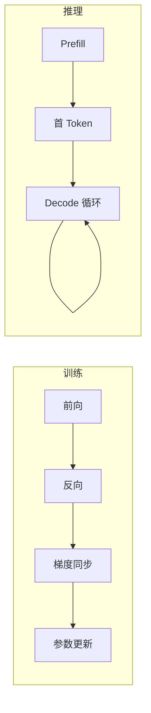
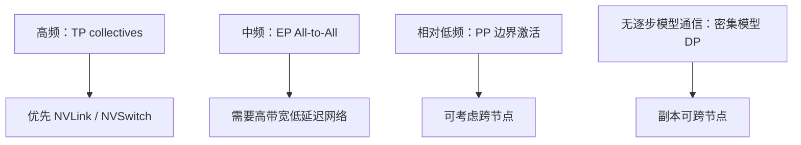
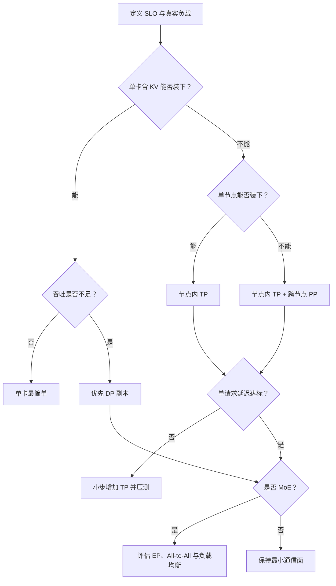
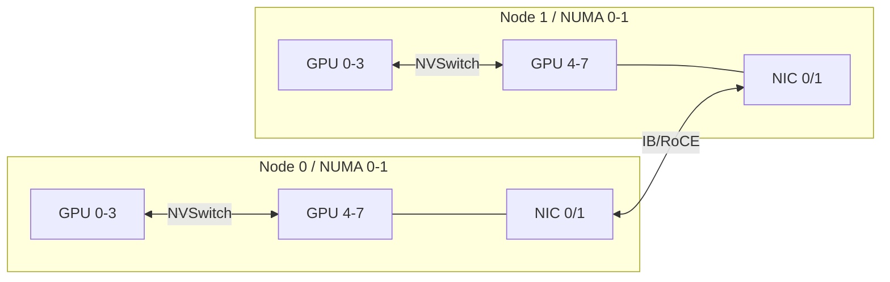

面对一台 8 卡机，最危险的问题是：“我应该把并行度设成 8 吗？”
GPU 数量只是资源，不是方案。
正确的问题应该是：**什么东西装不下，哪个指标不达标，通信要经过哪条链路？**
这一节先建立决策框架。后面五节再逐个拆开原理和命令。
<!-- more -->

## 📑 目录
- [1. 训练与推理并行不是一回事](#1-训练与推理并行不是一回事)
- [2. 先画显存地图](#2-先画显存地图)
- [3. 四种并行分别解决什么](#3-四种并行分别解决什么)
- [4. 手算一个 70B 部署](#4-手算一个-70b-部署)
- [5. 通信量与拓扑](#5-通信量与拓扑)
- [6. TP、PP、DP、EP 决策树](#6-tpppdpep-决策树)
- [7. 常见误区与 trade-off](#7-常见误区与-trade-off)
- [8. 把显存账本算到能上线的粒度](#8-把显存账本算到能上线的粒度)
- [9. 从逻辑并行组映射到物理拓扑](#9-从逻辑并行组映射到物理拓扑)
- [10. 容量、延迟、吞吐的联合决策](#10-容量延迟吞吐的联合决策)
- [11. 可执行的基线实验](#11-可执行的基线实验)
- [总结](#-总结)
- [自我检验清单](#-自我检验清单)
- [官方参考](#-官方参考)
---

## 1. 训练与推理并行不是一回事
训练的一步包含：
$$
\text{Forward} \rightarrow \text{Backward} \rightarrow \text{Optimizer Step}
$$
推理的一步只有前向，在线生成还被拆成 Prefill 与 Decode。

### 1.1 显存对象不同
训练通常同时保存参数、梯度、优化器状态和激活。
推理不保存梯度与优化器状态，却要为每个活跃序列保存 KV Cache。
训练显存常用粗算：
$$
M_{\text{train}} \approx M_W+M_G+M_O+M_A
$$
推理显存常用粗算：
$$
M_{\text{infer}} \approx M_W+M_{KV}+M_{\text{runtime}}
$$
### 1.2 性能目标不同
训练常追求每 GPU 每秒训练 Token 数。
在线推理至少有三条轴：
- TTFT：首 Token 等待时间；
- TPOT：相邻输出 Token 的间隔；
- Throughput：整体吞吐。
DP 扩副本通常提高吞吐，却不会让一个请求跨副本共同计算。
TP 可能降低单请求计算时间，也可能因集合通信让 TPOT 变差。
📌 **关键点**：不要把训练集群里的最佳并行配置直接抄到推理服务。
---

## 2. 先画显存地图
并行选择前，先把显存分成三类。
### 2.1 静态权重
设参数量为 $P$，每参数字节数为 $b_w$：
$$
M_W=P\times b_w
$$
常见数量级：
- FP32：4 Bytes；
- FP16/BF16：2 Bytes；
- INT8：约 1 Byte；
- INT4：约 0.5 Byte。
量化格式还可能有 scale、zero point 和对齐开销，所以这只是下界估算。
### 2.2 随并发与长度增长的 KV Cache
对常见 GQA 模型，可粗略写成：
$$
M_{KV} =2\times L\times H_{kv}\times D_h \times N_{\text{tokens}}\times b_{kv}
$$
其中：
- 2 表示 K 与 V；
- $L$ 是层数；
- $H_{kv}$ 是 KV Head 数；
- $D_h$ 是 Head Dimension；
- $N_{\text{tokens}}$ 是所有活跃序列已缓存 Token 总数；
- $b_{kv}$ 是每个 KV 元素字节数。
注意这里不是 Attention Head 总数，GQA 的 $H_{kv}$ 往往更小。
### 2.3 运行时余量
还要给以下对象留空间：
- 临时激活；
- CUDA Graph；
- NCCL 通信缓冲区；
- 分词与调度相关缓冲；
- 显存碎片；
- 峰值波动。
因此容量条件应写成：
$$
M_W^{shard}+M_{KV}^{shard}+M_{\text{runtime}} <M_{\text{physical}}
$$
而不是只判断权重分片能否放下。
---

## 3. 四种并行分别解决什么
### 3.1 TP：一层内部多人抬桌
TP 把矩阵乘法切到多卡。
每卡保存部分权重，同一个 Token 的同一层由多卡合作。
它主要解决：
- 单卡放不下权重；
- 单请求希望使用多卡算力。
它主要付出：
- 高频 AllReduce / ReduceScatter / AllGather；
- 对 NVLink/NVSwitch 的强依赖；
- rank 越多，通信和小矩阵效率越敏感。
### 3.2 PP：把楼层分给不同施工队
PP 把连续层分成多个 stage。
激活沿 stage 单向传递。
它主要解决：
- 模型跨节点才能装下；
- 某些模型不能整齐地做高 TP；
- 希望把高频 TP 限制在节点内。
它主要付出：
- 流水线空泡；
- stage 划分不均；
- stage 间激活传输；
- 单个 stage 出错会拖垮整条流水线。
### 3.3 DP：复制多家完整门店
DP 复制完整模型，或复制完整的 TP×PP 组。
它主要解决：
- 吞吐不足；
- 请求之间天然独立；
- 需要滚动升级或故障隔离。
它主要付出：
- 每个副本重复占权重显存；
- 请求负载可能不均；
- Prefix Cache 与 KV Cache 不跨副本共享；
- 热副本排队时，冷副本未必能接管上下文。
### 3.4 EP：Token 去找对应专家
EP 把 MoE 专家分布到不同 GPU。
它主要解决：
- 专家权重总量巨大；
- 每个 Token 只激活少量专家；
- 希望按专家维度扩展。
它主要付出：
- dispatch 与 combine 两次 All-to-All；
- 热门专家造成负载倾斜；
- 小 batch 下通信难以摊薄；
- 后端对硬件与软件版本较敏感。
---

## 4. 手算一个 70B 部署
假设一个 70B GQA 模型：
- BF16 权重；
- 80 层；
- 8 个 KV Heads；
- Head Dimension 为 128；
- KV Cache 使用 BF16；
- 目标同时缓存 32 个请求；
- 每个请求平均缓存 4096 Token。
### 4.1 权重
$$
70\times10^9\times2 =140\times10^9\text{ Bytes} \approx130.4\text{ GiB}
$$
如果用 TP=4：
$$
130.4/4\approx32.6\text{ GiB/GPU}
$$
### 4.2 KV Cache
总 Token 数：
$$
N_{\text{tokens}}=32\times4096=131072
$$
每 Token KV：
$$
2\times80\times8\times128\times2 =327680\text{ Bytes} \approx0.3125\text{ MiB}
$$
总 KV：
$$
0.3125\text{ MiB}\times131072 =40960\text{ MiB}=40\text{ GiB}
$$
若 KV 在 TP=4 上理想分片：
$$
40/4=10\text{ GiB/GPU}
$$
### 4.3 结论
单卡至少已有：
$$
32.6+10=42.6\text{ GiB}
$$
还没算运行时。
所以 4×40 GiB 显然不够，4×80 GiB 才有更现实的余量。
也可以继续量化权重、降低并发/上下文，或增加 TP，但每个选择都会改写性能与通信账单。
💡 **提示**：先手算排除不可能方案，再上机 profile。
---

## 5. 通信量与拓扑
通信时间的粗略下界：
$$
T_{\text{comm}} \gtrsim \text{latency} +\frac{\text{bytes}}{\text{effective bandwidth}}
$$
有效带宽通常小于链路标称带宽，还受拓扑、协议、并发流和消息大小影响。
### 5.1 三层物理边界
可以把 GPU 距离分成三层：
1. 同一 NVLink/NVSwitch 域；
2. 同节点但经 PCIe；
3. 跨节点经 IB、RoCE 或 TCP。
通信越频繁，越应该留在更近的边界内。

### 5.2 一个不可忽略的细节
“有 InfiniBand”不等于“GPU 通信一定走 RDMA”。
还需要核对：
- NIC 与 GPU 的 PCIe 拓扑；
- 驱动和 OFED/rdma-core；
- GPUDirect RDMA 条件；
- NCCL 选择了哪块网卡；
- 容器是否暴露设备与共享内存；
- 多 rail 是否配置正确。
---

## 6. TP、PP、DP、EP 决策树

实际选择可按以下顺序：
1. 先减少不必要的显存：量化、上下文、并发；
2. 再用最小 TP 让单副本装下；
3. 单节点装不下时再增加 PP；
4. 单副本满足延迟后，用 DP 扩吞吐；
5. 只有 MoE 才讨论 EP；
6. 每次只改变一个并行维度并压测。
---

## 7. 常见误区与 trade-off
### 误区一：TP 越大越快
TP 增大后，每卡计算变少，但 collective 数量不消失。
Decode 的矩阵本来就可能不够大，通信占比反而上升。
### 误区二：PP 天然适合在线低延迟
低并发时，后续 stage 等前序 stage，GPU 会空闲。
PP 更常首先解决容量与跨节点映射，不是免费降低 latency。
### 误区三：DP 会自动均衡
一个长请求可能长期占住某个副本。
只按轮询分发，很容易出现一边排队、一边空闲。
### 误区四：EP 等于“MoE 更快”
EP 先解决专家权重放置。
如果 Token 很少、网络很慢或路由倾斜，All-to-All 可能比专家计算更贵。
### 误区五：理论带宽就是应用带宽
标称速率不能代替 NCCL Tests 和真实请求压测。
不同消息大小的有效带宽可能差异巨大。
---

## 8. 把显存账本算到“能上线”的粒度

前面的三项式适合快速排除方案，工程设计还需要把每项拆成“复制项、分片项、随负载增长项”：

$$
M_{\text{rank}}=
M_W^{\text{shard}}+
M_W^{\text{replica}}+
M_{KV}^{\text{shard}}+
M_A^{\text{peak}}+
M_{\text{graph}}+
M_{\text{comm}}+
M_{\text{allocator}}+
M_{\text{reserve}}
$$

### 8.1 哪些对象随并行维度变化

| 对象 | TP | PP | DP | EP |
|---|---|---|---|---|
| Dense 权重 | 通常分片 | 按层分片 | 每副本复制 | 通常不受影响 |
| Expert 权重 | 可与 TP 组合 | 按层放置 | 视 DP+EP 分组 | 按专家分片 |
| KV Cache | 通常按 KV Head/层分片 | 按层分片 | 每副本独立 | Attention 侧决定 |
| 临时激活 | 部分分片、部分复制 | 边界上完整或 TP 分片 | 每副本独立 | dispatch buffer 增长 |
| CUDA Graph | 每 rank 各自持有 | 每 stage 各自持有 | 每副本复制 | 每 rank 各自持有 |
| 通信缓冲 | 随 collective/backend 变化 | P2P buffer | Dense DP 很少 | All-to-All buffer 显著 |

这张表不是实现契约。真正的判断方法是：对每个张量问三个问题。

1. 它的逻辑 shape 是什么？
2. 哪个维度被哪个 process group 切分？
3. 下一算子需要完整张量还是分片张量？

只说“TP=8 所以所有显存除以 8”，通常会低估显存。

### 8.2 激活峰值为什么不能忽略

在线推理不保存反向激活，但前向仍有临时张量。Prefill 时，Attention 和 MLP 中间张量会随本轮 Token 数增长。

以门控 MLP 为例，假设：

- 本轮 Prefill 有 $T=4096$ Tokens；
- 中间维 $I=28672$；
- BF16；
- `gate` 和 `up` 两个投影输出在融合前同时存在；
- TP=8，且中间维均匀切分。

仅两个本地中间张量的下界为：

$$
M_A\approx2\times T\times\frac{I}{TP}\times2
$$

代入：

$$
M_A\approx2\times4096\times3584\times2
=58{,}720{,}256\text{ Bytes}\approx56\text{ MiB/rank}
$$

这还没算输入、Attention workspace、量化临时量和 allocator 对齐。若一次 Prefill 调度 32768 Tokens，同一项会增至约 448 MiB/rank。

因此 `max_num_batched_tokens` 不只是吞吐旋钮，也是激活峰值旋钮。

### 8.3 KV Cache 账本要区分逻辑容量与物理块

逻辑 KV 字节由模型结构和 Token 数决定，物理占用还受以下因素影响：

- Block Size 与最后一个 Block 的内部碎片；
- Page Table / Block Table 元数据；
- Prefix Cache 中可复用但尚未回收的 Block；
- KV DType；
- KV Head 在 TP rank 间是分片还是复制；
- PP 下每个 stage 只保存自己层的 KV；
- Sliding Window 或局部 Attention 是否限制保留长度。

若 Block Size 为 16，一个长度 4097 的序列会占：

$$
\left\lceil\frac{4097}{16}\right\rceil=257\text{ Blocks}
$$

物理 Token 槽位为：

$$
257\times16=4112
$$

单序列内部碎片只有 15 个 Token 槽位；但大量短序列同时结束、复用和抢占时，调度状态比这个静态数字复杂得多。

### 8.4 用“可用显存”而不是物理显存做分母

若一张 80 GiB GPU 计划只使用 90%：

$$
M_{\text{budget}}=80\times0.9=72\text{ GiB}
$$

假设：

- 权重分片 42 GiB；
- 非 KV 运行时峰值 8 GiB；
- 预留 4 GiB 安全余量。

则 KV 预算最多为：

$$
72-42-8-4=18\text{ GiB}
$$

若每 Token KV 为 0.3125 MiB，且当前 rank 保存四分之一：

$$
N_{\text{tokens/rank}}
\approx\frac{18\times1024}{0.3125/4}
\approx235{,}929
$$

这只是容量上限，不代表该并发下延迟仍满足 SLO。

---

## 9. 从逻辑并行组映射到物理拓扑

并行配置不是四个整数，而是多个通信组：

- TP Group：同一层内做 collective；
- PP Group：相邻 stage 做点对点发送；
- DP Group：密集模型可独立，MoE/分布式 DP 可能有协调；
- EP Group：专家 Token 做 All-to-All；
- 某些实现还有 DP Attention、Decode Context Parallel 等组。

### 9.1 先画物理图，再编号 rank

假设两节点各 8 卡：



接着把最频繁的边放到最短的物理路径：

1. TP 优先完全落在单个 NVLink/NVSwitch 域；
2. PP 边界跨节点；
3. Dense DP 副本可跨节点独立放置；
4. EP 若跨节点，必须验证 All-to-All 的双向带宽与拥塞；
5. NIC 与 GPU 的 PCIe 亲和会影响 GDRDMA。

### 9.2 一个 rank 编号例子

配置 `DP=2, PP=2, TP=4`，16 张 GPU：

```text
Replica 0:
  PP stage 0 -> node0 gpu0-3 -> TP group [0,1,2,3]
  PP stage 1 -> node0 gpu4-7 -> TP group [4,5,6,7]

Replica 1:
  PP stage 0 -> node1 gpu0-3 -> TP group [8,9,10,11]
  PP stage 1 -> node1 gpu4-7 -> TP group [12,13,14,15]
```

这适合“每个节点能放下一份模型”的情形。若一份模型必须跨两节点，通常改为 `DP=1, PP=2, TP=8`。

📌 面试中不要只说“节点内 TP、节点间 PP”。还要补一句：前提是节点内是高带宽域，模型层可切、PP stage 能均衡，且并发足以接受空泡。

### 9.3 带宽—延迟模型的使用边界

对于 $n$ 次 collective：

$$
T_{\text{comm}}\approx
\sum_{i=1}^{n}\left(\alpha_i+\frac{V_i}{B_{\text{eff},i}}\right)
$$

Decode 常有很多小消息，$\alpha$ 占比高；Prefill 消息更大，$V/B$ 占比提高。

这解释了为什么：

- 100 Gb/s TCP 可能“带宽看起来够”，Decode 仍被同步延迟拖慢；
- 400 Gb/s IB 若选错接口或未启用 RDMA，实际表现仍可能接近普通 Socket；
- NCCL Tests 的大消息带宽不能单独预测小消息 TPOT。

---

## 10. 容量、延迟、吞吐的联合决策

### 10.1 不要把容量可行当成性能可行

一个配置至少经过四道门：

1. **容量门**：所有 rank 在峰值负载下不 OOM；
2. **正确性门**：输出、流式、失败恢复符合预期；
3. **SLO 门**：TTFT、TPOT、错误率满足目标；
4. **成本门**：Goodput/GPU 与单位 Token 成本可接受。

### 10.2 选型工作表

部署前填完以下字段：

```text
模型:
  参数量 / dtype:
  层数 / hidden / intermediate:
  attention heads / kv heads / head dim:
  dense 或 MoE / experts / top-k:

负载:
  prompt P50/P95/P99:
  output P50/P95/P99:
  并发与到达率:
  prefix 重复率:

SLO:
  TTFT P95:
  TPOT P95:
  request error rate:
  goodput:

硬件:
  GPU 型号与显存:
  节点内拓扑:
  节点间网络:
  NIC-GPU 亲和:

候选:
  dtype / quantization:
  TP / PP / DP / EP:
  max model len:
  max num seqs / batched tokens:
```

字段不全时，任何“最佳并行配置”都只是猜测。

### 10.3 一个完整候选比较

假设 16×80 GiB、两节点各 8 卡，模型单副本至少需要 8 卡：

- 方案 A：`TP=8, PP=1, DP=2`；
- 方案 B：`TP=8, PP=2, DP=1`；
- 方案 C：`TP=16, PP=1, DP=1`。

判断：

- A：每节点一副本，吞吐与故障隔离好；前提是单节点装得下；
- B：跨节点承载更大模型；PP 空泡与首 Token 路径更长；
- C：每层 collective 跨节点；可能降低每卡权重，但对网络最敏感。

如果 A 能装下且单副本延迟达标，扩吞吐通常优先 A。若 A 装不下，才比较 B/C。

---

## 11. 可执行的基线实验

### 11.1 前提

- Linux NVIDIA GPU 节点；
- 已安装可工作的 vLLM；
- 使用能在单卡或最小 TP 上启动的模型；
- 压测前固定模型、DType、采样参数和输入数据集。

先记录环境：

```bash
python -c "import vllm, torch; print(vllm.__version__, torch.__version__, torch.version.cuda)"
nvidia-smi -L
nvidia-smi topo -m
vllm serve --help | grep -E 'tensor-parallel|pipeline-parallel|max-num'
```

`grep` 只用于人在目标 Linux 节点执行命令；若系统没有该选项，以本机 `--help` 为准。

### 11.2 实验矩阵

在容量允许的范围内比较：

```text
TP: 1, 2, 4, 8
PP: 1；必要时 2
并发: 1, 8, 32, 128
Prompt/Output:
  128/128   -> 短请求
  4096/128  -> Prefill-heavy
  128/1024  -> Decode-heavy
```

每组先 Warm-up，再运行固定时长；随机化请求顺序或逐组重启服务，避免缓存命中污染结论。

### 11.3 必须采集的指标

- TTFT P50/P95/P99；
- TPOT P50/P95/P99；
- Input/Output Token Throughput；
- Request Throughput 与错误率；
- Goodput：同时满足 TTFT、TPOT SLO 的请求比例或速率；
- 每 rank 显存峰值、GPU 利用率；
- NCCL 时间或通信相关 profile；
- Prefix Cache 命中率、KV Cache 使用率；
- 功耗与 GPU·hour（若做成本选型）。

### 11.4 失败模式与证据

**启动即 OOM**

- 权重或初始化峰值装不下；
- 证据：OOM 出现在模型加载/KV 初始化前后；
- 动作：降低 DType、提高最小并行度、减少 KV 预算。

**压测后 OOM**

- KV、临时激活或碎片随负载增长；
- 证据：显存随并发/长度升高，低负载可稳定；
- 动作：降低并发、batched tokens、上下文或增加余量。

**加 TP 后 TPOT 变差**

- Decode collective 固定延迟超过计算收益；
- 证据：低并发退化明显，Prefill-heavy 可能仍改善；
- 动作：缩小 TP、改用 DP 扩吞吐、检查 rank 拓扑。

**平均延迟好但 P99 爆炸**

- 排队、长短请求干扰、专家热点或网络抖动；
- 证据：Waiting 队列、每请求长度、每专家 Token 数与 P99 同步上升；
- 动作：按负载类型拆实验，不用平均值掩盖尾部。

---

## 📝 总结
- 推理不保存梯度和优化器状态，但 KV Cache 会随并发与长度增长。
- 先算权重、KV 与运行时显存，再选择最小可行并行度。
- TP 切层内矩阵，适合高带宽域；PP 按层切分，适合跨节点容量扩展。
- DP 复制完整副本扩吞吐；EP 分布 MoE 专家并承担 All-to-All。
- 训练里的同名并行策略不能直接照搬到推理。
- 并行策略必须同时满足容量、SLO、通信和拓扑四项约束。
- 最小通信面通常比“把所有 GPU 都用上”更可靠。

## 🎯 自我检验清单
- 能写出推理显存的三大组成吗？
- 能用 GQA 参数手算 KV Cache 吗？
- 能说明推理 DP 为什么通常不做逐步梯度同步吗？
- 能解释 TP、PP、DP、EP 分别切分或复制什么吗？
- 能判断单请求延迟和集群吞吐分别优先看哪种并行吗？
- 能说出 NVLink、PCIe、IB/RoCE 对策略映射的影响吗？
- 能解释为什么 TP 增大后可能负扩展吗？
- 能为 16 张 GPU 给出一个 `DP×PP×TP` 组合并说明理由吗？

## 📚 官方参考
- [vLLM：Parallelism and Scaling](https://docs.vllm.ai/en/stable/serving/parallelism_scaling/)
- [vLLM：Optimization and Tuning](https://docs.vllm.ai/en/stable/configuration/optimization/)
- [NVIDIA NCCL：Collective Operations](https://docs.nvidia.com/deeplearning/nccl/user-guide/docs/usage/collectives.html)
- [NVIDIA：GPU Memory Usage](https://docs.nvidia.com/deploy/nvidia-smi/)
- [Megatron-LM：Efficient Large-Scale Language Model Training](https://arxiv.org/abs/1909.08053)
