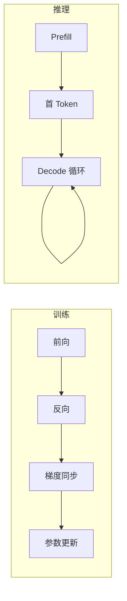
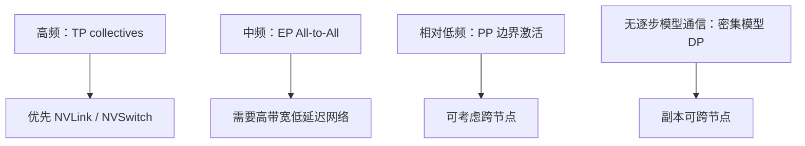
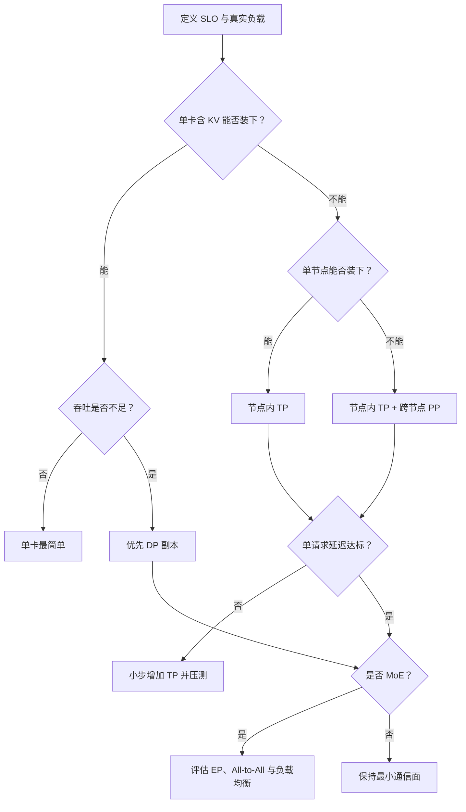

面对一台 8 卡机，最危险的问题是：“我应该把并行度设成 8 吗？”
GPU 数量只是资源，不是方案。
正确的问题应该是：**什么东西装不下，哪个指标不达标，通信要经过哪条链路？**
这一节先建立决策框架。后面五节再逐个拆开原理和命令。
<!-- more -->

## 📑 目录
- [1. 训练与推理并行不是一回事](#1-训练与推理并行不是一回事)
- [2. 先画显存地图](#2-先画显存地图)
- [3. 四种并行分别解决什么](#3-四种并行分别解决什么)
- [4. 手算一个 70B 部署](#4-手算一个-70b-部署)
- [5. 通信量与拓扑](#5-通信量与拓扑)
- [6. TP、PP、DP、EP 决策树](#6-tpppdpep-决策树)
- [7. 常见误区与 trade-off](#7-常见误区与-trade-off)
- [总结](#-总结)
- [自我检验清单](#-自我检验清单)
- [官方参考](#-官方参考)
---

## 1. 训练与推理并行不是一回事
训练的一步包含：
$$
\text{Forward} \rightarrow \text{Backward} \rightarrow \text{Optimizer Step}
$$
推理的一步只有前向，在线生成还被拆成 Prefill 与 Decode。

### 1.1 显存对象不同
训练通常同时保存参数、梯度、优化器状态和激活。
推理不保存梯度与优化器状态，却要为每个活跃序列保存 KV Cache。
训练显存常用粗算：
$$
M_{\text{train}} \approx M_W+M_G+M_O+M_A
$$
推理显存常用粗算：
$$
M_{\text{infer}} \approx M_W+M_{KV}+M_{\text{runtime}}
$$
### 1.2 性能目标不同
训练常追求每 GPU 每秒训练 Token 数。
在线推理至少有三条轴：
- TTFT：首 Token 等待时间；
- TPOT：相邻输出 Token 的间隔；
- Throughput：整体吞吐。
DP 扩副本通常提高吞吐，却不会让一个请求跨副本共同计算。
TP 可能降低单请求计算时间，也可能因集合通信让 TPOT 变差。
📌 **关键点**：不要把训练集群里的最佳并行配置直接抄到推理服务。
---

## 2. 先画显存地图
并行选择前，先把显存分成三类。
### 2.1 静态权重
设参数量为 $P$，每参数字节数为 $b_w$：
$$
M_W=P\times b_w
$$
常见数量级：
- FP32：4 Bytes；
- FP16/BF16：2 Bytes；
- INT8：约 1 Byte；
- INT4：约 0.5 Byte。
量化格式还可能有 scale、zero point 和对齐开销，所以这只是下界估算。
### 2.2 随并发与长度增长的 KV Cache
对常见 GQA 模型，可粗略写成：
$$
M_{KV} =2\times L\times H_{kv}\times D_h \times N_{\text{tokens}}\times b_{kv}
$$
其中：
- 2 表示 K 与 V；
- $L$ 是层数；
- $H_{kv}$ 是 KV Head 数；
- $D_h$ 是 Head Dimension；
- $N_{\text{tokens}}$ 是所有活跃序列已缓存 Token 总数；
- $b_{kv}$ 是每个 KV 元素字节数。
注意这里不是 Attention Head 总数，GQA 的 $H_{kv}$ 往往更小。
### 2.3 运行时余量
还要给以下对象留空间：
- 临时激活；
- CUDA Graph；
- NCCL 通信缓冲区；
- 分词与调度相关缓冲；
- 显存碎片；
- 峰值波动。
因此容量条件应写成：
$$
M_W^{shard}+M_{KV}^{shard}+M_{\text{runtime}} <M_{\text{physical}}
$$
而不是只判断权重分片能否放下。
---

## 3. 四种并行分别解决什么
### 3.1 TP：一层内部多人抬桌
TP 把矩阵乘法切到多卡。
每卡保存部分权重，同一个 Token 的同一层由多卡合作。
它主要解决：
- 单卡放不下权重；
- 单请求希望使用多卡算力。
它主要付出：
- 高频 AllReduce / ReduceScatter / AllGather；
- 对 NVLink/NVSwitch 的强依赖；
- rank 越多，通信和小矩阵效率越敏感。
### 3.2 PP：把楼层分给不同施工队
PP 把连续层分成多个 stage。
激活沿 stage 单向传递。
它主要解决：
- 模型跨节点才能装下；
- 某些模型不能整齐地做高 TP；
- 希望把高频 TP 限制在节点内。
它主要付出：
- 流水线空泡；
- stage 划分不均；
- stage 间激活传输；
- 单个 stage 出错会拖垮整条流水线。
### 3.3 DP：复制多家完整门店
DP 复制完整模型，或复制完整的 TP×PP 组。
它主要解决：
- 吞吐不足；
- 请求之间天然独立；
- 需要滚动升级或故障隔离。
它主要付出：
- 每个副本重复占权重显存；
- 请求负载可能不均；
- Prefix Cache 与 KV Cache 不跨副本共享；
- 热副本排队时，冷副本未必能接管上下文。
### 3.4 EP：Token 去找对应专家
EP 把 MoE 专家分布到不同 GPU。
它主要解决：
- 专家权重总量巨大；
- 每个 Token 只激活少量专家；
- 希望按专家维度扩展。
它主要付出：
- dispatch 与 combine 两次 All-to-All；
- 热门专家造成负载倾斜；
- 小 batch 下通信难以摊薄；
- 后端对硬件与软件版本较敏感。
---

## 4. 手算一个 70B 部署
假设一个 70B GQA 模型：
- BF16 权重；
- 80 层；
- 8 个 KV Heads；
- Head Dimension 为 128；
- KV Cache 使用 BF16；
- 目标同时缓存 32 个请求；
- 每个请求平均缓存 4096 Token。
### 4.1 权重
$$
70\times10^9\times2 =140\times10^9\text{ Bytes} \approx130.4\text{ GiB}
$$
如果用 TP=4：
$$
130.4/4\approx32.6\text{ GiB/GPU}
$$
### 4.2 KV Cache
总 Token 数：
$$
N_{\text{tokens}}=32\times4096=131072
$$
每 Token KV：
$$
2\times80\times8\times128\times2 =327680\text{ Bytes} \approx0.3125\text{ MiB}
$$
总 KV：
$$
0.3125\text{ MiB}\times131072 =40960\text{ MiB}=40\text{ GiB}
$$
若 KV 在 TP=4 上理想分片：
$$
40/4=10\text{ GiB/GPU}
$$
### 4.3 结论
单卡至少已有：
$$
32.6+10=42.6\text{ GiB}
$$
还没算运行时。
所以 4×40 GiB 显然不够，4×80 GiB 才有更现实的余量。
也可以继续量化权重、降低并发/上下文，或增加 TP，但每个选择都会改写性能与通信账单。
💡 **提示**：先手算排除不可能方案，再上机 profile。
---

## 5. 通信量与拓扑
通信时间的粗略下界：
$$
T_{\text{comm}} \gtrsim \text{latency} +\frac{\text{bytes}}{\text{effective bandwidth}}
$$
有效带宽通常小于链路标称带宽，还受拓扑、协议、并发流和消息大小影响。
### 5.1 三层物理边界
可以把 GPU 距离分成三层：
1. 同一 NVLink/NVSwitch 域；
2. 同节点但经 PCIe；
3. 跨节点经 IB、RoCE 或 TCP。
通信越频繁，越应该留在更近的边界内。

### 5.2 一个不可忽略的细节
“有 InfiniBand”不等于“GPU 通信一定走 RDMA”。
还需要核对：
- NIC 与 GPU 的 PCIe 拓扑；
- 驱动和 OFED/rdma-core；
- GPUDirect RDMA 条件；
- NCCL 选择了哪块网卡；
- 容器是否暴露设备与共享内存；
- 多 rail 是否配置正确。
---

## 6. TP、PP、DP、EP 决策树

实际选择可按以下顺序：
1. 先减少不必要的显存：量化、上下文、并发；
2. 再用最小 TP 让单副本装下；
3. 单节点装不下时再增加 PP；
4. 单副本满足延迟后，用 DP 扩吞吐；
5. 只有 MoE 才讨论 EP；
6. 每次只改变一个并行维度并压测。
---

## 7. 常见误区与 trade-off
### 误区一：TP 越大越快
TP 增大后，每卡计算变少，但 collective 数量不消失。
Decode 的矩阵本来就可能不够大，通信占比反而上升。
### 误区二：PP 天然适合在线低延迟
低并发时，后续 stage 等前序 stage，GPU 会空闲。
PP 更常首先解决容量与跨节点映射，不是免费降低 latency。
### 误区三：DP 会自动均衡
一个长请求可能长期占住某个副本。
只按轮询分发，很容易出现一边排队、一边空闲。
### 误区四：EP 等于“MoE 更快”
EP 先解决专家权重放置。
如果 Token 很少、网络很慢或路由倾斜，All-to-All 可能比专家计算更贵。
### 误区五：理论带宽就是应用带宽
标称速率不能代替 NCCL Tests 和真实请求压测。
不同消息大小的有效带宽可能差异巨大。
---

## 📝 总结
- 推理不保存梯度和优化器状态，但 KV Cache 会随并发与长度增长。
- 先算权重、KV 与运行时显存，再选择最小可行并行度。
- TP 切层内矩阵，适合高带宽域；PP 按层切分，适合跨节点容量扩展。
- DP 复制完整副本扩吞吐；EP 分布 MoE 专家并承担 All-to-All。
- 训练里的同名并行策略不能直接照搬到推理。
- 并行策略必须同时满足容量、SLO、通信和拓扑四项约束。
- 最小通信面通常比“把所有 GPU 都用上”更可靠。

## 🎯 自我检验清单
- 能写出推理显存的三大组成吗？
- 能用 GQA 参数手算 KV Cache 吗？
- 能说明推理 DP 为什么通常不做逐步梯度同步吗？
- 能解释 TP、PP、DP、EP 分别切分或复制什么吗？
- 能判断单请求延迟和集群吞吐分别优先看哪种并行吗？
- 能说出 NVLink、PCIe、IB/RoCE 对策略映射的影响吗？
- 能解释为什么 TP 增大后可能负扩展吗？
- 能为 16 张 GPU 给出一个 `DP×PP×TP` 组合并说明理由吗？

## 📚 官方参考
- [vLLM：Parallelism and Scaling](https://docs.vllm.ai/en/stable/serving/parallelism_scaling/)
- [vLLM：Optimization and Tuning](https://docs.vllm.ai/en/stable/configuration/optimization/)
- [NVIDIA NCCL：Collective Operations](https://docs.nvidia.com/deeplearning/nccl/user-guide/docs/usage/collectives.html)
- [NVIDIA：GPU Memory Usage](https://docs.nvidia.com/deploy/nvidia-smi/)
- [Megatron-LM：Efficient Large-Scale Language Model Training](https://arxiv.org/abs/1909.08053)
