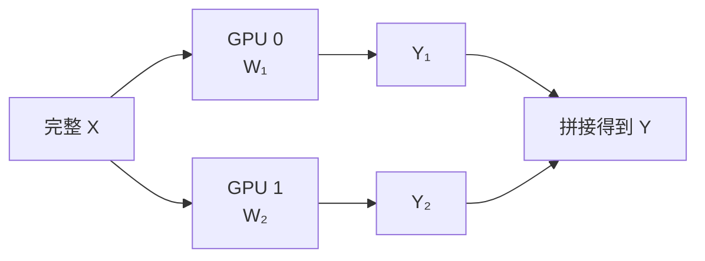
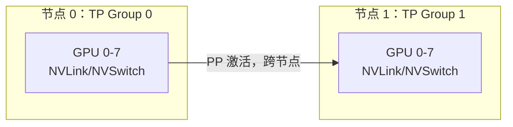

一张 70B 模型的权重像一张过大的会议桌。
TP 的做法不是把桌子锯成几段轮流使用，而是让几个人同时抬同一张桌子：每个人承担一部分重量，动作却必须保持同步。
“减轻单卡负担”是收益，“每层都要对齐”就是代价。
<!-- more -->

## 📑 目录
- [1. 从一个线性层开始](#1-从一个线性层开始)
- [2. 列并行与行并行](#2-列并行与行并行)
- [3. Attention 与 MLP 如何切](#3-attention-与-mlp-如何切)
- [4. 显存收益手算](#4-显存收益手算)
- [5. AllReduce 通信量手算](#5-allreduce-通信量手算)
- [6. 为什么 TP 偏爱 NVLink](#6-为什么-tp-偏爱-nvlink)
- [7. TP 大小怎么选](#7-tp-大小怎么选)
- [8. 验证与排错](#8-验证与排错)
- [总结](#-总结)
- [自我检验清单](#-自我检验清单)
- [官方参考](#-官方参考)
---

## 1. 从一个线性层开始
线性层可写成：
$$
Y=XW
$$
假设：
- 输入 $X$ 形状为 $[T,H]$；
- 权重 $W$ 形状为 $[H,O]$；
- 输出 $Y$ 形状为 $[T,O]$。
$T$ 可以理解为本次前向处理的 Token 数。
若直接复制 $W$ 到每张卡，每张卡仍然要保存完整权重，没有解决模型装不下的问题。
TP 会沿矩阵某个维度切分 $W$。
切法要同时满足两个目标：
1. 每张卡只保存权重的一部分；
2. 尽量让相邻算子之间少通信。
这就产生了列并行与行并行。
---

## 2. 列并行与行并行
### 2.1 列并行：按输出维切
将 $W$ 的列切成 $p$ 份：
$$
W=[W_1,W_2,\dots,W_p]
$$
每个 rank 计算：
$$
Y_i=XW_i
$$
得到的 $Y_i$ 是输出特征的一部分。

如果下一个算子能直接消费分片输出，这里不必立刻 AllGather。
### 2.2 行并行：按输入维切
将 $W$ 的行切成 $p$ 份，输入也对应切开：
$$
X=[X_1,X_2,\dots,X_p]^{}
$$
每个 rank 计算部分和：
$$
Z_i=X_iW_i
$$
最终：
$$
Y=\sum_{i=1}^{p}Z_i
$$
这个求和通常需要 AllReduce，或用 ReduceScatter 保持后续分片布局。
### 2.3 为什么两种切法要配对
Transformer 常把列并行与行并行成对安排。
前一个层把输出特征切开，中间激活保持本地；后一个层再产生部分和，最后做一次集合通信。
它像接力赛：不是每跑一步都回到起点报到，而是尽可能多跑一段后再同步。
---

## 3. Attention 与 MLP 如何切
### 3.1 Attention
Q、K、V 投影可以按 Head 或输出维切分。
每个 rank 负责一部分 Attention Heads，本地完成对应 Attention，输出投影再通过行并行合并部分结果。
对 GQA/MQA 模型要特别注意：
KV Head 数可能少于 TP 大小。
如果 $H_{kv}$ 不能自然被 TP 整除，框架可能复制 KV Heads、采用特殊分片，或直接限制该 TP 配置。
所以“GPU 有 8 张”并不能推出“TP 必须等于 8”。
### 3.2 MLP
门控 MLP 常包含：
$$
\text{MLP}(X) =W_{down}\left( \sigma(XW_{gate})\odot XW_{up} \right)
$$
$W_{gate}$ 与 $W_{up}$ 常做列并行，$W_{down}$ 做行并行。
中间宽维度留在各 rank 本地，经过 down projection 后再合并。
### 3.3 通信次数不能死记
经典 Megatron 风格 Transformer Block 常可理解为 Attention 与 MLP 各有一次主要聚合。
但真实框架可能使用：
- AllReduce；
- ReduceScatter + AllGather；
- 融合 Kernel；
- Sequence Parallel；
- 不同 Attention 后端。
因此下文的“两次/层”用于容量规划，不是对所有模型实现的逐条源码保证。
---

## 4. 显存收益手算
假设一个 32B 参数 BF16 模型。
权重下界：
$$
32\times10^9\times2 =64\times10^9\text{ Bytes} \approx59.6\text{ GiB}
$$
理想权重分片：
- TP=2：约 29.8 GiB/GPU；
- TP=4：约 14.9 GiB/GPU；
- TP=8：约 7.45 GiB/GPU。
但 LayerNorm、小向量、Embedding 或 LM Head 可能复制或采用不同切法，所以不是每项都严格除以 TP。
### 4.1 加上 KV Cache
假设总 KV Cache 为 24 GiB，并能在 TP rank 间均匀分片。
TP=4 时：
$$
M_{\text{weight+KV}} \approx14.9+24/4 =20.9\text{ GiB/GPU}
$$
在 24 GiB GPU 上仍然非常紧张，因为 CUDA Context、Graph、临时张量和通信缓冲区还没算。
在 40 GiB GPU 上则有更合理的运行余量。
### 4.2 TP 不会增加总 KV 容量魔法
TP 只是把可分片对象摊到更多 GPU。
如果框架为某些 KV Heads 做复制，实际缩放会低于理想值。
应该以启动日志和 `nvidia-smi` 实测为准。
---

## 5. AllReduce 通信量手算
假设某次需要聚合的 BF16 激活为：
- Decode 批内共 32 个 Token；
- Hidden Size $H=8192$；
- 每元素 2 Bytes。
消息大小：
$$
M=32\times8192\times2 =524288\text{ Bytes} =0.5\text{ MiB}
$$
### 5.1 Ring AllReduce 的每 rank 流量
Ring 算法常用近似：
$$
V_{\text{rank}} \approx2\frac{p-1}{p}M
$$
TP=4：
$$
V_{\text{rank}} \approx2\times\frac34\times0.5 =0.75\text{ MiB}
$$
若按每层两次主要聚合、80 层粗算：
$$
0.75\times2\times80 =120\text{ MiB/rank/decode step}
$$
这个数字是帮助理解数量级的模型：
- 不等于交换机上的总字节；
- 不包含协议开销；
- 不保证实际使用 Ring；
- 不包含可能融合或替代的通信；
- Prefill 的 $T$ 更大，消息也更大。
### 5.2 延迟与带宽都重要
0.5 MiB 消息不算特别大，但每层同步很多次。
总成本包含大量固定启动延迟：
$$
T_{\text{AR}} \approx N_{\text{collective}} \left(\alpha+\frac{V}{B_{\text{eff}}}\right)
$$
$\alpha$ 是每次通信的固定延迟，$B_{\text{eff}}$ 是有效带宽。
Decode 小消息尤其怕高延迟；Prefill 大消息更容易受带宽限制。
---

## 6. 为什么 TP 偏爱 NVLink
TP rank 每层都互相等待。
任何一个慢 rank 都会成为同步木桶的短板。
节点内链路常见优先级是：
1. NVSwitch / 全互连 NVLink 域；
2. 直连或较近的 NVLink；
3. 同 PCIe Switch；
4. 跨 CPU Socket 的 PCIe；
5. 跨节点 IB/RoCE；
6. 普通 TCP 网络。
这里是经验排序，具体平台仍以有效带宽和延迟为准。
### 6.1 查看拓扑
```bash
nvidia-smi topo -m
nvidia-smi topo -p2p n
nvidia-smi nvlink --status
```
`topo -m` 中常见标签含义依平台而变，应结合该机器的 NVIDIA 文档解释。
重点不是背标签，而是确认准备组成 TP 组的 GPU 是否处在近邻链路。
### 6.2 rank 放置示意
两节点各 8 卡且节点内有 NVSwitch 时，常见起点是：
$$
TP=8,\quad PP=2
$$
而不是让一个 TP=16 频繁跨节点 AllReduce。

若有跨节点 NVLink 系统，结论可能不同；仍需 NCCL Tests 与端到端压测。
---

## 7. TP 大小怎么选
先找**最小可行 TP**：
$$
TP_{\min} =\left\lceil \frac{M_{\text{required}}} {M_{\text{usable per GPU}}} \right\rceil
$$
然后检查模型结构约束：
- Attention Head 数能否整除；
- KV Head 如何分片；
- MLP 中间维是否适合切分；
- GPU 数与 rank 映射是否合法；
- 量化 Kernel 是否支持该 TP；
- LoRA、Prefix Cache 等功能是否兼容。
最后逐级压测：
$$
TP=1\rightarrow2\rightarrow4\rightarrow8
$$
同时观察：
- 每 GPU 显存；
- TTFT P50/P99；
- TPOT P50/P99；
- 请求吞吐与 Token 吞吐；
- GPU 利用率；
- NCCL 时间占比。
📌 **停止条件**：容量已满足且继续增大 TP 不再改善目标 SLO。
---

## 8. 验证与排错
### 8.1 单节点启动
```bash
vllm serve Qwen/Qwen2.5-32B-Instruct \
  --tensor-parallel-size 4
```
参数会随版本演进，先在目标环境确认：
```bash
vllm serve --help | less
python -c "import vllm; print(vllm.__version__)"
```
### 8.2 启动前验证
```bash
nvidia-smi
nvidia-smi topo -m
python -c "import torch; print(torch.cuda.device_count())"
```
### 8.3 常见故障
**只有部分 GPU 有显存占用**
- 检查 `CUDA_VISIBLE_DEVICES`；
- 检查 TP 是否超过可见 GPU；
- 检查 Ray 或容器资源是否正确申报。
**NCCL timeout / unhandled system error**
- 先确认 P2P 与拓扑；
- 检查 `/dev/shm`；
- 开启 `NCCL_DEBUG=INFO` 收集证据；
- 不要一上来永久禁用 P2P 或 IB。
**TP=8 比 TP=4 慢**
- 比较 collective 时间；
- 确认是否跨 NUMA 或跨节点；
- 检查 Decode batch 是否太小；
- 核对量化 Kernel 在高 TP 下的效率；
- 比较相同请求分布，而不是只看一次 curl。
**输出不一致**
- 先固定采样参数与随机种子；
- 使用 greedy decoding 做基线；
- 检查模型、Tokenizer、DType 和量化文件一致性；
- 区分浮点归约顺序差异与真实错误。
---

## 📝 总结
- TP 将层内权重矩阵分片，让同一请求在多 GPU 上协同前向。
- 列并行按输出维切，行并行产生部分和并需要集合通信。
- Transformer 通常配对安排列并行与行并行，以减少中间同步。
- 权重与部分 KV Cache 可近似除以 TP，但运行时和复制项不会消失。
- Ring AllReduce 每 rank 流量可用 $2(p-1)M/p$ 做数量级估算。
- Decode 怕大量小消息的固定延迟，Prefill 更容易受有效带宽约束。
- TP 应优先映射到 NVLink/NVSwitch 域，并选择满足容量的最小并行度。

## 🎯 自我检验清单
- 能从 $Y=XW$ 解释列并行和行并行吗？
- 能说明行并行为什么需要合并部分和吗？
- 能解释 Attention 与 MLP 中 TP 的典型切法吗？
- 能手算 BF16 权重在 TP=4 下的理想分片吗？
- 能用 Ring 公式估算一次 AllReduce 的每 rank 流量吗？
- 能说明固定延迟为何会伤害 Decode 吗？
- 能根据 `nvidia-smi topo -m` 选择 TP 组吗？
- 能解释为什么最小可行 TP 往往是更好的起点吗？
- 能列出 TP 负扩展的三个排查方向吗？

## 📚 官方参考
- [vLLM：Parallelism and Scaling](https://docs.vllm.ai/en/stable/serving/parallelism_scaling/)
- [vLLM：Serve CLI](https://docs.vllm.ai/en/stable/cli/serve/)
- [NVIDIA NCCL：Collective Operations](https://docs.nvidia.com/deeplearning/nccl/user-guide/docs/usage/collectives.html)
- [NVIDIA NCCL：GPU Troubleshooting](https://docs.nvidia.com/deeplearning/nccl/user-guide/docs/troubleshooting/gpu_troubleshooting.html)
- [Megatron-LM 论文](https://arxiv.org/abs/1909.08053)
