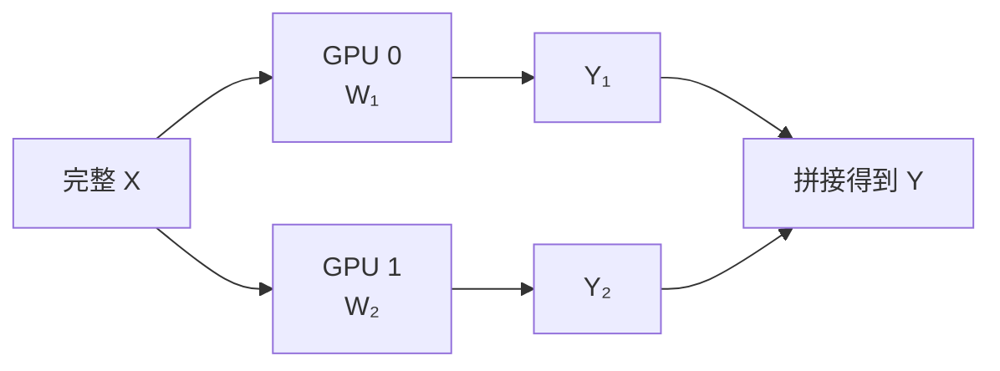
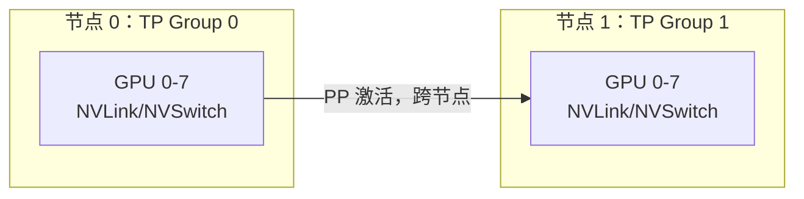
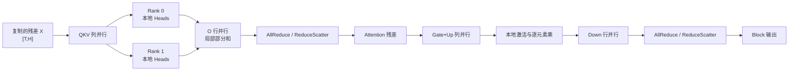

一张 70B 模型的权重像一张过大的会议桌。
TP 的做法不是把桌子锯成几段轮流使用，而是让几个人同时抬同一张桌子：每个人承担一部分重量，动作却必须保持同步。
“减轻单卡负担”是收益，“每层都要对齐”就是代价。
<!-- more -->

## 📑 目录
- [1. 从一个线性层开始](#1-从一个线性层开始)
- [2. 列并行与行并行](#2-列并行与行并行)
- [3. Attention 与 MLP 如何切](#3-attention-与-mlp-如何切)
- [4. 显存收益手算](#4-显存收益手算)
- [5. AllReduce 通信量手算](#5-allreduce-通信量手算)
- [6. 为什么 TP 偏爱 NVLink](#6-为什么-tp-偏爱-nvlink)
- [7. TP 大小怎么选](#7-tp-大小怎么选)
- [8. 验证与排错](#8-验证与排错)
- [9. 逐层推导 Transformer Block 的 TP 数据流](#9-逐层推导-transformer-block-的-tp-数据流)
- [10. AllReduce、ReduceScatter 与 AllGather](#10-allreducereducescatter-与-allgather-的严格区别)
- [11. Attention 头切分的完整数值例子](#11-attention-头切分的完整数值例子)
- [12. 计算—通信屋顶与 Prefill/Decode 差异](#12-计算通信屋顶与-prefilldecode-差异)
- [13. 训练 TP 与推理 TP](#13-训练-tp-与推理-tp相同算子不同压力)
- [14. TP 实验](#14-tp-实验验证缩放拓扑与通信)
- [总结](#-总结)
- [自我检验清单](#-自我检验清单)
- [官方参考](#-官方参考)
---

## 1. 从一个线性层开始
线性层可写成：
$$
Y=XW
$$
假设：
- 输入 $X$ 形状为 $[T,H]$；
- 权重 $W$ 形状为 $[H,O]$；
- 输出 $Y$ 形状为 $[T,O]$。
$T$ 可以理解为本次前向处理的 Token 数。
若直接复制 $W$ 到每张卡，每张卡仍然要保存完整权重，没有解决模型装不下的问题。
TP 会沿矩阵某个维度切分 $W$。
切法要同时满足两个目标：
1. 每张卡只保存权重的一部分；
2. 尽量让相邻算子之间少通信。
这就产生了列并行与行并行。
---

## 2. 列并行与行并行
### 2.1 列并行：按输出维切
将 $W$ 的列切成 $p$ 份：
$$
W=[W_1,W_2,\dots,W_p]
$$
每个 rank 计算：
$$
Y_i=XW_i
$$
得到的 $Y_i$ 是输出特征的一部分。

如果下一个算子能直接消费分片输出，这里不必立刻 AllGather。
### 2.2 行并行：按输入维切
将 $W$ 的行切成 $p$ 份，输入也对应切开：
$$
X=[X_1,X_2,\dots,X_p]^{}
$$
每个 rank 计算部分和：
$$
Z_i=X_iW_i
$$
最终：
$$
Y=\sum_{i=1}^{p}Z_i
$$
这个求和通常需要 AllReduce，或用 ReduceScatter 保持后续分片布局。
### 2.3 为什么两种切法要配对
Transformer 常把列并行与行并行成对安排。
前一个层把输出特征切开，中间激活保持本地；后一个层再产生部分和，最后做一次集合通信。
它像接力赛：不是每跑一步都回到起点报到，而是尽可能多跑一段后再同步。
---

## 3. Attention 与 MLP 如何切
### 3.1 Attention
Q、K、V 投影可以按 Head 或输出维切分。
每个 rank 负责一部分 Attention Heads，本地完成对应 Attention，输出投影再通过行并行合并部分结果。
对 GQA/MQA 模型要特别注意：
KV Head 数可能少于 TP 大小。
如果 $H_{kv}$ 不能自然被 TP 整除，框架可能复制 KV Heads、采用特殊分片，或直接限制该 TP 配置。
所以“GPU 有 8 张”并不能推出“TP 必须等于 8”。
### 3.2 MLP
门控 MLP 常包含：
$$
\text{MLP}(X) =W_{down}\left( \sigma(XW_{gate})\odot XW_{up} \right)
$$
$W_{gate}$ 与 $W_{up}$ 常做列并行，$W_{down}$ 做行并行。
中间宽维度留在各 rank 本地，经过 down projection 后再合并。
### 3.3 通信次数不能死记
经典 Megatron 风格 Transformer Block 常可理解为 Attention 与 MLP 各有一次主要聚合。
但真实框架可能使用：
- AllReduce；
- ReduceScatter + AllGather；
- 融合 Kernel；
- Sequence Parallel；
- 不同 Attention 后端。
因此下文的“两次/层”用于容量规划，不是对所有模型实现的逐条源码保证。
---

## 4. 显存收益手算
假设一个 32B 参数 BF16 模型。
权重下界：
$$
32\times10^9\times2 =64\times10^9\text{ Bytes} \approx59.6\text{ GiB}
$$
理想权重分片：
- TP=2：约 29.8 GiB/GPU；
- TP=4：约 14.9 GiB/GPU；
- TP=8：约 7.45 GiB/GPU。
但 LayerNorm、小向量、Embedding 或 LM Head 可能复制或采用不同切法，所以不是每项都严格除以 TP。
### 4.1 加上 KV Cache
假设总 KV Cache 为 24 GiB，并能在 TP rank 间均匀分片。
TP=4 时：
$$
M_{\text{weight+KV}} \approx14.9+24/4 =20.9\text{ GiB/GPU}
$$
在 24 GiB GPU 上仍然非常紧张，因为 CUDA Context、Graph、临时张量和通信缓冲区还没算。
在 40 GiB GPU 上则有更合理的运行余量。
### 4.2 TP 不会增加总 KV 容量魔法
TP 只是把可分片对象摊到更多 GPU。
如果框架为某些 KV Heads 做复制，实际缩放会低于理想值。
应该以启动日志和 `nvidia-smi` 实测为准。
---

## 5. AllReduce 通信量手算
假设某次需要聚合的 BF16 激活为：
- Decode 批内共 32 个 Token；
- Hidden Size $H=8192$；
- 每元素 2 Bytes。
消息大小：
$$
M=32\times8192\times2 =524288\text{ Bytes} =0.5\text{ MiB}
$$
### 5.1 Ring AllReduce 的每 rank 流量
Ring 算法常用近似：
$$
V_{\text{rank}} \approx2\frac{p-1}{p}M
$$
TP=4：
$$
V_{\text{rank}} \approx2\times\frac34\times0.5 =0.75\text{ MiB}
$$
若按每层两次主要聚合、80 层粗算：
$$
0.75\times2\times80 =120\text{ MiB/rank/decode step}
$$
这个数字是帮助理解数量级的模型：
- 不等于交换机上的总字节；
- 不包含协议开销；
- 不保证实际使用 Ring；
- 不包含可能融合或替代的通信；
- Prefill 的 $T$ 更大，消息也更大。
### 5.2 延迟与带宽都重要
0.5 MiB 消息不算特别大，但每层同步很多次。
总成本包含大量固定启动延迟：
$$
T_{\text{AR}} \approx N_{\text{collective}} \left(\alpha+\frac{V}{B_{\text{eff}}}\right)
$$
$\alpha$ 是每次通信的固定延迟，$B_{\text{eff}}$ 是有效带宽。
Decode 小消息尤其怕高延迟；Prefill 大消息更容易受带宽限制。
---

## 6. 为什么 TP 偏爱 NVLink
TP rank 每层都互相等待。
任何一个慢 rank 都会成为同步木桶的短板。
节点内链路常见优先级是：
1. NVSwitch / 全互连 NVLink 域；
2. 直连或较近的 NVLink；
3. 同 PCIe Switch；
4. 跨 CPU Socket 的 PCIe；
5. 跨节点 IB/RoCE；
6. 普通 TCP 网络。
这里是经验排序，具体平台仍以有效带宽和延迟为准。
### 6.1 查看拓扑
```bash
nvidia-smi topo -m
nvidia-smi topo -p2p n
nvidia-smi nvlink --status
```
`topo -m` 中常见标签含义依平台而变，应结合该机器的 NVIDIA 文档解释。
重点不是背标签，而是确认准备组成 TP 组的 GPU 是否处在近邻链路。
### 6.2 rank 放置示意
两节点各 8 卡且节点内有 NVSwitch 时，常见起点是：
$$
TP=8,\quad PP=2
$$
而不是让一个 TP=16 频繁跨节点 AllReduce。

若有跨节点 NVLink 系统，结论可能不同；仍需 NCCL Tests 与端到端压测。
---

## 7. TP 大小怎么选
先找**最小可行 TP**：
$$
TP_{\min} =\left\lceil \frac{M_{\text{required}}} {M_{\text{usable per GPU}}} \right\rceil
$$
然后检查模型结构约束：
- Attention Head 数能否整除；
- KV Head 如何分片；
- MLP 中间维是否适合切分；
- GPU 数与 rank 映射是否合法；
- 量化 Kernel 是否支持该 TP；
- LoRA、Prefix Cache 等功能是否兼容。
最后逐级压测：
$$
TP=1\rightarrow2\rightarrow4\rightarrow8
$$
同时观察：
- 每 GPU 显存；
- TTFT P50/P99；
- TPOT P50/P99；
- 请求吞吐与 Token 吞吐；
- GPU 利用率；
- NCCL 时间占比。
📌 **停止条件**：容量已满足且继续增大 TP 不再改善目标 SLO。
---

## 8. 验证与排错
### 8.1 单节点启动
```bash
vllm serve Qwen/Qwen2.5-32B-Instruct \
  --tensor-parallel-size 4
```
参数会随版本演进，先在目标环境确认：
```bash
vllm serve --help | less
python -c "import vllm; print(vllm.__version__)"
```
### 8.2 启动前验证
```bash
nvidia-smi
nvidia-smi topo -m
python -c "import torch; print(torch.cuda.device_count())"
```
### 8.3 常见故障
**只有部分 GPU 有显存占用**
- 检查 `CUDA_VISIBLE_DEVICES`；
- 检查 TP 是否超过可见 GPU；
- 检查 Ray 或容器资源是否正确申报。
**NCCL timeout / unhandled system error**
- 先确认 P2P 与拓扑；
- 检查 `/dev/shm`；
- 开启 `NCCL_DEBUG=INFO` 收集证据；
- 不要一上来永久禁用 P2P 或 IB。
**TP=8 比 TP=4 慢**
- 比较 collective 时间；
- 确认是否跨 NUMA 或跨节点；
- 检查 Decode batch 是否太小；
- 核对量化 Kernel 在高 TP 下的效率；
- 比较相同请求分布，而不是只看一次 curl。
**输出不一致**
- 先固定采样参数与随机种子；
- 使用 greedy decoding 做基线；
- 检查模型、Tokenizer、DType 和量化文件一致性；
- 区分浮点归约顺序差异与真实错误。
---

## 9. 逐层推导 Transformer Block 的 TP 数据流

这一节不再停留在“QKV 列并行、输出行并行”的结论，而是追踪张量在 rank 间的布局。

设：

- TP size 为 $p$；
- Token 数为 $T$；
- Hidden Size 为 $H$；
- Query Head 数为 $N_q$；
- KV Head 数为 $N_{kv}$；
- Head Dimension 为 $D$，所以 $H=N_qD$；
- MLP Intermediate Size 为 $I$。

### 9.1 输入布局

最常见的 Megatron 风格起点是每个 TP rank 都持有完整残差流：

$$
X_r=X,\quad X\in\mathbb{R}^{T\times H}
$$

这里的“复制”不代表模型权重复制，而是当前 Block 输入激活在 TP ranks 上相同。



### 9.2 Q 投影的列并行

对标准 MHA：

$$
W_Q\in\mathbb{R}^{H\times H}
$$

沿输出维切成：

$$
W_Q=[W_Q^{(0)},\dots,W_Q^{(p-1)}],
\quad
W_Q^{(r)}\in\mathbb{R}^{H\times H/p}
$$

每 rank：

$$
Q^{(r)}=XW_Q^{(r)}
\in\mathbb{R}^{T\times H/p}
$$

若 $N_q$ 可被 $p$ 整除，则每 rank 获得：

$$
N_q^{(r)}=\frac{N_q}{p}
$$

个完整 Query Heads。本地 reshape 为：

$$
[T,N_q/p,D]
$$

关键是切在 Head 边界上，而不是把一个 Head 的 $D$ 随意切碎。这样每个 rank 可以本地完成对应 Head 的 Attention。

### 9.3 GQA 的 KV Head 分配

GQA 中：

$$
W_K,W_V\in\mathbb{R}^{H\times(N_{kv}D)}
$$

有三种典型情形。

**情形 A：$N_{kv}\ge p$ 且整除**

每 rank 保存 $N_{kv}/p$ 个 KV Heads，最简单。

**情形 B：$N_{kv}<p$**

例如 $N_q=64,N_{kv}=8,p=16$。每个 KV Head 需要服务 8 个 Query Heads，而每 rank 只有 4 个 Query Heads。

框架可能：

- 在两个 TP rank 上复制同一个 KV Head；
- 限制 TP 不超过 KV Head 数；
- 使用更复杂的分组或跨 rank KV 访问。

复制时 KV 权重和 KV Cache 不再理想地除以 16。

**情形 C：不能整除**

例如 $N_{kv}=8,p=6$。平均切分会破坏 Head 边界。是否支持取决于模型实现与框架，不能只看 GPU 数。

### 9.4 Attention 本地计算

每 rank 用本地 Query Heads 和对应 KV Heads 计算：

$$
A^{(r)}=
\operatorname{softmax}
\left(
\frac{Q^{(r)}K^{(r)\top}}{\sqrt D}
\right)V^{(r)}
$$

输出：

$$
A^{(r)}\in\mathbb{R}^{T\times H/p}
$$

在 Decode 阶段，$T$ 通常是本轮调度的序列数；历史长度体现在读取的 KV Cache，而不是 Query 的 Token 维。

### 9.5 输出投影的行并行

输出投影：

$$
W_O\in\mathbb{R}^{H\times H}
$$

输入已经沿 $H$ 分片，所以把 $W_O$ 沿输入维切分：

$$
W_O=
\begin{bmatrix}
W_O^{(0)}\\
\vdots\\
W_O^{(p-1)}
\end{bmatrix},
\quad
W_O^{(r)}\in\mathbb{R}^{H/p\times H}
$$

每 rank 得到完整输出 shape 的部分和：

$$
Z^{(r)}=A^{(r)}W_O^{(r)}
\in\mathbb{R}^{T\times H}
$$

正确结果是：

$$
Z=\sum_{r=0}^{p-1}Z^{(r)}
$$

所以这里必须发生跨 rank 归约。

### 9.6 MLP 的同构推导

Gate 和 Up：

$$
W_g,W_u\in\mathbb{R}^{H\times I}
$$

沿输出维切：

$$
G^{(r)}=XW_g^{(r)},\quad
U^{(r)}=XW_u^{(r)}
$$

shape 都是 $[T,I/p]$。逐元素激活和乘法完全本地：

$$
S^{(r)}=\operatorname{SiLU}(G^{(r)})\odot U^{(r)}
$$

Down Projection：

$$
W_d^{(r)}\in\mathbb{R}^{I/p\times H}
$$

局部部分和：

$$
D^{(r)}=S^{(r)}W_d^{(r)}
\in\mathbb{R}^{T\times H}
$$

再归约得到完整 MLP 输出。

因此经典 Block 有两个主要归约点：Attention 输出后一次、MLP Down 后一次。

---

## 10. AllReduce、ReduceScatter 与 AllGather 的严格区别

### 10.1 AllReduce

输入：每 rank 有同 shape 的部分结果 $Z^{(r)}$。

输出：每 rank 都得到完整和：

$$
Y^{(r)}=\sum_i Z^{(i)}
$$

若残差流在每 rank 复制，AllReduce 后可直接做残差加法和下一子层。

### 10.2 ReduceScatter

输入仍是每 rank 的完整 shape 部分和，但输出只保留归约结果的一段：

$$
Y^{(r)}=
\operatorname{chunk}_r\left(\sum_i Z^{(i)}\right)
$$

每 rank 的输出大小为 $M/p$。

它适合后续采用 Sequence Parallel 或 ReduceScatter 布局的实现。若下一算子最终仍需要完整 $Y$，稍后还要 AllGather。

### 10.3 AllGather

输入：每 rank 持有不同分片。

输出：每 rank 拼接得到完整张量：

$$
Y=\operatorname{concat}(Y^{(0)},\dots,Y^{(p-1)})
$$

### 10.4 Ring 算法通信量

设完整张量大小为 $M$ Bytes，$p$ 个 rank。

Ring ReduceScatter 有 $p-1$ 步，每步发送 $M/p$：

$$
V_{\text{RS,rank}}=\frac{p-1}{p}M
$$

Ring AllGather 同样：

$$
V_{\text{AG,rank}}=\frac{p-1}{p}M
$$

组合为 AllReduce：

$$
V_{\text{AR,rank}}=
2\frac{p-1}{p}M
$$

注意“发送量”“接收量”“双向 NIC 计数”和“网络总流量”可能采用不同统计口径。面试回答时应先说明这里统计每 rank 发送的算法载荷。

### 10.5 数值手算：AR 与 RS

设：

- $T=128$；
- $H=8192$；
- BF16；
- $p=8$。

完整激活：

$$
M=128\times8192\times2=2\text{ MiB}
$$

每 rank：

$$
V_{\text{RS}}=\frac78\times2=1.75\text{ MiB}
$$

$$
V_{\text{AR}}=2\times\frac78\times2=3.5\text{ MiB}
$$

若一次 Block 两个 AllReduce，80 层：

$$
3.5\times2\times80=560\text{ MiB/rank/step}
$$

如果实现把一个 AllReduce 拆成 RS+AG，总算法载荷没有凭空消失；价值来自布局、算子重叠和避免不必要的复制。

### 10.6 延迟项

Ring 的近似时间可写为：

$$
T_{\text{AR}}\approx
2(p-1)\alpha+
2\frac{p-1}{p}\frac{M}{B}
$$

Tree 算法可降低步数，但带宽使用方式不同。NCCL 会根据拓扑和消息大小选择算法/协议，因此公式用于解释趋势，不用于替代 profile。

---

## 11. Attention 头切分的完整数值例子

假设模型：

- $H=8192$；
- $N_q=64$；
- $N_{kv}=8$；
- $D=128$；
- TP=8；
- BF16。

### 11.1 每 rank 的头

Query Heads：

$$
64/8=8
$$

KV Heads：

$$
8/8=1
$$

每 rank 的 Q 输出宽度：

$$
8\times128=1024
$$

每 rank 的 K 或 V 输出宽度：

$$
1\times128=128
$$

因此融合 QKV 投影每 rank 输出宽度：

$$
1024+128+128=1280
$$

### 11.2 每 rank 的 KV Cache

80 层、每序列 4096 Token：

$$
M_{KV,\text{rank}}
=2\times80\times1\times128\times4096\times2
=167{,}772{,}160\text{ Bytes}
\approx160\text{ MiB/sequence}
$$

8 ranks 总计约 1.25 GiB/sequence，与按 8 个 KV Heads 的全局计算一致。

### 11.3 TP=16 会发生什么

每 rank 只有 4 个 Query Heads，但全局只有 8 个 KV Heads。

若每个 KV Head 复制到两个 ranks，每 rank 仍保存 1 个 KV Head：

- Query 权重继续缩小；
- KV 权重和 KV Cache 从 TP=8 到 TP=16 不再减半；
- collective rank 数增加；
- 每 rank GEMM 更小。

这正是高 TP 可能负扩展的结构原因，而不仅是“网络慢”。

---

## 12. 计算—通信屋顶与 Prefill/Decode 差异

### 12.1 GEMM 计算量

对 $[T,H]\times[H,O]$：

$$
\text{FLOPs}\approx2THO
$$

列并行后每 rank：

$$
\text{FLOPs/rank}\approx\frac{2THO}{p}
$$

通信消息却常按 $TH$ 量级，不会按输出矩阵的全部计算量增长。

### 12.2 为什么 Prefill 更能利用 TP

Prefill 的 $T$ 大，GEMM 更大，更容易达到 Tensor Core 高效率，也更容易用计算覆盖通信。

Decode 中，每序列本轮通常只产生一个 Query Token。即使 batch 有 32 个序列，$T=32$ 仍可能让 GEMM 较瘦；collective 次数仍约每层两次。

定义粗略的通信占比：

$$
\rho=\frac{T_{\text{collective}}}
{T_{\text{compute}}+T_{\text{collective}}}
$$

如果 TP 从 4 增到 8：

- 计算理论上接近减半；
- collective rank 增多、步数和延迟上升；
- 若 $\rho$ 已很高，端到端时间可能反而上升。

### 12.3 一个延迟估算

假设 Decode 每层两次 collective，80 层；每次固定开销加小消息传输共 20 微秒：

$$
T_{\text{comm/step}}
=2\times80\times20\mu s
=3.2\text{ ms}
$$

如果每次变成 60 微秒：

$$
T_{\text{comm/step}}=9.6\text{ ms}
$$

即使带宽足够，小消息固定延迟的差异也会直接反映到 TPOT。

---

## 13. 训练 TP 与推理 TP：相同算子，不同压力

相同点：

- 权重切分与列/行并行代数相同；
- 前向仍需要相同类型的 collective；
- Head、Intermediate Size 的整除约束仍在。

训练额外包含：

- 反向中的梯度通信；
- 参数梯度、激活和优化器状态；
- Sequence Parallel 常用于降低训练激活；
- Micro-batch 与梯度累积决定流水线和吞吐。

推理特有压力：

- KV Cache 持续驻留；
- Decode 每步小消息、高频同步；
- Continuous Batching 让 $T$ 动态变化；
- TTFT 与 TPOT 必须分开；
- 一个慢 rank 会放大在线尾延迟。

面试中若问“TP 通信量”，应先问是前向推理、训练 forward+backward，还是只分析某个算子。三者答案不是同一个数字。

---

## 14. TP 实验：验证缩放、拓扑与通信

### 14.1 实验前提

- 一台至少 4 卡、GPU 间拓扑已知的 Linux 节点；
- 模型在 TP=1/2/4 中至少两个配置可运行；
- 使用固定 vLLM 版本；
- 准备短请求、Prefill-heavy、Decode-heavy 三组数据。

### 14.2 启动矩阵

以实际可用模型替换 `<MODEL>`：

```bash
TP=1  # 依次改为 1、2、4；每轮压测结束后先停止服务
CUDA_VISIBLE_DEVICES=0,1,2,3 \
vllm serve <MODEL> \
  --tensor-parallel-size "${TP}" \
  --port "$((8000 + TP))"
```

**每次只启动一个 TP 配置，完成 Warm-up 和压测后停止，再运行下一个值。**

先检查：

```bash
nvidia-smi topo -m
nvidia-smi dmon -s pucm
```

若有两组不同距离的 GPU，可在相同 TP 下分别测试近邻和跨 NUMA rank 放置。

### 14.3 请求矩阵

```text
A: prompt=128,  output=128,  concurrency=1/16/64
B: prompt=8192, output=128,  concurrency=1/8/32
C: prompt=128,  output=2048, concurrency=1/8/32
```

控制变量：

- 相同 Token 序列，而不只是相同字符数；
- `temperature=0`；
- 相同 `max_num_seqs` 与 `max_num_batched_tokens`；
- 每次服务启动后完成 Warm-up；
- 禁用或隔离 Prefix Cache 影响。

### 14.4 指标

- TTFT、TPOT 的 P50/P95/P99；
- Prefill Throughput、Output Throughput；
- 每 GPU 显存与利用率；
- NVLink/PCIe/NIC 吞吐；
- collective 时间占 CUDA 时间比例；
- TP Scaling Efficiency：

$$
E_p=\frac{Q_p}{pQ_1}
$$

对“单请求延迟”则不要套吞吐效率，直接比较目标分位延迟。

### 14.5 预期现象

- 权重显存接近按 TP 分片，但复制项不下降；
- Prefill-heavy 更可能从增大 TP 获益；
- Decode-heavy 在低并发下更容易负扩展；
- 跨 NUMA/PCIe 的 TP 组比 NVLink 组更敏感；
- TP 超过 KV Head 数后，KV 显存收益可能停滞。

### 14.6 故障矩阵

**初始化 hang**

- 可能原因：某 rank 未启动、可见 GPU 不一致、P2P/NCCL 初始化失败；
- 证据：最后一条日志停在 process group/NCCL init；
- 验证：确认所有 PID、rank、GPU 和 `NCCL_DEBUG=INFO`。

**`invalid argument` 或 shape 错误**

- 可能原因：Head/Intermediate Size/量化 group 与 TP 不兼容；
- 证据：模型层名和 shape 出现在堆栈；
- 动作：检查模型结构与目标版本支持，不先改网络变量。

**只有一个 rank OOM**

- 可能原因：LM Head/Embedding 复制、stage 特殊权重、CUDA Graph 峰值；
- 证据：各 rank 显存不对称；
- 动作：找到具体 rank 和初始化阶段，不用“总显存足够”反驳。

**性能抖动**

- 可能原因：慢 rank、GPU 时钟、NUMA、其他作业、collective 重试；
- 证据：单 rank kernel/通信时间明显偏长；
- 动作：关联 rank、物理 GPU、NIC、CPU NUMA，而不是只看平均 GPU Util。

---

## 📝 总结
- TP 将层内权重矩阵分片，让同一请求在多 GPU 上协同前向。
- 列并行按输出维切，行并行产生部分和并需要集合通信。
- Transformer 通常配对安排列并行与行并行，以减少中间同步。
- 权重与部分 KV Cache 可近似除以 TP，但运行时和复制项不会消失。
- Ring AllReduce 每 rank 流量可用 $2(p-1)M/p$ 做数量级估算。
- Decode 怕大量小消息的固定延迟，Prefill 更容易受有效带宽约束。
- TP 应优先映射到 NVLink/NVSwitch 域，并选择满足容量的最小并行度。

## 🎯 自我检验清单
- 能从 $Y=XW$ 解释列并行和行并行吗？
- 能说明行并行为什么需要合并部分和吗？
- 能解释 Attention 与 MLP 中 TP 的典型切法吗？
- 能手算 BF16 权重在 TP=4 下的理想分片吗？
- 能用 Ring 公式估算一次 AllReduce 的每 rank 流量吗？
- 能说明固定延迟为何会伤害 Decode 吗？
- 能根据 `nvidia-smi topo -m` 选择 TP 组吗？
- 能解释为什么最小可行 TP 往往是更好的起点吗？
- 能列出 TP 负扩展的三个排查方向吗？

## 📚 官方参考
- [vLLM：Parallelism and Scaling](https://docs.vllm.ai/en/stable/serving/parallelism_scaling/)
- [vLLM：Serve CLI](https://docs.vllm.ai/en/stable/cli/serve/)
- [NVIDIA NCCL：Collective Operations](https://docs.nvidia.com/deeplearning/nccl/user-guide/docs/usage/collectives.html)
- [NVIDIA NCCL：GPU Troubleshooting](https://docs.nvidia.com/deeplearning/nccl/user-guide/docs/troubleshooting/gpu_troubleshooting.html)
- [Megatron-LM 论文](https://arxiv.org/abs/1909.08053)
