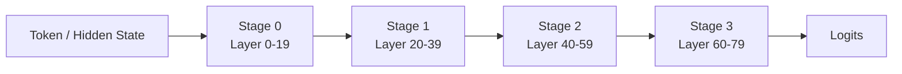
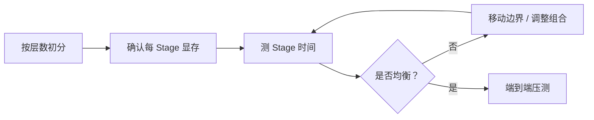
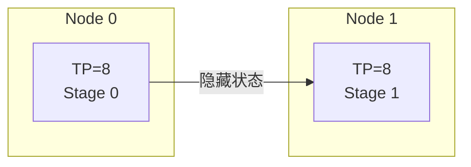
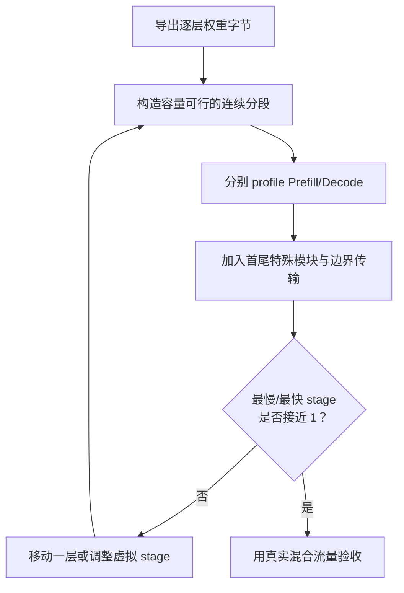
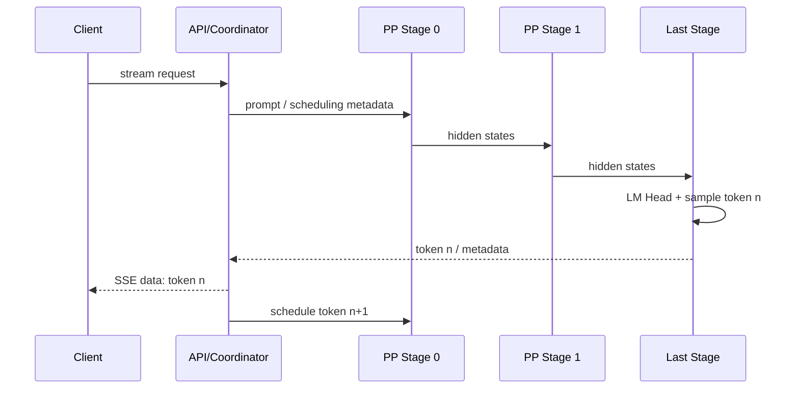

如果 TP 像几个人同时抬一张桌子，PP 更像餐厅后厨的多个工位：洗切、烹饪、摆盘依次交接。
每个工位只保存自己负责的层，因此模型可以跨越多台机器。
但只来一份订单时，后面的工位只能等待。这段等待就是理解 PP 的入口。
<!-- more -->

## 📑 目录
- [1. PP 到底切了什么](#1-pp-到底切了什么)
- [2. 推理流水线与训练流水线的差异](#2-推理流水线与训练流水线的差异)
- [3. 空泡从哪里来](#3-空泡从哪里来)
- [4. Stage 间通信量手算](#4-stage-间通信量手算)
- [5. Stage 均衡不是平均分层](#5-stage-均衡不是平均分层)
- [6. TP×PP 如何映射拓扑](#6-tppp-如何映射拓扑)
- [7. 适用场景与 trade-off](#7-适用场景与-trade-off)
- [8. vLLM 验证与排错](#8-vllm-验证与排错)
- [9. Stage 划分：从层数均分到约束优化](#9-stage-划分从层数均分到约束优化)
- [10. 推理中的五种 Bubble](#10-推理中的五种-bubble)
- [11. Micro-batch 在训练与推理中的语义](#11-micro-batch-在训练与推理中的语义)
- [12. 流式输出穿过 PP 的真实路径](#12-流式输出穿过-pp-的真实路径)
- [13. Stage 边界在 TP×PP 下传什么](#13-stage-边界在-tppp-下传什么)
- [14. PP 实验](#14-pp-实验测出三类空泡)
- [总结](#-总结)
- [自我检验清单](#-自我检验清单)
- [官方参考](#-官方参考)
---

## 1. PP 到底切了什么
假设模型有 80 层，PP=4 的最简单切法是：
- Stage 0：第 0～19 层；
- Stage 1：第 20～39 层；
- Stage 2：第 40～59 层；
- Stage 3：第 60～79 层。
每个 Stage 只保存自己的层权重。
请求的隐藏状态按顺序流过四个 Stage。

如果总权重为 160 GiB，理想均分后每 Stage 约 40 GiB。
但 Embedding、LM Head、不同层结构和量化元数据 会让实际分布偏离平均值。
### 1.1 PP 与 TP 的切分尺度
TP 切的是**一层内部**的矩阵。
PP 切的是**层与层之间**的边界。
因此：
- TP 通信频繁，通常每层发生；
- PP 通信只发生在 Stage 边界；
- TP rank 共同算同一个 Stage；
- PP stage 前后依赖，不能随意交换顺序。
---

## 2. 推理流水线与训练流水线的差异
训练 PP 有前向和反向，还要保存或重算中间激活。
常见训练调度会讨论：
- GPipe；
- 1F1B；
- Interleaved 1F1B；
- 梯度累积 Micro-batch。
推理没有反向。
在线服务里的“可流水化工作”可能来自：
- 一个调度批次中的多个序列；
- Prefill 的多个 Chunk；
- 连续到达的不同请求；
- Decode 迭代之间的批次推进。
所以推理 PP 的问题更像：**能否持续给每个 Stage 喂活，且不破坏 TTFT/TPOT？**
不能机械套用训练的梯度累积公式。
📌 **关键点**：同样叫 Micro-batch，训练用于组织更新，推理用于形成可重叠的前向工作。
---

## 3. 空泡从哪里来
### 3.1 填充与排空
设有 $p$ 个 Stage，每个 Micro-batch 在一个 Stage 耗时近似为 $t$。
第一个 Micro-batch 需要经过所有 Stage：
$$
T_{\text{first}}\approx p\times t
$$
流水线填满后，理想情况下每隔 $t$ 可完成一个 Micro-batch。
处理 $m$ 个 Micro-batch 的理想总时间：
$$
T_{\text{pipe}}\approx(p+m-1)t
$$
串行时间：
$$
T_{\text{serial}}\approx pm t
$$
理想 stage 利用率：
$$
U\approx\frac{m}{p+m-1}
$$
### 3.2 手算空泡
PP=4，只有一个 Micro-batch：
$$
U=\frac{1}{4}=25\%
$$
若有 8 个可流水的 Micro-batch：
$$
U=\frac{8}{4+8-1} =\frac{8}{11}\approx72.7\%
$$
若有 32 个：
$$
U=\frac{32}{35}\approx91.4\%
$$
并发越高，填充与排空成本越容易摊薄。
### 3.3 现实比公式更复杂
上式假设所有 Stage 一样快。
真实耗时是：
$$
T_{\text{cycle}} \approx\max(t_0,t_1,\dots,t_{p-1})
$$
最快的 Stage 也要等最慢的 Stage。
网络传输、调度抖动和不同 Token 长度 还会继续降低利用率。

```mermaid
gantt
    title PP=3 的填充与排空示意
    dateFormat X
    axisFormat %L
    section Stage 0
    MB1 :0, 1
    MB2 :1, 2
    MB3 :2, 3
    section Stage 1
    MB1 :1, 2
    MB2 :2, 3
    MB3 :3, 4
    section Stage 2
    MB1 :2, 3
    MB2 :3, 4
    MB3 :4, 5
```

---

## 4. Stage 间通信量手算
PP 在边界上传隐藏状态。
对一个边界，消息大小可粗算为：
$$
M_{\text{boundary}} =T\times H\times b
$$
其中：
- $T$ 是这次传输的 Token 数；
- $H$ 是 Hidden Size；
- $b$ 是每元素字节数。
### 4.1 Decode 示例
假设：
- 批内 64 个序列各生成 1 Token；
- $H=8192$；
- BF16，$b=2$ Bytes。
$$
M=64\times8192\times2 =1048576\text{ Bytes} =1\text{ MiB}
$$
PP=4 有 3 个边界。
从整个流水线看，每个 Decode step 至少要完成约：
$$
3\times1=3\text{ MiB}
$$
的单向边界载荷。
这不是每 rank 流量，也不含协议和可能的额外张量。
### 4.2 Prefill 示例
若一次传 2048 个 Token：
$$
2048\times8192\times2 =32\text{ MiB/边界}
$$
消息更大，更容易利用链路带宽，但也可能让后续在线 Decode 等待更久。
Chunked Prefill 可以减小单次边界消息，代价是增加传输与调度次数。
### 4.3 PP 与 TP 通信模式对比
PP：
- 边界少；
- 点对点；
- 消息随 Token 数和 Hidden Size 增长。
TP：
- 几乎每层有集合通信；
- 多 rank 同步；
- 对延迟和高频带宽更敏感。
因此跨节点时通常优先跨 PP 边界。
---

## 5. Stage 均衡不是平均分层
“80 层除以 4”只是第一版草图。
### 5.1 首尾 Stage 的额外负担
Stage 0 可能额外承担：
- Token Embedding；
- 输入相关处理；
- 某些位置编码准备。
最后一个 Stage 可能额外承担：
- Final Norm；
- LM Head；
- Logits 处理或采样相关工作。
如果 Embedding 与 LM Head 不共享，首尾权重也可能显著不同。
### 5.2 不同层的计算并不等价
模型可能包含：
- Dense 层与 MoE 层混合；
- 不同频率的 Attention；
- MLA、GQA 等不同结构；
- 特殊视觉或多模态模块。
按层数平均，不代表按 FLOPs 或耗时平均。
### 5.3 正确的均衡方法
1. 先按权重大小给出可启动切分；
2. profile 每个 Stage 的 Prefill 与 Decode 时间；
3. 找出最慢 Stage；
4. 调整边界或虚拟 Stage；
5. 再测端到端 TTFT、TPOT 和吞吐。

⚠️ **注意**：框架是否允许不均匀手工切层，要查目标版本能力。
---

## 6. TP×PP 如何映射拓扑
假设两台服务器，每台 8 张 GPU，节点内 NVLink/NVSwitch，节点间 InfiniBand。
常见起点：
$$
TP=8,\quad PP=2
$$
每个节点是一个 TP Group，节点间只传 PP 激活。

另一个方案是：
$$
TP=16,\quad PP=1
$$
它让每层 collective 跨节点。
如果节点间链路远慢于 NVLink，通常风险更高。
### 6.1 何时可能采用更大 PP
- 单个 Stage 仍放不进节点；
- 模型层数适合更多切分；
- 并发足以摊薄空泡；
- 节点间带宽有限但点对点尚可；
- TP 受 Head 数或 Kernel 约束。
### 6.2 总 GPU 关系
一个副本：
$$
N_{\text{replica}}=TP\times PP
$$
多个副本：
$$
N_{\text{total}}=DP\times TP\times PP
$$
不要把 DP rank 当成 PP Stage，两者的请求路由语义不同。
---

## 7. 适用场景与 trade-off
### PP 更合适
- 模型超过单节点总显存；
- 希望 TP 不跨慢网络；
- 模型结构难以继续扩大 TP；
- 在线并发或离线 batch 足以填充流水线；
- 可以接受更复杂的故障域。
### PP 未必合适
- 单卡或节点内 TP 已能装下；
- 极低并发且追求最低单请求延迟；
- 层数少，无法合理切成很多 Stage；
- Stage 严重不均衡；
- 框架对该模型的 PP 支持不完整。
### 核心 trade-off
PP 用更低频的边界通信 换取顺序依赖与空泡。
PP 变大：
- 每 Stage 权重下降；
- 可跨更多节点；
- 边界数量增加；
- 首请求路径变长；
- 填充和排空更难摊薄；
- 故障影响范围更大。
---

## 8. vLLM 验证与排错
### 8.1 单节点组合示例
8 张 GPU，TP=4、PP=2：
```bash
vllm serve gpt2 \
  --tensor-parallel-size 4 \
  --pipeline-parallel-size 2
```
`gpt2` 只用于快速验证命令和资源编排，不代表它需要 8 张 GPU。
生产压测应换成目标模型。
### 8.2 多节点常见起点
两节点各 8 卡：
```bash
vllm serve /models/your-model \
  --tensor-parallel-size 8 \
  --pipeline-parallel-size 2 \
  --distributed-executor-backend ray
```
运行前先确认 Ray 集群共有 16 张可用 GPU。
### 8.3 常见故障
**某些 GPU 长期低利用率**
- 低并发导致空泡；
- Stage 计算不均；
- 上游 Stage 等网络；
- 下游采样或 LM Head 成为瓶颈。
**首 Token 显著变慢**
- PP 路径变长；
- 首个批次需要填充所有 Stage；
- 模型加载或首次 CUDA Graph 捕获干扰测量；
- 跨节点接口或路由选择错误。
**跨节点卡住**
- 先用 Ray 查看资源是否就绪；
- 再检查节点间端口与私网地址；
- 使用 `NCCL_DEBUG=INFO` 看通信初始化；
- 检查两端模型路径与软件环境；
- 最后才尝试缩小 TP/PP 定位故障边界。
**启动提示层数不能整除**
- 这是模型与 PP 切分约束，不是网络问题；
- 降低 PP 或换支持的切法；
- 查目标 vLLM 版本对该模型的 PP 支持。
---

## 9. Stage 划分：从层数均分到约束优化

PP 划分同时受三类约束：

1. 每个 Stage 必须放得下；
2. 稳态周期由最慢 Stage 决定；
3. Stage 边界消息必须能走目标链路。

可以把第 $l$ 层的属性写成：

- 权重显存 $w_l$；
- KV 每 Token 字节 $k_l$；
- Prefill 时间 $c_l^P(T)$；
- Decode 时间 $c_l^D(B,L)$；
- 边界激活大小 $a_l(T)$。

对 stage $s$ 覆盖的层集合 $\mathcal L_s$：

$$
M_s=
\sum_{l\in\mathcal L_s}w_l+
N_{\text{tokens}}\sum_{l\in\mathcal L_s}k_l+
M_{runtime,s}
$$

必须满足：

$$
M_s<M_{\text{usable},s}
$$

而目标周期近似：

$$
T_{\text{cycle}}
\approx
\max_s
\left(
\sum_{l\in\mathcal L_s}c_l+
T_{\text{send},s}
\right)
$$

### 9.1 为什么显存均衡与计算均衡冲突

假设 12 层模型切 3 个 Stage。每层权重相同，但测得 Decode 时间：

```text
Layer 0-3:  0.8 ms/layer
Layer 4-7:  1.0 ms/layer
Layer 8-11: 1.4 ms/layer
```

按 4/4/4 划分：

$$
t_0=3.2,\quad t_1=4.0,\quad t_2=5.6\text{ ms}
$$

周期为 5.6 ms，前两个 Stage 每周期分别空闲 2.4 和 1.6 ms。

尝试 5/4/3：

$$
t_0=4.0,\quad t_1=4.0,\quad t_2=4.2\text{ ms}
$$

周期下降到 4.2 ms，但 Stage 0 权重和 KV 层数增加 25%。若 Stage 0 已接近显存上限，这个更快的划分不可行。

### 9.2 首尾特殊模块

划分时至少单独记账：

- Embedding；
- Vision Encoder 或多模态 Projector；
- Final Norm；
- LM Head；
- Logits Processor / Sampling；
- tied embeddings 是否共享；
- MoE 层与 Dense 层；
- 每层 KV 结构是否一致。

如果词表 152064、Hidden Size 8192、BF16，未分片 LM Head 权重约：

$$
152064\times8192\times2
\approx2.32\text{ GiB}
$$

它足以让最后一个 Stage 比平均值重很多。

### 9.3 可操作的划分流程



工程上先求“容量可行”，再求“性能均衡”。不能为了均衡把某个 Stage 推到 OOM 边缘。

---

## 10. 推理中的五种 Bubble

训练常用统一的 pipeline bubble 比例描述利用率。在线推理至少要区分五种形态。

### 10.1 Fill/Drain Bubble

有限个 Micro-batches 进入和离开流水线时产生。前面的：

$$
U=\frac{m}{m+p-1}
$$

描述的是理想、等速、有限批次的填充和排空。

### 10.2 Arrival Bubble

在线请求不是一次性准备好的。若到达率低，Stage 0 没有新工作，整条流水线最终空闲。

即使理论上 `m=32` 能达到高利用率，如果 32 个请求需要 10 秒才到齐，为了凑批而等待会让 TTFT 恶化。

### 10.3 Imbalance Bubble

若 stage 时间分别是：

$$
[3,5,4]\text{ ms}
$$

稳态周期是 5 ms。每周期 Stage 0 空闲 2 ms，Stage 2 空闲 1 ms。

稳态利用率：

$$
U_0=3/5=60\%,\quad U_1=100\%,\quad U_2=80\%
$$

增加 Micro-batch 数只能摊薄 Fill/Drain，不能消除这个不均衡。

### 10.4 Dependency Bubble

自回归 Decode 的第 $n+1$ 个 Token 依赖第 $n$ 个 Token 的采样结果。

对**同一个序列**：

```text
token n:   stage0 -> stage1 -> stage2 -> sample
token n+1:                              stage0 -> stage1 -> ...
```

不能像独立训练 Micro-batches 那样任意让未来 Token 提前进入。流水工作来自不同序列、不同请求或可切分 Prefill，而不是同一序列的未来 Decode Token。

### 10.5 Head-of-Line Bubble

长 Prefill 占住某个 Stage 或边界时，短 Decode 请求可能等待。即使 GPU 总体利用率高，交互请求的 TPOT 会出现尖峰。

Chunked Prefill 的价值之一是把大块工作切小，让调度器在块之间插入 Decode；代价是更多调度和边界消息。

---

## 11. Micro-batch 在训练与推理中的语义

### 11.1 训练

训练 Micro-batch 通常服务于：

- 梯度累积；
- 固定 global batch；
- 前向/反向流水线调度；
- 激活显存控制。

多个 Micro-batches 最终参与同一次参数更新。

### 11.2 推理

推理 Micro-batch 可能指：

- Continuous Batching 某轮选中的 Decode Tokens；
- 一批 Prefill 请求；
- 一个长 Prefill 的 Chunk；
- PP runtime 为形成流水而拆出的前向单元。

这些单元没有共同的梯度更新边界。

### 11.3 Micro-batch 大小的双向影响

增大 Micro-batch：

- GEMM 更饱满；
- 更容易填充 PP；
- 边界消息更大，带宽利用率更好；
- 单位调度开销下降。

但同时：

- 等待凑批可能提高 TTFT；
- 长任务阻塞更严重；
- 激活峰值上升；
- Decode TPOT 可能被 Prefill 干扰；
- 不同长度的 Padding/调度浪费增加。

所以目标不是“最大 Micro-batch”，而是在 SLO 约束下最大化 Goodput。

---

## 12. 流式输出穿过 PP 的真实路径

流式 API 不意味着每个 Stage 都直接向客户端输出。

典型路径：



### 12.1 TTFT 的组成

$$
TTFT\approx
T_{\text{queue}}+
T_{\text{prefill pipeline}}+
T_{\text{last-stage logits}}+
T_{\text{API flush}}
$$

PP 增加的不是只有网络时间，还可能包括：

- Stage 顺序路径；
- Ray/进程间调度；
- 首次通信初始化；
- 最后 Stage 的采样回传；
- API 层缓冲未及时 flush。

### 12.2 TPOT 的组成

稳态下：

$$
TPOT\approx
T_{\text{one decode pipeline iteration}}
$$

如果 stage 不均：

$$
TPOT\gtrsim
\sum_{\text{dependency path}}t_s
$$

对单序列低并发，Token 必须顺序穿过所有 stages，PP 不会把单 Token 的端到端路径变成 $\max(t_s)$。$\max(t_s)$ 代表多 Micro-batches 稳态产出间隔，不等于单请求 Token 延迟。

这是面试高频混淆点：

- **流水线吞吐周期**看最慢 Stage；
- **单个 Token 端到端延迟**仍包含所有 Stage 的顺序路径。

### 12.3 流式卡顿的定位

若服务内部 Token 生成平稳、客户端却成批收到：

- 检查反向代理 buffering；
- 检查 SSE/HTTP chunk flush；
- 检查客户端读取逻辑；
- 不要先归因于 PP。

若生成时间本身周期性尖峰：

- 看 Prefill 插队；
- 看最慢 Stage；
- 看边界传输与网络重传；
- 看最后 Stage 采样是否成为串行点。

---

## 13. Stage 边界在 TP×PP 下传什么

如果每个 Stage 内 TP=p，边界张量有两种常见布局：

1. 每个 TP rank 持有完整残差片段，rank-to-rank 发送；
2. 张量仍按某维分片，匹配的 rank 之间发送。

因此不能简单地说“PP 边界永远传 $T\times H\times b$ 一份”。

### 13.1 rank-to-rank 分片传输

若边界按 TP 分片，每 rank 发送：

$$
M_{\text{rank}}=\frac{T\times H\times b}{p}
$$

全 TP group 算法载荷仍约：

$$
M_{\text{group}}=T\times H\times b
$$

### 13.2 复制布局

若每 rank 都持有完整边界但只让一个 rank 发送，接收端可能还要 broadcast；若所有 rank 对应发送，则网络总流量可能放大。

具体实现必须通过：

- runtime 源码/文档；
- NCCL 日志；
- profiler；
- NIC counters；

来确认。

### 13.3 数值例子

$T=2048,H=8192,$ BF16，TP=8：

完整边界：

$$
2048\times8192\times2=32\text{ MiB}
$$

若按 TP 分片：

$$
32/8=4\text{ MiB/rank}
$$

若跨节点 8 个 ranks 分别经同一 400 Gb/s NIC，聚合瓶颈仍受 NIC 总有效带宽限制，不能把 4 MiB 除以单链路带宽后当成整个边界时间。

---

## 14. PP 实验：测出三类空泡

### 14.1 前提

- 至少 4 张 GPU；
- 目标 vLLM 版本支持所选模型的 PP；
- 模型至少能在 `TP=2,PP=1` 和 `TP=1,PP=2` 中形成可比配置；
- 若跨节点，先完成 Ray 与 NCCL 基线。

### 14.2 对照组

总 GPU 数相同，比较：

```text
A: TP=4, PP=1
B: TP=2, PP=2
C: TP=1, PP=4
```

不是所有模型/显存都支持三组。只运行容量可行且模型结构支持的配置。

示例：

```bash
vllm serve <MODEL> \
  --tensor-parallel-size 2 \
  --pipeline-parallel-size 2
```

### 14.3 负载组

```text
低并发短流式: prompt 128 / output 512 / concurrency 1
高并发短流式: prompt 128 / output 512 / concurrency 64
长 Prefill:    prompt 16384 / output 128 / concurrency 8
混合流量:     80% 128/512 + 20% 16384/128
```

### 14.4 指标

- TTFT 与 TPOT P50/P95/P99；
- 每 Stage GPU Active Time；
- 每 Stage Prefill/Decode 时间；
- Stage 边界发送字节和耗时；
- Pipeline fill/drain 时间；
- Waiting/Running 请求数；
- Output Throughput 与 Goodput；
- 流式 chunk 到达间隔。

### 14.5 如何从结果识别 Bubble

**低并发差，高并发改善**

- 主要是 Fill/Drain 或 Arrival Bubble；
- 证据：高并发时 stages 同时活跃。

**无论并发多高，某个 Stage 满载、其他 Stage 等待**

- 主要是 Imbalance Bubble；
- 证据：周期接近最慢 Stage 时间。

**长 Prefill 到来时 Decode TPOT 尖峰**

- 主要是 Head-of-Line Blocking；
- 证据：尖峰与 Prefill chunk 时间相关。

**所有 Stage 轮流工作但单序列仍慢**

- 这是自回归依赖限制，不一定是实现错误；
- 用多序列提高流水吞吐，不会自动降低单序列路径长度。

### 14.6 常见失败模式

**Layer 数不能整除 PP**

- 某些版本要求均匀切层；
- 检查模型层数和框架支持；
- 不通过伪造 PP 值绕过。

**Stage 0/Last Stage OOM**

- Embedding、LM Head 或视觉模块导致不对称；
- 对每 Stage 单独记账；
- 查看实际 rank 显存而非平均。

**跨节点启动成功但吞吐极低**

- 可能将 TP collective 意外跨节点；
- Placement 不符合预期；
- PP 边界走 Socket 而非目标数据网；
- 通过日志和 rank-node 映射确认。

**流式响应成块返回**

- 可能是代理或客户端 buffering；
- 同时记录服务内部生成时间和客户端到达时间；
- 先确定卡顿发生在模型路径还是 HTTP 路径。

---

## 📝 总结
- PP 按层切分模型，Stage 之间传递隐藏状态。
- 推理 PP 没有反向，重点是用请求、批次或 Chunk 持续填充 Stage。
- 理想利用率可用 $m/(p+m-1)$ 理解填充与排空空泡。
- Stage 边界流量约为 $T\times H\times b$，通常比 TP collective 低频。
- 平均分层不等于均衡，要同时看显存和 Prefill/Decode 实测耗时。
- 常见拓扑映射是节点内 TP、节点间 PP。
- PP 首先解决跨节点容量，不保证降低低并发单请求延迟。

## 🎯 自我检验清单
- 能说明 PP 与 TP 的切分尺度差异吗？
- 能解释推理 Micro-batch 与训练梯度累积的区别吗？
- 能用 $m/(p+m-1)$ 手算理想利用率吗？
- 能估算一个 PP 边界的激活字节数吗？
- 能解释为何首尾 Stage 可能更重吗？
- 能为两节点各 8 卡设计一个 TP×PP 映射吗？
- 能说出 PP 变大带来的三项代价吗？
- 能按空泡、Stage 不均和网络三类排查低利用率吗？

## 📚 官方参考
- [vLLM：Parallelism and Scaling](https://docs.vllm.ai/en/stable/serving/parallelism_scaling/)
- [vLLM：Serve CLI](https://docs.vllm.ai/en/stable/cli/serve/)
- [GPipe：Efficient Training of Giant Neural Networks](https://arxiv.org/abs/1811.06965)
- [PipeDream：Generalized Pipeline Parallelism](https://arxiv.org/abs/1806.03377)
- [NVIDIA NCCL：Point-to-point Communication](https://docs.nvidia.com/deeplearning/nccl/user-guide/docs/usage/p2p.html)
