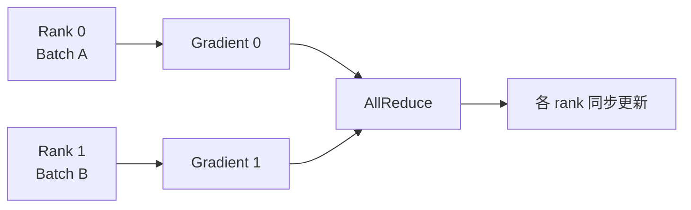
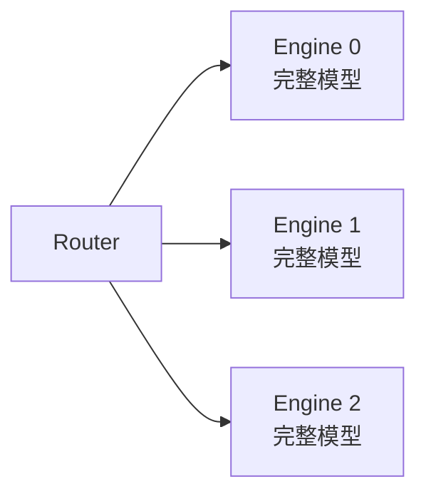
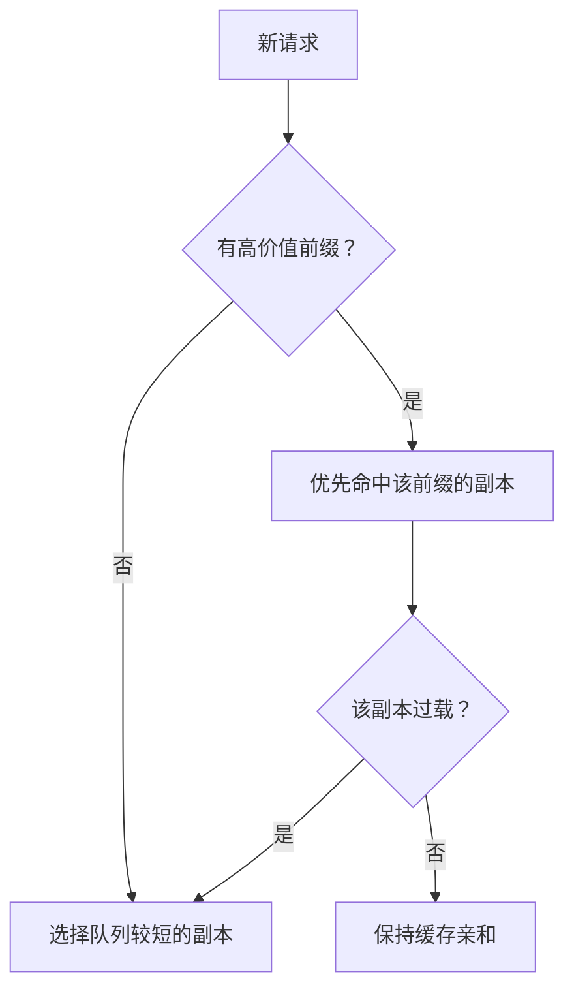
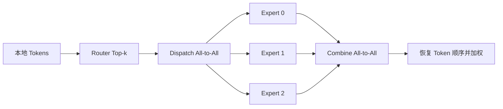
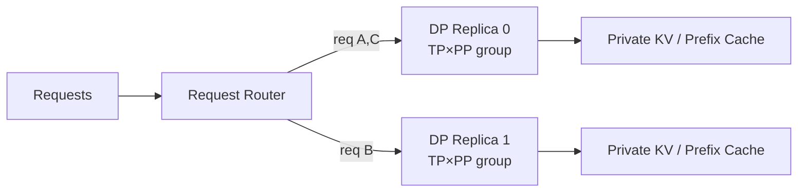
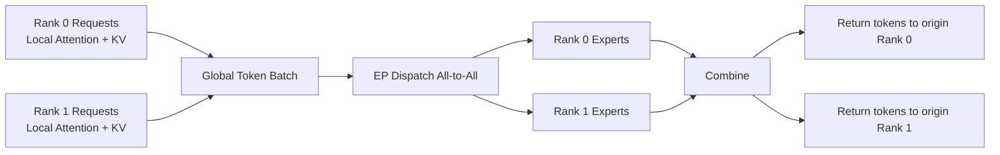
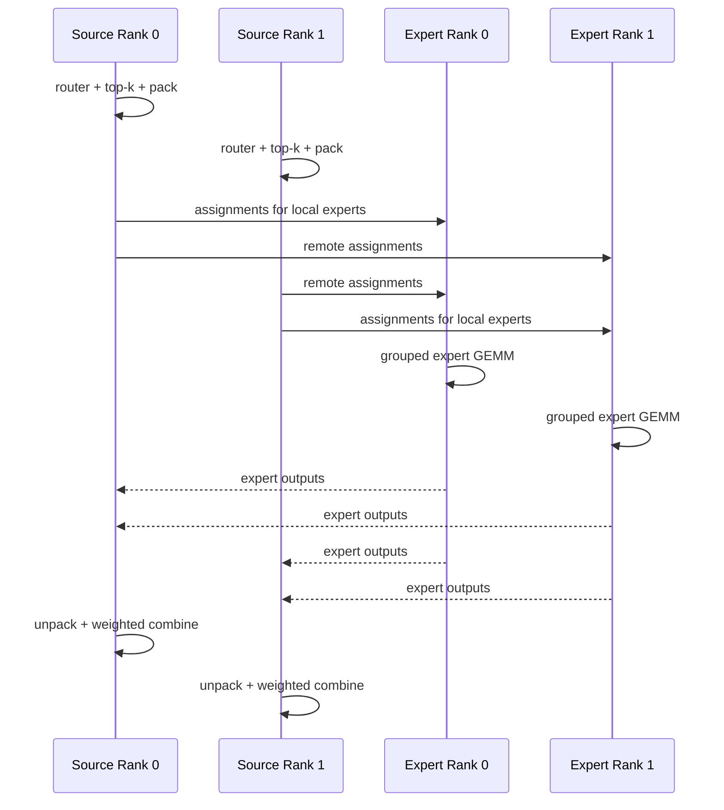

DP 和 EP 看起来都在“把工作分给不同 GPU”，但两者分的不是同一种东西。
DP 像复制多家完整餐厅：每家独立接待一批客人。
EP 像只有一家餐厅，川菜、粤菜、甜点专家分散在不同厨房；每张订单要先被路由到对应专家。
一个主要扩请求吞吐，一个主要承载 MoE 专家权重。
<!-- more -->

## 📑 目录
- [1. 推理 DP 与训练 DP](#1-推理-dp-与训练-dp)
- [2. DP 的容量与吞吐手算](#2-dp-的容量与吞吐手算)
- [3. DP 负载均衡](#3-dp-负载均衡)
- [4. MoE 与 EP 的基本流程](#4-moe-与-ep-的基本流程)
- [5. EP 显存与通信量手算](#5-ep-显存与通信量手算)
- [6. 专家负载不均](#6-专家负载不均)
- [7. DP、TP 与 EP 的组合](#7-dptp-与-ep-的组合)
- [8. vLLM 参数与排错](#8-vllm-参数与排错)
- [9. 推理 DP 的两层路由](#9-推理-dp-的两层路由)
- [10. DP Attention](#10-dp-attention不要与请求副本混淆)
- [11. MoE Token Dispatch 的逐步数据结构](#11-moe-token-dispatch-的逐步数据结构)
- [12. All-to-All 通信量与负载倾斜](#12-all-to-all-通信量与负载倾斜)
- [13. Expert Placement 与冗余专家](#13-expert-placement-与冗余专家)
- [14. DP/EP 的可复现实验](#14-dpep-的可复现实验)
- [总结](#-总结)
- [自我检验清单](#-自我检验清单)
- [官方参考](#-官方参考)
---

## 1. 推理 DP 与训练 DP
### 1.1 训练 DP
训练 DP 的每个 rank 保存同一份模型，处理不同数据，反向后同步梯度。

训练 DP 的核心约束是：参数更新后所有副本仍保持一致。
### 1.2 密集模型推理 DP
推理没有反向和参数更新。
多个副本可以独立处理不同请求：

正常前向不需要每一步同步梯度，副本间也不必交换隐藏状态。
这使推理 DP 成为最容易横向扩展的方式。
⚠️ **边界条件**：MoE 的 DP+EP 实现可能要求 rank 对齐前向并参与 collective，不能把“推理 DP 永远完全独立”当成普遍真理。
---

## 2. DP 的容量与吞吐手算
假设一个模型副本需要：
- 52 GiB 权重；
- 20 GiB 目标 KV Cache；
- 8 GiB 运行时与余量。
单副本需要：
$$
52+20+8=80\text{ GiB}
$$
一张 80 GiB GPU 只是刚好，通常还需要降低 KV 预算或增加余量。
如果每副本使用 TP=2，每张卡粗略需要：
$$
(52+20)/2+8 =44\text{ GiB}
$$
注意运行时不一定能完全除以 TP。
### 2.1 四个副本需要多少 GPU
若：
$$
DP=4,\quad TP=2,\quad PP=1
$$
则：
$$
N_{\text{GPU}}=DP\times TP\times PP=8
$$
总权重存储约为：
$$
DP\times52=208\text{ GiB}
$$
DP 并没有减少整个集群中的权重副本数量。
### 2.2 理想吞吐不等于线性吞吐
若单副本稳定吞吐为 1000 output tok/s，DP=4 的理想上限是：
$$
4\times1000=4000\text{ output tok/s}
$$
现实中还要扣除：
- API Server 或 Router 开销；
- 请求分布不均；
- 长短请求混合；
- Tokenization 瓶颈；
- 模型下载与冷启动；
- Prefix Cache 命中被副本分散。
DP 的评估指标应是：
$$
\text{Scaling Efficiency} =\frac{Q_{DP=n}}{n\times Q_{DP=1}}
$$
---

## 3. DP 负载均衡
### 3.1 为什么轮询不够
请求 A 生成 32 Token，请求 B 生成 4096 Token。
它们在“请求数”上都是 1，占用引擎的时间却完全不同。
若只 Round Robin，某个副本可能积累多个长请求，其他副本已经空闲。
### 3.2 路由器真正需要看的信号
- Running 请求数；
- Waiting 队列长度；
- 当前已调度 Token 数；
- 可用 KV Blocks；
- 预测 Prompt/Output 长度；
- Prefix Cache 亲和性；
- 最近 TTFT/TPOT。
这不是“选最空 GPU”那么简单。
GPU 利用率高可能代表它工作高效，也可能代表它已经严重排队。
### 3.3 Prefix Cache 的局部性
每个 DP 副本通常有独立 KV Cache。
若共享同一前缀的请求被随机打散，每个副本都要重新 Prefill。
按前缀 Hash 做粘性路由可以提高命中，但会与负载均衡发生冲突。

trade-off 是：缓存命中率与排队时间之间要动态平衡。
---

## 4. MoE 与 EP 的基本流程
MoE 层有多个 Expert，Router 为每个 Token 选择 Top-k Experts。
以 Top-2 为例：
1. 每个 Token 计算路由分数；
2. 选择两个专家；
3. 将 Token 激活发送到专家所在 rank；
4. 专家执行 MLP；
5. 将结果发回原 rank；
6. 按路由权重组合结果。

### 4.1 EP 切的是专家，不是整个模型
Attention、Embedding、Norm 等非专家部分 仍需用复制、TP 或其他方式放置。
EP 只替换 MoE 专家层的分布方式。
所以一个 MoE 部署常同时包含：
- Attention 的 DP 或 TP；
- Expert 层的 EP；
- 跨节点资源编排；
- API 层的请求负载均衡。
---

## 5. EP 显存与通信量手算
### 5.1 专家权重显存
假设：
- 64 个 Experts；
- 每个 Expert 权重 1 GiB；
- EP=8；
- 专家均匀分配。
每 rank 保存：
$$
64/8=8\text{ Experts}
$$
专家权重：
$$
8\times1=8\text{ GiB/rank}
$$
若复制全部专家，每 rank 则需 64 GiB。
EP 对专家权重的显存收益很直接。
但 Shared Experts、Router、Attention 权重 不会因此都除以 8。
### 5.2 All-to-All 流量
设某 rank 输入：
- $T=512$ Tokens；
- Top-$k=2$；
- Hidden Size $H=7168$；
- BF16，$b=2$ Bytes；
- EP size $p=8$；
- 路由近似均匀。
专家分配数：
$$
T_{\text{assign}}=T\times k=1024
$$
激活载荷：
$$
M=1024\times7168\times2 =14680064\text{ Bytes} \approx14\text{ MiB}
$$
若本地专家约接收 $1/p$，需要发往其他 rank 的载荷约：
$$
M_{\text{remote}} \approx\frac{p-1}{p}M =\frac78\times14 =12.25\text{ MiB}
$$
dispatch 一次，combine 再返回一次，因此每 rank 的双向算法载荷数量级约：
$$
2\times12.25=24.5\text{ MiB/layer}
$$
这仍是简化估算：
- 不含索引、对齐和协议开销；
- 不含 Capacity Padding；
- 不代表交换网络总流量；
- 路由不均时会明显偏离；
- 后端可能用 AllGather+ReduceScatter 模拟。
---

## 6. 专家负载不均
EP 的木桶不是最慢 GPU，而是最拥挤的专家。
### 6.1 热点如何出现
- 输入领域集中；
- Router 偏向少数专家；
- Top-k 选择造成重复分配；
- batch 太小，统计波动大；
- 专家放置让热点集中在同一 rank。
若平均每专家收到 16 个 Token，某专家收到 64 个，该专家所在 rank 可能拖慢整个 collective。
### 6.2 两类代价
**Padding / Capacity**
为了统一张量形状，系统可能按容量上限填充，浪费计算和通信。
**Token Drop 或重路由**
超过容量时可能丢弃、重路由或使用备份专家，会影响质量、复杂度或延迟。
推理框架的具体策略必须查版本和实现。
### 6.3 缓解方向
- 使用训练时的负载均衡损失；
- 调整 Expert Placement；
- Round-robin 分散相邻冗余专家；
- 使用 EPLB 或冗余专家；
- 增大可调度 Token 数以平滑波动；
- 选择适配硬件的 All-to-All 后端；
- 分别压测 Prefill 与 Decode。
⚠️ **注意**：增大 batch 能改善均衡，却可能抬高 TTFT/TPOT。
---

## 7. DP、TP 与 EP 的组合
### 7.1 密集模型
常见组合：
$$
DP\times TP\times PP
$$
每个 DP 副本是一个完整 TP×PP 组。
### 7.2 MoE 模型
vLLM 当前文档中，DP rank 对 Attention 可表现为不同 core engine。
启用 EP 后，专家层会在相关 $DP\times TP$ 设备范围内形成专家并行组；具体分组由当前版本的 ParallelConfig 决定。
这意味着：
- MoE DP rank 不一定完全独立；
- 某些空闲 rank 也要参与对齐或 collective；
- 总 GPU 乘法只是资源数，不能完整表达通信组。
### 7.3 一个选择顺序
1. 用 TP/PP 让共享与 Dense 部分装下；
2. 若是 MoE，计算专家权重是否需要 EP；
3. 估算 All-to-All 是否能被网络承受；
4. 决定 DP 是独立副本还是 DP+EP 设备维度；
5. 再设计入口负载均衡。
---

## 8. vLLM 参数与排错
### 8.1 密集模型 DP
单节点 8 卡，DP=4、TP=2：
```bash
vllm serve Qwen/Qwen2.5-7B-Instruct \
  --data-parallel-size 4 \
  --tensor-parallel-size 2
```
这需要 8 张可见 GPU。
`--max-num-seqs` 按当前官方文档是每个 DP rank 的限制，容量规划时不要只算一次。
### 8.2 MoE 启用 EP
```bash
vllm serve /models/your-moe-model \
  --data-parallel-size 8 \
  --tensor-parallel-size 1 \
  --enable-expert-parallel
```
可选 All-to-All 后端会随版本和依赖变化。
先核对：
```bash
vllm serve --help | less
```
再根据目标版本官方文档选择：
```bash
--all2all-backend allgather_reducescatter
```
不要因为名字中有 `low_latency` 就假设它在你的 GPU、网络和负载上一定更快。
### 8.3 排错顺序
**DP 吞吐不线性**
- 单 API Server 是否成为瓶颈；
- 请求是否均匀；
- 每 rank 的 KV 预算是否一致；
- CPU Tokenization 是否打满；
- Prefix Cache 是否被随机路由稀释。
**EP 出现长尾**
- 记录每专家 Token 数；
- 检查热点是否集中到同一 rank；
- 区分 Prefill 与 Decode；
- 对比不同 All-to-All 后端；
- 用 NCCL/网络测试排除链路问题。
**某些 MoE rank 空闲仍有通信**
- 这可能是 DP+EP 为保持前向对齐的设计；
- 先查官方 Data Parallel 文档和日志；
- 不要直接把它判断为死锁。
**切换后端直接崩溃**
- 核对 GPU 架构；
- 核对 CUDA、NCCL 与扩展依赖；
- 回退官方默认后端建立基线；
- 一次只改变一个变量。
---

## 9. 推理 DP 的两层路由

“DP”在服务里常同时出现于两个层次。

### 9.1 请求级路由

入口把**整个请求**交给一个模型副本。该请求的 Prefill、KV Cache 和后续 Decode 通常保持在同一副本：



如果 Decode 中途迁移到另一副本，目标副本没有该请求的 KV Cache。除非系统实现 KV 迁移/共享，否则只能重新 Prefill。

### 9.2 引擎内 DP

某些框架用一个协调器管理多个 DP ranks：

- 入口仍可能只有一个 API Server；
- 每个 rank 有独立 scheduler/core engine；
- rank 之间可能交换负载状态；
- MoE 的 DP+EP 可能要求每轮对齐 Token 数或参与 collective。

所以“请求副本完全独立”是 Dense 模型常见实现，不是所有 DP 参数的普遍语义。

### 9.3 路由成本函数

一个更实用的路由分数：

$$
S_i=
\lambda_q Q_i+
\lambda_t T_i-
\lambda_c C_i+
\lambda_e E_i
$$

其中：

- $Q_i$：排队工作量；
- $T_i$：当前已调度 Token；
- $C_i$：目标前缀缓存命中价值；
- $E_i$：最近错误或拥塞惩罚。

选择最小 $S_i$ 的副本。

权重不是固定真理，应通过回放真实负载调优。若 Prefix 命中能节省 2 秒 Prefill，但粘性副本只多排队 20 ms，应该优先缓存；若多排队 5 秒，则应放弃亲和。

### 9.4 数值手算：轮询为何失衡

两个副本，各按 100 output tok/s 生成。

请求：

```text
A=4000 output tokens
B=100 output tokens
C=4000 output tokens
D=100 output tokens
```

轮询分配：

```text
Replica 0: A+C = 8000 tokens -> 80 s work
Replica 1: B+D =  200 tokens ->  2 s work
```

若按预计 Token 工作量做 greedy 分配：

```text
Replica 0: A+B = 4100 -> 41 s
Replica 1: C+D = 4100 -> 41 s
```

真实输出长度未知，但哪怕粗略预测也可能比只数请求更好。预测错误则要用实时队列信号纠正。

---

## 10. DP Attention：不要与请求副本混淆

在部分 MoE 推理架构中，Attention 使用“DP Attention”，专家层使用 EP。

### 10.1 基本思想

设设备组有 $p$ 个 ranks：

- Attention 权重在 ranks 上复制；
- 不同 ranks 处理不同 Token/序列分片；
- 每个 rank 维护自己请求对应的 KV Cache；
- 进入 MoE 层时，Token 按专家位置做 EP dispatch。



### 10.2 与 TP Attention 的区别

TP Attention：

- 同一个 Token 的 Heads/投影由多个 ranks 合作；
- Attention 权重和 KV 常按 Head 分片；
- 每层有 TP collective；
- 单 Token 计算跨 ranks。

DP Attention：

- 一个 Token 的 Attention 通常在所属 rank 本地完成；
- Attention 权重复制；
- KV Cache 随请求归属在本地；
- 不同 ranks 处理不同 Tokens；
- 到 MoE 专家层才跨 rank 路由。

### 10.3 为什么 MoE 场景有吸引力

MoE 模型中专家权重可能远大于 Attention 权重。

复制较小的 Attention、分片较大的 Experts，可以：

- 避免 Attention 的高频 TP collective；
- 让 KV Cache 与请求局部化；
- 用 EP 承载专家权重；
- 让设备数用于增加并行 Token 数。

代价是：

- Attention 权重重复占显存；
- 各 DP rank Token 数可能不同；
- EP collective 需要 ranks 协调；
- 某 rank 没有请求时也可能发送空/对齐消息；
- 请求路由与专家路由形成两层负载均衡问题。

### 10.4 数值手算：复制换通信

假设每 rank：

- Attention 等共享 Dense 权重 12 GiB；
- 全部专家权重 64 GiB；
- 8 ranks。

使用 DP Attention + EP=8：

$$
M_{\text{rank}}\approx12+64/8=20\text{ GiB}
$$

集群总权重：

$$
8\times12+64=160\text{ GiB}
$$

若所有权重都纯 TP=8，理想每 rank：

$$
(12+64)/8=9.5\text{ GiB}
$$

DP Attention 多占显存，但可能减少 Dense Attention 的 TP collective。是否值得取决于显存余量、Decode 延迟和 EP 网络。

---

## 11. MoE Token Dispatch 的逐步数据结构

设每个 rank 有本地 Tokens：

$$
X_r\in\mathbb{R}^{T_r\times H}
$$

Router 输出 logits：

$$
R_r=X_rW_{\text{router}}
\in\mathbb{R}^{T_r\times E}
$$

对每个 Token 选择 Top-$k$：

$$
(e_{t,j},g_{t,j}),\quad j=1,\dots,k
$$

其中 $e$ 是专家 ID，$g$ 是归一化 gate 权重。

### 11.1 Dispatch 前的 pack

需要把数据重排为按目标 rank/expert 连续的发送缓冲：

```text
activation: [assignment, H]
expert_id:  [assignment]
token_id:   [assignment]
gate:       [assignment]
src_rank:   [assignment]
```

同一个 Token 在 Top-2 下会产生两个 assignment。

### 11.2 交换计数

每个源 rank 先知道要发给各目标 rank 多少 assignments：

$$
C_{r\rightarrow j}
$$

路由不均时，这是不规则 All-to-All-v，而不是每对 rank 固定相同大小。

有些后端为了规则 shape 会 Padding 到 capacity：

$$
C_{\text{expert}}=
\left\lceil
\text{capacity factor}\times
\frac{T_{\text{global}}k}{E}
\right\rceil
$$

### 11.3 Dispatch

激活和元数据被发到专家所在 rank。目标 rank 按专家分组执行 MLP。

### 11.4 Combine

专家输出沿反向映射回源 rank：

$$
Y_t=\sum_{j=1}^{k}g_{t,j}Y_{t,j}
$$

源 rank 恢复原 Token 顺序，再进入残差或下一层。

### 11.5 完整数据流



---

## 12. All-to-All 通信量与负载倾斜

### 12.1 均匀路由下界

每 rank 有 $T$ Tokens，Top-$k$，激活元素字节 $b$，Hidden Size $H$：

$$
M_{\text{assign}}=T k H b
$$

若专家均匀，远端比例约 $(p-1)/p$：

$$
M_{\text{dispatch,remote}}
\approx
\frac{p-1}{p}TkHb
$$

Combine 返回相近载荷：

$$
M_{\text{roundtrip}}
\approx
2\frac{p-1}{p}TkHb
$$

### 12.2 全局数值手算

设：

- EP=8；
- 每 rank 256 Tokens；
- $H=7168$；
- Top-2；
- BF16。

单 rank assignments：

$$
256\times2=512
$$

激活：

$$
512\times7168\times2
=7{,}340{,}032\text{ Bytes}
\approx7\text{ MiB}
$$

远端 dispatch：

$$
7\times7/8=6.125\text{ MiB/rank}
$$

dispatch+combine：

$$
12.25\text{ MiB/rank/MoE layer}
$$

若模型有 40 个 MoE 层，一轮前向的算法载荷数量级：

$$
12.25\times40=490\text{ MiB/rank}
$$

实际还包含索引、计数交换、Padding 和协议开销。

### 12.3 热点 rank 的时间由最大接收量决定

平均每 rank 512 assignments，不代表每 rank 都收到 512。

假设接收：

```text
[300, 320, 340, 350, 360, 380, 400, 1646]
```

总计 4096，但最后一个 rank 是平均值 512 的：

$$
1646/512\approx3.21
$$

倍。所有 ranks 在下一 collective 或层边界等待它，尾延迟由热点而不是平均值决定。

### 12.4 负载指标

建议记录：

$$
\text{Max/Mean Load}
=\frac{\max_e n_e}{\frac1E\sum_en_e}
$$

$$
CV=\frac{\operatorname{std}(n_e)}{\operatorname{mean}(n_e)}
$$

以及：

- 每专家 Token 数 P50/P99；
- 每 rank 收发字节；
- Padding Ratio；
- Dropped/Rerouted Tokens；
- dispatch、expert GEMM、combine 各自时间；
- All-to-All 有效带宽；
- 每层 Top-k 分布。

只看 GPU Util 无法区分“专家计算忙”和“collective 等热点”。

---

## 13. Expert Placement 与冗余专家

### 13.1 连续放置的风险

如果训练后专家 0、1、2 经常同时热门，把它们都放在同一 rank 会叠加热点。

连续放置：

```text
rank0: expert 0-7
rank1: expert 8-15
...
```

交错放置：

```text
rank0: 0,8,16,24,...
rank1: 1,9,17,25,...
```

哪个更好取决于真实共现矩阵，不能仅凭编号。

### 13.2 用共现矩阵做放置

统计专家 $i,j$ 被同一批 Tokens 命中的频率：

$$
C_{ij}
$$

放置目标之一是减少同一 rank 上高负载专家的共现，同时兼顾跨节点流量和权重容量。

### 13.3 冗余专家

给热点专家放多个副本，可把 Token 分摊到不同 ranks：

- 优点：降低最大负载；
- 代价：复制专家权重；
- 难点：动态热度变化、路由一致性、额外管理。

冗余不是免费的 EP 扩展，它是在显存与尾延迟间交换。

---

## 14. DP/EP 的可复现实验

### 14.1 Dense DP 实验

前提：单副本可用 TP=1 或最小 TP 运行，至少 4 张 GPU。

比较：

```text
A: DP=1, TP=1
B: DP=2, TP=1
C: DP=4, TP=1
D: DP=2, TP=2  # 若模型需要
```

示例：

```bash
vllm serve <DENSE_MODEL> \
  --data-parallel-size 4 \
  --tensor-parallel-size 1
```

请求负载：

```text
均匀: 每请求 prompt/output 相同
长尾: output 32/128/2048 混合
前缀: 80% 请求共享长 system prompt
突发: 10 秒内阶跃增加并发
```

采集：

- 集群 Output tok/s；
- DP Scaling Efficiency；
- 每副本 Waiting/Running；
- TTFT/TPOT P95/P99；
- Prefix Cache hit rate；
- 路由后每副本输入/输出 Token；
- API Server CPU 与事件循环延迟；
- 错误率。

预期：

- 均匀负载更接近线性；
- 长尾负载暴露轮询失衡；
- 随机路由降低 Prefix 命中；
- API Server 可能先于 GPU 成为瓶颈。

### 14.2 EP 实验

前提：

- 模型是目标 vLLM 版本支持的 MoE；
- GPU、CUDA/NCCL 和 All-to-All backend 满足要求；
- 先用默认 backend 建立正确性基线。

示例结构：

```bash
vllm serve <MOE_MODEL> \
  --data-parallel-size 8 \
  --tensor-parallel-size 1 \
  --enable-expert-parallel
```

先以本机 `vllm serve --help` 确认参数。

实验变量：

```text
EP/DP group size: 2, 4, 8（容量允许时）
batch tokens:     32, 256, 2048
traffic:          通用、代码、数学、单一领域
all-to-all:       默认 + 一个目标硬件支持的候选后端
```

### 14.3 EP 指标

- 每层 dispatch/combine 时间；
- 每 rank 收发字节；
- 每专家 Token 数；
- Max/Mean 与 CV；
- Padding/Drop 比例；
- Expert GEMM 时间；
- TTFT、TPOT、吞吐；
- 网络端口吞吐与拥塞；
- EP Goodput/GPU。

### 14.4 失败模式

**DP 吞吐停在 2 倍**

- API/Tokenizer/Router 饱和；
- 部分副本未收到请求；
- 请求负载不均；
- 检查 CPU、队列和每副本 Token，而非继续加 GPU。

**EP 小 batch 极慢**

- 每专家 Token 太少，grouped GEMM 和 All-to-All 启动开销无法摊薄；
- 分别比较 Prefill 与 Decode；
- 不用大 batch 结论代表低并发在线服务。

**某些 ranks 0% GPU Util**

- 可能没有本地 Attention 请求，但仍参与 EP；
- 也可能 Placement/资源错误；
- 用每 rank Token、collective 日志和 Actor 状态区分。

**输出质量变化**

- Token Drop、路由/量化实现、数值归约或模型文件不一致；
- 先比较 greedy 固定样本；
- 检查是否有 capacity overflow；
- 性能优化不能越过正确性门。

**All-to-All hang**

- 某 rank 发送计数不一致、进程崩溃、网络/后端不兼容；
- 保留所有 rank 首个异常；
- 不要只看最后出现 timeout 的健康 rank。

---

## 📝 总结
- 训练 DP 需要同步梯度；密集模型推理 DP 通常复制独立引擎处理不同请求。
- DP 提高总吞吐但复制权重，也不会自动降低单请求延迟。
- DP 路由要在队列负载与 Prefix Cache 亲和性之间权衡。
- EP 只分片 MoE 专家，非专家层仍需其他放置策略。
- EP 通过 dispatch/combine All-to-All 路由 Token，流量随 Token、Top-k 和 Hidden Size 增长。
- 热门专家会造成负载倾斜，平均流量不能代表尾延迟。
- vLLM 的 DP+EP rank 可能需要对齐前向，不能假设所有推理 DP 都完全独立。

## 🎯 自我检验清单
- 能解释训练 DP 与密集模型推理 DP 的通信差异吗？
- 能手算 `DP×TP×PP` 需要的 GPU 数吗？
- 能解释为什么轮询无法处理长短请求差异吗？
- 能描述 MoE 的 dispatch、expert、combine 流程吗？
- 能手算 Top-k 路由下的激活载荷吗？
- 能列出三种专家负载倾斜来源吗？
- 能解释 DP 负载均衡与 Prefix Cache 亲和性的冲突吗？
- 能说明为什么 EP 后端必须在目标硬件上实测吗？

## 📚 官方参考
- [vLLM：Data Parallel Deployment](https://docs.vllm.ai/en/stable/serving/data_parallel_deployment/)
- [vLLM：Expert Parallel Deployment](https://docs.vllm.ai/en/stable/serving/expert_parallel_deployment/)
- [vLLM：Serve CLI](https://docs.vllm.ai/en/stable/cli/serve/)
- [GShard：Scaling Giant Models](https://arxiv.org/abs/2006.16668)
- [Switch Transformers](https://arxiv.org/abs/2101.03961)
- [NVIDIA NCCL：All-to-all Support and Collectives](https://docs.nvidia.com/deeplearning/nccl/user-guide/docs/usage/collectives.html)
