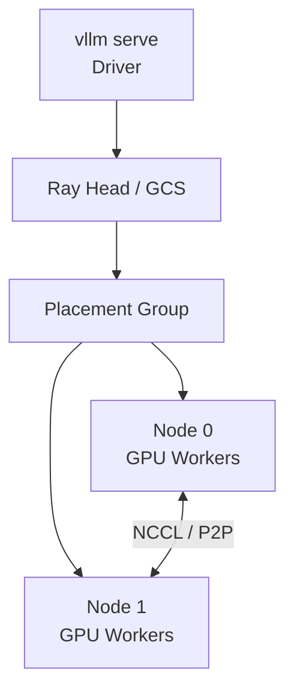
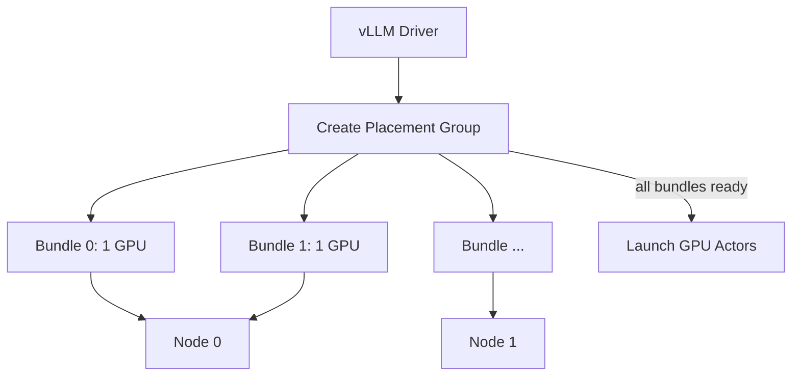
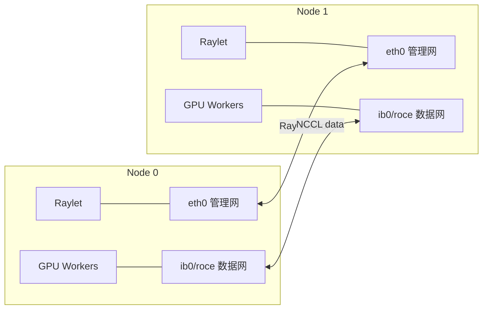

Ray 能回答“哪台机器还有几张 GPU”，却不能保证这些 GPU 能彼此正确通信。
它像酒店前台：能分配房间、记录住客、安排资源，但不会替你修电梯、铺网线或搬运行李。
多节点部署必须同时打通四层：环境、资源、网络和集合通信。
<!-- more -->
## 📑 目录
- [1. Ray 在 vLLM 中做什么](#1-ray-在-vllm-中做什么)
- [2. 多节点前置条件](#2-多节点前置条件)
- [3. 网络与拓扑检查](#3-网络与拓扑检查)
- [4. 手工启动 Ray 集群](#4-手工启动-ray-集群)
- [5. 容器部署要点](#5-容器部署要点)
- [6. 验证资源与放置](#6-验证资源与放置)
- [7. vLLM 如何使用 Ray](#7-vllm-如何使用-ray)
- [8. 分层故障排查](#8-分层故障排查)
- [9. 生产 trade-off](#9-生产-trade-off)
- [10. Head、Worker、Actor 与 Placement Group](#10-headworkeractor-与-placement-group)
- [11. 控制面与数据面网络必须分开验证](#11-控制面与数据面网络必须分开验证)
- [12. NCCL 环境变量](#12-nccl-环境变量先观察再约束)
- [13. 容器的一致性与网络检查](#13-容器的一致性与网络检查)
- [14. 从 ping 到 NCCL Tests 的实验阶梯](#14-从-ping-到-nccl-tests-的实验阶梯)
- [15. 故障树](#15-故障树从第一处异常定位)
- [总结](#-总结)
- [自我检验清单](#-自我检验清单)
- [官方参考](#-官方参考)
---
## 1. Ray 在 vLLM 中做什么
Ray 集群包含：
- 一个 Head Node；零个或多个 Worker Nodes；每个节点上注册的逻辑资源。
- 调度 Task/Actor 的控制面。
vLLM 使用 Ray 时，可以把模型 Worker 放到集群中的 GPU 上。

Ray 负责：
- 发现逻辑 GPU 资源；预留 Placement Group；启动远端 Worker。
- 维护 Actor 生命周期。
Ray 不负责：
- 安装匹配的 NVIDIA Driver；保证 CUDA/NCCL ABI 一致；自动让模型路径出现在每个节点。
- 打开防火墙；修复 IB/RoCE；保证跨节点带宽符合预期。
---
## 2. 多节点前置条件
先完成下面的清单，再运行 `ray start`。
### 2.1 硬件与驱动
所有计算节点应确认：
```bash
nvidia-smi
nvidia-smi topo -m
```
重点检查：
- GPU 型号与显存是否符合计划；Driver 是否支持容器/环境中的 CUDA Runtime；GPU 数量是否一致或已显式规划异构放置。
- ECC/Xid 等硬件错误是否存在；NVLink 是否处于预期状态。
GPU 型号可以不同，但异构 TP/PP 往往产生慢 rank 和兼容性风险。
入门部署优先使用同构节点。
### 2.2 软件一致性
每个节点记录：
```bash
python --version
python -c "import torch; print(torch.__version__, torch.version.cuda)"
python -c "import vllm; print(vllm.__version__)"
python -c "import ray; print(ray.__version__)"
```
需要一致或明确兼容的项目：
- Python；vLLM；PyTorch。
- CUDA Runtime；NCCL；Tokenizer 与模型代码依赖。
- 自定义 Kernel；环境变量。
最稳妥的方式是使用同一个不可变容器镜像。
“都叫 latest”不等于内容一致，生产环境应固定 image digest。
### 2.3 模型与缓存可见性
每个 Worker 都要能读取相同模型。
可选方式：
- 每节点预下载到同一路径；共享只读文件系统；每节点通过 Hugging Face Hub 下载。
- 对象存储配合本地缓存。
检查：
```bash
ls -ld /models/your-model
```
如果使用私有模型，每个节点都要有有效凭证，且不要把 Token 写进文档或日志。
### 2.4 操作系统资源
核对：
- `/dev/shm` 大小；文件描述符限制；进程/线程限制。
- 磁盘空间与 inode；时钟同步；主机名与 DNS。
- NUMA 与 CPU 绑核策略。
容器默认共享内存过小，是多进程与 NCCL 常见故障源。
---
## 3. 网络与拓扑检查
### 3.1 选择可达的私网 IP
Head 打印的地址必须能被所有 Worker 访问。
多网卡机器可能同时有：
- 管理网；业务网；存储网。
- IB/RoCE 数据网；Docker 虚拟网。
不要默认第一个 IP 就是正确接口。
```bash
ip -br addr
ip route
```
macOS 本机不承载 CUDA Worker，这些命令应在 Linux GPU 节点执行。
### 3.2 基础连通性
从 Worker 检查 Head：
```bash
ping -c 3 <HEAD_IP>
nc -vz <HEAD_IP> 6379
```
`ping` 通不代表所有端口可用，`ping` 被禁也不代表 TCP 一定不通。
Ray 除 GCS 端口外还会使用其他端口。
生产环境应依据 Ray 官方端口配置 设置固定范围并配置防火墙，而不是长期关闭整个防火墙。
### 3.3 InfiniBand / RoCE
InfiniBand 可先检查：
```bash
ibstat
ibstatus
```
需要确认：
- Port State 为 Active；Link Layer 符合预期；Rate 符合硬件配置。
- Subnet Manager 正常；错误计数没有持续增长。
RoCE 还要关注：
- PFC/ECN；MTU；GID。
- 无损网络配置；交换机侧拥塞。
### 3.4 GPU Direct RDMA
有高速 NIC 不代表启用了 GDRDMA。
要核对：
- NIC/GPU PCIe 亲和；`nvidia-peermem` 或受支持的 DMA-BUF 路径；容器设备暴露。
- NCCL 日志实际选择的 transport。
### 3.5 通信量决定接口价值
假设跨节点每步传 64 MiB，有效带宽 20 GiB/s，忽略固定延迟：
$$
T\gtrsim\frac{64\text{ MiB}}{20\text{ GiB/s}} \approx3.125\text{ ms}
$$
若有效带宽只有 2 GiB/s：
$$
T\gtrsim31.25\text{ ms}
$$
一个接口选择错误，就可能让 TPOT 增加一个数量级。
---
## 4. 手工启动 Ray 集群
下面使用 Ray 官方 on-premise 的基本方式。
### 4.1 Head Node
```bash
ray stop
ray start --head \
  --node-ip-address=<HEAD_IP> \
  --port=6379
```
记录输出中的集群地址。
如果省略 `--port`，Ray 可能选择 6379 或其他可用端口；为了可复现和防火墙配置，示例显式固定 6379。
### 4.2 Worker Node
```bash
ray stop
ray start \
  --address=<HEAD_IP>:6379 \
  --node-ip-address=<WORKER_IP>
```
每个 Worker 都执行一次。
`--address` 是 Head 的可达地址，`--node-ip-address` 是本节点向集群声明的地址。
### 4.3 为什么先 `ray stop`
它用于清理本机残留的旧 Ray 进程，避免连接到错误集群。
但这会影响同机其他 Ray 作业。
共享生产节点上不能机械执行，应先确认该机器是否由当前部署独占。
### 4.4 查看集群状态
在 Head Node：
```bash
ray status
```
再用 Python：
```bash
python - <<'PY'
import ray
ray.init(address="auto")
print(ray.cluster_resources())
print(ray.available_resources())
print(ray.nodes())
PY
```
检查总 GPU 数是否符合预期。
Ray 资源是逻辑资源，调度可用不等于硬件健康。
---
## 5. 容器部署要点
多节点最容易出现“Head 与 Worker 镜像不一致”。
所有节点应使用同一命令和同一镜像 digest。
典型容器能力包括：
```bash
docker run --rm -it \
  --gpus all \
  --network host \
  --ipc host \
  --entrypoint /bin/bash \
  -v /models:/models:ro \
  <YOUR_VLLM_IMAGE_DIGEST>
```
解释：
- `--gpus all` 暴露 GPU；`--network host` 简化多端口和私网地址；`--ipc host` 避免默认 `/dev/shm` 过小。
- 模型以只读方式挂载到相同路径。
### 5.1 安全 trade-off
`--network host` 与 `--ipc host` 扩大了容器与宿主机的共享范围。
在安全要求高的环境中，应改用：
- 明确端口映射；足够大的 `--shm-size`；最小设备权限。
- Kubernetes NetworkPolicy；KubeRay / Operator 管理。
教程命令追求可理解，不代表是唯一生产方案。
### 5.2 环境变量一致
常见需要明确的变量：
```bash
export NCCL_DEBUG=INFO
export NCCL_SOCKET_IFNAME=<DATA_INTERFACE>
export GLOO_SOCKET_IFNAME=<DATA_INTERFACE>
```
只在确认接口名后设置。
不要盲抄：
```bash
NCCL_P2P_DISABLE=1
NCCL_IB_DISABLE=1
```
这些变量适合定位故障，长期启用可能直接关闭最快链路。
---
## 6. 验证资源与放置
### 6.1 资源数
两台各 8 卡时，预期 Ray 集群资源至少包含：
$$
\text{GPU}=16
$$
若只看到 8：
- Worker 未加入；Worker 进程未看到 GPU；容器未暴露 GPU。
- `CUDA_VISIBLE_DEVICES` 限制；Ray 注册了错误资源数。
### 6.2 Placement Group
vLLM 会用 Placement Group 为 Worker 预留成组资源。
如果请求 16 张 GPU，集群虽总计 16 张，但其中一张被其他 Actor 占用，Placement Group 可能一直 Pending。
这不是 NCCL 故障，而是调度资源不足。
### 6.3 验证每个节点看到的模型
可提交一个简单 Ray 任务：
```bash
python - <<'PY'
import os
import ray
ray.init(address="auto")
@ray.remote
def check():
    return {
        "host": os.uname().nodename,
        "model": os.path.exists("/models/your-model"),
    }
print(ray.get([check.remote() for _ in range(8)]))
PY
```
这只检查任务落点上的路径，不保证覆盖每个节点。
更严格时应使用节点资源标签或运维工具逐节点检查。
---
## 7. vLLM 如何使用 Ray
Ray 集群就绪后，在一个节点执行一条 vLLM 命令即可调度 Worker。
两节点各 8 卡的常见映射：
```bash
vllm serve /models/your-model \
  --tensor-parallel-size 8 \
  --pipeline-parallel-size 2 \
  --distributed-executor-backend ray
```
这表达：
- 每个 Stage 内 TP=8；共两个 PP Stages；总模型 Worker 数为 16。
- Ray 负责跨节点放置。
必须结合日志验证：不要仅凭参数假设每个 Stage 恰好落在一个节点。
### 7.1 另一种方案
TP=16、PP=1：
```bash
vllm serve /models/your-model \
  --tensor-parallel-size 16 \
  --distributed-executor-backend ray
```
它让 TP collective 跨节点，官方文档支持这种形式，但性能高度依赖高速互连。
支持启动不等于适合生产。
---
## 8. 分层故障排查
不要一次修改十个 NCCL 变量。
按层排查才能保留证据。
### 第 1 层：进程与资源
```bash
ray status
nvidia-smi
```
问题表现：
- Placement Group Pending；GPU 数不够；Worker 未加入。
- CUDA_VISIBLE_DEVICES 不一致。
### 第 2 层：文件与环境
```bash
python -c "import vllm, ray, torch; print(vllm.__version__, ray.__version__, torch.__version__)"
ls -ld /models/your-model
```
问题表现：
- 远端 ImportError；模型路径不存在；自定义模型代码版本不同。
- 量化扩展缺失。
### 第 3 层：控制面网络
```bash
nc -vz <HEAD_IP> 6379
ray status
```
问题表现：
- Worker 无法加入；GCS 连接超时；节点使用 NAT 后的不可达地址。
### 第 4 层：数据面通信
```bash
export NCCL_DEBUG=INFO
export NCCL_DEBUG_SUBSYS=INIT,NET,GRAPH
```
问题表现：
- NCCL 初始化卡住；选错 NIC；IB/RoCE 不可用。
- P2P 或共享内存失败。
日志可能很大，问题定位后应恢复合理日志级别。
### 第 5 层：性能
能跑后再看：
- NCCL Tests 有效带宽；GPU/NIC 拓扑；TP 是否跨节点。
- Stage 是否不均；真实 TTFT/TPOT 与吞吐。
“启动成功”只是正确性的第一关。
---
## 9. 生产 trade-off
### Ray 的优势
- Python 生态成熟；vLLM 多节点集成直接；Placement Group 表达成组 GPU。
- 资源发现和 Actor 生命周期统一；适合裸机、VM 和实验集群。
### Ray 的代价
- 增加控制面和日志体系；需要规划端口与网络；Head/GCS 是重要故障域。
- 资源逻辑视图可能掩盖硬件问题；与 Kubernetes 调度叠加时更复杂。
### 什么时候不必用 Ray
- 单节点多卡，vLLM 默认 multiprocessing 足够；已有成熟外部编排并使用独立 DP 副本；目标版本支持并验证了其他 multi-node backend。
- 团队无法承担额外控制面运维。
选择 Ray 的理由应该是：它解决了你的跨节点编排问题，而不是“分布式教程里都用了 Ray”。
---
## 10. Head、Worker、Actor 与 Placement Group

### 10.1 Head Node 不等于模型第一个 Stage

Head Node 运行 Ray 控制面，常包括 GCS、Raylet、Dashboard 与状态服务。Worker Node 也运行 Raylet，并启动被调度的 Worker/Actor。

“Ray Head”是控制面角色；“PP Stage 0”是模型计算角色。它们可能在同一机器，但没有概念上的必然绑定。

### 10.2 Driver 与 GPU Worker

执行 `vllm serve ...` 的进程通常充当 Driver/Coordinator。它解析并行配置、向 Ray 请求资源、创建远端 GPU Workers、协调模型加载和执行，并启动 API 服务。

真正持有模型权重和 CUDA Context 的是 GPU Worker Actors。

### 10.3 Placement Group 为什么存在

普通调度可能先占到 15 张 GPU，最后 1 张长期不可用，导致已启动 workers 占着资源等待。

Placement Group 用多个 bundle 做 gang reservation：

```text
bundle 0: {"GPU": 1, "CPU": n}
bundle 1: {"GPU": 1, "CPU": n}
...
```

只有整组资源可满足，组才 Ready。



### 10.4 放置策略的直觉

Ray Placement Strategy 的具体使用由框架版本决定，理解以下差异有助于排错：

- `PACK`：尽量装到少数节点；
- `SPREAD`：尽量分散；
- `STRICT_PACK`：全部 bundle 必须在一个节点；
- `STRICT_SPREAD`：每个 bundle 在不同节点。

对 TP，通常希望同一 TP group 尽量在一个高速节点；对 PP，希望不同 stage 可跨节点。

如果框架只表达“16 个 GPU bundle”而未表达你的理想 TP/PP 拓扑，资源数量正确也可能放置不佳。必须查看 Actor 到 node/GPU 的实际映射。

### 10.5 Placement Pending 的数值例子

两节点各 8 GPU，总资源显示 16。若旧 Actor 在 Node 0 占 1 GPU，则空闲分布：

```text
Node 0: 7 GPU
Node 1: 8 GPU
Total: 15 GPU
```

请求 16 个 1-GPU bundles 必然 Pending。

更隐蔽的情况：总空闲仍为 16，但请求 `STRICT_PACK` 16 GPU，任何单节点都只有 8，也会 Pending。

所以要同时看总资源、每节点资源、已占用 Actor、bundle 数量与 strategy。

---

## 11. 控制面与数据面网络必须分开验证

### 11.1 控制面

Ray 控制面负责 Worker 加入、心跳、Actor 创建、对象/状态元数据和状态查询。控制面网络通，不代表 NCCL 数据面通。

### 11.2 数据面

模型执行可能使用：

- NCCL Socket；
- InfiniBand verbs；
- RoCE；
- GPUDirect RDMA；
- 节点内 CUDA P2P / NVLink；
- 共享内存。

它们可能选择与 Ray 不同的接口。



### 11.3 地址选择检查

在每节点：

```bash
hostname -I
ip -br addr
ip route get <PEER_IP>
getent hosts "$(hostname)"
```

确认：

- `--node-ip-address` 是其他节点可达地址；
- 主机名不会解析到 `127.0.1.1` 或错误网卡；
- 容器看到的地址与宿主网络模式一致；
- Head 返回的地址不是 Docker bridge 私有地址。

### 11.4 固定端口范围

Ray 除 Head/GCS 端口外，还涉及 Node Manager、Object Manager、Worker Ports、Dashboard 等。

生产环境应按所用 Ray 版本的官方参数固定 Head、Node/Object Manager、Runtime Env Agent、Dashboard/Agent 和 Worker 端口范围，然后只开放必要网段和端口。

不要把“临时关闭防火墙后能跑”当成最终配置。

---

## 12. NCCL 环境变量：先观察，再约束

### 12.1 推荐的首次诊断

```bash
export NCCL_DEBUG=INFO
export NCCL_DEBUG_SUBSYS=INIT,NET,GRAPH
```

重点看：

- 每个 rank 的 host、busId；
- Bootstrap 选择的接口；
- `NET/IB` 还是 `NET/Socket`；
- HCA 与 GID；
- P2P/SHM 是否启用；
- Ring/Tree 拓扑；
- 哪个 rank 最先失败。

### 12.2 接口变量

确认接口后再设置：

```bash
export NCCL_SOCKET_IFNAME='=eth0'
export GLOO_SOCKET_IFNAME='eth0'
```

若使用 IB/RoCE，可能还需要根据实际 HCA、GID 和平台文档设置 NCCL 参数。不要从另一套集群复制接口名。

NCCL 的接口选择支持包含/排除语法，但细节随版本文档为准。常见目标是排除 loopback、Docker bridge、CNI 虚拟接口和不应参与通信的管理接口。

先用日志确认默认选错，再约束；否则手工配置可能屏蔽自动选择的正确高速网。

### 12.3 诊断变量不能成为永久“修复”

```bash
export NCCL_IB_DISABLE=1
export NCCL_P2P_DISABLE=1
export NCCL_SHM_DISABLE=1
```

这些可用于 A/B 定位：

- 禁用 IB 后不再 hang：问题在 IB/RoCE 路径或配置；
- 禁用 P2P 后能跑：节点内 P2P/拓扑/虚拟化有问题；
- 禁用 SHM 后能跑：共享内存或容器 IPC 有问题。

但它们往往显著降低性能。证实故障层后应修复根因，并恢复最快路径。

---

## 13. 容器的一致性与网络检查

### 13.1 固定镜像摘要

在所有节点：

```bash
docker image inspect <IMAGE> \
  --format '{{index .RepoDigests 0}}'
```

记录 digest，而不是只记 tag。

### 13.2 节点内先验证 GPU

```bash
docker run --rm --gpus all \
  --entrypoint nvidia-smi \
  <IMAGE> \
  -L
```

如果这里 GPU 数不对，问题在容器 runtime/设备暴露，不在 Ray。

### 13.3 对称启动容器

Head：

```bash
docker run --rm -it \
  --name vllm-ray \
  --gpus all \
  --network host \
  --ipc host \
  --entrypoint /bin/bash \
  -v /models:/models:ro \
  <IMAGE_DIGEST>
```

Worker 使用相同命令、镜像和挂载。

容器内分别检查：

```bash
python -c "import torch, ray, vllm; print(torch.__version__, ray.__version__, vllm.__version__)"
test -r /models/your-model/config.json
ip -br addr
df -h /dev/shm
```

### 13.4 非 host network

若安全策略不允许 `--network host`：

- 显式映射固定 Ray 端口和 worker range；
- 给容器分配节点间可路由地址；
- 确认 Actor 返回地址从远端可达；
- 使用 `--shm-size` 替代 `--ipc host`；
- 挂载 IB/RDMA 必需设备与库；
- 用 NetworkPolicy/防火墙限制来源。

这比 host network 更安全，但配置面显著扩大。

---

## 14. 从 ping 到 NCCL Tests 的实验阶梯

每一层只证明一件事。

### 14.1 L3/L4 连通

```bash
ping -c 3 <PEER_IP>
nc -vz <HEAD_IP> 6379
```

只证明 ICMP/TCP 指定端口。

### 14.2 Ray 远端执行

```bash
python - <<'PY'
import socket
import ray

ray.init(address="auto")

@ray.remote(num_cpus=0)
def identity():
    return socket.gethostname()

print(ray.get([identity.remote() for _ in range(32)]))
PY
```

结果出现多个 hostname 才证明任务确实落到多节点。它仍不证明 GPU/NCCL。

### 14.3 Ray GPU Actor

```bash
python - <<'PY'
import socket
import ray
import torch

ray.init(address="auto")

@ray.remote(num_gpus=1)
def check_gpu():
    return {
        "host": socket.gethostname(),
        "visible": torch.cuda.device_count(),
        "name": torch.cuda.get_device_name(0),
        "bytes": torch.cuda.mem_get_info(),
    }

n = int(ray.cluster_resources().get("GPU", 0))
print(ray.get([check_gpu.remote() for _ in range(n)]))
PY
```

这证明 GPU Actor 能启动，但调度不保证每个节点恰好一次。要做逐节点覆盖，需要节点资源标签。

### 14.4 NCCL Tests

在目标容器/环境编译或使用匹配版本的 `nccl-tests`，按其官方文档运行 `all_reduce_perf`。

至少测试：

```text
消息: 8 KiB, 64 KiB, 1 MiB, 16 MiB, 256 MiB
范围: 单节点；两节点
rank: 与目标 TP/EP group 相同
```

关注：

- `algbw`；
- `busbw`；
- 是否 hang/error；
- 小消息延迟；
- 单节点到跨节点下降幅度；
- 多次运行稳定性。

不要只截取最大消息的最高带宽。

### 14.5 数值验收

若 32 MiB AllReduce 在两节点实测 2.5 ms，粗略算法带宽：

$$
B_{\text{alg}}\approx32\text{ MiB}/2.5\text{ ms}
=12.5\text{ GiB/s}
$$

若单节点是 0.4 ms：

$$
80\text{ GiB/s}
$$

跨节点约慢 6.25 倍。让每层 TP collective 跨节点时，这个差距会被重复放大。

---

## 15. 故障树：从第一处异常定位

### 15.1 Worker 加不进 Head

检查顺序：

1. Head 进程是否存活；
2. Worker 到 Head 固定端口是否可达；
3. `--node-ip-address` 是否为可达私网；
4. Ray 版本是否一致；
5. 主机时间、DNS/hostname；
6. 防火墙 worker 端口范围。

失败阶段在 Ray Bootstrap，此时调 NCCL 没有意义。

### 15.2 Placement Group Pending

收集：

```bash
ray status
ray list placement-groups
ray list actors
ray list nodes
```

命令可用性取决于 Ray 版本，以 `ray --help` 为准。

判断：

- 总 GPU 不够；
- 每节点形状不满足 strategy；
- 旧 Actor 占用；
- Dead Node 资源未及时清理；
- CPU/自定义资源缺失，而不只是 GPU。

### 15.3 Actor 启动后远端 ImportError

说明 Ray 控制面已通，问题在 Runtime Environment：

- 镜像/虚拟环境不同；
- 工作目录或 `PYTHONPATH` 不同；
- 自定义模型代码缺失；
- 动态库路径不一致。

在每个 Actor 返回版本、`sys.path` 和模型路径，比只在 Head 执行 `pip list` 更有效。

### 15.4 NCCL 初始化 hang

检查所有 rank 的日志时间线。常见原因：

- 一个 Actor 已先崩溃，其他 ranks 等它；
- Bootstrap 选错接口；
- IB/RoCE/GID/MTU 配置不一致；
- 容器未暴露 RDMA；
- `/dev/shm` 太小；
- P2P/ACS/IOMMU 问题；
- 防火墙拦截 NCCL 动态连接。

最后打印 timeout 的 rank 常常不是根因 rank。

### 15.5 运行一段时间后失败

收集：

- GPU Xid/ECC；
- NIC error/drop/retry；
- Ray node/actor death；
- OOM killer 与容器限制；
- NCCL async error；
- 发生时的请求长度、并发和显存。

“启动成功”只能排除静态配置的一部分。

### 15.6 性能失败

若正确但慢，按以下阶梯建立基线：

```text
单 GPU kernel -> 单节点 collective -> 跨节点 collective
-> Ray actor overhead -> vLLM end-to-end
```

指标包括 TTFT、TPOT、吞吐、NCCL Tests 消息曲线、NIC 吞吐/错误、Stage 时间、rank 到 GPU/NIC/NUMA 映射、Placement、控制面 CPU、GPU 时钟和功耗限制。

---

## 📝 总结
- Ray 管理逻辑资源与 Worker 生命周期，不替代 CUDA、NCCL 或网络配置；多节点前要保证驱动、镜像、Python/vLLM/Ray、模型路径和环境一致；Head/Worker 必须使用彼此可达的私网地址，并正确规划 Ray 端口。
- NVLink、IB/RoCE 与 GDRDMA 要分别验证，不能由“有高速网卡”推断；`ray status` 先验证控制面，NCCL 日志与带宽测试再验证数据面；vLLM 常用节点内 TP、跨节点 PP，但必须检查实际 Placement。
- 排错应按资源、环境、控制面、数据面、性能五层推进。
## 🎯 自我检验清单
- 能说明 Ray 和 NCCL 的职责边界吗？
- 能列出多节点软件一致性的五个项目吗？
- 能解释模型路径为何必须对所有 Worker 可见吗？
- 能手工启动 Head 和 Worker 并查看 `ray status` 吗？
- 能说明逻辑 GPU 资源与硬件健康的区别吗？
- 能解释为什么多网卡环境要显式选择接口吗？
- 能按五层顺序定位 Placement Pending 与 NCCL timeout 吗？
- 能说出 `--network host` / `--ipc host` 的便利与安全代价吗？
## 📚 官方参考
- [Ray：Launching an On-Premise Cluster](https://docs.ray.io/en/latest/cluster/vms/user-guides/launching-clusters/on-premises.html)
- [Ray：Cluster Key Concepts](https://docs.ray.io/en/latest/cluster/key-concepts.html)
- [Ray：Resources](https://docs.ray.io/en/latest/ray-core/scheduling/resources.html)
- [vLLM：Parallelism and Scaling](https://docs.vllm.ai/en/stable/serving/parallelism_scaling/)
- [NVIDIA NCCL：GPU Troubleshooting](https://docs.nvidia.com/deeplearning/nccl/user-guide/docs/troubleshooting/gpu_troubleshooting.html)
- [NVIDIA NCCL：Networking Troubleshooting](https://docs.nvidia.com/deeplearning/nccl/user-guide/docs/troubleshooting/networking_troubleshooting.html)
