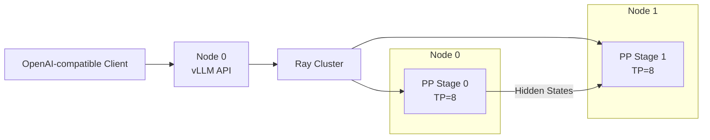

这一节不从“直接上 16 卡”开始。
分布式部署最可靠的方法是逐级增加复杂度：单卡能跑，单节点 TP 能跑，Ray 资源正确，最后才跨节点。
每一级都保留同一组请求和指标，这样出错时才知道是哪一层引入了变化。
<!-- more -->
## 📑 目录
- [1. 实验目标与拓扑](#1-实验目标与拓扑)
- [2. 固定版本并核对 CLI](#2-固定版本并核对-cli)
- [3. 建立单卡基线](#3-建立单卡基线)
- [4. 单节点 TP](#4-单节点-tp)
- [5. 两节点 Ray 集群](#5-两节点-ray-集群)
- [6. 多节点 TP×PP 服务](#6-多节点-tppp-服务)
- [7. 请求与正确性验证](#7-请求与正确性验证)
- [8. 显存、通信和性能验收](#8-显存通信和性能验收)
- [9. DP 与 EP 扩展示例](#9-dp-与-ep-扩展示例)
- [10. 故障排查 Runbook](#10-故障排查-runbook)
- [11. 部署前先写容量与拓扑验收单](#11-部署前先写容量与拓扑验收单)
- [12. 单节点容器化部署](#12-单节点容器化部署)
- [13. 两节点容器 + Ray 完整命令](#13-两节点容器--ray-完整命令)
- [14. 网络与 NCCL 的上线前检查](#14-网络与-nccl-的上线前检查)
- [15. 可执行的正确性验收脚本](#15-可执行的正确性验收脚本)
- [16. 性能实验矩阵](#16-性能实验矩阵)
- [17. 指标、Goodput 与成本](#17-指标goodput-与成本)
- [18. 从现象到证据的故障矩阵](#18-从现象到证据的故障矩阵)
- [19. 上线与回滚门槛](#19-上线与回滚门槛)
- [总结](#-总结)
- [自我检验清单](#-自我检验清单)
- [官方参考](#-官方参考)
---
## 1. 实验目标与拓扑
假设有两台同构服务器：
- Node 0：8×GPU，私网 IP `10.0.0.10`；Node 1：8×GPU，私网 IP `10.0.0.11`；节点内 NVLink/NVSwitch。
- 节点间 InfiniBand 或 RoCE；模型都位于 `/models/your-model`；两节点使用同一容器镜像。
目标配置：
$$
TP=8,\quad PP=2,\quad DP=1
$$
总 Worker GPU：
$$
8\times2\times1=16
$$

示例 IP、模型路径和端口必须替换为实际值。
---
## 2. 固定版本并核对 CLI
vLLM 的 stable 文档随发布滚动。
部署记录至少保存：
```bash
python --version
python -c "import vllm; print(vllm.__version__)"
python -c "import ray; print(ray.__version__)"
python -c "import torch; print(torch.__version__, torch.version.cuda)"
nvidia-smi
```
核对目标环境支持的参数：
```bash
vllm serve --help | less
```
本节会使用当前 stable 文档中的：
- `--tensor-parallel-size`；`--pipeline-parallel-size`；`--distributed-executor-backend ray`。
- `--data-parallel-size`；`--data-parallel-backend ray`；`--enable-expert-parallel`。
如果本机 `--help` 与网页不同，以安装版本的 CLI 与对应版本文档为准。
### 2.1 先做静态检查
在两节点分别执行：
```bash
nvidia-smi -L
nvidia-smi topo -m
test -d /models/your-model
```
确认：
- 每台确实看到 8 张 GPU；TP 组位于预期 NVLink 域；模型目录存在。
- 当前用户有读取权限。
---
## 3. 建立单卡基线
若目标模型单卡放不下，可以用同系列较小模型验证软件栈，再用目标模型从最小可行 TP 开始。单卡示例：
```bash
CUDA_VISIBLE_DEVICES=0 \
vllm serve Qwen/Qwen2.5-7B-Instruct \
  --host 0.0.0.0 \
  --port 8000 \
  --dtype auto
```
### 3.1 健康与模型检查
```bash
curl -fsS http://127.0.0.1:8000/health
curl -fsS http://127.0.0.1:8000/v1/models
```
### 3.2 发出固定请求
```bash
curl -sS http://127.0.0.1:8000/v1/chat/completions \
  -H 'Content-Type: application/json' \
  -d '{
    "model": "Qwen/Qwen2.5-7B-Instruct",
    "messages": [
      {"role": "user", "content": "用一句话解释张量并行。"}
    ],
    "temperature": 0,
    "max_tokens": 64
  }'
```
记录是否返回 200、首 Token 时间、总时长、输入/输出 Token 数、单卡显存、服务启动参数与日志。
这份记录是后续所有阶段的基线。
---
## 4. 单节点 TP
先在 Node 0 验证 8 卡 TP，排除跨节点因素。
```bash
CUDA_VISIBLE_DEVICES=0,1,2,3,4,5,6,7 \
vllm serve /models/your-model \
  --host 0.0.0.0 \
  --port 8000 \
  --tensor-parallel-size 8
```
单节点场景默认通常使用 multiprocessing；无需为了“统一”强行引入 Ray。
### 4.1 验证显存分布
```bash
watch -n 1 nvidia-smi
```
应观察到 8 张目标 GPU 都有 Worker 占用。
理想权重显存约为：
$$
M_{\text{weight per GPU}} \approx\frac{P\times b_w}{8}
$$
实际值会包含 KV Cache 与运行时，也可能有复制权重。
### 4.2 验证 API
将前一节的固定请求改成目标模型名，重复至少多次，排除首次编译、模型加载和 CUDA Graph Warm-up。
### 4.3 单节点失败时不要继续
如果 TP=8 在单节点失败，跨节点只会叠加更多变量。
先解决：
- 模型结构与 TP 整除；显存不足；量化 Kernel。
- 本地 NCCL/P2P；CUDA Graph；模型代码依赖。
---
## 5. 两节点 Ray 集群
确保没有需要保留的 Ray 作业后，再清理旧进程。
### 5.1 Node 0：Head
```bash
ray stop
ray start --head \
  --node-ip-address=10.0.0.10 \
  --port=6379
```
### 5.2 Node 1：Worker
```bash
ray stop
ray start \
  --address=10.0.0.10:6379 \
  --node-ip-address=10.0.0.11
```
### 5.3 Node 0：资源验收
```bash
ray status
```
确认两节点均为 Alive、总 GPU 数为 16；若资源不足，不要启动 vLLM。
---
## 6. 多节点 TP×PP 服务
在 Node 0 执行：
```bash
export NCCL_DEBUG=INFO
vllm serve /models/your-model \
  --host 0.0.0.0 \
  --port 8000 \
  --tensor-parallel-size 8 \
  --pipeline-parallel-size 2 \
  --distributed-executor-backend ray
```
当前 vLLM 官方建议的常见做法是：
- TP 等于每节点 GPU 数；PP 等于节点数。
这是适合本拓扑的起点，不是对所有机器的最优值保证。
### 6.1 启动日志要确认什么
- 识别到 16 张 GPU；Placement Group 不再 Pending；两节点都启动 Worker。
- 模型路径在远端可读；TP=8、PP=2 与预期一致；NCCL 选择了正确网卡/transport。
- 服务最终监听 8000 端口。
---
## 7. 请求与正确性验证
### 7.1 非流式请求
```bash
curl -sS http://10.0.0.10:8000/v1/completions \
  -H 'Content-Type: application/json' \
  -d '{
    "model": "/models/your-model",
    "prompt": "Tensor parallelism is",
    "temperature": 0,
    "max_tokens": 32
  }'
```
模型 ID 以 `/v1/models` 返回值为准。
### 7.2 流式请求
```bash
curl -N http://10.0.0.10:8000/v1/chat/completions \
  -H 'Content-Type: application/json' \
  -d '{
    "model": "/models/your-model",
    "messages": [
      {"role": "user", "content": "列出 TP 和 PP 的两个区别。"}
    ],
    "temperature": 0,
    "max_tokens": 128,
    "stream": true
  }'
```
观察：
- 第一个 `data:` 多久出现；后续 Token 是否平稳；是否中途断流。
- 两节点 GPU 是否同时工作。
### 7.3 正确性基线
使用：
- 相同模型文件；相同 Tokenizer；`temperature=0`。
- 相同 Prompt；相同最大输出长度。
浮点归约顺序可能带来细微差异。
重点检查：
- 输出不是乱码或重复死循环；API usage 合理；无 rank crash。
- 多次请求稳定；单节点与多节点语义一致。
---
## 8. 显存、通信和性能验收
### 8.1 显存
每节点：
```bash
nvidia-smi --query-gpu=index,memory.used,utilization.gpu \
  --format=csv
```
关注：
- 同一 TP 组显存是否大致接近；某个 Stage 是否因 Embedding/LM Head 更重；是否留有 KV Cache 余量。
- 是否接近 OOM 临界点。
### 8.2 通信
启动定位阶段可保留：
```bash
export NCCL_DEBUG=INFO
export NCCL_DEBUG_SUBSYS=INIT,NET,GRAPH
```
检查日志是否使用预期：
- 节点内 P2P/NVLink；节点间 IB/RoCE；正确的 Socket Interface。
- GDRDMA 或受支持路径。
稳定后降低日志级别。
### 8.3 性能
至少比较三组：
1. 单节点最小可行配置；
2. 单节点 TP=8；
3. 两节点 TP=8、PP=2。
固定：
- Prompt 长度分布；Output 长度分布；并发。
- 采样参数；模型与量化；Warm-up 次数。
记录：
- TTFT P50/P95/P99；TPOT P50/P95/P99；Request Throughput。
- Input/Output Token Throughput；错误率；每 GPU 利用率与显存。
### 8.4 计算扩展效率
若基线吞吐为 $Q_1$，目标配置使用 $n$ 倍 GPU，吞吐为 $Q_n$：
$$
E=\frac{Q_n}{nQ_1}
$$
但 PP 扩展常首先为了承载更大模型，不应只用吞吐线性度评判。
还要看它是否满足原本无法满足的容量和 SLO。
---
## 9. DP 与 EP 扩展示例
### 9.1 单节点 DP×TP
8 张 GPU，4 个副本，每副本 TP=2：
```bash
vllm serve /models/your-model \
  --data-parallel-size 4 \
  --tensor-parallel-size 2
```
适用于一个副本能在 2 卡装下、 目标是增加请求吞吐的情况。
### 9.2 Ray 管理 DP
已启动 Ray 集群时：
```bash
vllm serve /models/your-model \
  --data-parallel-size 4 \
  --data-parallel-size-local 2 \
  --data-parallel-backend ray
```
当前 stable 文档说明，Ray 后端可用单条命令启动本地和远端 DP ranks。
实际 GPU 数还取决于 TP/PP。
### 9.3 MoE 的 EP
```bash
vllm serve /models/your-moe-model \
  --data-parallel-size 16 \
  --tensor-parallel-size 1 \
  --enable-expert-parallel \
  --data-parallel-backend ray
```
这只是参数结构示例。
运行前必须核对：
- 模型确实是受支持的 MoE；当前版本 EP 分组语义；All-to-All 后端依赖。
- 16 张 GPU 的 Ray 资源；节点间网络是否足以承载 EP。
---
## 10. 故障排查 Runbook
### 10.1 Placement Group Pending
检查：
- 总 GPU 是否足够；GPU 是否被旧 Actor 占用；每节点资源是否注册。
- bundle 是否无法满足拓扑；旧 Ray 作业是否仍在。
### 10.2 远端找不到模型
检查 Node 1：
```bash
test -d /models/your-model
```
容器场景还要检查挂载路径是否一致。
### 10.3 NCCL timeout
先保留日志证据：
```bash
export NCCL_DEBUG=INFO
export NCCL_DEBUG_SUBSYS=INIT,NET,GRAPH
```
再检查：
- Head/Worker 私网地址；防火墙与端口；`NCCL_SOCKET_IFNAME`。
- IB/RoCE 状态；`/dev/shm`；GPU P2P 与 PCIe 拓扑。
- 所有 rank 是否同时存活。
### 10.4 能跑但性能差
做对照实验：
- TP=16、PP=1 与 TP=8、PP=2；单节点与多节点；小并发与目标并发。
- Prefill-heavy 与 Decode-heavy；默认 NCCL 与显式正确接口。
只改一个变量，否则无法归因。
### 10.5 OOM
区分发生阶段：
- 加载时 OOM：权重分片或峰值加载；KV 初始化 OOM：缓存预算过高；首请求 OOM：Graph/临时激活。
- 高并发 OOM：KV Cache 或并发配置。
处理方向：
- 增大 TP/PP；降低模型精度或使用量化；降低上下文/并发预算。
- 调整显存利用率参数；避免多个服务争抢同一 GPU。
---
## 11. 部署前先写容量与拓扑验收单

不要把模型下载完成当作部署准备完成。

### 11.1 模型账本

记录：

```text
parameter count:
weight dtype / quantization:
layers:
hidden size:
attention heads:
kv heads:
head dimension:
max model length:
moe experts / top-k:
```

然后计算：

$$
M_W=P\times b_w
$$

$$
M_{KV/token}
=2\times L\times N_{kv}\times D\times b_{kv}
$$

### 11.2 数值例子

70B BF16、80 层、8 KV Heads、Head Dimension 128、KV BF16：

权重：

$$
70\times10^9\times2\approx130.4\text{ GiB}
$$

每 Token KV：

$$
2\times80\times8\times128\times2
=327680\text{ Bytes}
=0.3125\text{ MiB}
$$

若目标是 64 个请求、平均保留 8192 Tokens：

$$
N=64\times8192=524288\text{ Tokens}
$$

总 KV：

$$
524288\times0.3125\text{ MiB}
=160\text{ GiB}
$$

在 `TP=8,PP=2` 且 KV 理想按 TP 和层分片时，每 rank：

$$
M_{KV,\text{rank}}\approx160/(8\times2)=10\text{ GiB}
$$

权重每 rank：

$$
130.4/(8\times2)\approx8.15\text{ GiB}
$$

账面约 18.15 GiB/rank，但仍要加运行时、临时激活、CUDA Graph、通信缓冲和碎片。实际模型结构与框架布局可能偏离理想分片。

### 11.3 拓扑验收单

```text
Node count:
GPUs per node:
GPU model / memory:
intra-node NVLink/NVSwitch domain:
GPU-NIC PCIe affinity:
inter-node fabric:
MTU / GID / HCA:
Ray control interface:
NCCL data interface:
```

数据缺失时，先补检查，不直接定 TP/PP。

---

## 12. 单节点容器化部署

### 12.1 固定镜像

用团队已验证的 vLLM 镜像，并记录 digest：

```bash
docker pull <VLLM_IMAGE>
docker image inspect <VLLM_IMAGE> \
  --format '{{index .RepoDigests 0}}'
```

不要在生产记录中只保留 `latest`。

### 12.2 容器启动

```bash
docker run --rm -it \
  --name vllm-single-node \
  --gpus all \
  --ipc host \
  --network host \
  --entrypoint /bin/bash \
  -v /models:/models:ro \
  <VLLM_IMAGE_DIGEST> \
  -lc 'exec vllm serve /models/your-model \
    --host 0.0.0.0 \
    --port 8000 \
    --tensor-parallel-size 8'
```

前提：

- 宿主已安装 NVIDIA Container Toolkit；
- `/models/your-model` 在宿主存在；
- 8000 端口未被占用；
- 8 张 GPU 属于目标 NVLink 域；
- 镜像内 CLI 支持这些参数。

### 12.3 不使用 host IPC

可替换为：

```bash
--shm-size 16g
```

所需大小应在目标并行度和负载下验证，不应机械固定 16 GiB。

### 12.4 启动后检查

宿主：

```bash
docker logs -f vllm-single-node
nvidia-smi
curl -fsS http://127.0.0.1:8000/health
curl -fsS http://127.0.0.1:8000/v1/models
```

验收：

- 8 张 GPU 均有预期进程；
- 没有 rank 重启或 NCCL error；
- 模型 ID 与客户端请求一致；
- 显存有安全余量；
- Warm-up 后请求稳定。

---

## 13. 两节点容器 + Ray 完整命令

下面使用 host network/IPC 简化网络映射，适用于受控实验环境。生产环境要根据安全边界收紧。

### 13.1 两节点共同环境

```bash
export IMAGE=<VLLM_IMAGE_DIGEST>
export MODEL=/models/your-model
export HEAD_IP=10.0.0.10
export NCCL_SOCKET_IFNAME='=eth0'
export GLOO_SOCKET_IFNAME='eth0'
export NCCL_DEBUG=INFO
```

`eth0` 必须替换为实际通信接口。如果 NCCL 数据网与 Ray 控制网不同，分别设置。

### 13.2 Node 0：Head 容器

```bash
docker run --rm -it \
  --name vllm-ray-head \
  --gpus all \
  --network host \
  --ipc host \
  --entrypoint /bin/bash \
  -v /models:/models:ro \
  -e NCCL_SOCKET_IFNAME \
  -e GLOO_SOCKET_IFNAME \
  -e NCCL_DEBUG \
  -e VLLM_HOST_IP=10.0.0.10 \
  "${IMAGE}"
```

容器内：

```bash
ray stop
ray start --head \
  --node-ip-address=10.0.0.10 \
  --port=6379
```

### 13.3 Node 1：Worker 容器

使用与 Head **同一镜像 digest、挂载和网络模式**：

```bash
docker run --rm -it \
  --name vllm-ray-worker \
  --gpus all \
  --network host \
  --ipc host \
  --entrypoint /bin/bash \
  -v /models:/models:ro \
  -e NCCL_SOCKET_IFNAME \
  -e GLOO_SOCKET_IFNAME \
  -e NCCL_DEBUG \
  -e VLLM_HOST_IP=10.0.0.11 \
  "${IMAGE}"
```

容器内：

```bash
ray stop
ray start \
  --address=10.0.0.10:6379 \
  --node-ip-address=10.0.0.11
```

### 13.4 资源检查

Head 容器内：

```bash
ray status
python - <<'PY'
import ray
ray.init(address="auto")
print("cluster:", ray.cluster_resources())
print("available:", ray.available_resources())
for node in ray.nodes():
    print(node["NodeManagerAddress"], node["Alive"], node["Resources"])
PY
```

必须看到：

- 两个 Alive Nodes；
- 16 个 GPU；
- 两节点 IP 正确；
- 没有旧作业占用资源。

### 13.5 启动服务

Head 容器内：

```bash
vllm serve /models/your-model \
  --host 0.0.0.0 \
  --port 8000 \
  --tensor-parallel-size 8 \
  --pipeline-parallel-size 2 \
  --distributed-executor-backend ray
```

### 13.6 实际放置检查

```bash
ray list actors
nvidia-smi
```

并在两个节点分别查看 `nvidia-smi`。目标是：

```text
Node 0 -> PP stage 0, TP ranks 0-7
Node 1 -> PP stage 1, TP ranks 0-7
```

具体 Actor 名称和 `ray list` 字段随版本变化。最终以 vLLM 日志、Ray Actor-node 映射和 GPU 进程三者交叉确认。

---

## 14. 网络与 NCCL 的上线前检查

### 14.1 控制网

Worker 到 Head：

```bash
ip route get 10.0.0.10
nc -vz 10.0.0.10 6379
```

### 14.2 数据网

两节点：

```bash
ip -br addr
ibstat
nvidia-smi topo -m
```

RoCE 环境不一定有传统 IB Link Layer，需按平台检查 GID、PFC/ECN、MTU 与 NIC counters。

### 14.3 NCCL 日志验收

在启动日志中确认：

```text
Bootstrap interface = 预期接口
NET plugin/path     = IB/RoCE 或预期 Socket
rank host mapping   = 8 + 8
P2P/SHM             = 节点内可用
```

如果日志显示 Docker bridge、错误管理网或意外 `NET/Socket`，先解决接口，再做性能结论。

### 14.4 通信微基准

使用与目标环境匹配的 `nccl-tests`，分别运行：

- 8 ranks 单节点；
- 16 ranks 两节点；
- 消息范围覆盖 8 KiB 到 256 MiB；
- AllReduce；MoE 还需关注 All-to-All 对应测试或框架 microbenchmark。

记录原始输出、命令、hostfile、环境变量和拓扑。

---

## 15. 可执行的正确性验收脚本

前提：安装 `curl` 和 `python3`，服务监听 `${BASE_URL}`。

```bash
export BASE_URL=http://10.0.0.10:8000
export MODEL_ID=/models/your-model

curl -fsS "${BASE_URL}/health"
curl -fsS "${BASE_URL}/v1/models"

curl -fsS "${BASE_URL}/v1/chat/completions" \
  -H 'Content-Type: application/json' \
  -d "{
    \"model\": \"${MODEL_ID}\",
    \"messages\": [
      {\"role\": \"user\", \"content\": \"Return exactly: distributed-ok\"}
    ],
    \"temperature\": 0,
    \"max_tokens\": 16
  }" \
  > /tmp/vllm-response.json

python3 - <<'PY'
import json
from pathlib import Path

data = json.loads(Path("/tmp/vllm-response.json").read_text())
assert "choices" in data and data["choices"], data
assert "usage" in data, data
print(data["choices"][0]["message"]["content"])
print(data["usage"])
PY
```

明确前提：

- `MODEL_ID` 必须与 `/v1/models` 返回一致；
- 某些 Base Model 不支持 Chat Template，应改用 `/v1/completions`；
- 文本未必严格只返回目标短语，因此脚本只验收 schema；语义断言要按模型能力设计。

### 15.1 流式间隔检查

```bash
curl -N "${BASE_URL}/v1/chat/completions" \
  -H 'Content-Type: application/json' \
  -d "{
    \"model\": \"${MODEL_ID}\",
    \"messages\": [
      {\"role\": \"user\", \"content\": \"Explain TP, PP and DP in 200 words.\"}
    ],
    \"temperature\": 0,
    \"max_tokens\": 256,
    \"stream\": true
  }"
```

人工观察只是 smoke test。正式验收应在客户端记录每个 SSE chunk 的单调时钟，计算首 chunk 和相邻 chunk 间隔。

---

## 16. 性能实验矩阵

一次压测只能回答一个负载点。工程结论需要矩阵。

### 16.1 并行配置轴

在容量允许时：

```text
C0: 单卡或最小可行配置
C1: 单节点 TP=4
C2: 单节点 TP=8
C3: 两节点 TP=8, PP=2
C4: 两节点 TP=16, PP=1
C5: DP=2 × (单节点 TP=8)
```

`C4` 专门验证跨节点 TP 的代价，不应预设它更快。`C5` 需要 16 GPU 且模型单节点可容纳。

### 16.2 请求 shape 轴

```text
S1: input 128,   output 128
S2: input 4096,  output 128
S3: input 16384, output 128
S4: input 128,   output 1024
S5: input 4096,  output 1024
```

### 16.3 并发轴

```text
1, 4, 16, 64, 128
```

若达到错误率、OOM 或 SLO 崩溃，停止继续增压并记录拐点。

### 16.4 调度轴

按目标版本支持情况比较：

- `max_num_seqs`；
- `max_num_batched_tokens`；
- Chunked Prefill；
- Prefix Caching；
- KV Cache DType；
- GPU Memory Utilization。

每次只改一项。

### 16.5 总实验数控制

全笛卡尔积会很大。先做三阶段：

1. 固定典型 shape/concurrency，筛掉明显劣势的并行配置；
2. 对剩余配置扫描请求 shape 与并发；
3. 只对候选最优配置调 scheduler/KV 参数。

---

## 17. 指标、Goodput 与成本

### 17.1 延迟

- TTFT P50/P95/P99；
- TPOT P50/P95/P99；
- End-to-End Latency；
- Inter-chunk Gap；
- Queue Time。

### 17.2 吞吐

- Request/s；
- Input tok/s；
- Output tok/s；
- Total tok/s。

不要用 Total tok/s 掩盖 Output tok/s；Prefill 与 Decode 的计算特征不同。

### 17.3 资源

- 每 GPU 显存峰值；
- SM/Tensor Core 活跃度；
- GPU 功耗和时钟；
- NVLink/PCIe/NIC 吞吐；
- CPU、内存、Tokenizer 使用；
- KV Cache 使用与命中；
- Waiting/Running 请求。

### 17.4 Goodput

定义 SLO：

```text
TTFT P-request <= 2 s
TPOT P-request <= 50 ms
HTTP success
```

某段时间内：

$$
\text{Goodput}
=\frac{N_{\text{good requests}}}
{T_{\text{test}}}
$$

即只统计满足全部 SLO 的请求，单位为 req/s。若请求吞吐从 30 提升到 40 req/s，但满足 SLO 的比例从 95% 降到 60%：

$$
G_1=30\times0.95=28.5\text{ req/s}
$$

$$
G_2=40\times0.60=24\text{ req/s}
$$

表面吞吐更高，Goodput 反而下降。

若要衡量满足 SLO 的输出 Token，另命名为 **Token Goodput**，并按请求直接累加：

$$
\text{Token Goodput}
=\frac{\sum_{i\in\text{good requests}}N_{\text{output tokens},i}}
{T_{\text{test}}}
$$

### 17.5 成本

若 16 GPU 配置输出 4000 tok/s，8 GPU 配置输出 3000 tok/s：

$$
\text{tok/s/GPU}_{16}=250
$$

$$
\text{tok/s/GPU}_{8}=375
$$

16 GPU 可能为容量或 SLO 必需，但单位 GPU 效率更低。报告中要同时给绝对能力与单位资源效率。

---

## 18. 从现象到证据的故障矩阵

### 18.1 服务端口未监听

顺序：

1. Driver 是否仍存活；
2. Placement Group 是否 Ready；
3. 模型是否仍在加载；
4. 某远端 Actor 是否已崩；
5. 端口是否冲突；
6. API Server 是否在错误地址监听。

端口未监听不等于网络防火墙；服务可能根本没启动完成。

### 18.2 HTTP 200 但无流式增量

- 请求是否确实 `"stream": true`；
- 反向代理是否 buffering；
- 客户端是否逐 chunk 读取；
- 服务内部是否在生成；
- 长 Prefill 是否推迟首 Token。

同时采服务日志与客户端时间戳。

### 18.3 单节点快、多节点慢

- 比较单/多节点 NCCL Tests；
- 确认 TP 是否跨节点；
- 检查 PP stage 不均；
- 检查 NCCL 接口/transport；
- 检查 Actor placement；
- 检查 NIC-GPU 亲和和共享 NIC 拥塞。

### 18.4 P99 周期性尖峰

- Chunked Prefill 周期；
- 长请求到达；
- GC/CPU Tokenizer；
- Prefix Cache eviction；
- Ray/网络抖动；
- GPU 时钟/热降频；
- 某 Stage 或专家热点。

将尖峰时刻与请求 shape、队列、GPU/NIC/Stage 指标对齐。

### 18.5 一张 GPU 显存明显更高

- Embedding/LM Head；
- 某 PP Stage 层更多；
- KV 请求路由不均；
- CUDA Graph 捕获 shape 不同；
- Actor/服务重复占用；
- 专家放置不均。

先确认 PID、rank、stage，再决定是否异常。

### 18.6 第一个异常优先

分布式日志中后续常出现大量 timeout。根因往往是：

1. 某 rank 先 OOM/ImportError/Xid；
2. 其他 ranks 等待 collective；
3. watchdog 最后报 NCCL timeout。

按时间排序所有节点日志，找第一处异常，不要只修最后一条 timeout。

---

## 19. 上线与回滚门槛

上线前至少满足：

- 固定镜像 digest 与模型 revision；
- 容量账本有运行余量；
- 资源与 Placement 符合拓扑；
- NCCL transport 符合预期；
- 正确性和流式检查通过；
- 目标负载矩阵中 SLO/Goodput 达标；
- 团队规定时长的稳定性测试通过；
- 监控覆盖 GPU、KV、队列、HTTP、Ray、NCCL/网络；
- 有已验证的旧版本镜像和启动参数；
- 模型文件、Tokenizer、Chat Template 一起版本化。

回滚触发条件应量化，例如：

```text
5 分钟错误率 > 1%
TTFT P99 > 目标值持续 10 分钟
任一 rank 重启
GPU Xid
Goodput 低于基线 15%
```

回滚不是临时现写命令，而是恢复上一组不可变镜像、模型 revision 和配置。

---

## 📝 总结
- vLLM 分布式部署应从单卡、单节点 TP、Ray 资源到多节点逐级验证；每一级使用相同请求和指标，才能定位新增复杂度带来的问题；两节点各 8 卡的常见起点是 TP=8、PP=2，并由 Ray 放置 Worker。
- CLI 参数必须以本机 `vllm serve --help` 与对应版本文档复核；验收不止看 HTTP 200，还要看显存、Placement、NCCL transport、TTFT、TPOT 与吞吐；DP 用于复制吞吐副本，EP 用于 MoE 专家；不能只凭 GPU 数开启。
- 故障排查应区分资源、文件、控制面、NCCL、OOM 与性能问题。
## 🎯 自我检验清单
- 能解释为什么要先建立单卡或最小可行基线吗？
- 能用命令核对 vLLM、Ray、PyTorch 与 CUDA 版本吗？
- 能启动两节点 Ray 并确认 16 张逻辑 GPU 吗？
- 能写出 TP=8、PP=2 的 `vllm serve` 命令吗？
- 能用 `/health`、`/v1/models` 与固定请求验证服务吗？
- 能列出分布式性能验收的六项指标吗？
- 能区分 Placement Pending、NCCL timeout 与 OOM 吗？
- 能说明 `--data-parallel-size` 和 `--enable-expert-parallel` 的不同目标吗？
- 能解释为什么“能启动”不等于“扩展有效”吗？
## 📚 官方参考
- [vLLM：Parallelism and Scaling](https://docs.vllm.ai/en/stable/serving/parallelism_scaling/)
- [vLLM：Serve CLI](https://docs.vllm.ai/en/stable/cli/serve/)
- [vLLM：Data Parallel Deployment](https://docs.vllm.ai/en/stable/serving/data_parallel_deployment/)
- [vLLM：Expert Parallel Deployment](https://docs.vllm.ai/en/stable/serving/expert_parallel_deployment/)
- [Ray：Launching an On-Premise Cluster](https://docs.ray.io/en/latest/cluster/vms/user-guides/launching-clusters/on-premises.html)
- [NVIDIA NCCL：Troubleshooting](https://docs.nvidia.com/deeplearning/nccl/user-guide/docs/troubleshooting.html)
