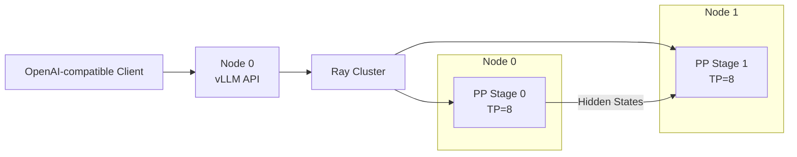

这一节不从“直接上 16 卡”开始。
分布式部署最可靠的方法是逐级增加复杂度：单卡能跑，单节点 TP 能跑，Ray 资源正确，最后才跨节点。
每一级都保留同一组请求和指标，这样出错时才知道是哪一层引入了变化。
<!-- more -->
## 📑 目录
- [1. 实验目标与拓扑](#1-实验目标与拓扑)
- [2. 固定版本并核对 CLI](#2-固定版本并核对-cli)
- [3. 建立单卡基线](#3-建立单卡基线)
- [4. 单节点 TP](#4-单节点-tp)
- [5. 两节点 Ray 集群](#5-两节点-ray-集群)
- [6. 多节点 TP×PP 服务](#6-多节点-tppp-服务)
- [7. 请求与正确性验证](#7-请求与正确性验证)
- [8. 显存、通信和性能验收](#8-显存通信和性能验收)
- [9. DP 与 EP 扩展示例](#9-dp-与-ep-扩展示例)
- [10. 故障排查 Runbook](#10-故障排查-runbook)
- [总结](#-总结)
- [自我检验清单](#-自我检验清单)
- [官方参考](#-官方参考)
---
## 1. 实验目标与拓扑
假设有两台同构服务器：
- Node 0：8×GPU，私网 IP `10.0.0.10`；Node 1：8×GPU，私网 IP `10.0.0.11`；节点内 NVLink/NVSwitch。
- 节点间 InfiniBand 或 RoCE；模型都位于 `/models/your-model`；两节点使用同一容器镜像。
目标配置：
$$
TP=8,\quad PP=2,\quad DP=1
$$
总 Worker GPU：
$$
8\times2\times1=16
$$

示例 IP、模型路径和端口必须替换为实际值。
---
## 2. 固定版本并核对 CLI
vLLM 的 stable 文档随发布滚动。
部署记录至少保存：
```bash
python --version
python -c "import vllm; print(vllm.__version__)"
python -c "import ray; print(ray.__version__)"
python -c "import torch; print(torch.__version__, torch.version.cuda)"
nvidia-smi
```
核对目标环境支持的参数：
```bash
vllm serve --help | less
```
本节会使用当前 stable 文档中的：
- `--tensor-parallel-size`；`--pipeline-parallel-size`；`--distributed-executor-backend ray`。
- `--data-parallel-size`；`--data-parallel-backend ray`；`--enable-expert-parallel`。
如果本机 `--help` 与网页不同，以安装版本的 CLI 与对应版本文档为准。
### 2.1 先做静态检查
在两节点分别执行：
```bash
nvidia-smi -L
nvidia-smi topo -m
test -d /models/your-model
```
确认：
- 每台确实看到 8 张 GPU；TP 组位于预期 NVLink 域；模型目录存在。
- 当前用户有读取权限。
---
## 3. 建立单卡基线
若目标模型单卡放不下，可以用同系列较小模型验证软件栈，再用目标模型从最小可行 TP 开始。单卡示例：
```bash
CUDA_VISIBLE_DEVICES=0 \
vllm serve Qwen/Qwen2.5-7B-Instruct \
  --host 0.0.0.0 \
  --port 8000 \
  --dtype auto
```
### 3.1 健康与模型检查
```bash
curl -fsS http://127.0.0.1:8000/health
curl -fsS http://127.0.0.1:8000/v1/models
```
### 3.2 发出固定请求
```bash
curl -sS http://127.0.0.1:8000/v1/chat/completions \
  -H 'Content-Type: application/json' \
  -d '{
    "model": "Qwen/Qwen2.5-7B-Instruct",
    "messages": [
      {"role": "user", "content": "用一句话解释张量并行。"}
    ],
    "temperature": 0,
    "max_tokens": 64
  }'
```
记录是否返回 200、首 Token 时间、总时长、输入/输出 Token 数、单卡显存、服务启动参数与日志。
这份记录是后续所有阶段的基线。
---
## 4. 单节点 TP
先在 Node 0 验证 8 卡 TP，排除跨节点因素。
```bash
CUDA_VISIBLE_DEVICES=0,1,2,3,4,5,6,7 \
vllm serve /models/your-model \
  --host 0.0.0.0 \
  --port 8000 \
  --tensor-parallel-size 8
```
单节点场景默认通常使用 multiprocessing；无需为了“统一”强行引入 Ray。
### 4.1 验证显存分布
```bash
watch -n 1 nvidia-smi
```
应观察到 8 张目标 GPU 都有 Worker 占用。
理想权重显存约为：
$$
M_{\text{weight per GPU}} \approx\frac{P\times b_w}{8}
$$
实际值会包含 KV Cache 与运行时，也可能有复制权重。
### 4.2 验证 API
将前一节的固定请求改成目标模型名，重复至少多次，排除首次编译、模型加载和 CUDA Graph Warm-up。
### 4.3 单节点失败时不要继续
如果 TP=8 在单节点失败，跨节点只会叠加更多变量。
先解决：
- 模型结构与 TP 整除；显存不足；量化 Kernel。
- 本地 NCCL/P2P；CUDA Graph；模型代码依赖。
---
## 5. 两节点 Ray 集群
确保没有需要保留的 Ray 作业后，再清理旧进程。
### 5.1 Node 0：Head
```bash
ray stop
ray start --head \
  --node-ip-address=10.0.0.10 \
  --port=6379
```
### 5.2 Node 1：Worker
```bash
ray stop
ray start \
  --address=10.0.0.10:6379 \
  --node-ip-address=10.0.0.11
```
### 5.3 Node 0：资源验收
```bash
ray status
```
确认两节点均为 Alive、总 GPU 数为 16；若资源不足，不要启动 vLLM。
---
## 6. 多节点 TP×PP 服务
在 Node 0 执行：
```bash
export NCCL_DEBUG=INFO
vllm serve /models/your-model \
  --host 0.0.0.0 \
  --port 8000 \
  --tensor-parallel-size 8 \
  --pipeline-parallel-size 2 \
  --distributed-executor-backend ray
```
当前 vLLM 官方建议的常见做法是：
- TP 等于每节点 GPU 数；PP 等于节点数。
这是适合本拓扑的起点，不是对所有机器的最优值保证。
### 6.1 启动日志要确认什么
- 识别到 16 张 GPU；Placement Group 不再 Pending；两节点都启动 Worker。
- 模型路径在远端可读；TP=8、PP=2 与预期一致；NCCL 选择了正确网卡/transport。
- 服务最终监听 8000 端口。
---
## 7. 请求与正确性验证
### 7.1 非流式请求
```bash
curl -sS http://10.0.0.10:8000/v1/completions \
  -H 'Content-Type: application/json' \
  -d '{
    "model": "/models/your-model",
    "prompt": "Tensor parallelism is",
    "temperature": 0,
    "max_tokens": 32
  }'
```
模型 ID 以 `/v1/models` 返回值为准。
### 7.2 流式请求
```bash
curl -N http://10.0.0.10:8000/v1/chat/completions \
  -H 'Content-Type: application/json' \
  -d '{
    "model": "/models/your-model",
    "messages": [
      {"role": "user", "content": "列出 TP 和 PP 的两个区别。"}
    ],
    "temperature": 0,
    "max_tokens": 128,
    "stream": true
  }'
```
观察：
- 第一个 `data:` 多久出现；后续 Token 是否平稳；是否中途断流。
- 两节点 GPU 是否同时工作。
### 7.3 正确性基线
使用：
- 相同模型文件；相同 Tokenizer；`temperature=0`。
- 相同 Prompt；相同最大输出长度。
浮点归约顺序可能带来细微差异。
重点检查：
- 输出不是乱码或重复死循环；API usage 合理；无 rank crash。
- 多次请求稳定；单节点与多节点语义一致。
---
## 8. 显存、通信和性能验收
### 8.1 显存
每节点：
```bash
nvidia-smi --query-gpu=index,memory.used,utilization.gpu \
  --format=csv
```
关注：
- 同一 TP 组显存是否大致接近；某个 Stage 是否因 Embedding/LM Head 更重；是否留有 KV Cache 余量。
- 是否接近 OOM 临界点。
### 8.2 通信
启动定位阶段可保留：
```bash
export NCCL_DEBUG=INFO
export NCCL_DEBUG_SUBSYS=INIT,NET,GRAPH
```
检查日志是否使用预期：
- 节点内 P2P/NVLink；节点间 IB/RoCE；正确的 Socket Interface。
- GDRDMA 或受支持路径。
稳定后降低日志级别。
### 8.3 性能
至少比较三组：
1. 单节点最小可行配置；
2. 单节点 TP=8；
3. 两节点 TP=8、PP=2。
固定：
- Prompt 长度分布；Output 长度分布；并发。
- 采样参数；模型与量化；Warm-up 次数。
记录：
- TTFT P50/P95/P99；TPOT P50/P95/P99；Request Throughput。
- Input/Output Token Throughput；错误率；每 GPU 利用率与显存。
### 8.4 计算扩展效率
若基线吞吐为 $Q_1$，目标配置使用 $n$ 倍 GPU，吞吐为 $Q_n$：
$$
E=\frac{Q_n}{nQ_1}
$$
但 PP 扩展常首先为了承载更大模型，不应只用吞吐线性度评判。
还要看它是否满足原本无法满足的容量和 SLO。
---
## 9. DP 与 EP 扩展示例
### 9.1 单节点 DP×TP
8 张 GPU，4 个副本，每副本 TP=2：
```bash
vllm serve /models/your-model \
  --data-parallel-size 4 \
  --tensor-parallel-size 2
```
适用于一个副本能在 2 卡装下、 目标是增加请求吞吐的情况。
### 9.2 Ray 管理 DP
已启动 Ray 集群时：
```bash
vllm serve /models/your-model \
  --data-parallel-size 4 \
  --data-parallel-size-local 2 \
  --data-parallel-backend ray
```
当前 stable 文档说明，Ray 后端可用单条命令启动本地和远端 DP ranks。
实际 GPU 数还取决于 TP/PP。
### 9.3 MoE 的 EP
```bash
vllm serve /models/your-moe-model \
  --data-parallel-size 16 \
  --tensor-parallel-size 1 \
  --enable-expert-parallel \
  --data-parallel-backend ray
```
这只是参数结构示例。
运行前必须核对：
- 模型确实是受支持的 MoE；当前版本 EP 分组语义；All-to-All 后端依赖。
- 16 张 GPU 的 Ray 资源；节点间网络是否足以承载 EP。
---
## 10. 故障排查 Runbook
### 10.1 Placement Group Pending
检查：
- 总 GPU 是否足够；GPU 是否被旧 Actor 占用；每节点资源是否注册。
- bundle 是否无法满足拓扑；旧 Ray 作业是否仍在。
### 10.2 远端找不到模型
检查 Node 1：
```bash
test -d /models/your-model
```
容器场景还要检查挂载路径是否一致。
### 10.3 NCCL timeout
先保留日志证据：
```bash
export NCCL_DEBUG=INFO
export NCCL_DEBUG_SUBSYS=INIT,NET,GRAPH
```
再检查：
- Head/Worker 私网地址；防火墙与端口；`NCCL_SOCKET_IFNAME`。
- IB/RoCE 状态；`/dev/shm`；GPU P2P 与 PCIe 拓扑。
- 所有 rank 是否同时存活。
### 10.4 能跑但性能差
做对照实验：
- TP=16、PP=1 与 TP=8、PP=2；单节点与多节点；小并发与目标并发。
- Prefill-heavy 与 Decode-heavy；默认 NCCL 与显式正确接口。
只改一个变量，否则无法归因。
### 10.5 OOM
区分发生阶段：
- 加载时 OOM：权重分片或峰值加载；KV 初始化 OOM：缓存预算过高；首请求 OOM：Graph/临时激活。
- 高并发 OOM：KV Cache 或并发配置。
处理方向：
- 增大 TP/PP；降低模型精度或使用量化；降低上下文/并发预算。
- 调整显存利用率参数；避免多个服务争抢同一 GPU。
---
## 📝 总结
- vLLM 分布式部署应从单卡、单节点 TP、Ray 资源到多节点逐级验证；每一级使用相同请求和指标，才能定位新增复杂度带来的问题；两节点各 8 卡的常见起点是 TP=8、PP=2，并由 Ray 放置 Worker。
- CLI 参数必须以本机 `vllm serve --help` 与对应版本文档复核；验收不止看 HTTP 200，还要看显存、Placement、NCCL transport、TTFT、TPOT 与吞吐；DP 用于复制吞吐副本，EP 用于 MoE 专家；不能只凭 GPU 数开启。
- 故障排查应区分资源、文件、控制面、NCCL、OOM 与性能问题。
## 🎯 自我检验清单
- 能解释为什么要先建立单卡或最小可行基线吗？
- 能用命令核对 vLLM、Ray、PyTorch 与 CUDA 版本吗？
- 能启动两节点 Ray 并确认 16 张逻辑 GPU 吗？
- 能写出 TP=8、PP=2 的 `vllm serve` 命令吗？
- 能用 `/health`、`/v1/models` 与固定请求验证服务吗？
- 能列出分布式性能验收的六项指标吗？
- 能区分 Placement Pending、NCCL timeout 与 OOM 吗？
- 能说明 `--data-parallel-size` 和 `--enable-expert-parallel` 的不同目标吗？
- 能解释为什么“能启动”不等于“扩展有效”吗？
## 📚 官方参考
- [vLLM：Parallelism and Scaling](https://docs.vllm.ai/en/stable/serving/parallelism_scaling/)
- [vLLM：Serve CLI](https://docs.vllm.ai/en/stable/cli/serve/)
- [vLLM：Data Parallel Deployment](https://docs.vllm.ai/en/stable/serving/data_parallel_deployment/)
- [vLLM：Expert Parallel Deployment](https://docs.vllm.ai/en/stable/serving/expert_parallel_deployment/)
- [Ray：Launching an On-Premise Cluster](https://docs.ray.io/en/latest/cluster/vms/user-guides/launching-clusters/on-premises.html)
- [NVIDIA NCCL：Troubleshooting](https://docs.nvidia.com/deeplearning/nccl/user-guide/docs/troubleshooting.html)
