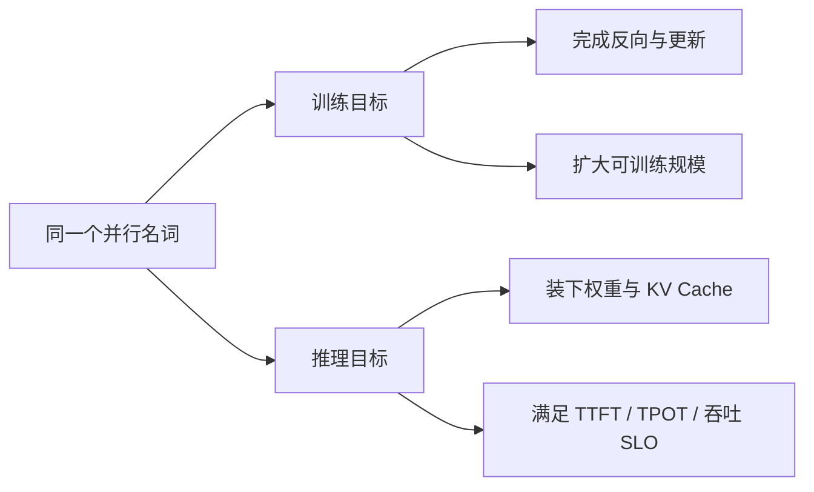
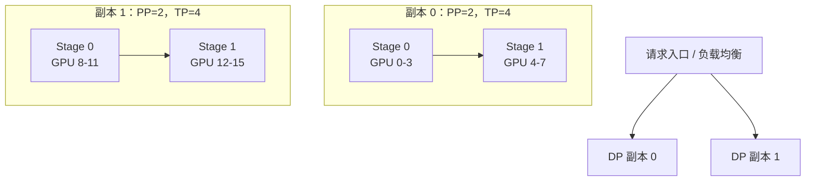
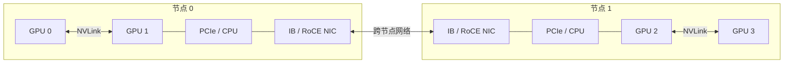
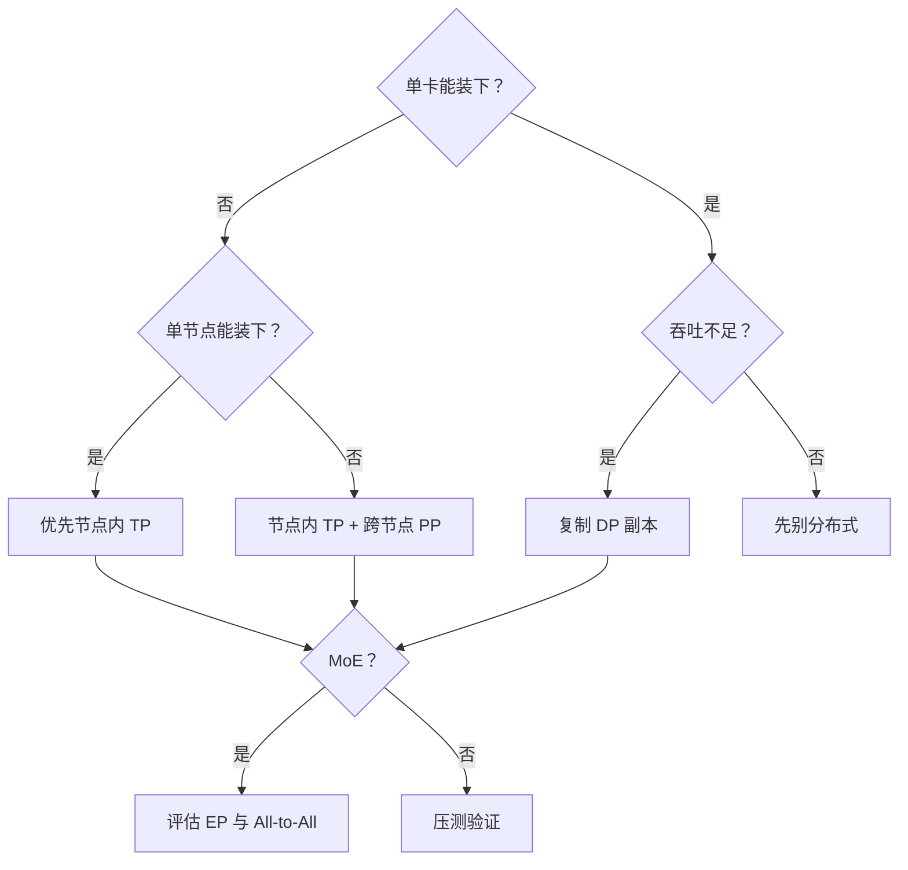

模型放不进一张 GPU，只是分布式推理最直观的起点。
真正上线后，你还会遇到另一类问题：
- 单个请求的出字速度不够快；
- 一张卡能装下模型，但扛不住并发；
- MoE 模型的专家权重很大，却不是每个 Token 都会访问；
- 节点内有 NVLink，节点间却只有普通以太网；
- GPU 都被 Ray 看见了，vLLM 仍然启动失败或越跑越慢。
本章不把“多卡”当成一个开关。
我们会从目标、显存、通信量和物理拓扑四个角度，逐步回答应该切什么、复制什么，以及通信应该发生在哪里。
<!-- more -->

## 📑 本章路线
- [6.1 推理并行策略总览](/AIInfraGuide/inference/模块四-推理优化/第6章-分布式推理/61-推理并行策略总览)
- [6.2 张量并行推理](/AIInfraGuide/inference/模块四-推理优化/第6章-分布式推理/62-张量并行推理)
- [6.3 流水线并行推理](/AIInfraGuide/inference/模块四-推理优化/第6章-分布式推理/63-流水线并行推理)
- [6.4 数据并行与专家并行](/AIInfraGuide/inference/模块四-推理优化/第6章-分布式推理/64-数据并行与专家并行)
- [6.5 多节点部署 Ray](/AIInfraGuide/inference/模块四-推理优化/第6章-分布式推理/65-多节点部署ray)
- [6.6 vLLM 分布式部署实战](/AIInfraGuide/inference/模块四-推理优化/第6章-分布式推理/66-vllm分布式部署实战)
---

## 1. 先把训练并行与推理并行分开
训练和推理可以使用同名的 TP、PP、DP、EP，但它们优化的目标并不相同。
训练要完成前向、反向和参数更新。
它通常要管理：
- 参数；
- 梯度；
- 优化器状态；
- 中间激活；
- 梯度同步与数值一致性。
推理只有前向，却多了一项会持续增长的状态：
**KV Cache**。
在线推理还要同时关心：
- TTFT：多久生成第一个 Token；
- TPOT：后续每个 Token 间隔多久；
- Throughput：单位时间处理多少 Token 或请求；
- Goodput：满足 SLO 的有效吞吐；
- 尾延迟：P95、P99 是否突然恶化。
所以，训练中的“扩大总 batch”不等于推理中的“降低延迟”。
训练 DP 会在每步反向后同步梯度；密集模型的推理 DP 通常只是复制多份独立引擎，请求之间不需要逐步 AllReduce。

📌 **本章约定**：除非明确写“训练”，所有公式都针对前向推理。
---

## 2. 分布式推理的四把刀
可以把一间大餐厅想成一个推理集群。
- **TP**：几位厨师共同做同一道菜的每一步；
- **PP**：前菜、主菜、甜点分到不同工位；
- **DP**：复制多套完整厨房，同时接不同订单；
- **EP**：每位专家厨师只负责自己擅长的菜系。
类比的重点不在“人多力量大”，而在于不同分工会产生不同的交接成本。
### 2.1 张量并行 TP
TP 把一层中的大矩阵切到多张卡。
好处是每张卡只保存部分权重，同一请求也能同时使用多卡算力。
代价是几乎每层都要集合通信。
因此 TP 最喜欢节点内高带宽的 NVLink / NVSwitch。
### 2.2 流水线并行 PP
PP 按层切模型。
一个 stage 算完激活后，把结果交给下一个 stage。
它的通信频率比 TP 低，更适合跨节点边界，但低并发时容易出现 stage 空闲。
### 2.3 数据并行 DP
DP 复制完整模型或完整 TP/PP 组。
不同副本处理不同请求，最适合模型已经能装下、目标是横向扩吞吐的场景。
它不会自动降低单请求延迟，并且每个副本都要再占一份权重显存。
### 2.4 专家并行 EP
EP 只适用于 MoE 的专家层。
不同 GPU 保存不同专家，Token 根据路由结果跨卡“找专家”。
它节省专家权重的单卡占用，代价是 All-to-All 和负载不均。
---

## 3. 一眼看懂组合关系
一个部署可以同时使用多种并行。
例如两台 8 卡服务器：
$$
\text{总 GPU 数} = DP \times PP \times TP
$$
若设置：
$$
DP=2,\quad PP=2,\quad TP=4
$$
则一份模型副本使用 $2\times4=8$ 张卡，整个集群放两份副本，总计使用 16 张卡。

对 MoE 来说，EP 还可能覆盖 $DP\times TP$ 形成的设备组。
具体含义依赖推理框架实现，不能只看四个缩写做乘法。
---

## 4. 第一张账单：显存
先做一个粗算。
一个 70B 参数模型以 BF16 加载：
$$
M_{\text{weight}} =70\times10^9\times2\text{ Bytes} \approx140\text{ GB}
$$
这还没有算 KV Cache、CUDA Graph、通信缓冲区和临时激活。
如果 TP=4，理想权重分片约为：
$$
140/4=35\text{ GB/GPU}
$$
但“35 GB 小于 40 GB”并不代表能上 40 GB GPU。
因为运行时还需要：
$$
M_{\text{GPU}} \approx M_{\text{weight shard}} +M_{\text{KV}} +M_{\text{runtime}} +M_{\text{headroom}}
$$
工程上必须给碎片和峰值留余量。
量化会改变每参数字节数，GQA/MQA 会显著减少 KV Cache，但都不能把运行时开销当成零。
---

## 5. 第二张账单：通信
分布式不是把显存除以 GPU 数就结束了。
粗略的时间模型是：
$$
T_{\text{step}} \approx T_{\text{compute}} +T_{\text{communication}} +T_{\text{schedule}} +T_{\text{idle}}
$$
TP 主要增加集合通信；PP 主要传 stage 间激活；EP 主要做 Token 的 All-to-All；DP 主要增加副本和负载均衡问题。
如果通信时间比省下的计算时间还长，加 GPU 反而会变慢。
这就是分布式推理最常见的“负扩展”。
---

## 6. 第三张账单：拓扑
带宽数字不能脱离拓扑看。
同一台服务器中可能同时存在：
- GPU 间 NVLink；
- GPU 经 PCIe Switch 互连；
- GPU 跨 CPU Socket；
- NIC 与某些 GPU 共用 PCIe Root Complex。
跨节点又可能是：
- InfiniBand；
- RoCE；
- 普通 TCP 以太网。

通常应把高频 TP 通信留在 NVLink 域内，把较低频的 PP 边界放到节点之间。
这是一条经验法则，不是硬性定律；最终仍需实测。
---

## 7. 本章的选型主线
从下面四个问题开始：
1. 单卡是否装得下模型和目标 KV Cache？
2. 单请求延迟是否已经满足 SLO？
3. 目标是提高并发，还是承载 MoE 专家？
4. 最慢通信边界在哪里？

选择不是一次性的。
模型、上下文长度、并发分布和网络一变，最佳并行策略也会变。
---

## 8. 学完本章你应该能做什么
你不需要背下所有 NCCL 环境变量。
但应该能：
- 区分训练与推理中的 DP；
- 手算权重和 KV Cache 的数量级；
- 估算 TP AllReduce 与 EP All-to-All 的流量；
- 解释为什么 TP 通常不跨慢网络；
- 用拓扑图决定 rank 放置；
- 判断 PP 的空泡和 stage 不均衡；
- 说清 DP 提吞吐但不直接降单请求延迟；
- 列出 Ray 多节点部署的前置条件；
- 用可复现命令启动并验证 vLLM；
- 按“资源、网络、集合通信、框架”分层排错。
---

## 📝 本章总结
- 推理并行优化的是显存、TTFT、TPOT、吞吐与 SLO，不是梯度同步。
- TP 切层内矩阵，通信频繁，适合高带宽域。
- PP 按层分 stage，适合跨节点，但要处理空泡和不均衡。
- DP 复制服务以扩吞吐，代价是重复权重和独立 KV Cache。
- EP 分散 MoE 专家，核心代价是 All-to-All 与热点专家。
- 并行度必须映射到真实的 NVLink、PCIe、IB/RoCE 拓扑。
- Ray 负责资源编排，不会替你修复驱动、网络或 NCCL。
- 所有理论选择最终都要在真实请求分布上压测。

## 🎯 自我检验清单
- 能否用一句话说明训练并行和推理并行目标为何不同？
- 能否解释 TP、PP、DP、EP 各自切分或复制了什么？
- 能否写出 `总 GPU = DP × PP × TP` 的适用前提？
- 能否说出权重显存之外至少三项显存开销？
- 能否指出 TP 与 PP 分别主要传什么数据？
- 能否解释为什么 GPU 数增加可能导致性能下降？
- 能否根据节点内外带宽给出初步 rank 映射？
- 能否说明 MoE 才需要重点考虑 EP？
- 能否把“能启动”和“扩展有效”当成两个验收目标？

## 📚 官方参考
- [vLLM：Parallelism and Scaling](https://docs.vllm.ai/en/stable/serving/parallelism_scaling/)
- [vLLM：Data Parallel Deployment](https://docs.vllm.ai/en/stable/serving/data_parallel_deployment/)
- [vLLM：Expert Parallel Deployment](https://docs.vllm.ai/en/stable/serving/expert_parallel_deployment/)
- [Ray：Cluster Key Concepts](https://docs.ray.io/en/latest/cluster/key-concepts.html)
- [NVIDIA NCCL：Overview](https://docs.nvidia.com/deeplearning/nccl/user-guide/docs/overview.html)
