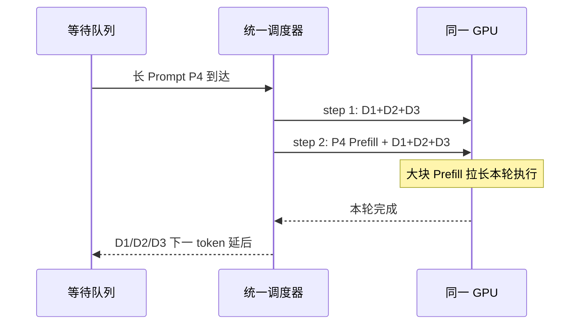

## 📑 本节目标

这一节只回答一个问题：
**既然 Continuous Batching 已经能把请求动态塞进批次，为什么还要考虑 P/D 解耦？**

学完后你应能：

- 区分 Prefill 和 Decode 的主要瓶颈。
- 读懂混合批次的一次迭代发生了什么。
- 解释平均吞吐提高但流式体验变差的现象。
- 用 TTFT、TPOT、ITL 的分位数验证干扰。
- 说清 Chunked Prefill 能缓和什么、不能保证什么。

## 1. 从餐厅类比开始

想象一间只有一个灶台的餐厅。

Prefill 像一次性为一桌大宴席集中备菜：
食材很多，可以把砧板、锅具和厨师的并行能力充分用起来。

Decode 像已经开席后逐桌上一小碟菜：
每次工作量不大，但顾客期待稳定、连续地看到下一碟。

如果一份 8K token 的“备菜单”突然占住灶台，
正在等待下一碟的几十桌客人就会同时停顿。
厨房全天完成的菜品总数也许没有下降，
但顾客会感觉服务“卡了一下”。

这就是吞吐量与交互延迟之间的差别。

## 2. 一次请求的两个阶段

### 2.1 Prefill 做什么

Prefill 一次读入 Prompt 的全部或一大块 token。
模型对这些 token 执行各层前向计算，
并为每层生成后续 Decode 所需的 Key 和 Value。

对长度为 \(L\) 的 Prompt，经典全注意力计算量会随 \(L\) 增长得很快。
在现代 GPU 上，大矩阵乘法通常能形成较高并行度。
因此 Prefill 常被概括为 **compute-bound 倾向**。

“倾向”二字很重要。
短 Prompt、小 Batch、量化 Kernel 或不同模型结构都可能改变瓶颈，
不能仅凭阶段名字断言 GPU 一定算力满载。

### 2.2 Decode 做什么

Decode 每一步通常只为每个活跃序列产生一个新 token。
它仍需读取模型权重，
并读取该序列不断增长的 KV Cache。

单步矩阵形状较“瘦”，
算术强度通常低于大 Prefill。
在许多常见部署中，Decode 更容易受 HBM 带宽限制，
因此常被概括为 **memory-bound 倾向**。

Decode 的关键不是一次做得多，
而是每一步都及时完成。

### 2.3 用户看到的指标

设请求到达时间为 \(t_0\)，
首 token 返回时间为 \(t_1\)，
最后一个 token 返回时间为 \(t_n\)。

\[
TTFT = t_1 - t_0
\]

若输出 token 数为 \(N_{out}\)，常用平均 TPOT 为：

\[
TPOT = \frac{t_n - t_1}{N_{out}-1}
\]

相邻 token 的间隔称为 ITL：

\[
ITL_i = t_i - t_{i-1}
\]

TPOT 是一段输出的平均节奏，
ITL 分布则能暴露某一个 token 突然卡顿。
分析 P/D 干扰时，P95/P99 ITL 往往比均值更敏感。

上述等式假设一次流式 Chunk 只包含一个 Token。投机解码可能一次返回多个 Token，此时压测工具记录的相邻 Chunk 间隔不等于逐 Token ITL；应同时记录 Chunk 大小，并用实际输出 Token 数计算 token-normalized TPOT。

## 3. 混合批次里发生了什么

Continuous Batching 允许请求在迭代边界进入和退出。
假设当前已有三个请求在 Decode，
此时一个长 Prompt 到达。



统一批次并不意味着 Kernel 可以神奇地同时满足两类目标。
调度器仍要在有限 token budget、显存和执行时间中取舍。

如果把长 Prompt 整体放入一轮，
该轮会变得很长。
如果把 Prompt 切成小块，
Decode 可更频繁地获得执行机会，
但 Prefill 完成时间、调度开销和整体吞吐又可能变化。

## 4. 干扰不只有“抢算力”

### 4.1 迭代时间被拉长

流式 Decode 通常在一次模型迭代后才能返回下一 token。
混入大 Prefill 后，单次迭代时间增加，
所有同批 Decode 请求都会一起等待。

### 4.2 Batch 形状改变

Prefill 是多 token 序列块，
Decode 是多个序列各一个 token。
两者混合会形成不规则输入形状，
影响 Kernel 选择、CUDA Graph 命中和执行效率。

### 4.3 KV Cache 压力增加

新 Prompt 在短时间内写入大量 KV。
Decode 请求则持续读旧 KV、追加少量新 KV。
两类访问混在同一显存空间，
会争用容量与带宽，也可能触发抢占或重计算。

### 4.4 调度目标冲突

尽快调度 Prefill 有利于降低新请求 TTFT。
优先 Decode 有利于稳定已有请求 TPOT。
一套队列很难在高负载下同时把两者的尾延迟压低。

### 4.5 并行方案被绑定

如果 Prefill 需要较高 Tensor Parallel 度来缩短 TTFT，
而 Decode 更适合较小 TP、多副本提高并发，
共置实例只能选同一个模型并行布局。

这种绑定是 DistServe 强调的另一类损失：
不仅有瞬时干扰，还有资源配置耦合。

## 5. 一个简化时间线手算

假设没有新 Prefill 时， Decode 每步耗时 25 ms。 某请求还需生成 8 个 token。

理想剩余生成时间约为：

\[
8 \times 25\text{ ms}=200\text{ ms}
\]

现在第 3 步混入一个未切块的长 Prefill， 该混合步耗时 225 ms， 其余 7 步仍为 25 ms。

总时间变为：

\[
7 \times 25 + 225 = 400\text{ ms}
\]

平均每步从 25 ms 变成 50 ms。 更值得注意的是， 其中一次 ITL 接近 225 ms， 用户会看到明显停顿。

这不是通用性能数字， 只是帮助理解尾延迟传播的教学算例。 真实数值必须在目标模型、GPU、并发和调度参数上测量。

## 6. Chunked Prefill：先切小块

Chunked Prefill 把一个长 Prompt 切成多个 token chunk。 调度器可在相邻 chunk 之间插入 Decode 工作。

类比上，它把“一次占灶台 20 分钟”改成“四次各 5 分钟”， 让出餐有机会穿插。

```mermaid
gantt
    title 未切块与切块的示意时间线
    dateFormat X
    axisFormat %L
    section 未切块
    Decode :0, 1
    Long Prefill :1, 6
    Decode :6, 7
    section 切块
    P chunk 1 :0, 1
    Decode :1, 2
    P chunk 2 :2, 3
    Decode :3, 4
    P chunk 3 :4, 5
    Decode :5, 6
```



它通常是尝试解耦前的重要基线， 因为不引入跨实例 KV 传输与双份模型权重。

但它不是严格隔离：

- P 与 D 仍共享 GPU 和 HBM。
- chunk 太大会继续制造长迭代。
- chunk 太小会增加调度和 Kernel 开销。
- 高 Prompt 到达率下，多个 chunk 仍可能挤压 Decode。
- P/D 仍被同一并行布局和扩缩容单元绑定。

因此正确问题不是“Chunked Prefill 还是 P/D 解耦谁更先进”， 而是“在目标负载和 SLO 下，最小复杂度方案是否已经够用”。

## 7. 可复现的干扰实验

下面给出教学骨架。 命令参数以当前 `vllm bench serve --help` 为准， 先在测试环境确认版本，不要把示例直接复制到生产。

### 7.1 启动单实例

```bash
vllm serve Qwen/Qwen2.5-7B-Instruct \
  --host 0.0.0.0 \
  --port 8000 \
  --max-model-len 16384 \
  --enable-chunked-prefill \
  --max-num-batched-tokens 2048
```

### 7.2 建立短 Prompt 基线

```bash
vllm bench serve \
  --backend openai-chat \
  --base-url http://127.0.0.1:8000 \
  --endpoint /v1/chat/completions \
  --model Qwen/Qwen2.5-7B-Instruct \
  --dataset-name random \
  --random-input-len 128 \
  --random-output-len 256 \
  --num-prompts 300 \
  --request-rate 4 \
  --percentile-metrics ttft,tpot,itl \
  --metric-percentiles 50,95,99 \
  --save-result
```

### 7.3 注入长 Prompt

保持同一服务和短请求流， 另开一个终端周期性提交 8K 或 16K Prompt。 若本版本 benchmark 不支持直接混合长度， 可分别生成两份请求文件，再用小脚本按时间戳发送。

记录每个请求的：

- 输入与输出 token 数。
- 到达时间和首 token 时间。
- 每个输出 token 的时间戳。
- 当时活跃序列数。
- GPU 利用率、显存带宽近似指标和 KV 使用率。

### 7.4 对照组

至少比较三组：

1. 只有短 Prompt 的 Decode 稳态。
2. 长 Prompt 整体进入或使用较大 chunk。
3. 使用更小 chunk 的混合流量。

每组先预热， 再在相同到达率、随机种子和持续时间下运行。 不要把一次冷启动结果当成稳态结论。

## 8. 怎样读结果

若吞吐基本不变但 P99 ITL 明显升高， 说明 GPU 总工作量没有失控， 却出现了用户可感知的瞬时阻塞。

若 TTFT 和 TPOT 同时恶化， 通常已接近或超过排队拐点。 此时仅调整 chunk 大小可能是在重新分配拥塞， 不一定能恢复两个 SLO。

若小 chunk 已满足 SLO， 继续上 P/D 解耦可能得不偿失。 解耦会复制模型权重、占用额外 GPU， 并引入 KV 传输和控制面。

若 Prompt 很长、到达波动大， 且 Decode P99 必须稳定， 物理隔离才更可能体现价值。

## 9. 常见误区与边界

### 误区一：Prefill 永远 compute-bound

这是有用的第一近似，不是硬件定律。 应通过 profiler 和 Roofline 证据确认。

### 误区二：平均 TPOT 足够

一次长停顿可能被后续快速 token 平均掉。 必须同时看 ITL 分布和时间线。

### 误区三：吞吐越高，用户体验越好

超载时系统仍可完成很多请求， 但大量请求已违反 TTFT 或 TPOT SLO。 下一节会用 Goodput 修正这个问题。

### 误区四：解耦自动降低 TTFT

Prefill 排队可能下降， 但 KV 传输和 D 池排队会增加交接延迟。 端到端收益取决于整个临界路径。

### 误区五：论文倍数可直接搬到业务

论文结果绑定模型、硬件、输入输出分布和 SLO。 可借鉴机制，不能把倍数当容量承诺。

## 📝 总结

1. Prefill 倾向计算密集，Decode 倾向显存带宽密集，两者优化目标不同。
2. 混合 Batching 提高 GPU 利用率，却会让长 Prefill 拉长 Decode 迭代。
3. P95/P99 ITL 能揭示平均 TPOT 隐藏的流式停顿。
4. Chunked Prefill 是低复杂度的重要缓解方案，但不提供资源和故障隔离。
5. 是否解耦必须由同负载、同 SLO 的对照压测决定。

## 🎯 自我检验

- [ ] 我能解释 TTFT、TPOT、ITL 分别观察哪个阶段。
- [ ] 我能画出长 Prefill 插入 Decode 批次后的时间线。
- [ ] 我知道 compute-bound / memory-bound 是倾向而非绝对结论。
- [ ] 我能说明 Chunked Prefill 的收益和至少三个边界。
- [ ] 我会比较均值、P95 和 P99，而不是只报告 token/s。
- [ ] 我能设计短 Prompt 基线与长 Prompt 注入对照组。

## 📚 论文与官方参考

- [DistServe: Disaggregating Prefill and Decoding for Goodput-optimized LLM Serving（OSDI 2024）](https://www.usenix.org/conference/osdi24/presentation/zhong-yinmin)
- [Splitwise: Efficient Generative LLM Inference Using Phase Splitting（ISCA 2024）](https://www.microsoft.com/en-us/research/publication/splitwise-efficient-generative-llm-inference-using-phase-splitting/)
- [Sarathi-Serve: Taming Throughput-Latency Tradeoff in LLM Inference](https://arxiv.org/abs/2403.02310)
- [vLLM 文档：Optimization and Tuning](https://docs.vllm.ai/en/stable/configuration/optimization/)
- [vLLM 文档：vllm bench serve](https://docs.vllm.ai/en/stable/cli/bench/serve/)
