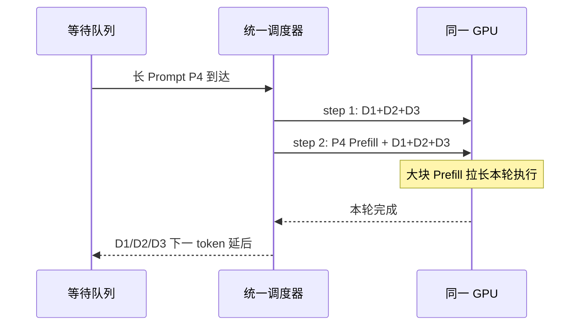

## 📑 本节目标

这一节只回答一个问题：
**既然 Continuous Batching 已经能把请求动态塞进批次，为什么还要考虑 P/D 解耦？**

学完后你应能：

- 区分 Prefill 和 Decode 的主要瓶颈。
- 读懂混合批次的一次迭代发生了什么。
- 解释平均吞吐提高但流式体验变差的现象。
- 用 TTFT、TPOT、ITL 的分位数验证干扰。
- 说清 Chunked Prefill 能缓和什么、不能保证什么。

## 1. 从餐厅类比开始

想象一间只有一个灶台的餐厅。

Prefill 像一次性为一桌大宴席集中备菜：
食材很多，可以把砧板、锅具和厨师的并行能力充分用起来。

Decode 像已经开席后逐桌上一小碟菜：
每次工作量不大，但顾客期待稳定、连续地看到下一碟。

如果一份 8K token 的“备菜单”突然占住灶台，
正在等待下一碟的几十桌客人就会同时停顿。
厨房全天完成的菜品总数也许没有下降，
但顾客会感觉服务“卡了一下”。

这就是吞吐量与交互延迟之间的差别。

## 2. 一次请求的两个阶段

### 2.1 Prefill 做什么

Prefill 一次读入 Prompt 的全部或一大块 token。
模型对这些 token 执行各层前向计算，
并为每层生成后续 Decode 所需的 Key 和 Value。

对长度为 \(L\) 的 Prompt，经典全注意力计算量会随 \(L\) 增长得很快。
在现代 GPU 上，大矩阵乘法通常能形成较高并行度。
因此 Prefill 常被概括为 **compute-bound 倾向**。

“倾向”二字很重要。
短 Prompt、小 Batch、量化 Kernel 或不同模型结构都可能改变瓶颈，
不能仅凭阶段名字断言 GPU 一定算力满载。

### 2.2 Decode 做什么

Decode 每一步通常只为每个活跃序列产生一个新 token。
它仍需读取模型权重，
并读取该序列不断增长的 KV Cache。

单步矩阵形状较“瘦”，
算术强度通常低于大 Prefill。
在许多常见部署中，Decode 更容易受 HBM 带宽限制，
因此常被概括为 **memory-bound 倾向**。

Decode 的关键不是一次做得多，
而是每一步都及时完成。

### 2.3 用户看到的指标

设请求到达时间为 \(t_0\)，
首 token 返回时间为 \(t_1\)，
最后一个 token 返回时间为 \(t_n\)。

\[
TTFT = t_1 - t_0
\]

若输出 token 数为 \(N_{out}\)，常用平均 TPOT 为：

\[
TPOT = \frac{t_n - t_1}{N_{out}-1}
\]

相邻 token 的间隔称为 ITL：

\[
ITL_i = t_i - t_{i-1}
\]

TPOT 是一段输出的平均节奏，
ITL 分布则能暴露某一个 token 突然卡顿。
分析 P/D 干扰时，P95/P99 ITL 往往比均值更敏感。

上述等式假设一次流式 Chunk 只包含一个 Token。投机解码可能一次返回多个 Token，此时压测工具记录的相邻 Chunk 间隔不等于逐 Token ITL；应同时记录 Chunk 大小，并用实际输出 Token 数计算 token-normalized TPOT。

## 3. 混合批次里发生了什么

Continuous Batching 允许请求在迭代边界进入和退出。
假设当前已有三个请求在 Decode，
此时一个长 Prompt 到达。



统一批次并不意味着 Kernel 可以神奇地同时满足两类目标。
调度器仍要在有限 token budget、显存和执行时间中取舍。

如果把长 Prompt 整体放入一轮，
该轮会变得很长。
如果把 Prompt 切成小块，
Decode 可更频繁地获得执行机会，
但 Prefill 完成时间、调度开销和整体吞吐又可能变化。

## 4. 干扰不只有“抢算力”

### 4.1 迭代时间被拉长

流式 Decode 通常在一次模型迭代后才能返回下一 token。
混入大 Prefill 后，单次迭代时间增加，
所有同批 Decode 请求都会一起等待。

### 4.2 Batch 形状改变

Prefill 是多 token 序列块，
Decode 是多个序列各一个 token。
两者混合会形成不规则输入形状，
影响 Kernel 选择、CUDA Graph 命中和执行效率。

### 4.3 KV Cache 压力增加

新 Prompt 在短时间内写入大量 KV。
Decode 请求则持续读旧 KV、追加少量新 KV。
两类访问混在同一显存空间，
会争用容量与带宽，也可能触发抢占或重计算。

### 4.4 调度目标冲突

尽快调度 Prefill 有利于降低新请求 TTFT。
优先 Decode 有利于稳定已有请求 TPOT。
一套队列很难在高负载下同时把两者的尾延迟压低。

### 4.5 并行方案被绑定

如果 Prefill 需要较高 Tensor Parallel 度来缩短 TTFT，
而 Decode 更适合较小 TP、多副本提高并发，
共置实例只能选同一个模型并行布局。

这种绑定是 DistServe 强调的另一类损失：
不仅有瞬时干扰，还有资源配置耦合。

## 5. 一个简化时间线手算

假设没有新 Prefill 时， Decode 每步耗时 25 ms。 某请求还需生成 8 个 token。

理想剩余生成时间约为：

\[
8 \times 25\text{ ms}=200\text{ ms}
\]

现在第 3 步混入一个未切块的长 Prefill， 该混合步耗时 225 ms， 其余 7 步仍为 25 ms。

总时间变为：

\[
7 \times 25 + 225 = 400\text{ ms}
\]

平均每步从 25 ms 变成 50 ms。 更值得注意的是， 其中一次 ITL 接近 225 ms， 用户会看到明显停顿。

这不是通用性能数字， 只是帮助理解尾延迟传播的教学算例。 真实数值必须在目标模型、GPU、并发和调度参数上测量。

## 6. Chunked Prefill：先切小块

Chunked Prefill 把一个长 Prompt 切成多个 token chunk。 调度器可在相邻 chunk 之间插入 Decode 工作。

类比上，它把“一次占灶台 20 分钟”改成“四次各 5 分钟”， 让出餐有机会穿插。

```mermaid
gantt
    title 未切块与切块的示意时间线
    dateFormat X
    axisFormat %L
    section 未切块
    Decode :0, 1
    Long Prefill :1, 6
    Decode :6, 7
    section 切块
    P chunk 1 :0, 1
    Decode :1, 2
    P chunk 2 :2, 3
    Decode :3, 4
    P chunk 3 :4, 5
    Decode :5, 6
```



它通常是尝试解耦前的重要基线， 因为不引入跨实例 KV 传输与双份模型权重。

但它不是严格隔离：

- P 与 D 仍共享 GPU 和 HBM。
- chunk 太大会继续制造长迭代。
- chunk 太小会增加调度和 Kernel 开销。
- 高 Prompt 到达率下，多个 chunk 仍可能挤压 Decode。
- P/D 仍被同一并行布局和扩缩容单元绑定。

因此正确问题不是“Chunked Prefill 还是 P/D 解耦谁更先进”， 而是“在目标负载和 SLO 下，最小复杂度方案是否已经够用”。

## 7. 可复现的干扰实验

下面给出教学骨架。 命令参数以当前 `vllm bench serve --help` 为准， 先在测试环境确认版本，不要把示例直接复制到生产。

### 7.1 启动单实例

```bash
vllm serve Qwen/Qwen2.5-7B-Instruct \
  --host 0.0.0.0 \
  --port 8000 \
  --max-model-len 16384 \
  --enable-chunked-prefill \
  --max-num-batched-tokens 2048
```

### 7.2 建立短 Prompt 基线

```bash
vllm bench serve \
  --backend openai-chat \
  --base-url http://127.0.0.1:8000 \
  --endpoint /v1/chat/completions \
  --model Qwen/Qwen2.5-7B-Instruct \
  --dataset-name random \
  --random-input-len 128 \
  --random-output-len 256 \
  --num-prompts 300 \
  --request-rate 4 \
  --percentile-metrics ttft,tpot,itl \
  --metric-percentiles 50,95,99 \
  --save-result
```

### 7.3 注入长 Prompt

保持同一服务和短请求流， 另开一个终端周期性提交 8K 或 16K Prompt。 若本版本 benchmark 不支持直接混合长度， 可分别生成两份请求文件，再用小脚本按时间戳发送。

记录每个请求的：

- 输入与输出 token 数。
- 到达时间和首 token 时间。
- 每个输出 token 的时间戳。
- 当时活跃序列数。
- GPU 利用率、显存带宽近似指标和 KV 使用率。

### 7.4 对照组

至少比较三组：

1. 只有短 Prompt 的 Decode 稳态。
2. 长 Prompt 整体进入或使用较大 chunk。
3. 使用更小 chunk 的混合流量。

每组先预热， 再在相同到达率、随机种子和持续时间下运行。 不要把一次冷启动结果当成稳态结论。

## 8. 怎样读结果

若吞吐基本不变但 P99 ITL 明显升高， 说明 GPU 总工作量没有失控， 却出现了用户可感知的瞬时阻塞。

若 TTFT 和 TPOT 同时恶化， 通常已接近或超过排队拐点。 此时仅调整 chunk 大小可能是在重新分配拥塞， 不一定能恢复两个 SLO。

若小 chunk 已满足 SLO， 继续上 P/D 解耦可能得不偿失。 解耦会复制模型权重、占用额外 GPU， 并引入 KV 传输和控制面。

若 Prompt 很长、到达波动大， 且 Decode P99 必须稳定， 物理隔离才更可能体现价值。

## 9. 常见误区与边界

### 误区一：Prefill 永远 compute-bound

这是有用的第一近似，不是硬件定律。 应通过 profiler 和 Roofline 证据确认。

### 误区二：平均 TPOT 足够

一次长停顿可能被后续快速 token 平均掉。 必须同时看 ITL 分布和时间线。

### 误区三：吞吐越高，用户体验越好

超载时系统仍可完成很多请求， 但大量请求已违反 TTFT 或 TPOT SLO。 下一节会用 Goodput 修正这个问题。

### 误区四：解耦自动降低 TTFT

Prefill 排队可能下降， 但 KV 传输和 D 池排队会增加交接延迟。 端到端收益取决于整个临界路径。

### 误区五：论文倍数可直接搬到业务

论文结果绑定模型、硬件、输入输出分布和 SLO。 可借鉴机制，不能把倍数当容量承诺。

## 10. 用“轮次时间线”定量拆开一次干扰

前面的 225 ms 算例说明了现象，但还没有解释这个延迟怎样传播给同批的每个 Decode 请求。下面把调度器的一个 iteration 写成三部分：

\[
T_{iter}=T_{schedule}+T_{model}(B_D,C_P)+T_{sample}
\]

其中：

- \(B_D\) 是本轮 Decode 序列数，每条序列贡献 1 个新 token。
- \(C_P\) 是本轮 Prefill token 数；纯 Decode 时 \(C_P=0\)。
- \(T_{schedule}\) 包括构造 batch、block table 和元数据准备。
- \(T_{model}\) 包括 Attention、MLP、collective 与必要的内存访问。
- \(T_{sample}\) 包括 logits processor、采样和结果回传。

对某条正在 Decode 的请求 \(r\)，只要它每轮最多生成一个 token，它的第 \(j\) 个相邻 token 间隔近似为：

\[
ITL_{r,j}\approx W_{r,j}+T_{iter,j}+T_{stream,j}
\]

\(W_{r,j}\) 是请求在本轮被选中之前的等待。若调度器每轮都保留所有 Decode 请求，\(W\) 很小，ITL 主要由本轮执行时间决定；若 token budget、抢占或优先级让请求跳过一轮，\(W\) 还会包含一个或多个完整 iteration。

### 10.1 逐毫秒时间线

假设纯 Decode 稳态为 24 条序列，每轮 24 ms。时刻 48 ms 到达一个 4096-token Prompt，调度器下一轮将其中 2048 token 与 Decode 混合：

```text
墙钟时间      调度内容                         24 条旧请求收到 token 的时刻
0–24 ms       D(24)                            24 ms
24–48 ms      D(24)                            48 ms
48–54 ms      调度 + KV block 分配             无
54–174 ms     P(2048) + D(24) 混合前向         无
174–180 ms    采样 + 回传                      180 ms
180–204 ms    D(24)                            204 ms
```

对旧请求而言，token 时间戳是 `24, 48, 180, 204 ms`，所以：

```text
ITL = 24, 132, 24 ms
```

不是只有新 Prompt 的 TTFT 受影响；同批 24 条流式请求各产生一次约 132 ms 的 stall。若看“本轮生成 token 总数”，系统仍产出了 24 个 Decode token；若只看 1 秒窗口的平均输出吞吐，这次停顿还可能被前后快速 iteration 稀释。

### 10.2 Chunk 大小怎样换延迟

将 2048-token Prefill 切成 4 个 512-token chunk。假设每个混合 iteration 为 48 ms，四个 chunk 之间都允许 Decode：

```text
轮次           1       2       3       4
工作           P512+D  P512+D  P512+D  P512+D
轮次时间       48 ms   48 ms   48 ms   48 ms
旧请求 ITL     48 ms   48 ms   48 ms   48 ms
```

尾部 ITL 从 132 ms 降到约 48 ms，但 Prefill 占用的可见总时间变为：

\[
4\times48=192\text{ ms}
\]

它可能高于大 chunk 的 126 ms，因为小矩阵效率、重复调度、采样边界和 Kernel launch 开销更差。Chunked Prefill 的本质是把“一次大阻塞”变成“多次小阻塞”，并不保证总工作量或 TTFT 一定下降。

### 10.3 多个长 Prompt 会重新形成拥塞

若长 Prompt 到达率为 \(\lambda_L=3\) req/s，每个 Prompt 有 4096 token，则 Prefill 输入流量为：

\[
\lambda_{tok,P}=3\times4096=12288\text{ token/s}
\]

假设在保护 Decode 的 chunk 配置下，实例只能稳定消化 10,000 Prefill token/s，则 Prefill 队列工作量每秒净增长：

\[
12288-10000=2288\text{ token/s}
\]

即使每个 chunk 都很小，等待队列仍会持续增长。此时小 chunk 只限制单次 ITL 抖动，无法修复长期不稳定。

## 11. 用排队模型解释“为什么尾延迟先坏”

真实 continuous batching 不是严格 M/G/1，但 M/G/1 的 Pollaczek–Khinchine 公式能给出有用方向：

\[
E[W_q]=\frac{\lambda E[S^2]}{2(1-\rho)}
\]

\[
\rho=\lambda E[S]
\]

这里把一次 iteration 看作服务，\(S\) 是 iteration 时间。两个因素会放大等待：

1. \(\rho\) 接近 1，分母趋近 0。
2. 长 Prefill 让 \(E[S^2]\) 增长；平方项对少量长服务极其敏感。

### 11.1 手算：均值只涨一点，等待涨很多

纯 Decode 时，假设 iteration 恒为 25 ms：

\[
E[S]=0.025,\quad E[S^2]=0.000625
\]

每秒到达并形成 30 个“轮次工作单元”，则：

\[
\rho=30\times0.025=0.75
\]

\[
E[W_q]=\frac{30\times0.000625}{2(1-0.75)}
=0.0375\text{ s}=37.5\text{ ms}
\]

现在 90% iteration 仍是 25 ms，10% 因 Prefill 变为 125 ms：

\[
E[S]=0.9\times0.025+0.1\times0.125=0.035\text{ s}
\]

到达率若仍为 20/s：

\[
\rho=20\times0.035=0.70
\]

均值利用率甚至略低于上例，但二阶矩为：

\[
E[S^2]
=0.9\times0.025^2+0.1\times0.125^2
=0.002125
\]

\[
E[W_q]
=\frac{20\times0.002125}{2(1-0.70)}
\approx70.8\text{ ms}
\]

服务时间均值从 25 ms 增至 35 ms，二阶矩却增至 3.4 倍，平均排队等待接近翻倍。尾部等待会更敏感。这正是“少量长 Prefill 先打坏 P99 ITL”的排队论解释。

### 11.2 残余服务时间

随机到达的 Decode 请求可能撞上一轮已经开始的 Prefill。它平均看到的残余服务时间为：

\[
E[R]=\frac{E[S^2]}{2E[S]}
\]

纯 25 ms iteration 时：

\[
E[R]=12.5\text{ ms}
\]

采用上面的混合分布时：

\[
E[R]=\frac{0.002125}{2\times0.035}\approx30.4\text{ ms}
\]

长轮次占比只有 10%，随机请求看到的平均残余时间却增至约 2.4 倍。原因不是调度器“偏心”，而是随机观察更容易落在长区间内，这就是 inspection paradox。

### 11.3 模型不能替代实测

这个 M/G/1 近似忽略了：

- 一轮同时服务多条 Decode 序列。
- Prefill token budget 会改变服务批量。
- KV 容量不足会抢占和重算。
- CUDA Graph 命中会让服务时间呈多峰分布。
- Prefix Cache 命中改变有效 Prefill 长度。
- 投机解码一轮可能产出多个 token。

因此它用于解释方向和做容量预警，不应用来替代实际负载扫描。

## 12. 从 Kernel 资源冲突到请求指标

### 12.1 计算与带宽不是互补拼图

“P compute-bound、D memory-bound”不意味着把二者混合就能免费重叠。一次模型前向中的 Kernel 通常仍按 stream 与依赖关系执行，并共同争用：

- SM 与 Tensor Core。
- HBM 读写带宽。
- L2 cache。
- workspace 与 KV block。
- TP collective 使用的 NVLink/PCIe。
- CUDA launch 与 graph replay 路径。

若混合 batch 触发不同 Kernel 形状，原来稳定的 Decode CUDA Graph 还可能失配或回退到 eager 路径。

### 12.2 KV 写突发

Prefill 为 \(C_P\) 个 token 生成 KV，单轮 KV 写入量为：

\[
W_{KV}=C_P\times Bytes_{KV/token}
\]

若模型每 token KV 为 128 KiB，chunk 为 2048 token：

\[
W_{KV}=2048\times128\text{ KiB}=256\text{ MiB}
\]

这 256 MiB 只是 KV 写入主体，还不含模型权重读取、激活和 Attention 中间量。同轮 Decode 还要读取已有 KV 并追加新 token，因而“Prefill 用算力、Decode 用带宽”只是第一近似。

### 12.3 请求指标映射

```text
现象                         最可能受影响指标
Prefill 排队                 新请求 TTFT
混合 iteration 拉长          旧请求 ITL / TPOT
KV block 紧张与抢占          TTFT、TPOT、错误率
小 chunk 调度开销            Prefill service time、TTFT
超载后队列持续增长           TTFT/TPOT/E2E 全部恶化
偶发 CUDA Graph 回退         ITL 多峰或长尾
```

## 13. 实现层：应记录什么而不是只开一个开关

### 13.1 每轮记录

建议从引擎统计或 trace 中得到：

```text
iteration_start / iteration_end
num_decode_sequences
num_decode_tokens
num_prefill_sequences
num_prefill_tokens
scheduled_tokens
kv_blocks_used / kv_blocks_free
preemptions / recomputations
cuda_graph_mode_or_shape
```

用这些字段可画出：

\[
T_{iter}\ \text{vs.}\ C_P
\]

以及条件分布：

\[
P(ITL>x\mid C_P=0)
\quad\text{和}\quad
P(ITL>x\mid C_P>0)
\]

若第二条曲线显著右移，才能把 ITL 抖动和 Prefill 混入建立因果关联。

### 13.2 每请求记录

```text
request_id
arrival_time
prompt_tokens / cache_hit_tokens
prefill_start / prefill_end
first_token_time
token_timestamps[]
finish_time
cancel_time / error
```

不要用服务端“发出 SSE chunk”的时间代替客户端“收到 chunk”的时间却不注明测量点。代理缓冲、TCP 和客户端事件循环都可能加入额外 ITL。

## 14. 完整实验矩阵

### 14.1 控制变量

固定模型 revision、dtype、GPU、TP、采样参数和请求时间线。每组至少预热到：

- 模型加载完成。
- CUDA Graph 或 Kernel autotune 稳定。
- Prefix Cache 状态按实验要求清空或预热。
- GPU 时钟和温度进入稳态。

### 14.2 两个维度同时扫描

只改 chunk 大小不够。应同时扫描长 Prompt 到达率：

```text
chunk tokens: 256, 512, 1024, 2048, disabled
long-prompt rate: 0, 0.25, 0.5, 1, 2 req/s
```

每个点报告：

```text
短请求 TTFT P50/P95/P99
所有请求 TPOT P50/P95/P99
token ITL P95/P99/max
Prefill queue tokens
iteration time histogram
completed request throughput
observed goodput
错误与取消
```

### 14.3 一个可判定的成功条件

假设业务联合 SLO 为：

```text
TTFT <= 800 ms
TPOT <= 50 ms/token
request max ITL <= 200 ms
attainment >= 99%
```

如果 512-token chunk 在目标到达率下满足全部条件，物理解耦不是当前必要条件。如果任何 chunk 都出现：

- 大 chunk：max/P99 ITL 违约。
- 小 chunk：Prefill 队列不稳定、TTFT 违约。

那么“同一 GPU 上无法同时满足两个阶段目标”才获得了实验支持。

## 15. 排障闭环

### 症状一：P99 ITL 高，但 Prefill token 为 0

排查：

1. 是否发生 Decode batch size 突变。
2. 是否有 KV 抢占、swap 或重算。
3. 是否发生 CUDA Graph miss。
4. TP collective 是否有慢 rank。
5. 代理或客户端是否缓冲 SSE。

这类问题不能归因于 P/D 干扰。

### 症状二：Prefill chunk 越小，TTFT 越差

验证：

1. 画 \(T_{iter}\) 与 chunk token 的曲线。
2. 统计每请求 chunk 数与调度次数。
3. 检查小形状 GEMM 效率。
4. 检查 Decode 是否始终优先，导致 Prefill 饥饿。

### 症状三：均值正常，P99 周期性尖峰

把 `iteration_start` 与长 Prompt 到达时间对齐。若尖峰周期与长请求注入周期一致，并且尖峰轮次 `num_prefill_tokens>0`，证据链才闭合。

### 症状四：关闭 Chunked Prefill 后反而更快

先区分“裸吞吐更快”还是“SLO 内请求更多”。未切块大 Prefill 可能提高矩阵效率和平均 token/s，同时恶化 ITL 尾部。两者并不矛盾。

### 症状五：解耦后 TTFT 上升

按阶段拆：

\[
TTFT=T_{q,P}+T_P+T_{handoff}+T_{q,D}+T_{first,D}
\]

若 \(T_{handoff}+T_{q,D}\) 大于隔离节省的时间，解耦在当前网络和负载下没有净收益。

## 16. 本节闭环：问题→机制→手算→实验→决策

```text
问题：旧请求流式输出出现长尾停顿
  ↓
机制：长 Prefill 增大 iteration 服务时间及其二阶矩
  ↓
手算：ITL 时间线 + M/G/1 等待近似 + KV 写入量
  ↓
实现：记录每轮 P/D token、KV、抢占与请求 token 时间戳
  ↓
实验：chunk × 长请求到达率二维扫描
  ↓
排障：排除网络缓冲、图回退、慢 rank 与 KV 抢占
  ↓
决策：Chunked Prefill 已满足 SLO则保留共置；否则评估物理解耦
```

## 📝 总结

1. Prefill 倾向计算密集，Decode 倾向显存带宽密集，两者优化目标不同。
2. 混合 Batching 提高 GPU 利用率，却会让长 Prefill 拉长 Decode 迭代。
3. P95/P99 ITL 能揭示平均 TPOT 隐藏的流式停顿。
4. Chunked Prefill 是低复杂度的重要缓解方案，但不提供资源和故障隔离。
5. 是否解耦必须由同负载、同 SLO 的对照压测决定。

## 🎯 自我检验

- [ ] 我能解释 TTFT、TPOT、ITL 分别观察哪个阶段。
- [ ] 我能画出长 Prefill 插入 Decode 批次后的时间线。
- [ ] 我知道 compute-bound / memory-bound 是倾向而非绝对结论。
- [ ] 我能说明 Chunked Prefill 的收益和至少三个边界。
- [ ] 我会比较均值、P95 和 P99，而不是只报告 token/s。
- [ ] 我能设计短 Prompt 基线与长 Prompt 注入对照组。

## 📚 论文与官方参考

- [DistServe: Disaggregating Prefill and Decoding for Goodput-optimized LLM Serving（OSDI 2024）](https://www.usenix.org/conference/osdi24/presentation/zhong-yinmin)
- [Splitwise: Efficient Generative LLM Inference Using Phase Splitting（ISCA 2024）](https://www.microsoft.com/en-us/research/publication/splitwise-efficient-generative-llm-inference-using-phase-splitting/)
- [Sarathi-Serve: Taming Throughput-Latency Tradeoff in LLM Inference](https://arxiv.org/abs/2403.02310)
- [vLLM 文档：Optimization and Tuning](https://docs.vllm.ai/en/stable/configuration/optimization/)
- [vLLM 文档：vllm bench serve](https://docs.vllm.ai/en/stable/cli/bench/serve/)
