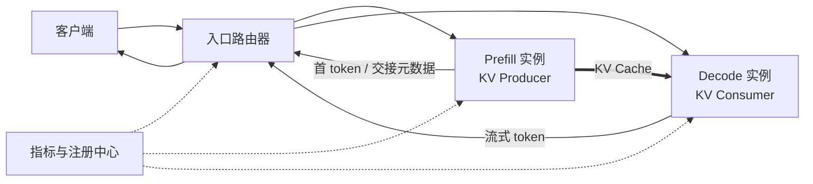

## 📑 本节目标

P/D 解耦经常被简化成一句话：
“Prefill 放一组 GPU，Decode 放另一组 GPU。”

真正的系统还必须回答：

- 请求先到谁？
- 哪个 P 实例与哪个 D 实例配对？
- KV Cache 用什么标识交接？
- D 何时确认可以继续 Decode？
- 任一阶段失败后如何释放另一边资源？
- 多轮对话的已有 KV 在哪里？
- 两个池怎样独立扩缩容而不把流量路由乱？

本节建立一张完整的架构地图，
再看 DistServe 和 Splitwise 分别优化什么。

## 1. 类比：两条产线与一张提货单

把 Prefill 看成“原料加工车间”，
Decode 看成“成品装配车间”。

原料车间处理整批 Prompt，
产生的不只是首 token，
还产生一批体积很大的半成品——KV Cache。

装配车间必须拿到正确请求的 KV，
才能继续逐 token 生成。

请求 ID 就像提货单号。 KV 元数据像货物清单。 Connector 像叉车和传送带。 全局路由器则像生产调度室。

只有叉车，没有调度室， 两条产线仍然无法成为可靠服务。

## 2. 最小解耦拓扑



图中有两条路径：

- **控制路径**：请求、请求 ID、块映射、完成通知、错误与取消。
- **数据路径**：体积大的 KV Tensor 从 P 到 D。

把这两条路径分开理解非常重要。 HTTP 代理可以完成控制转发， 却不适合承载大量 GPU KV Tensor。

## 3. 一次请求的生命周期

### 3.1 接入与分类

入口先完成鉴权、限流和参数校验， 再读取模型、Prompt 长度、最大输出长度和租户优先级。

它不应盲目 Round Robin。 路由决策至少要考虑：

- P 实例等待 token 数。
- D 实例活跃序列与可用 KV blocks。
- P-D 之间是否有高速互联。
- Connector 是否已建立可用通道。
- 目标模型、量化与 KV dtype 是否一致。

### 3.2 选择一个 Prefill 实例

简单策略是最短队列。 更合理的估计可按“等待 Prompt token 总数”排序， 因为两个请求数量相同的队列可能分别是 2×128 和 2×16K。

入口生成全局唯一请求 ID， 将请求发给选定 P 实例。

### 3.3 预留 Decode 容量

可以先选 D 再做 P， 也可以 P 接近完成时再选 D。

提前预留降低交接时的等待风险， 却可能让 D 资源空等。 延后选择提高利用率， 却可能出现 P 已完成而 D 无空间的阻塞。

生产调度器常用“软预留 + 超时”折中： 先登记预期 KV 大小和输出长度， 到交接时再确认实际 blocks。

### 3.4 Prefill 与 KV 导出

P 计算 Prompt， 生成各层 K/V。 Connector 注册源内存、交换目标地址或句柄， 再触发发送。

发送可以：

- 等 Prefill 全部完成后串行执行。
- 按 layer 或 block 流水发送。
- 与后续计算重叠异步发送。

异步并不等于没有成本。 传输仍会争用 NIC、PCIe/NVLink、copy engine 和显存带宽。

### 3.5 交接屏障

D 在 KV 可见前不能安全继续该请求。 控制面必须知道：

- 哪些 blocks 已到达。
- block 到目标地址的映射。
- token 范围和模型层范围。
- 传输是否完整。
- 超时后重试还是重算。

错误地“提前继续”比慢更危险， 因为它可能产生静默错误输出。

### 3.6 Decode 与流式返回

D 接管请求， 执行连续 Decode， 并经入口向客户端流式返回。

客户端取消时， 取消信号要同时到达 P、D 和 Connector。 否则会留下孤儿 KV、未完成传输或无消费者请求。

### 3.7 清理

请求结束后释放：

- P 侧临时 KV 与传输句柄。
- D 侧 KV blocks。
- 路由器中的配对状态。
- Connector 注册内存与 side channel 状态。
- 指标系统中的 in-flight 记录。

清理必须幂等， 因为超时、重试和重复取消都可能触发它。

## 4. DistServe 的核心思路

DistServe 在 OSDI 2024 系统化讨论了 P/D 共置的两个问题：

1. Prefill 与 Decode 互相干扰。
2. 两阶段被迫使用相同的资源与并行方案。

它以 Goodput 为目标， 分别针对 TTFT 和 TPOT SLO 配置两阶段资源。

### 4.1 阶段独立并行

Prefill 可能使用更高 Tensor Parallel 度， 以缩短单个长 Prompt 的计算时间。

Decode 可能使用较低 TP 度和更多副本， 通过更大的聚合批次提升每 GPU 可服务请求数。

独立规划避免“一套 TP 配置兼顾所有阶段”。

### 4.2 带宽感知放置

解耦会引入 KV 通信。 DistServe 因此区分：

- 节点内或高速互联域中的高带宽连接。
- 跨节点、带宽较低的连接。

P 与 D 的放置不能只看空闲 GPU。 当 KV 传输时间接近 Prefill 或 Decode 服务时间时， 网络会成为新瓶颈。

### 4.3 论文结果怎样使用

论文报告在其模型、集群、负载和 SLO 下， 可服务更高请求率或更紧 SLO。

正确用法是借鉴：

- 以 Goodput 而非裸吞吐选配置。
- 分别测 P 与 D 的扩展曲线。
- 把网络纳入放置约束。

错误用法是把论文中的最高倍数， 直接乘到自己的容量表上。

## 5. Splitwise 的核心思路

Splitwise 同样物理拆分 Prompt 与 Token 阶段， 但特别强调阶段特征与硬件成本、功耗的匹配。

### 5.1 三种资源池

Splitwise 设计包含：

- **Prompt 池**：处理计算密集的 Prompt 阶段。
- **Token 池**：处理内存带宽敏感的生成阶段。
- **Mixed 池**：在负载变化时动态支援任一阶段。

Mixed 池值得注意。 严格静态切分容易在流量画像改变时出现一边排队、一边空闲。 弹性池为峰值和预测误差留出缓冲。

### 5.2 异构硬件

Prompt 可放在更强算力 GPU 上， Token 阶段可考虑成本更低但显存容量、带宽仍合适的 GPU。

这不是“Decode 随便用旧卡”。 D 仍需完整模型权重、足够 KV 容量， 并满足 TPOT SLO。 不同 GPU 的 dtype、Kernel、互联和可维护性也会带来成本。

### 5.3 分层调度

集群级调度器选择 P/D 机器对， 机器级调度器负责本地 Batch。

这种分层避免一个中央调度器决定每个 token， 但需要把本地负载摘要及时上报。

### 5.4 KV 流水传输

Splitwise 讨论按层异步搬运 KV， 让第 \(l\) 层传输与后续层计算重叠。

对大 Prompt，流水化可隐藏部分通信。 对小 Prompt，建立和同步流水的固定开销可能不值得， 因此实际系统需要阈值策略。

## 6. DistServe 与 Splitwise 怎么比较

两者共同点：

- 都承认 Prompt 与 Token 阶段资源特征不同。
- 都用独立池消除直接干扰。
- 都必须跨机器传输 KV。
- 都需要阶段感知的集群调度。

侧重点不同：

- DistServe 更突出 TTFT/TPOT SLO 下的 Goodput 和并行配置规划。
- Splitwise 更突出异构硬件、成本、功耗和弹性 Mixed 池。

它们不是开箱即用产品配置的同义词。 论文系统的设计原则可以映射到 vLLM 等引擎， 但具体 API、Connector 与控制面需另行实现。

## 7. 路由器应维护什么状态

一个教学级路由器只需 P 地址和 D 地址。 一个可靠路由器至少要维护：

```text
request_id
model_id / model_revision
prefill_worker_id
decode_worker_id
prompt_tokens / predicted_output_tokens
kv_dtype / block_size / connector_type
state: QUEUED -> PREFILLING -> TRANSFERRING -> DECODING -> DONE
deadline_ttft / deadline_tpot
retry_count / cancellation_flag
```

工作进程心跳还应包含：

- 可接收 Prompt token budget。
- 可用 KV blocks。
- 活跃请求数。
- 近窗 P95 服务时间。
- Connector 端点和健康状态。
- 所在机架、节点与互联域。

这些状态不必每毫秒全局强一致， 但陈旧到足以把请求送进已满实例时， 尾延迟会迅速恶化。

## 8. 三类路由策略

### 8.1 最短队列

优点是简单。 缺点是请求长度差异大时误差明显。

### 8.2 最少工作量

P 池按待处理 Prompt token 或估计 FLOPs。 D 池按活跃 KV token、预期输出长度和 Batch 容量。

预测输出长度通常不准确， 因此需要在线校正和保守上限。

### 8.3 SLO Slack

定义剩余裕量：

\[
slack = deadline - now - estimated\_remaining\_service
\]

优先处理 slack 小的请求， 可减少即将违约的请求。

但若不设置准入控制， 系统可能持续抢救已不可能达标的请求， 反而拖累仍能达标的流量。

## 9. 故障语义

### P 在传输前失败

请求可重新选择 P 并重做 Prefill。 路由器必须撤销原 D 预留。

### P 在传输中失败

D 不得使用部分 KV。 要么 Connector 支持完整性与完成标记， 要么目标 blocks 保持不可见直到提交。

### D 在交接后失败

若 P 已释放 KV， 最保守方案是重新 Prefill。 若有外部 KV 存储或副本， 可从缓存恢复，但一致性更复杂。

### 路由器失败

请求状态应可恢复或明确失败。 仅放在代理进程内存中的配对表， 会让工作进程产生孤儿状态。

## 10. 何时先不要解耦

以下情况优先保留共置：

- Prompt 普遍很短。
- 到达率低，P/D 干扰不明显。
- Chunked Prefill 已满足尾延迟。
- GPU 数太少，复制模型权重后容量更差。
- 只有普通 TCP 网络，KV 传输进入临界路径。
- 团队还没有请求级指标、取消和重试语义。

解耦是用系统复杂度换隔离与独立优化空间。 如果没有明确 SLO 痛点， 复杂度本身不会产生性能。

## 📝 总结

1. P/D 解耦由控制路径和 KV 数据路径共同组成。
2. 完整生命周期包含路由、预留、Prefill、传输屏障、Decode、取消和清理。
3. DistServe 强调 Goodput、阶段独立并行与带宽感知放置。
4. Splitwise 强调异构硬件、成本功耗、Mixed 池和流水传输。
5. 入口路由不能只做 Round Robin，必须看到 token 工作量、KV 容量和互联拓扑。
6. Connector 解决数据搬运，不自动提供生产控制面。

## 🎯 自我检验

- [ ] 我能画出请求的控制路径与 KV 数据路径。
- [ ] 我能解释提前预留 D 和延后选择 D 的取舍。
- [ ] 我能分别概括 DistServe 与 Splitwise 的侧重点。
- [ ] 我知道异构 Decode 池仍受模型、显存和 TPOT 约束。
- [ ] 我能列出路由器需要维护的核心请求状态。
- [ ] 我能描述 P、D、路由器失败时的最保守恢复方式。

## 📚 论文与官方参考

- [DistServe（USENIX OSDI 2024）](https://www.usenix.org/conference/osdi24/presentation/zhong-yinmin)
- [DistServe arXiv 版本](https://arxiv.org/abs/2401.09670)
- [Splitwise（Microsoft Research / ISCA 2024）](https://www.microsoft.com/en-us/research/publication/splitwise-efficient-generative-llm-inference-using-phase-splitting/)
- [Splitwise 论文 PDF](https://www.microsoft.com/en-us/research/wp-content/uploads/2023/12/Splitwise_ISCA24.pdf)
- [vLLM：Disaggregated Prefilling](https://docs.vllm.ai/en/stable/features/disagg_prefill/)
