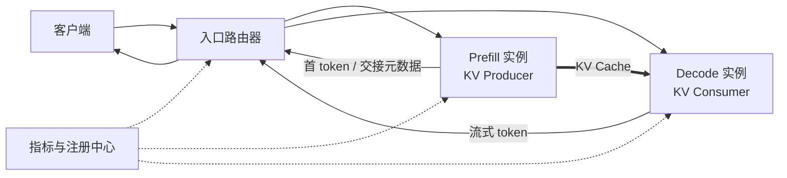

## 📑 本节目标

P/D 解耦经常被简化成一句话：
“Prefill 放一组 GPU，Decode 放另一组 GPU。”

真正的系统还必须回答：

- 请求先到谁？
- 哪个 P 实例与哪个 D 实例配对？
- KV Cache 用什么标识交接？
- D 何时确认可以继续 Decode？
- 任一阶段失败后如何释放另一边资源？
- 多轮对话的已有 KV 在哪里？
- 两个池怎样独立扩缩容而不把流量路由乱？

本节建立一张完整的架构地图，
再看 DistServe 和 Splitwise 分别优化什么。

## 1. 类比：两条产线与一张提货单

把 Prefill 看成“原料加工车间”，
Decode 看成“成品装配车间”。

原料车间处理整批 Prompt，
产生的不只是首 token，
还产生一批体积很大的半成品——KV Cache。

装配车间必须拿到正确请求的 KV，
才能继续逐 token 生成。

请求 ID 就像提货单号。 KV 元数据像货物清单。 Connector 像叉车和传送带。 全局路由器则像生产调度室。

只有叉车，没有调度室， 两条产线仍然无法成为可靠服务。

## 2. 最小解耦拓扑



图中有两条路径：

- **控制路径**：请求、请求 ID、块映射、完成通知、错误与取消。
- **数据路径**：体积大的 KV Tensor 从 P 到 D。

把这两条路径分开理解非常重要。 HTTP 代理可以完成控制转发， 却不适合承载大量 GPU KV Tensor。

## 3. 一次请求的生命周期

### 3.1 接入与分类

入口先完成鉴权、限流和参数校验， 再读取模型、Prompt 长度、最大输出长度和租户优先级。

它不应盲目 Round Robin。 路由决策至少要考虑：

- P 实例等待 token 数。
- D 实例活跃序列与可用 KV blocks。
- P-D 之间是否有高速互联。
- Connector 是否已建立可用通道。
- 目标模型、量化与 KV dtype 是否一致。

### 3.2 选择一个 Prefill 实例

简单策略是最短队列。 更合理的估计可按“等待 Prompt token 总数”排序， 因为两个请求数量相同的队列可能分别是 2×128 和 2×16K。

入口生成全局唯一请求 ID， 将请求发给选定 P 实例。

### 3.3 预留 Decode 容量

可以先选 D 再做 P， 也可以 P 接近完成时再选 D。

提前预留降低交接时的等待风险， 却可能让 D 资源空等。 延后选择提高利用率， 却可能出现 P 已完成而 D 无空间的阻塞。

生产调度器常用“软预留 + 超时”折中： 先登记预期 KV 大小和输出长度， 到交接时再确认实际 blocks。

### 3.4 Prefill 与 KV 导出

P 计算 Prompt， 生成各层 K/V。 Connector 注册源内存、交换目标地址或句柄， 再触发发送。

发送可以：

- 等 Prefill 全部完成后串行执行。
- 按 layer 或 block 流水发送。
- 与后续计算重叠异步发送。

异步并不等于没有成本。 传输仍会争用 NIC、PCIe/NVLink、copy engine 和显存带宽。

### 3.5 交接屏障

D 在 KV 可见前不能安全继续该请求。 控制面必须知道：

- 哪些 blocks 已到达。
- block 到目标地址的映射。
- token 范围和模型层范围。
- 传输是否完整。
- 超时后重试还是重算。

错误地“提前继续”比慢更危险， 因为它可能产生静默错误输出。

### 3.6 Decode 与流式返回

D 接管请求， 执行连续 Decode， 并经入口向客户端流式返回。

客户端取消时， 取消信号要同时到达 P、D 和 Connector。 否则会留下孤儿 KV、未完成传输或无消费者请求。

### 3.7 清理

请求结束后释放：

- P 侧临时 KV 与传输句柄。
- D 侧 KV blocks。
- 路由器中的配对状态。
- Connector 注册内存与 side channel 状态。
- 指标系统中的 in-flight 记录。

清理必须幂等， 因为超时、重试和重复取消都可能触发它。

## 4. DistServe 的核心思路

DistServe 在 OSDI 2024 系统化讨论了 P/D 共置的两个问题：

1. Prefill 与 Decode 互相干扰。
2. 两阶段被迫使用相同的资源与并行方案。

它以 Goodput 为目标， 分别针对 TTFT 和 TPOT SLO 配置两阶段资源。

### 4.1 阶段独立并行

Prefill 可能使用更高 Tensor Parallel 度， 以缩短单个长 Prompt 的计算时间。

Decode 可能使用较低 TP 度和更多副本， 通过更大的聚合批次提升每 GPU 可服务请求数。

独立规划避免“一套 TP 配置兼顾所有阶段”。

### 4.2 带宽感知放置

解耦会引入 KV 通信。 DistServe 因此区分：

- 节点内或高速互联域中的高带宽连接。
- 跨节点、带宽较低的连接。

P 与 D 的放置不能只看空闲 GPU。 当 KV 传输时间接近 Prefill 或 Decode 服务时间时， 网络会成为新瓶颈。

### 4.3 论文结果怎样使用

论文报告在其模型、集群、负载和 SLO 下， 可服务更高请求率或更紧 SLO。

正确用法是借鉴：

- 以 Goodput 而非裸吞吐选配置。
- 分别测 P 与 D 的扩展曲线。
- 把网络纳入放置约束。

错误用法是把论文中的最高倍数， 直接乘到自己的容量表上。

## 5. Splitwise 的核心思路

Splitwise 同样物理拆分 Prompt 与 Token 阶段， 但特别强调阶段特征与硬件成本、功耗的匹配。

### 5.1 三种资源池

Splitwise 设计包含：

- **Prompt 池**：处理计算密集的 Prompt 阶段。
- **Token 池**：处理内存带宽敏感的生成阶段。
- **Mixed 池**：在负载变化时动态支援任一阶段。

Mixed 池值得注意。 严格静态切分容易在流量画像改变时出现一边排队、一边空闲。 弹性池为峰值和预测误差留出缓冲。

### 5.2 异构硬件

Prompt 可放在更强算力 GPU 上， Token 阶段可考虑成本更低但显存容量、带宽仍合适的 GPU。

这不是“Decode 随便用旧卡”。 D 仍需完整模型权重、足够 KV 容量， 并满足 TPOT SLO。 不同 GPU 的 dtype、Kernel、互联和可维护性也会带来成本。

### 5.3 分层调度

集群级调度器选择 P/D 机器对， 机器级调度器负责本地 Batch。

这种分层避免一个中央调度器决定每个 token， 但需要把本地负载摘要及时上报。

### 5.4 KV 流水传输

Splitwise 讨论按层异步搬运 KV， 让第 \(l\) 层传输与后续层计算重叠。

对大 Prompt，流水化可隐藏部分通信。 对小 Prompt，建立和同步流水的固定开销可能不值得， 因此实际系统需要阈值策略。

## 6. DistServe 与 Splitwise 怎么比较

两者共同点：

- 都承认 Prompt 与 Token 阶段资源特征不同。
- 都用独立池消除直接干扰。
- 都必须跨机器传输 KV。
- 都需要阶段感知的集群调度。

侧重点不同：

- DistServe 更突出 TTFT/TPOT SLO 下的 Goodput 和并行配置规划。
- Splitwise 更突出异构硬件、成本、功耗和弹性 Mixed 池。

它们不是开箱即用产品配置的同义词。 论文系统的设计原则可以映射到 vLLM 等引擎， 但具体 API、Connector 与控制面需另行实现。

## 7. 路由器应维护什么状态

一个教学级路由器只需 P 地址和 D 地址。 一个可靠路由器至少要维护：

```text
request_id
model_id / model_revision
prefill_worker_id
decode_worker_id
prompt_tokens / predicted_output_tokens
kv_dtype / block_size / connector_type
state: QUEUED -> PREFILLING -> TRANSFERRING -> DECODING -> DONE
deadline_ttft / deadline_tpot
retry_count / cancellation_flag
```

工作进程心跳还应包含：

- 可接收 Prompt token budget。
- 可用 KV blocks。
- 活跃请求数。
- 近窗 P95 服务时间。
- Connector 端点和健康状态。
- 所在机架、节点与互联域。

这些状态不必每毫秒全局强一致， 但陈旧到足以把请求送进已满实例时， 尾延迟会迅速恶化。

## 8. 三类路由策略

### 8.1 最短队列

优点是简单。 缺点是请求长度差异大时误差明显。

### 8.2 最少工作量

P 池按待处理 Prompt token 或估计 FLOPs。 D 池按活跃 KV token、预期输出长度和 Batch 容量。

预测输出长度通常不准确， 因此需要在线校正和保守上限。

### 8.3 SLO Slack

定义剩余裕量：

\[
slack = deadline - now - estimated\_remaining\_service
\]

优先处理 slack 小的请求， 可减少即将违约的请求。

但若不设置准入控制， 系统可能持续抢救已不可能达标的请求， 反而拖累仍能达标的流量。

## 9. 故障语义

### P 在传输前失败

请求可重新选择 P 并重做 Prefill。 路由器必须撤销原 D 预留。

### P 在传输中失败

D 不得使用部分 KV。 要么 Connector 支持完整性与完成标记， 要么目标 blocks 保持不可见直到提交。

### D 在交接后失败

若 P 已释放 KV， 最保守方案是重新 Prefill。 若有外部 KV 存储或副本， 可从缓存恢复，但一致性更复杂。

### 路由器失败

请求状态应可恢复或明确失败。 仅放在代理进程内存中的配对表， 会让工作进程产生孤儿状态。

## 10. 何时先不要解耦

以下情况优先保留共置：

- Prompt 普遍很短。
- 到达率低，P/D 干扰不明显。
- Chunked Prefill 已满足尾延迟。
- GPU 数太少，复制模型权重后容量更差。
- 只有普通 TCP 网络，KV 传输进入临界路径。
- 团队还没有请求级指标、取消和重试语义。

解耦是用系统复杂度换隔离与独立优化空间。 如果没有明确 SLO 痛点， 复杂度本身不会产生性能。

## 11. 三个论文系统不能压成一句话

DistServe、Splitwise 和 TetriInfer 都拆 P/D，但它们回答的问题不同：

```text
DistServe
  核心目标：给定 TTFT/TPOT SLO，最大化 per-GPU capacity goodput
  关键选择：阶段独立并行、带宽感知放置、D 主动 pull KV

Splitwise
  核心目标：用阶段匹配硬件和三类池，优化吞吐/成本/功耗
  关键选择：CLS+MLS 两级调度、Prompt/Token/Mixed 池、逐层 one-sided put

TetriInfer
  核心目标：混合下游工作负载下同时抑制 P-P、P-D、D-D 干扰
  关键选择：固定 token chunk、输出长度预测、两级 Decode 调度、实例角色 flip
```

共同名词不代表同一实现。下面逐个沿“组件—状态—调度—传输—故障”展开。

## 12. DistServe：以 SLO 容量规划驱动运行时

### 12.1 组件

DistServe 的实现可以拆成：

1. **Frontend**：接收兼容 OpenAI 的请求和采样参数。
2. **Placement algorithm / simulator**：离线或部署时搜索 P/D 实例数、并行方式与放置。
3. **Orchestration layer**：分派请求、安排 KV 传输、回传结果。
4. **Prefill instances**：每个实例持有完整模型副本所需资源，只执行 Prefill。
5. **Decoding instances**：只执行 Decode，并聚合更多 Decode 请求。
6. **Parallel execution engine**：基于 Ray actor 管理 GPU worker 和 KV。
7. **传输路径**：论文实现中节点内异步 `cudaMemcpy`，跨节点使用 NCCL。

这里“实例”不是一个进程或一张卡的固定同义词，而是持有一份完整模型权重的资源组；它内部可以采用 TP/PP。

### 12.2 控制状态

中央控制器至少需要：

```text
P:
  queued_requests
  queued_prompt_tokens
  active_prefill_batch
  retained_kv_requests

D:
  active_decode_requests
  available_kv_pages
  current_batch_size
  transfer_pull_queue

request:
  request_id
  prompt_tokens
  selected_P / selected_D
  kv_ready_on_P
  kv_pulled_by_D
  decode_finished
```

DistServe 的论文运行时使用简单 FCFS；入口把请求发到最短 P 队列，Prefill 后再发给负载最小的 D。它不是按 SLO slack 的复杂在线调度器。Goodput 优化主要体现在部署配置和放置搜索，而不是把所有智慧都塞到每次调度决策中。

### 12.3 \(L_m\) 与 Batch 策略

DistServe 先 profile 模型和 GPU，找出能让 Prefill 进入计算饱和的最短总输入长度 \(L_m\)：

- 多个短 Prompt 可以合并，使总 token 接近 \(L_m\)。
- 单个 Prompt 长于 \(L_m\) 时可单独执行。
- 继续扩大 Prefill batch 不再提高效率，只会让同批请求更晚完成。

Decode 则以可容纳的较大 batch 提高带宽利用率。两个阶段因此不共享一个 token budget。

### 12.4 为什么采用 D pull

若 P 完成后立即 push，突发流量可能同时把大量 KV 推向 D：

```text
P1 ─┐
P2 ─┼──> D：目标 blocks 不足、接收队列膨胀
P3 ─┘
```

DistServe 让 D 在有容量时主动 pull，P 的 HBM 暂时充当中间排队缓冲：

```text
P 完成 Prefill
  -> 在 P 保留 KV
  -> D 获得可接纳空间
  -> D 发起 pull
  -> 完成屏障
  -> P 释放源 KV
```

代价是 P 必须为“已算完但未被取走”的 KV 留容量，控制器还需避免 lease 泄漏。Pull 解决的是突发背压，不是网络带宽本身。

### 12.5 放置与并行搜索

DistServe 的搜索目标可抽象为：

\[
\max \frac{\lambda_{\max}}{N_{GPU}}
\]

约束：

\[
P(TTFT\le S_{TTFT})\ge p
\]

\[
P(TPOT\le S_{TPOT})\ge p
\]

候选配置同时包含：

```text
P 实例数、每个 P 的 TP/PP
D 实例数、每个 D 的 TP/PP
每个实例的 GPU 放置
P-D 链路带宽
```

高 TP 可能降低单请求 Prefill 服务时间，却减少副本数；低 TP 多副本可能提高高到达率下的总体容量。搜索必须把队列等待和并行通信一起算。

### 12.6 DistServe 的边界

- 原论文运行时和今天的 vLLM Connector 不是同一代码路径。
- Pull 会消耗 P 侧保留 KV 容量。
- 论文倍数依赖特定模型、A100 集群、SLO 与负载。
- FCFS/最短队列在多租户、重尾输出和多轮会话下仍需扩展。

## 13. Splitwise：用三类资源池吸收碎片

### 13.1 组件

Splitwise 的运行时由两级调度器和三类机器池构成：

1. **Cluster-Level Scheduler（CLS）**
   - 管理 Prompt、Token、Mixed 三池。
   - 为每个请求同时选择 Prompt machine 与 Token machine。
   - 根据负载在池间移动机器。
2. **Machine-Level Scheduler（MLS）**
   - 维护本机 pending queue。
   - 跟踪 GPU memory。
   - 每轮组成 batch。
   - 向 CLS 汇报负载。
3. **Prompt pool**
   - 只执行 Prompt 阶段。
   - 生成首 token 和 KV。
4. **Token pool**
   - 连续批处理 Decode。
5. **Mixed pool**
   - 运行混合 continuous batching，吸收临时失衡。

所有机器预加载模型。Mixed pool 不是“第三种模型”，而是允许原 Prompt/Token 机器临时接另一阶段任务。

### 13.2 CLS 持有的状态

```text
pool_membership[machine_id]
machine_role_origin
pending_queue_length
gpu_memory_headroom
assigned_prompt_machine[request_id]
assigned_token_machine[request_id]
transfer_state[request_id]
```

CLS 使用 Join-the-Shortest-Queue 为请求配 P/T 机器。论文中的 queue length 不是完整的 SLO 风险模型，因此在长度高度异构时，生产实现通常还要加 token 工作量和内存余量。

### 13.3 MLS 的阶段差异

Prompt machine 的 MLS：

- 使用 FCFS。
- 限制同时 batching 的 Prompt 总 token。
- 论文实验中对特定模型/硬件使用 2048 token 阈值；这不是通用常数。

Token machine 的 MLS：

- 使用 FCFS。
- 尽可能扩大 Decode batch。
- 按 GPU memory 开始排队，避免放入无法容纳的请求。

Mixed machine 的 MLS：

- 保留原始身份。
- 临时处理对侧 pending work。
- 对侧任务排空后返回原池。

### 13.4 Mixed pool 怎样缓解碎片

假设静态配置为 4P:8D，而短时输入变成长 Prompt 为主：

```text
静态池：
P queue = 12，D active = 30%，出现 P 排队、D 空闲

Mixed 池：
2 个原 D machine 暂时进入 Mixed
接收 Prompt work
任务排空后回到 Token pool
```

这种“借用”仍会重新引入有限的 P/D 共置干扰，但只发生在弹性缓冲区。Splitwise 的目标不是追求绝对隔离，而是在高负载时避免静态切池造成吞吐下降。

### 13.5 逐层 KV 传输

Splitwise 使用 MSCCL++ 实现 one-sided put：

```text
P 计算 layer 0
  -> layer 0 KV 生成
  -> 异步 put 到 T 的目标内存
P 同时计算 layer 1
  -> layer 1 KV 生成
  -> 异步 put
...
全部 layer put 已提交
  -> P 更新 semaphore
T 等待 semaphore
  -> KV 可消费
```

关键状态包括：

```text
request_id
target_machine
target_block_addresses
layer_or_block_progress
per-request_semaphore
all_layers_committed
```

论文实现按 block-by-block 传 KV，并为同批中可能路由到不同 T 的请求分配不同 semaphore。所谓“逐层重叠”不是省略完成同步，而是把大部分数据移动隐藏在后续层计算之后。

### 13.6 异构硬件不是无约束降级

Splitwise 观察到 Token 阶段计算利用率低，因而可用成本/功耗更合适的 GPU。但 Token machine 仍要满足：

\[
M_{weights}+M_{KV}+M_{workspace}\le M_{HBM}
\]

以及：

\[
T_{decode\ iteration}\le S_{ITL}
\]

较旧 GPU 若 HBM 容量、带宽或 Kernel 支持不足，并不适合 Decode。异构配置还必须保证 P 产生的 KV layout 能被 T 正确接收。

### 13.7 Splitwise 的边界

- 论文的 2048 token 限制和硬件收益不可直接照搬。
- Mixed pool 提升弹性，但会让容量模型和故障恢复更复杂。
- 粗粒度 repurpose 虽不一定重载权重，仍要 drain 请求。
- CLS 的 JSQ 需要及时、准确的机器状态。

## 14. TetriInfer：预测 Decode 工作集后再落点

### 14.1 中央控制面

TetriInfer 的控制面有：

- **Global scheduler**：把新请求发给 Prefill 实例，接收 Decode 流式结果。
- **Cluster monitor**：收集 P/D 负载并广播给 Prefill 实例。
- **Transition watcher**：按负载决定实例角色 flip。

与 DistServe“中央控制器直接选最轻 D”不同，TetriInfer 把 D 选择的一部分下放到每个 P 的 dispatcher。

### 14.2 Prefill 实例内部

每个 P 实例包含：

1. **Local prefill scheduler**
   - raw queue 与 scheduled queue。
   - 支持 FCFS、SJF、LJF。
   - `PrefillSchedBatch` 限制一次参与排序的请求数，避免饥饿。
2. **Length predictor**
   - 小模型预测输出长度区间，而非精确 token 数。
   - 预测结果用于 D 落点和 D 本地准入。
3. **Main LLM**
   - 把 Prompt 切成固定 token chunk。
   - 记录每请求最后完成的 Prefill 位置。
4. **Dispatcher**
   - 根据广播的 D 状态与预测输出长度选 D。
   - 发送请求元数据和 KV。

P 侧请求状态比简单路由多出：

```text
raw_queue_position
scheduled_queue_position
prefilled_until_token
predicted_output_bucket
candidate_decode_set
selected_decode
kv_transfer_state
```

### 14.3 Prefill 调度与固定 chunk

TetriInfer 的 chunk 阈值 `ChunkSize` 来自模型/加速器 profile。达到该 token 数后，继续增大本轮 Prefill 不再提高吞吐，只增长时延。

它先按 FCFS/SJF/LJF 排请求，再把 token slice/merge 成固定 chunk。最后不足一个 chunk 的部分会 padding。与共置的 piggyback chunk 不同，这些 chunk 在 P-only 实例执行，不和 Decode 混 batch。

SJF 可降低平均等待，却可能饿死长 Prompt；`PrefillSchedBatch` 把排序限制在有限窗口中，形成工程折中。

### 14.4 输出长度预测

预测器将输出长度分类到 bucket：

```text
0–200 token
200–400 token
400–600 token
...
```

精确预测不现实，因为 temperature、top-p 和内容都会改变生成长度。Bucket 提供的是工作集上下界：

\[
\widehat{KV}_{future}
\approx Bytes_{token}\times
(T_{prompt}+\widehat T_{output})
\]

预测过短会导致 D 未来 KV 不足；预测过长会让容量被保守预留，降低利用率。因此应同时记录预测 bucket、实际输出长度和校准误差。

### 14.5 P dispatcher 的两级 D 选择

TetriInfer 的 inter-D 策略可写为：

1. 根据预测工作集和广播状态，把 D 分成：
   - \(\alpha\)：有足够资源。
   - \(\beta\)：资源不足。
2. 从 \(\alpha\) 随机抽两个候选。
3. 选预计 heavy/light Decode 干扰最小的一个。

```text
all D
  -> capacity filter
  -> power-of-two sample
  -> predicted-interference comparison
  -> selected D
```

这与纯 Round Robin、JSQ、DistServe 的 least-loaded 都不同：它显式利用预测输出长度，目标是避免重 Decode 聚集成热点。

### 14.6 Decode 实例内部

D 实例包含：

- Receiver：接收请求与 KV；KV 完整后才入本地队列。
- Local scheduler：continuous batching。
- Main LLM：自回归 Decode。

TetriInfer 在 vLLM greedy 之外提出：

- `reserve-static`：只有预测总工作集能放入当前可用显存才准入。
- `reserve-dynamic`：考虑 batch 中最短任务完成后释放的内存，再决定是否准入。

目的不是减少当前一轮显存，而是避免未来上下文增长触发 swap/thrashing。

### 14.7 实例 flip

P→D：

```text
Global scheduler 停止向该 P 发新请求
  -> P drain raw/scheduled queue
  -> 修改内部角色
  -> 开始接收 Decode
```

D→P：

```text
Cluster monitor 通知所有 P 不再选择该 D
  -> D 完成/迁移已有 Decode 请求
  -> 修改角色
  -> 开始接收 Prefill
```

论文报告内部角色切换本身很快，但不包含 drain 时间。生产容量规划应计入最长输出请求、取消策略和负载状态传播。

### 14.8 传输实现与论文评估边界

TetriInfer 设计了统一网络抽象，可覆盖 Direct、Direct-NIC、Indirect 链路和 send/receive/read/write 接口。但论文原型受硬件限制，实际只实现了基于 socket 的 Indirect 路径；对 RoCE/NVLink 的部分评估使用 mock 延迟。不能把设计图中的 one-sided 能力误写成原型已完整实现。

论文实现还选择 request-level KV transfer；chunk-level 与 layer-level 组合被列为后续空间。

## 15. 同一个请求在三种系统里的状态机差异

### 15.1 DistServe

```text
ARRIVED
 -> P_QUEUE(FCFS, shortest-P routing)
 -> PREFILL
 -> RETAINED_ON_P
 -> D_SELECTED(least-loaded)
 -> D_PULLING
 -> DECODING
 -> DONE
```

核心中间态是 `RETAINED_ON_P`：它承担突发缓冲和 D 背压。

### 15.2 Splitwise

```text
ARRIVED
 -> P_AND_T_ASSIGNED(JSQ by CLS)
 -> P_QUEUE(MLS)
 -> PREFILL_AND_LAYER_PUT
 -> SEMAPHORE_COMMITTED
 -> T_QUEUE
 -> DECODING
 -> DONE
```

核心中间态是已预先配对的 P/T 和 per-request semaphore。

### 15.3 TetriInfer

```text
ARRIVED
 -> P_SELECTED(global)
 -> P_LOCAL_SCHEDULED(FCFS/SJF/LJF)
 -> LENGTH_BUCKET_PREDICTED
 -> CHUNKED_PREFILL
 -> D_FILTERED_AND_SELECTED(dispatcher)
 -> REQUEST_LEVEL_TRANSFER
 -> D_ADMISSION(reserve policy)
 -> DECODING
 -> DONE
```

核心额外状态是预测输出 bucket、Prefill chunk progress 和 D future working set。

## 16. 用一个请求手算路由决策

请求 Prompt 为 4096 token，预测输出 bucket 为 400–600 token。每 token KV 为 128 KiB：

\[
KV_{now}=4096\times128\text{ KiB}=512\text{ MiB}
\]

按上界预留未来 KV：

\[
KV_{future,max}=(4096+600)\times128\text{ KiB}
\approx587\text{ MiB}
\]

候选 D：

```text
D1: free KV 700 MiB，active heavy=6，active light=2
D2: free KV 550 MiB，active heavy=1，active light=8
D3: free KV 2 GiB，active heavy=2，active light=6，但跨低速链路
```

- 按 TetriInfer capacity filter，D2 被排除；D1/D3 再按预测干扰选。
- 按简单 least-loaded，如果负载只用 active count，D1=8、D3=8，无法区分。
- 按带宽感知成本，D3 的传输时间可能抵消负载优势。

若 D3 有效带宽 8 GiB/s，而 D1 为 25 GiB/s：

\[
T_{xfer,D3}=0.5/8=62.5\text{ ms}
\]

\[
T_{xfer,D1}=0.5/25=20\text{ ms}
\]

调度器应把约 42.5 ms 的差额计入 TTFT slack，而不是只看空闲显存。

## 17. 生产路由器的最小伪代码

```python
def route(req, snapshot):
    p_candidates = compatible_prefillers(req, snapshot)
    p = min(p_candidates, key=estimated_prefill_finish)

    kv_bytes = estimate_kv_bytes(req)
    d_candidates = [
        d for d in compatible_decoders(req, snapshot)
        if d.free_kv_bytes >= reserve_with_margin(req)
        and reachable(p, d)
    ]
    if not d_candidates:
        reject_or_queue(req, reason="no_decode_capacity")

    d = min(
        d_candidates,
        key=lambda d: (
            estimated_decode_wait(d, req)
            + kv_bytes / measured_bandwidth(p, d)
            + failure_domain_penalty(p, d)
        ),
    )
    reserve(d, req, ttl=reservation_ttl)
    dispatch_to_prefill(req, p, d)
```

实现时 `snapshot` 不是强一致数据库快照。必须为陈旧状态留下安全余量，并让 D 在实际交接时再次确认容量。

## 18. 设计实验：验证调度而不是只验证能跑

准备四类二维负载：

```text
LPLD：短输入、短输出
LPHD：短输入、长输出
HPLD：长输入、短输出
HPHD：长输入、长输出
```

对每种负载比较：

1. Round Robin。
2. 最短请求数队列。
3. token/工作集感知。
4. 带宽 + SLO slack + 工作集联合成本。

记录：

```text
P queue token P95/P99
D active KV bytes 分布
每个 D 的 heavy/light 比例
handoff P95/P99
TTFT/TPOT/ITL
联合 SLO observed goodput
负载不均衡系数
```

负载不均衡可用：

\[
Imbalance_D=\frac{\max_j Load_j}{\operatorname{mean}_j Load_j}
\]

若请求数均衡但 KV 工作集不均衡，说明状态摘要选错了。

## 19. 排障闭环

### P 空闲但 TTFT 高

- D 预留是否阻塞 Prefill 启动。
- P 状态是否因心跳陈旧被路由器误判为满。
- Connector endpoint 是否不可达。
- 模型/版本兼容过滤是否把大多数 P 排除。

### D 有显存却不接请求

- 空闲字节是否小于连续/对齐 block 需求。
- 是否已有软预留尚未过期。
- 预测输出上界是否过度保守。
- D 是否在等前一个 KV 完成屏障。

### 同一 D 持续成为热点

- 负载广播周期是否大于请求到达间隔。
- Round Robin 是否忽略输出长度。
- predicted/actual output bucket 是否系统性偏短。
- power-of-two 候选集合是否过滤错误。

### Mixed pool 反复抖动

- 进入和退出阈值是否相同，缺少 hysteresis。
- 最小驻留时间是否过短。
- 是否把瞬时 P queue spike 当成长期结构变化。
- 角色切换是否遗漏 drain 时间。

### KV 到达但 Decode 输出错误

立即停止把它当性能问题处理，先核对：

```text
model revision
tokenizer/chat template
request_id
token range
layer range
KV dtype/layout
block table generation
completion fence
```

部分 KV、错请求 KV 或迟到写入都可能产生静默错误。

## 20. 本节闭环

```text
问题：P/D 拆开后，谁选择谁、状态放哪、故障如何收敛
  ↓
机制：控制路径维护配对和 lease，数据路径搬 KV，D 完成屏障后接管
  ↓
公式：Prefill finish + Decode wait + KV/BW + failure penalty
  ↓
实现：DistServe pull、Splitwise CLS/MLS+semaphore、TetriInfer predictor+dispatcher
  ↓
实验：四象限负载 × 四种路由策略
  ↓
排障：检查状态陈旧、预留泄漏、热点、布局和完成屏障
```

## 📝 总结

1. P/D 解耦由控制路径和 KV 数据路径共同组成。
2. 完整生命周期包含路由、预留、Prefill、传输屏障、Decode、取消和清理。
3. DistServe 以 Goodput 配置与带宽放置为核心，运行时用最短队列、least-loaded D 与 pull KV 抑制突发。
4. Splitwise 以 CLS/MLS、Prompt/Token/Mixed 三池和逐层 one-sided KV put 协调成本与碎片。
5. TetriInfer 用固定 Prefill chunk、输出长度预测和两级 Decode 调度控制混合工作负载热点。
6. 入口路由不能只做 Round Robin，必须看到 token 工作量、未来 KV、互联拓扑和故障域。
7. Connector 解决数据搬运，不自动提供生产控制面。

## 🎯 自我检验

- [ ] 我能画出请求的控制路径与 KV 数据路径。
- [ ] 我能解释提前预留 D 和延后选择 D 的取舍。
- [ ] 我能分别概括 DistServe 与 Splitwise 的侧重点。
- [ ] 我能画出 TetriInfer 的 predictor、dispatcher、receiver 与两级调度。
- [ ] 我能解释 DistServe pull、Splitwise layer-wise put 的背压差异。
- [ ] 我知道异构 Decode 池仍受模型、显存和 TPOT 约束。
- [ ] 我能列出路由器需要维护的核心请求状态。
- [ ] 我能描述 P、D、路由器失败时的最保守恢复方式。

## 📚 论文与官方参考

- [DistServe（USENIX OSDI 2024）](https://www.usenix.org/conference/osdi24/presentation/zhong-yinmin)
- [DistServe arXiv 版本](https://arxiv.org/abs/2401.09670)
- [Splitwise（Microsoft Research / ISCA 2024）](https://www.microsoft.com/en-us/research/publication/splitwise-efficient-generative-llm-inference-using-phase-splitting/)
- [Splitwise 论文 PDF](https://www.microsoft.com/en-us/research/wp-content/uploads/2023/12/Splitwise_ISCA24.pdf)
- [TetriInfer：Inference without Interference](https://arxiv.org/abs/2401.11181)
- [vLLM：Disaggregated Prefilling](https://docs.vllm.ai/en/stable/features/disagg_prefill/)
