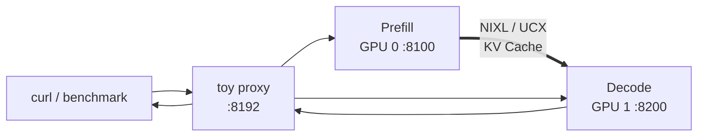

## 📑 本节目标
这一节把前面的概念落到 vLLM。 我们会搭建：
- GPU 0：Prefill / KV Producer。
- GPU 1：Decode / KV Consumer。
- 一个教学代理：按 P→D 顺序转发请求。
- NixlConnector：在两个实例之间搬运 KV。
最终不是得到一条“万能生产命令”， 而是完成一套可验证流程：
1. 核对版本和 Connector 参数。
2. 跑通 1P1D 正确性。
3. 与共置基线做同负载对照。
4. 测量 TTFT、TPOT、ITL 与 KV handoff。
5. 判断当前 vLLM 能力离生产还缺什么。
## 1. 先读官方边界
本文命令和路径固定到 **vLLM v0.27.1**。该版本文档把 Disaggregated Prefilling 明确标记为：
> experimental and subject to change
官方还明确说明：
> Disaggregated prefill DOES NOT improve throughput.
它的两个主要目标是：
- 分别调优 TTFT 与 ITL。
- 控制混合 Prefill 导致的 tail ITL。
这两句决定了实验预期。 如果只比较输出 token/s， 可能看不到价值，甚至因复制权重和 KV 传输而更低。 应重点比较：
- TTFT SLO attainment。
- TPOT/ITL P95、P99。
- 满足组合 SLO 的 Goodput。
- 额外 GPU 与网络成本。
## 2. 实验拓扑

这个代理负责控制路径， NixlConnector 负责 KV 数据路径。 toy proxy 是教学组件， 不应被误解为高可用生产网关。
## 3. 环境前提
最低教学环境：
- Linux。
- 两张 vLLM 支持的 GPU。
- 两个实例都能加载同一模型。
- 对应 CUDA/驱动。
- 当前 vLLM 与匹配的 NIXL。
- 已克隆同版本 vLLM 仓库以使用测试代理。
同机实验可先走 CUDA IPC/UCX 路径， 跨机实验还要验证 RDMA/RoCE、网卡和防火墙。 不要在生产节点边看教程边升级依赖。 先建立隔离环境并记录完整版本。
## 4. 创建环境并核对版本
示例使用 `uv`：
```bash
uv venv --python 3.12 --seed
source .venv/bin/activate
uv pip install "vllm==0.27.1" nixl
```
生产复现应锁定已验证版本， 而不是每次安装最新包。 记录版本：
```bash
python - <<'PY'
import importlib.metadata as m
for name in ("vllm", "nixl", "torch"):
    print(name, m.version(name))
PY
```
核对 GPU：
```bash
nvidia-smi
nvidia-smi topo -m
```
核对当前 CLI：
```bash
vllm serve --help | rg "kv-transfer"
vllm bench serve --help | rg "goodput|request-rate"
```
若参数与本文不同， 以安装版本官方文档和 `--help` 为准。
## 5. 获取匹配的示例代码
官方 NixlConnector 教程使用仓库中的 toy proxy。
```bash
git clone https://github.com/vllm-project/vllm.git
cd vllm
git checkout v0.27.1
```
确认文件存在：
```bash
test -f tests/v1/kv_connector/nixl_integration/toy_proxy_server.py
```
这里的关键是“版本匹配”。 不要用 main 分支代理控制旧版 PyPI 引擎， 也不要反过来。
## 6. 启动 Prefill 实例
终端 A：
```bash
CUDA_VISIBLE_DEVICES=0 \
UCX_NET_DEVICES=all \
VLLM_NIXL_SIDE_CHANNEL_PORT=5600 \
vllm serve Qwen/Qwen3-0.6B \
  --host 0.0.0.0 \
  --port 8100 \
  --enforce-eager \
  --kv-transfer-config \
  '{"kv_connector":"NixlConnector","kv_role":"kv_producer","kv_load_failure_policy":"fail"}'
```
参数含义：
- `CUDA_VISIBLE_DEVICES=0`：隔离 P 到 GPU 0。
- `kv_producer`：该实例生产 KV。
- `5600`：NIXL 握手 side-channel 端口。
- `kv_load_failure_policy=fail`：教学时让 KV 加载失败显式暴露。
- `--enforce-eager`：遵循官方最小示例，先减少图捕获变量。
端口不得与其他进程冲突。
## 7. 启动 Decode 实例
终端 B：
```bash
CUDA_VISIBLE_DEVICES=1 \
UCX_NET_DEVICES=all \
VLLM_NIXL_SIDE_CHANNEL_PORT=5601 \
vllm serve Qwen/Qwen3-0.6B \
  --host 0.0.0.0 \
  --port 8200 \
  --enforce-eager \
  --kv-transfer-config \
  '{"kv_connector":"NixlConnector","kv_role":"kv_consumer","kv_load_failure_policy":"fail"}'
```
P 与 D 必须保持兼容：
- 同一模型与 revision。
- 同一 tokenizer/chat template 语义。
- 兼容的 KV dtype。
- 兼容的 block size 和并行布局。
- 对应 Connector 配置。
“两边都能独立启动”不代表可以正确交接 KV。
## 8. 启动教学代理
终端 C，在匹配版本的 vLLM 仓库根目录：
```bash
python tests/v1/kv_connector/nixl_integration/toy_proxy_server.py \
  --port 8192 \
  --prefiller-hosts localhost \
  --prefiller-ports 8100 \
  --decoder-hosts localhost \
  --decoder-ports 8200
```
代理负责：
1. 把请求发给 Prefill。
2. 获取 KV 交接参数。
3. 把请求和参数发给 Decode。
4. 将 Decode 输出返回客户端。
若仓库路径或参数变化， 查看该 tag 的 NixlConnector 官方文档， 不要猜代理协议。
## 9. 健康与正确性验证
先检查三个 HTTP 端点：
```bash
curl -fsS http://127.0.0.1:8100/health
curl -fsS http://127.0.0.1:8200/health
curl -fsS http://127.0.0.1:8192/healthcheck
```
toy proxy 使用 `/healthcheck`；它只验证代理进程，端到端仍需发送最小请求：
```bash
curl http://127.0.0.1:8192/v1/chat/completions \
  -H "Content-Type: application/json" \
  -d '{
    "model": "Qwen/Qwen3-0.6B",
    "messages": [{"role": "user", "content": "用一句话解释 KV Cache。"}],
    "temperature": 0,
    "max_tokens": 32,
    "stream": false
  }'
```
同时观察 P、D 和代理日志。 成功标准不是只收到 HTTP 200， 还要确认：
- P 实际完成 Prefill。
- Connector 产生并传递 KV 参数。
- D 加载远端 KV 后继续生成。
- 输出 token 数和 finish reason 正常。
- 请求结束后 KV blocks 被释放。
## 10. 先做共置基线
使用第三张 GPU， 或停止 P/D 后复用其中一张：
```bash
CUDA_VISIBLE_DEVICES=0 \
vllm serve Qwen/Qwen3-0.6B \
  --host 0.0.0.0 \
  --port 8000 \
  --enforce-eager
```
基线与解耦组保持：
- 相同模型。
- 相同 dtype。
- 相同采样参数。
- 相同请求清单和到达时间。
- 相同输入/输出长度。
解耦用两张 GPU， 共置用一张 GPU 时， 既要比较绝对指标， 也要报告每 GPU Goodput。
## 11. Goodput 对照压测
共置端口：
```bash
vllm bench serve \
  --backend openai-chat \
  --base-url http://127.0.0.1:8000 \
  --endpoint /v1/chat/completions \
  --model Qwen/Qwen3-0.6B \
  --dataset-name random \
  --random-input-len 2048 \
  --random-output-len 256 \
  --num-prompts 500 \
  --request-rate 4 \
  --percentile-metrics ttft,tpot,itl \
  --metric-percentiles 50,95,99 \
  --goodput ttft:800 tpot:50 \
  --save-result \
  --save-detailed
```
对解耦代理重复同一命令， 只把 `--base-url` 改为 `http://127.0.0.1:8192`。 先确认 toy proxy 暴露的 API 与 benchmark backend 兼容。 若不兼容， 使用仓库对应 benchmark 脚本或编写显式两阶段客户端， 不要用不同请求语义强行比较。
## 12. 混合长度干扰实验
准备三类请求：
- 128 输入 / 256 输出。
- 2048 输入 / 256 输出。
- 8192 输入 / 64 输出。
按例如 70% / 20% / 10% 混合， 为每个请求保存固定到达时间。 在共置和解耦系统分别重放。 重点观察：
```text
short-request TTFT P99
all-request ITL P99
long-prefill handoff P99
SLO goodput
GPU-normalized goodput
```
如果解耦只降低短请求 ITL 尾部， 却没有提高裸吞吐， 这与官方定位并不矛盾。
## 13. KV handoff 怎样量
请求级增加或提取以下时间戳：
```text
prefill_end
kv_transfer_start
kv_transfer_end
decode_start
first_token
```
定义：
\[
T_{handoff}=T_{decode\_start}-T_{prefill\_end}
\]
并记录请求 KV 字节数：
\[
BW_{effective}=\frac{KVBytes}{T_{transfer}}
\]
若代理和 Connector 日志没有完整时间戳， 可先以教学 patch 加结构化日志， 但不要在延迟压测中保留高频同步日志。
## 14. 从单机走向跨机
跨机时至少补充：
- `VLLM_NIXL_SIDE_CHANNEL_HOST`。
- 每个 worker 唯一 side-channel 端口。
- `UCX_NET_DEVICES` 指向正确 HCA。
- RDMA/RoCE 连通性。
- GPU/NIC NUMA 亲和。
- 防火墙和网络 ACL。
- 有效带宽与 P99 测试。
注意： NixlConnector 使用 UCX 时， `NCCL_IB_HCA` 等 NCCL 环境变量并不配置 UCX。 应使用 UCX 对应变量。
## 15. 多 TP/DP 的端口与兼容性
官方 NixlConnector 文档说明， 每个 worker 需要唯一 side-channel 端口。 TP/DP 会让进程和端口映射更复杂。 上线前核对兼容矩阵：
- 模型架构是否支持。
- P 与 D 的 TP 组合是否支持。
- Prefix Cache、LoRA、量化是否兼容。
- 多模态和结构化输出是否经过验证。
- 当前 Connector 是否支持目标平台。
不要从 1P1D 单卡成功， 直接推断异构 TP 集群一定成功。
## 16. 多轮对话
标准单向路径为 P→D。 多轮时，D 已有上一轮生成后的 KV， 下一轮重新在 P 全量 Prefill 会浪费。 当前 NixlConnector 文档提供双向 KV 传输选项：
```json
{
  "kv_connector": "NixlConnector",
  "kv_role": "kv_producer",
  "kv_connector_extra_config": {
    "bidirectional_kv_xfer": true
  }
}
```
D 侧也要开启对应选项。 这还需要有状态代理按 `conversation_id` 保存并转发 KV 参数。 状态代理会新增：
- 会话亲和。
- KV TTL。
- 代理状态恢复。
- 租户隔离。
- 过期与重算策略。
因此先在单轮压测中验证基本链路， 再单独评估多轮。
## 17. Connector 选择建议
教学同机最小链路可用 NixlConnector 示例。 生产评估时按需求选择：
- NixlConnector 适合异步数据移动；LMCacheConnectorV1 面向分层缓存；P2pNcclConnector 和 Mooncake 等应按官方示例、拓扑与兼容矩阵评估。
不要只按 benchmark 峰值选 Connector。 还要比较升级兼容、可观测性、故障恢复和团队运维经验。
## 18. 实验能力与生产能力边界
官方示例能帮助验证：
- P/D 两实例可启动、Connector 能交接 KV、指定模型在小拓扑上结果正确，并观察基础延迟与带宽趋势。
它不自动提供：
- 高可用入口、状态复制、多租户鉴权、限流和配额。
- SLO 感知路由、动态 P:D 配比与安全扩缩容。
- 完整的取消、重试、幂等、跨故障域恢复语义。
- Connector 兼容承诺，以及生产监控、审计和容量门禁。
vLLM 官方也说明， 解耦 Prefill 与基础设施高度相关， 生产级能力依赖第三方 Connector 生态。 “有人用某 Connector 上生产” 不等于 vLLM 的整个解耦服务栈已经是一键生产方案。
## 19. 上线前门禁
至少通过：
### 正确性
- 固定 seed 的共置/解耦输出对照。
- 多种 Prompt 长度。
- 流式与非流式。
- 取消、超时、非法参数。
### 性能
- 稳态与 burst。
- 混合输入输出长度。
- Goodput 与每 GPU Goodput。
- KV handoff P99。
### 故障
- 杀死 P。
- 杀死 D。
- 重启代理。
- 中断网络。
- Connector 超时和迟到传输。
### 运维
- 滚动升级。
- 模型 revision 切换。
- 扩容和缩容。
- 指标、日志、trace 与告警。
- KV 敏感数据隔离。
任一故障测试都应验证资源最终释放， 而不只是客户端收到错误。
## 20. 排错顺序
若请求失败，按层排查：
1. P/D 模型是否分别能独立推理。
2. 代理是否把请求发给正确端口。
3. side channel 是否连通且端口唯一。
4. P 是否生成 `kv_transfer_params`。
5. D 是否收到并匹配请求 ID。
6. UCX/NIXL 是否选择预期设备。
7. KV dtype、block 和并行布局是否一致。
8. 超时前 KV lease 是否已过期。
一次只改变一个变量。 不要同时换 Connector、模型和网络配置。

## 21. v0.27.1 有三条不同教学路径

不要把三个 proxy 脚本当成同一个协议的别名。

### 21.1 NixlConnector 最小 1P1D

v0.27.1 NixlConnector Usage Guide 使用：

```text
tests/v1/kv_connector/nixl_integration/toy_proxy_server.py
```

它适合验证同机 producer/consumer、side channel 和 KV 数据移动。前文的 8100/8200/8192 命令属于这条路径。

### 21.2 XpYd 示例

仓库还提供：

```text
examples/disaggregated/disaggregated_serving/disagg_proxy_demo.py
```

它演示多个 P、多个 D 和 Round Robin，单轮控制流是：

```text
Client
  -> Proxy 选择 P
  -> 把 max_tokens 改为 1，调用 P
  -> drain P 响应
  -> Proxy 选择 D
  -> 把原请求发给 D
  -> 流式返回 D 响应
```

该脚本验证 XpYd 形态，不是 SLO 感知生产路由器。v0.27.1 源码注释还说明它未来可能在 PDController 支持 XpYd 后移除，因此教程应固定 tag，不应依赖 `main`。

启动示例：

```bash
python examples/disaggregated/disaggregated_serving/disagg_proxy_demo.py \
  --model Qwen/Qwen3-0.6B \
  --prefill localhost:8100 \
  --decode localhost:8200 \
  --port 8000
```

### 21.3 显式 `kv_transfer_params` 多轮路径

```text
examples/disaggregated/disaggregated_serving/disagg_proxy_multiturn.py
```

这条路径明确缓存 D 返回的 `kv_transfer_params`，下一轮让 P 反向读取 D 的历史 KV。它最适合学习状态生命周期，但要求客户端增加非标准字段 `conversation_id`。

## 22. 单轮 Pull 请求的完整路径

以下按 NixlConnector 的 D pull 语义解释。

### 22.1 Router 接入

Router 生成或透传稳定的请求 ID：

```text
request_id = UUID
model = Qwen/Qwen3-0.6B
stream = true
max_tokens = 256
```

Router 选择一对兼容 P/D。教学脚本通常 Round Robin；生产应考虑 P queue token、D free blocks 和 P-D 带宽。

### 22.2 P 请求

Router 构造 P leg：

```json
{
  "model": "Qwen/Qwen3-0.6B",
  "messages": [{"role": "user", "content": "..."}],
  "stream": false,
  "max_tokens": 1
}
```

`max_tokens=1` 的意义是让 P 完成 Prompt Prefill 并产生首 token/KV，不在 P 上完成全部生成。

### 22.3 P worker 内部

```text
API process
  -> tokenizer / request validation
  -> EngineCore request
  -> Scheduler 分配 KV blocks
  -> Model runner 执行 Prefill
  -> KVConnector 收集可导出的 blocks
  -> NIXL 注册/查找源 buffer descriptors
  -> 生成远端读取所需元数据
  -> 源 blocks 进入 lease 状态
```

P HTTP 完成不等于 KV 已到 D；此时 KV 仍在 P，等待 D pull。

### 22.4 控制参数

显式协议路径中的 `kv_transfer_params` 可包含：

```text
do_remote_decode
do_remote_prefill
remote_engine_id
remote_request_id
remote_block_ids
remote_host
remote_port
```

Router 转发的是描述 KV 在哪里、如何找到它的元数据，不搬运 Tensor 主体。

### 22.5 D 请求

Router 把原始生成参数和 P 的远端 KV 描述交给 D。D worker：

```text
验证 request/model/layout
  -> Scheduler 分配本地目标 KV blocks
  -> NixlConnector 连接 P side channel
  -> 获取/校验 descriptors
  -> post NIXL READ
  -> 等待所有 transfer completion
  -> 发送 read notification
  -> 标记目标 KV READY
  -> 进入第一个 Decode iteration
```

只有 READY 之后，Attention 才能读取目标 blocks。

### 22.6 流式返回

D 生成后续 token，API server 经 Router 返回 SSE。客户端指标：

\[
TTFT=t_{\text{first client token}}-t_{\text{client send}}
\]

不要用 P 的 `max_tokens=1` 响应时间当 TTFT；客户端真正看到的首 token来自完整 Router→P→KV→D→Router 临界路径。

### 22.7 释放

```text
D read 完成
  -> P 收到 notification，释放源 lease
D 生成结束
  -> 释放 D KV blocks
Router 请求结束
  -> 删除 P-D pairing 与计时状态
```

若 notification 丢失，P 最终依靠 lease 超时回收；若 Router 取消，三边都要幂等清理。

## 23. Push 模式为什么不同

v0.27.1 的 `disagg_proxy_pushconnector_demo.py` 演示：

```text
Router 同时发 P leg 和 D leg
P: do_remote_decode=true
D: do_remote_prefill=true，先分配目标 blocks
D 把目标信息通知 P
P 使用 NIXL WRITE 把 KV push 到 D
D 等待 WRITE 完成后 Decode
```

Push 模式中 Router 必须预先知道 P 的：

```text
engine_id
side-channel host/port
TP size
PP size
```

而 D 请求故意不包含 `remote_block_ids`：D 先分配本地 blocks 并注册，P 再决定源 block IDs 并写入。

### 23.1 Push 的时间线

```text
t0 Router -> P
t0 Router -> D
t1 D alloc/register
t2 P prefill complete
t3 P receives D target metadata
t4 P posts WRITE
t5 D completion
t6 first Decode
```

Pull 的 D leg通常在 P 返回元数据后开始；Push 可让 D 的分配/等待与 P 计算并行，但控制配对更严格。

### 23.2 不要混用参数

Pull demo 的 `remote_block_ids`、Push demo 的 P coordinates 和多轮的 D→P 参数流不同。排障时先确认运行的是哪个 proxy 和哪种模式。

## 24. 多轮请求完整路径

### 24.1 第一轮

```text
Client(conversation_id=session-42)
  -> Router cache MISS
  -> P 全量 Prefill
  -> P kv_transfer_params
  -> D pull P KV
  -> D Decode
  -> D 最后一个 chunk 返回自己的 kv_transfer_params
  -> Router 按 conversation_id 缓存
```

### 24.2 第二轮

```text
Client(same conversation_id)
  -> Router 取出上一轮 D block info
  -> P 从 D pull 历史 KV
  -> P 只 Prefill 新增 suffix
  -> D 从 P pull 更新后的 KV
  -> D Decode
  -> Router 更新缓存
```

v0.27.1 相关参数：

```text
bidirectional_kv_xfer=false 默认关闭
kv_recompute_threshold=64
decoder_kv_blocks_ttl=480 s
```

少于阈值的远端 token 可在 P 本地重算，以摊销固定传输成本。

### 24.3 正确性陷阱

如果 reasoning 模型在 D 生成了 thinking token，而客户端下一轮历史删除这些中间 token，P 收到的 Prompt 不再是 D 序列前缀。v0.27.1 文档明确要求 Router 能检测这种不匹配，否则复用的 KV token position 错误，可能产生错误结果。

## 25. 单机教学环境的验收单

### 25.1 软件固定

```bash
python - <<'PY'
import importlib.metadata as m
assert m.version("vllm") == "0.27.1", m.version("vllm")
print("vllm", m.version("vllm"))
print("nixl", m.version("nixl"))
print("torch", m.version("torch"))
PY
```

同时保存：

```text
vLLM tag/commit
NIXL version
CUDA driver/runtime
UCX version
GPU model
model revision
```

### 25.2 拓扑固定

```bash
nvidia-smi topo -m
```

记录 GPU0↔GPU1 是 NVLink、同 PCIe switch 还是跨 CPU socket。单机结果仍受拓扑影响。

### 25.3 三段健康

```bash
curl -fsS http://127.0.0.1:8100/health
curl -fsS http://127.0.0.1:8200/health
curl -fsS http://127.0.0.1:8192/healthcheck
```

若其他示例 proxy 没有 `/healthcheck`，至少验证：

```text
进程存活
P /v1/models
D /v1/models
proxy /status（若该脚本提供）
一次真实请求
```

### 25.4 正确性对照

对共置和解耦固定：

```text
temperature=0
top_p=1
same tokenizer/template
same model revision
same max_tokens
same prompt
```

比较 token IDs 优于只比较文本；不同并行 reduction 的浮点细微差异仍可能导致边界 logits 分叉，因此还要做任务级正确性与规模化回归。

## 26. 多机前提，不满足就不要测结论

### 26.1 网络与设备

```text
P/D side-channel IP 可路由
数据网与管理网选择明确
UCX_NET_DEVICES 指向预期 HCA:port
RoCE/IB MTU、PFC/ECN 或 IB fabric 正常
GPU Direct RDMA 能力已验证
GPU 与 NIC NUMA 亲和
防火墙放行每个 worker side-channel 端口
```

`iperf3` 通过只能说明 host TCP 路径，不证明 GPU-direct NIXL 路径。

### 26.2 Worker 端口

v0.27.1 文档指出，同一主机每个 worker 的 side-channel 端口必须唯一。DP 使用：

```text
base_port + dp_rank
```

不同主机可复用 5600；同主机多个 worker 不能都绑定 5600。

### 26.3 兼容矩阵

上线前固定并验证：

```text
model architecture
attention backend
P TP/PP/DP
D TP/PP/DP
KV dtype
block size
KV layout
prefix caching
LoRA
quantization
multimodal
speculative decoding
structured output
```

v0.27.1 的 HND→NHD permute 和 cross-layer blocks 都属于实验能力，要单独回归。

### 26.4 GB 系列注意

v0.27.1 文档指出 GB 系列多节点 NVLink 路径要求 KVCache 以 VMM 注册，并配合 cuMem allocator/sleep mode 与 `UCX_CUDA_IPC_ENABLE_MNNVL=y`；否则可能回退到 RDMA/TCP。不能看到“链路可达”就假设实际走了多节点 NVLink。

## 27. 指标：Router、P、D、Connector 四层对齐

### 27.1 Router 指标

```text
requests_total{role_pair}
prefill_leg_seconds
handoff_gap_seconds
decode_leg_ttft_seconds
end_to_end_ttft_seconds
request_tpot_seconds
request_max_stream_gap_seconds
pairing_failures_total
cancellations_total
```

### 27.2 P 指标

```text
prefill_queue_tokens
prefill_service_seconds
prompt_tokens_total
kv_blocks_retained
kv_lease_extensions_total
prefix_cache_hit_tokens
```

### 27.3 D 指标

```text
decode_active_sequences
decode_iteration_seconds
kv_blocks_used
preemptions_total
request_tpot / ITL
remote_prefill_wait_seconds
```

### 27.4 NixlConnector 指标

v0.27.1 文档列出：

```text
vllm:nixl_xfer_time_seconds
vllm:nixl_post_time_seconds
vllm:nixl_bytes_transferred
vllm:nixl_num_descriptors
vllm:nixl_num_failed_transfers
vllm:nixl_num_failed_notifications
vllm:nixl_num_kv_expired_reqs
```

周期日志还包含：

```text
Num successful transfers
Avg/P90 xfer time
Avg/P90 post time
Avg MB per transfer
Throughput MB/s
Avg descriptor count
```

### 27.5 用 request_id 串起来

一条 trace 至少应有：

```text
router.receive
router.dispatch_p
p.queue / p.prefill / p.kv_export
router.dispatch_d
d.kv_alloc
nixl.post / nixl.complete / nixl.notify
d.first_step
router.first_chunk
router.finish
```

如果 P/D/Router 各用不同 request ID，应记录 parent-child 映射。

## 28. 指标手算与判定

定义：

\[
T_{Pleg}=t_{P,response}-t_{router,dispatchP}
\]

\[
T_{handoff,gap}=t_{D,firststep}-t_{P,prefillend}
\]

\[
T_{TTFT,e2e}=t_{client,firsttoken}-t_{client,send}
\]

Connector 只测成功 transfer：

\[
BW_{xfer}=\frac{KVBytes}{T_{nixl,xfer}}
\]

而业务可见：

\[
TTFT=T_{router,q}+T_{Pleg}+T_{handoff,gap}
+T_{D,firststep}+T_{proxy}+T_{network,client}
\]

若 NIXL xfer P99 只有 20 ms，但 handoff gap P99 120 ms，应查 D queue、目标 block allocation、post/notification 和 Router 调度，不应继续只优化链路线速。

## 29. 故障注入矩阵

所有命令只应在隔离测试主机或 network namespace 执行，并预先准备恢复步骤。

### 29.1 P 在 Prefill 前退出

操作：向 P 进程发送正常终止信号。

期望：

```text
Router 返回明确 5xx 或重试到另一 P
D 预留被撤销
无 orphan target blocks
请求计入失败，不从 Goodput 分母删除
```

### 29.2 P 在 D pull 前退出

目标：验证 D 无法读取远端 KV 时 `kv_load_failure_policy`。

`fail`：

- 请求应快速失败。
- 不应在 D 偷偷运行 Prefill。
- 其他 Decode ITL 不应出现大幅抖动。

`recompute`：

- 请求可能完成。
- D 会执行 Prefill，可能破坏其他请求 ITL。
- 必须记录为降级路径。

v0.27.1 默认 `fail`；生产启用 `recompute` 前要做尾延迟故障压测。

### 29.3 D 在 KV 到达后退出

期望：

- P 已释放源 KV 时，通常需要重新 Prefill。
- Router 不得把旧 `kv_transfer_params` 交给新 D。
- 迟到 notification 不得释放新请求 blocks。

### 29.4 Side channel 断开

在测试配置中使用错误 host/port，验证：

```text
连接超时有界
failed transfer/notification 可观测
HTTP 请求不会无限挂起
lease 最终释放
```

### 29.5 Lease 过期

把测试环境 `kv_lease_duration` 调短，并在 Router 中人为延迟 D leg。期望：

```text
vllm:nixl_num_kv_expired_reqs 增长
D load 失败或按策略重算
P retained blocks 回落
无静默错误输出
```

### 29.6 网络延迟/丢包

在独立 network namespace 中注入 delay/loss，比较：

```text
nixl_xfer_time
failed transfers
handoff P99
TTFT joint attainment
lease heartbeat
```

结束后必须删除注入规则并验证路径恢复。

### 29.7 Notification 丢失

目标不是让传输失败，而是模拟“D 已收到，P 未收到完成通知”。成功条件：

- D 结果正确。
- `num_failed_notifications` 增长。
- P 源 KV 通过重试或 lease 回收。
- 不重复释放。

### 29.8 Router 重启

单轮无状态 Router 也有 in-flight 请求；多轮 Router 还持有 `conversation_id -> D kv_transfer_params`。验证：

```text
已建立流是否中断
pairing state 是否恢复
多轮缓存是否持久化或明确丢失
孤儿 lease 是否超时释放
```

## 30. 故障实验结果模板

每个故障记录：

```text
injection timestamp
affected component / fault domain
inflight requests
client outcome
P retained blocks before/after
D used blocks before/after
failed transfer/notification/expired counters
TTFT/TPOT/ITL impact
recovery time
manual cleanup required?
```

成功不只是“服务恢复”，还包括：

```text
状态收敛
资源释放
指标可解释
没有静默错误
没有跨租户 KV 泄漏
```

## 31. 单机教学与多机生产的差距

### 31.1 单机证明了什么

- v0.27.1 参数和 Connector 能初始化。
- 指定模型的 P/D layout 在该拓扑兼容。
- Router 能完成基本两阶段请求。
- KV 传输在同机路径正确。

### 31.2 单机没有证明什么

- RDMA/RoCE fabric 正确。
- 跨机注册、rkey、ACL 与 MTU 正确。
- 多 TP/DP rank 映射正确。
- 交换机拥塞下 P99 达标。
- worker/节点/机架故障可恢复。
- XpYd Router 能做容量感知和背压。

## 32. 生产 Router 必须补齐的状态

```text
request_id / generation
tenant / priority / deadlines
model_revision / tokenizer_revision
selected_P / selected_D
P/D health epoch
predicted_kv_bytes
D reservation lease
kv_transfer_params
handoff state
cancel/retry state
conversation ownership
```

状态机：

```text
ADMITTED
 -> P_RESERVED
 -> PREFILLING
 -> KV_EXPORTED
 -> D_RESERVED
 -> TRANSFERRING
 -> DECODING
 -> DONE
```

异常终态：

```text
CANCELLED
FAILED_P
FAILED_TRANSFER
FAILED_D
EXPIRED
```

每个转移都要幂等，且绑定 worker health epoch，避免重启后的新进程接受旧句柄。

## 33. 生产边界清单

### 33.1 高可用

- Router 多副本和状态恢复。
- P/D 服务发现与 health epoch。
- 多故障域放置。
- 明确 retry budget，防止重试风暴。

### 33.2 调度

- token-workload 而非 Round Robin。
- D KV 容量软预留。
- P-D 带宽和拓扑感知。
- SLO slack、准入与背压。

### 33.3 安全

- `kv_transfer_params` 不暴露给不可信客户端。
- side channel 置于受控网络。
- tenant/request ID 隔离。
- KV 作为敏感派生数据处理。
- 迟到写入和 block reuse 防护。

### 33.4 运维

- vLLM/NIXL/UCX/driver 兼容矩阵。
- P/D 同步滚动模型 revision。
- drain-aware 扩缩容。
- Connector 指标、trace 和泄漏告警。
- 容量与故障回归门禁。

## 34. v0.27.1 实验脚本的明确边界

`toy_proxy_server.py`、`disagg_proxy_demo.py`、`disagg_proxy_multiturn.py` 和 push demo 都是示例：

- 默认调度可为 Round Robin。
- 状态可能只在单进程内存。
- 错误恢复和重试语义有限。
- 接口和路径可能在后续版本变化。
- 它们不构成生产 SLA 承诺。

因此文档应把 v0.27.1 当可复现基线，不把示例 proxy 包装成完整平台。

## 35. 排障决策树

```text
请求无响应
├─ P/D /health 不通
│  └─ 先修服务、模型加载和端口
├─ P leg 失败
│  └─ 查 Prompt、模型、P queue、KV export
├─ D leg 未发出
│  └─ 查 Router pairing、P response、timeout
├─ D 在等 remote KV
│  ├─ side channel 不通
│  ├─ remote engine/request/block IDs 错
│  ├─ lease 已过期
│  └─ layout/TP 不兼容
├─ NIXL complete 但 D 不 Decode
│  ├─ completion commit 未发布
│  ├─ notification/调度状态错
│  └─ D queue 或目标 block 不足
└─ D 已输出但客户端无 token
   └─ 查 Router SSE 缓冲、代理超时和客户端读取
```

### 35.1 典型指标组合

```text
failed_transfer↑ + xfer_time缺失
  -> 建链、descriptor、远端地址或 backend

expired_reqs↑ + D queue↑
  -> lease 小于交接等待

failed_notification↑ + D输出成功
  -> 完成通知路径，P 可能泄漏

post_time↑ + descriptors↑
  -> block碎片/提交开销

xfer_time↑ + bytes稳定
  -> 链路拥塞、回退或并发争用

ITL↑ + recompute事件↑
  -> D 执行了失败回退 Prefill
```

## 36. 本节闭环

```text
问题：1P1D HTTP 200 不等于 P/D 数据面和生产语义正确
  ↓
机制：Router 编排两条请求腿，Connector 管理 lease/descriptor/completion
  ↓
公式：TTFT 分解、handoff gap、有效带宽、联合 Goodput
  ↓
实现：v0.27.1 pull/push/multiturn 三条明确路径
  ↓
实验：单机正确性→多机带宽→负载扫描→故障注入
  ↓
排障：沿 Router→P→NIXL→D→SSE 逐段定位
  ↓
边界：示例 proxy 只作基线，生产补齐 HA、调度、安全与运维
```
## 📝 总结
1. 本节固定 vLLM v0.27.1；官方仍把 Disaggregated Prefilling 标为 experimental，并明确它不以提高吞吐为目标。
2. 完整请求由 Router 的 P/D 两条控制腿和 NixlConnector 的 lease、descriptor、READ/WRITE、完成通知组成。
3. v0.27.1 提供最小 1P1D、XpYd、Push 和多轮示例，它们的参数流与状态语义不同。
4. 正确对照应使用相同请求回放，并同时报告尾延迟、Goodput 和每 GPU 成本。
5. 单机成功不代表跨机、TP/DP、多轮与异构拓扑兼容。
6. 生产还需补齐高可用路由、SLO 调度、弹性、故障语义、可观测性和安全。
## 🎯 自我检验
- [ ] 我能说明 vLLM 对该特性的官方定位与目标。
- [ ] 我能沿 Router→P→NIXL→D→SSE 解释一次请求。
- [ ] 我能区分 pull、push 和 bidirectional multi-turn。
- [ ] 我能启动 P、D 和 toy proxy，并解释每个组件职责。
- [ ] 我会先核对安装版本、仓库 tag 和 CLI 参数。
- [ ] 我能设计共置与解耦的同负载对照。
- [ ] 我知道如何计算 KV handoff 与有效带宽。
- [ ] 我能列出至少六项官方示例未提供的生产能力。
- [ ] 我不会把 1P1D 成功外推为所有 TP/DP 拓扑兼容。
## 📚 官方与论文参考
- [vLLM v0.27.1：Disaggregated Prefilling（experimental）](https://docs.vllm.ai/en/v0.27.1/features/disagg_prefill.html)
- [vLLM v0.27.1：NixlConnector Usage Guide](https://docs.vllm.ai/en/v0.27.1/features/nixl_connector_usage/)
- [vLLM v0.27.1：disaggregated examples](https://github.com/vllm-project/vllm/tree/v0.27.1/examples/disaggregated)
- [NVIDIA NIXL 官方仓库](https://github.com/ai-dynamo/nixl)
- [LMCache：Disaggregated Prefill Example](https://docs.lmcache.ai/getting_started/quickstart/disaggregated_prefill.html)
- [DistServe（OSDI 2024）](https://www.usenix.org/conference/osdi24/presentation/zhong-yinmin)
- [Splitwise（ISCA 2024）](https://www.microsoft.com/en-us/research/publication/splitwise-efficient-generative-llm-inference-using-phase-splitting/)
