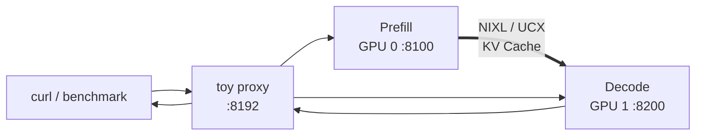

## 📑 本节目标
这一节把前面的概念落到 vLLM。 我们会搭建：
- GPU 0：Prefill / KV Producer。
- GPU 1：Decode / KV Consumer。
- 一个教学代理：按 P→D 顺序转发请求。
- NixlConnector：在两个实例之间搬运 KV。
最终不是得到一条“万能生产命令”， 而是完成一套可验证流程：
1. 核对版本和 Connector 参数。
2. 跑通 1P1D 正确性。
3. 与共置基线做同负载对照。
4. 测量 TTFT、TPOT、ITL 与 KV handoff。
5. 判断当前 vLLM 能力离生产还缺什么。
## 1. 先读官方边界
截至本文更新时， vLLM 稳定文档把 Disaggregated Prefilling 明确标记为：
> experimental and subject to change
官方还明确说明：
> Disaggregated prefill DOES NOT improve throughput.
它的两个主要目标是：
- 分别调优 TTFT 与 ITL。
- 控制混合 Prefill 导致的 tail ITL。
这两句决定了实验预期。 如果只比较输出 token/s， 可能看不到价值，甚至因复制权重和 KV 传输而更低。 应重点比较：
- TTFT SLO attainment。
- TPOT/ITL P95、P99。
- 满足组合 SLO 的 Goodput。
- 额外 GPU 与网络成本。
## 2. 实验拓扑

这个代理负责控制路径， NixlConnector 负责 KV 数据路径。 toy proxy 是教学组件， 不应被误解为高可用生产网关。
## 3. 环境前提
最低教学环境：
- Linux。
- 两张 vLLM 支持的 GPU。
- 两个实例都能加载同一模型。
- 对应 CUDA/驱动。
- 当前 vLLM 与匹配的 NIXL。
- 已克隆同版本 vLLM 仓库以使用测试代理。
同机实验可先走 CUDA IPC/UCX 路径， 跨机实验还要验证 RDMA/RoCE、网卡和防火墙。 不要在生产节点边看教程边升级依赖。 先建立隔离环境并记录完整版本。
## 4. 创建环境并核对版本
示例使用 `uv`：
```bash
uv venv --python 3.12 --seed
source .venv/bin/activate
uv pip install vllm nixl
```
生产复现应锁定已验证版本， 而不是每次安装最新包。 记录版本：
```bash
python - <<'PY'
import importlib.metadata as m
for name in ("vllm", "nixl", "torch"):
    print(name, m.version(name))
PY
```
核对 GPU：
```bash
nvidia-smi
nvidia-smi topo -m
```
核对当前 CLI：
```bash
vllm serve --help | rg "kv-transfer"
vllm bench serve --help | rg "goodput|request-rate"
```
若参数与本文不同， 以安装版本官方文档和 `--help` 为准。
## 5. 获取匹配的示例代码
官方 NixlConnector 教程使用仓库中的 toy proxy。
```bash
git clone https://github.com/vllm-project/vllm.git
cd vllm
git checkout <与你安装包匹配的tag或commit>
```
确认文件存在：
```bash
test -f tests/v1/kv_connector/nixl_integration/toy_proxy_server.py
```
这里的关键是“版本匹配”。 不要用 main 分支代理控制旧版 PyPI 引擎， 也不要反过来。
## 6. 启动 Prefill 实例
终端 A：
```bash
CUDA_VISIBLE_DEVICES=0 \
UCX_NET_DEVICES=all \
VLLM_NIXL_SIDE_CHANNEL_PORT=5600 \
vllm serve Qwen/Qwen3-0.6B \
  --host 0.0.0.0 \
  --port 8100 \
  --enforce-eager \
  --kv-transfer-config \
  '{"kv_connector":"NixlConnector","kv_role":"kv_producer","kv_load_failure_policy":"fail"}'
```
参数含义：
- `CUDA_VISIBLE_DEVICES=0`：隔离 P 到 GPU 0。
- `kv_producer`：该实例生产 KV。
- `5600`：NIXL 握手 side-channel 端口。
- `kv_load_failure_policy=fail`：教学时让 KV 加载失败显式暴露。
- `--enforce-eager`：遵循官方最小示例，先减少图捕获变量。
端口不得与其他进程冲突。
## 7. 启动 Decode 实例
终端 B：
```bash
CUDA_VISIBLE_DEVICES=1 \
UCX_NET_DEVICES=all \
VLLM_NIXL_SIDE_CHANNEL_PORT=5601 \
vllm serve Qwen/Qwen3-0.6B \
  --host 0.0.0.0 \
  --port 8200 \
  --enforce-eager \
  --kv-transfer-config \
  '{"kv_connector":"NixlConnector","kv_role":"kv_consumer","kv_load_failure_policy":"fail"}'
```
P 与 D 必须保持兼容：
- 同一模型与 revision。
- 同一 tokenizer/chat template 语义。
- 兼容的 KV dtype。
- 兼容的 block size 和并行布局。
- 对应 Connector 配置。
“两边都能独立启动”不代表可以正确交接 KV。
## 8. 启动教学代理
终端 C，在匹配版本的 vLLM 仓库根目录：
```bash
python tests/v1/kv_connector/nixl_integration/toy_proxy_server.py \
  --port 8192 \
  --prefiller-hosts localhost \
  --prefiller-ports 8100 \
  --decoder-hosts localhost \
  --decoder-ports 8200
```
代理负责：
1. 把请求发给 Prefill。
2. 获取 KV 交接参数。
3. 把请求和参数发给 Decode。
4. 将 Decode 输出返回客户端。
若仓库路径或参数变化， 查看该 tag 的 NixlConnector 官方文档， 不要猜代理协议。
## 9. 健康与正确性验证
先检查三个 HTTP 端点：
```bash
curl -fsS http://127.0.0.1:8100/health
curl -fsS http://127.0.0.1:8200/health
curl -fsS http://127.0.0.1:8192/health || true
```
toy proxy 未必实现 `/health`， 所以最后一条仅用于探测，不作为唯一健康证据。 发送最小请求：
```bash
curl http://127.0.0.1:8192/v1/chat/completions \
  -H "Content-Type: application/json" \
  -d '{
    "model": "Qwen/Qwen3-0.6B",
    "messages": [{"role": "user", "content": "用一句话解释 KV Cache。"}],
    "temperature": 0,
    "max_tokens": 32,
    "stream": false
  }'
```
同时观察 P、D 和代理日志。 成功标准不是只收到 HTTP 200， 还要确认：
- P 实际完成 Prefill。
- Connector 产生并传递 KV 参数。
- D 加载远端 KV 后继续生成。
- 输出 token 数和 finish reason 正常。
- 请求结束后 KV blocks 被释放。
## 10. 先做共置基线
使用第三张 GPU， 或停止 P/D 后复用其中一张：
```bash
CUDA_VISIBLE_DEVICES=0 \
vllm serve Qwen/Qwen3-0.6B \
  --host 0.0.0.0 \
  --port 8000 \
  --enforce-eager
```
基线与解耦组保持：
- 相同模型。
- 相同 dtype。
- 相同采样参数。
- 相同请求清单和到达时间。
- 相同输入/输出长度。
解耦用两张 GPU， 共置用一张 GPU 时， 既要比较绝对指标， 也要报告每 GPU Goodput。
## 11. Goodput 对照压测
共置端口：
```bash
vllm bench serve \
  --backend openai-chat \
  --base-url http://127.0.0.1:8000 \
  --endpoint /v1/chat/completions \
  --model Qwen/Qwen3-0.6B \
  --dataset-name random \
  --random-input-len 2048 \
  --random-output-len 256 \
  --num-prompts 500 \
  --request-rate 4 \
  --percentile-metrics ttft,tpot,itl \
  --metric-percentiles 50,95,99 \
  --goodput ttft:800 tpot:50 \
  --save-result \
  --save-detailed
```
对解耦代理重复同一命令， 只把 `--base-url` 改为 `http://127.0.0.1:8192`。 先确认 toy proxy 暴露的 API 与 benchmark backend 兼容。 若不兼容， 使用仓库对应 benchmark 脚本或编写显式两阶段客户端， 不要用不同请求语义强行比较。
## 12. 混合长度干扰实验
准备三类请求：
- 128 输入 / 256 输出。
- 2048 输入 / 256 输出。
- 8192 输入 / 64 输出。
按例如 70% / 20% / 10% 混合， 为每个请求保存固定到达时间。 在共置和解耦系统分别重放。 重点观察：
```text
short-request TTFT P99
all-request ITL P99
long-prefill handoff P99
SLO goodput
GPU-normalized goodput
```
如果解耦只降低短请求 ITL 尾部， 却没有提高裸吞吐， 这与官方定位并不矛盾。
## 13. KV handoff 怎样量
请求级增加或提取以下时间戳：
```text
prefill_end
kv_transfer_start
kv_transfer_end
decode_start
first_token
```
定义：
\[
T_{handoff}=T_{decode\_start}-T_{prefill\_end}
\]
并记录请求 KV 字节数：
\[
BW_{effective}=\frac{KVBytes}{T_{transfer}}
\]
若代理和 Connector 日志没有完整时间戳， 可先以教学 patch 加结构化日志， 但不要在延迟压测中保留高频同步日志。
## 14. 从单机走向跨机
跨机时至少补充：
- `VLLM_NIXL_SIDE_CHANNEL_HOST`。
- 每个 worker 唯一 side-channel 端口。
- `UCX_NET_DEVICES` 指向正确 HCA。
- RDMA/RoCE 连通性。
- GPU/NIC NUMA 亲和。
- 防火墙和网络 ACL。
- 有效带宽与 P99 测试。
注意： NixlConnector 使用 UCX 时， `NCCL_IB_HCA` 等 NCCL 环境变量并不配置 UCX。 应使用 UCX 对应变量。
## 15. 多 TP/DP 的端口与兼容性
官方 NixlConnector 文档说明， 每个 worker 需要唯一 side-channel 端口。 TP/DP 会让进程和端口映射更复杂。 上线前核对兼容矩阵：
- 模型架构是否支持。
- P 与 D 的 TP 组合是否支持。
- Prefix Cache、LoRA、量化是否兼容。
- 多模态和结构化输出是否经过验证。
- 当前 Connector 是否支持目标平台。
不要从 1P1D 单卡成功， 直接推断异构 TP 集群一定成功。
## 16. 多轮对话
标准单向路径为 P→D。 多轮时，D 已有上一轮生成后的 KV， 下一轮重新在 P 全量 Prefill 会浪费。 当前 NixlConnector 文档提供双向 KV 传输选项：
```json
{
  "kv_connector": "NixlConnector",
  "kv_role": "kv_producer",
  "kv_connector_extra_config": {
    "bidirectional_kv_xfer": true
  }
}
```
D 侧也要开启对应选项。 这还需要有状态代理按 `conversation_id` 保存并转发 KV 参数。 状态代理会新增：
- 会话亲和。
- KV TTL。
- 代理状态恢复。
- 租户隔离。
- 过期与重算策略。
因此先在单轮压测中验证基本链路， 再单独评估多轮。
## 17. Connector 选择建议
教学同机最小链路可用 NixlConnector 示例。 生产评估时按需求选择：
- NixlConnector 适合异步数据移动；LMCacheConnectorV1 面向分层缓存；P2pNcclConnector 和 Mooncake 等应按官方示例、拓扑与兼容矩阵评估。
不要只按 benchmark 峰值选 Connector。 还要比较升级兼容、可观测性、故障恢复和团队运维经验。
## 18. 实验能力与生产能力边界
官方示例能帮助验证：
- P/D 两实例可启动、Connector 能交接 KV、指定模型在小拓扑上结果正确，并观察基础延迟与带宽趋势。
它不自动提供：
- 高可用入口、状态复制、多租户鉴权、限流和配额。
- SLO 感知路由、动态 P:D 配比与安全扩缩容。
- 完整的取消、重试、幂等、跨故障域恢复语义。
- Connector 兼容承诺，以及生产监控、审计和容量门禁。
vLLM 官方也说明， 解耦 Prefill 与基础设施高度相关， 生产级能力依赖第三方 Connector 生态。 “有人用某 Connector 上生产” 不等于 vLLM 的整个解耦服务栈已经是一键生产方案。
## 19. 上线前门禁
至少通过：
### 正确性
- 固定 seed 的共置/解耦输出对照。
- 多种 Prompt 长度。
- 流式与非流式。
- 取消、超时、非法参数。
### 性能
- 稳态与 burst。
- 混合输入输出长度。
- Goodput 与每 GPU Goodput。
- KV handoff P99。
### 故障
- 杀死 P。
- 杀死 D。
- 重启代理。
- 中断网络。
- Connector 超时和迟到传输。
### 运维
- 滚动升级。
- 模型 revision 切换。
- 扩容和缩容。
- 指标、日志、trace 与告警。
- KV 敏感数据隔离。
任一故障测试都应验证资源最终释放， 而不只是客户端收到错误。
## 20. 排错顺序
若请求失败，按层排查：
1. P/D 模型是否分别能独立推理。
2. 代理是否把请求发给正确端口。
3. side channel 是否连通且端口唯一。
4. P 是否生成 `kv_transfer_params`。
5. D 是否收到并匹配请求 ID。
6. UCX/NIXL 是否选择预期设备。
7. KV dtype、block 和并行布局是否一致。
8. 超时前 KV lease 是否已过期。
一次只改变一个变量。 不要同时换 Connector、模型和网络配置。
## 📝 总结
1. vLLM 官方仍把 Disaggregated Prefilling 标为 experimental，并明确它不以提高吞吐为目标。
2. 1P1D 教学链路由代理控制路径和 Connector 数据路径组成。
3. NixlConnector 示例需要 producer、consumer 和匹配版本的 toy proxy。
4. 正确对照应使用相同请求回放，并同时报告尾延迟、Goodput 和每 GPU 成本。
5. 单机成功不代表跨机、TP/DP、多轮与异构拓扑兼容。
6. 生产还需补齐高可用路由、SLO 调度、弹性、故障语义、可观测性和安全。
## 🎯 自我检验
- [ ] 我能说明 vLLM 对该特性的官方定位与目标。
- [ ] 我能启动 P、D 和 toy proxy，并解释每个组件职责。
- [ ] 我会先核对安装版本、仓库 tag 和 CLI 参数。
- [ ] 我能设计共置与解耦的同负载对照。
- [ ] 我知道如何计算 KV handoff 与有效带宽。
- [ ] 我能列出至少六项官方示例未提供的生产能力。
- [ ] 我不会把 1P1D 成功外推为所有 TP/DP 拓扑兼容。
## 📚 官方与论文参考
- [vLLM：Disaggregated Prefilling（experimental）](https://docs.vllm.ai/en/stable/features/disagg_prefill/)
- [vLLM：NixlConnector Usage Guide](https://docs.vllm.ai/en/stable/features/nixl_connector_usage/)
- [vLLM GitHub：disaggregated examples](https://github.com/vllm-project/vllm/tree/main/examples/disaggregated)
- [NVIDIA NIXL 官方仓库](https://github.com/ai-dynamo/nixl)
- [LMCache：Disaggregated Prefill Example](https://docs.lmcache.ai/getting_started/quickstart/disaggregated_prefill.html)
- [DistServe（OSDI 2024）](https://www.usenix.org/conference/osdi24/presentation/zhong-yinmin)
- [Splitwise（ISCA 2024）](https://www.microsoft.com/en-us/research/publication/splitwise-efficient-generative-llm-inference-using-phase-splitting/)
