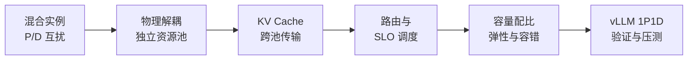

## 本章简介

一次 LLM 请求先完成 Prefill，再逐 token Decode。
它们共用同一套模型权重，却像“集中备菜”和“逐桌出餐”：
前者偏计算密集，后者偏显存带宽密集。
把两者混在同一批次有利于填满 GPU，却可能让长 Prompt 阻塞正在流式输出的请求。

P/D 解耦不是简单地把服务复制两份。
它把 Prefill 和 Decode 放入不同实例池，让两边分别选择并行策略、批大小、GPU 型号和扩缩容策略；
同时也新增 KV Cache 搬运、跨池路由、故障恢复和资源配比问题。

本章从“为什么要拆”逐步走到“怎样判断值得拆”：

- [**7.1 混合 Batching 的问题**](/AIInfraGuide/inference/模块四-推理优化/第7章-pd解耦架构/71-混合batching的问题)：用时间线和可复现实验观察 Prefill/Decode 干扰，并区分吞吐收益与尾延迟代价。
- [**7.2 解耦架构设计**](/AIInfraGuide/inference/模块四-推理优化/第7章-pd解耦架构/72-解耦架构设计)：拆解 DistServe、Splitwise 的设计目标，以及入口路由、P 池、D 池和控制面的职责。
- [**7.3 KV Cache 传输与 Connector**](/AIInfraGuide/inference/模块四-推理优化/第7章-pd解耦架构/73-kv-cache传输与connector)：手算 GQA 模型的 KV 大小、网络传输时间，理解 NIXL、NCCL、LMCache 等 Connector 的位置。
- [**7.4 Goodput 与 SLO 感知调度**](/AIInfraGuide/inference/模块四-推理优化/第7章-pd解耦架构/74-goodput与slo感知调度)：把 TTFT、TPOT、E2E SLO 合成 Goodput，用负载扫描找到可服务容量。
- [**7.5 解耦挑战与配比**](/AIInfraGuide/inference/模块四-推理优化/第7章-pd解耦架构/75-解耦挑战与配比)：从阶段服务时间推导 P:D 初始配比，再用排队、显存和故障域修正。
- [**7.6 vLLM Disaggregated Prefill 实战**](/AIInfraGuide/inference/模块四-推理优化/第7章-pd解耦架构/76-vllm-disaggregated-prefill实战)：搭建 1P1D 教学环境，明确官方示例、实验特性与生产编排之间的边界。

## 学习地图

## 建议的学习方式

先完成 7.1 的单实例基线，不要一上来部署解耦系统。
没有同模型、同数据集、同到达率的基线，就无法判断解耦是否真的提升了用户体验。

阅读 7.3 时请亲手代入自己的模型参数。
KV Cache 大小由层数、KV Head 数、Head Dimension、精度和 Prompt 长度共同决定，
不能用模型参数量直接猜测。

阅读 7.4 与 7.5 时，把“最大 QPS”改写为“在目标 SLO 下的最大 Goodput”。
生产容量规划关注的是有多少请求按时完成，而不是 GPU 忙了多久。

最后再进入 7.6。
截至本文更新时，vLLM 官方仍把 Disaggregated Prefilling 标为 experimental；
示例脚本可以验证数据面，但入口代理、调度、鉴权、重试、弹性与可观测性仍需生产控制面补齐。

## 本章完成标准

完成本章后，你应当能够：

1. 解释长 Prefill 为什么会抬高 Decode 的 ITL/TPOT 尾延迟。
2. 画出 P/D 解耦请求从入口到 KV 交接再到流式返回的路径。
3. 手算指定模型和 Prompt 的 KV Cache 字节数与理论传输时间。
4. 区分 Connector、传输后端、KV 存储层和集群路由器。
5. 用 TTFT/TPOT SLO 计算 Goodput，而不是只报告 Throughput。
6. 根据流量画像给出 P:D 的起始实例配比和压测校正方法。
7. 说明 vLLM 官方实验示例能验证什么、不能替代哪些生产能力。
