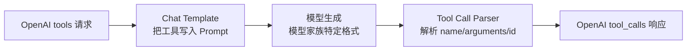

模型说“我应该查一下天气”和模型真正发出一个可执行的 `get_weather` 调用，是两回事。
中间至少隔着四层契约：客户端用什么协议声明工具、Chat Template 怎样把声明翻译给模型、模型怎样输出调用标记、Parser 又怎样把这些 Token 还原成结构化对象。任一层不匹配，都会出现“模型明明会用工具，API 却只返回一段普通文本”。
本节把这条链路完整拆开。
<!-- more -->

## 1. Tool Calling 不是模型执行函数
Tool Calling 的职责是让模型输出一个结构化意图：
```json
{"name":"get_weather","arguments":"{\"city\":\"杭州\"}"}
```
模型服务不会因此自动访问天气 API。真正的流程是：
1. 应用把工具定义和对话发给模型；
2. 模型决定是否调用工具并生成参数；
3. vLLM Parser 把模型文本解析成 `tool_calls`；
4. 应用校验参数、授权并执行函数；
5. 应用把工具结果作为 `tool` 消息回填；
6. 模型读取结果，生成最终答复或继续调用工具。
类比一下：模型是值班医生，Tool Calling 是开检查单。Parser 把手写检查单录入系统，但真正抽血、拍片和读取结果的是外部系统。医生不能因为写了“做 CT”就获得直接控制设备的权限。
📌 **关键点**：Tool Calling 是**协议化意图生成**，不是远程代码执行框架。
---

## 2. OpenAI tools 协议
### 2.1 声明工具
一个函数工具通常包含名称、描述和 JSON Schema 参数：
```python
tools = [
    {
        "type": "function",
        "function": {
            "name": "get_weather",
            "description": "查询指定城市当前天气",
            "parameters": {
                "type": "object",
                "properties": {
                    "city": {
                        "type": "string",
                        "description": "城市名，例如杭州",
                    },
                    "unit": {
                        "type": "string",
                        "enum": ["celsius", "fahrenheit"],
                    },
                },
                "required": ["city"],
                "additionalProperties": False,
            },
        },
    }
]
```
工具描述会进入模型上下文，因此要短、准、无歧义。多个工具描述高度相似时，模型容易选错。
### 2.2 tool_choice
常见选择包括：
- `"none"`：不调用工具；
- `"auto"`：由模型决定是否调用；
- 指定函数：要求调用某个命名工具；
- 某些接口或版本还提供强制“必须调用某个工具”的表达。
支持范围由模型、Chat Template、Parser 和 vLLM 版本共同决定，不能只看协议字段是否被服务端接受。
### 2.3 响应中的 tool_calls
典型响应消息：
```json
{"role":"assistant","content":null,"tool_calls":[{"id":"call_abc123","type":"function","function":{"name":"get_weather","arguments":"{\"city\":\"杭州\",\"unit\":\"celsius\"}"}}]}
```
`arguments` 通常是 JSON 字符串。应用必须先解析，再按自己的 Schema 校验，不能把它直接展开为函数参数。
### 2.4 回填工具结果
执行完成后，追加：
```python
messages.append(response.choices[0].message)
messages.append({
    "role": "tool",
    "tool_call_id": "call_abc123",
    "content": '{"temperature":31,"condition":"rain"}',
})
```
`tool_call_id` 把结果与请求对应起来。并行调用时，这个关联尤其重要。
---

## 3. vLLM 的解析链路
Tool Calling 不是一个 Parser 就能独立完成，而是一条流水线：

### 3.1 Chat Template
不同模型训练时见过的工具格式不同。有的用特殊 Token，有的生成 XML 风格标签，有的生成 JSON 块。
Chat Template 负责把统一的 OpenAI `tools` 请求翻译成该模型熟悉的 Prompt。如果模板没有工具分支，模型可能根本看不到工具定义。
### 3.2 Tool Call Parser
Parser 负责反向翻译：把模型特定格式还原为统一的 `tool_calls`。
例如模型可能生成：
```text
<tool_call>{"name":"get_weather","arguments":{"city":"杭州"}}</tool_call>
```
Parser 要识别边界、函数名、参数和并行调用，并在流式场景增量输出。
### 3.3 为什么 Parser 必须匹配模型
“Hermes Parser 能启动”不代表它适合任意模型。若模型训练格式与 Parser 规则不一致，可能出现：
- 调用被当成普通 `content`；
- 参数只解析一半；
- 特殊 Token 泄漏给用户；
- 多个调用被错误合并；
- 流式与非流式结果不同。
🔑 **核心概念**：模型、Tokenizer、Chat Template、Tool Parser 是一套协议栈，必须成套验证。
---

## 4. 自动与命名工具选择
### 4.1 启用自动工具选择
官方示例常见的启动方式如下：
```bash
vllm serve Qwen/QwQ-32B \
  --enable-auto-tool-choice \
  --tool-call-parser hermes
```
这里的模型和 Parser 只是一个官方示例组合。实际部署应从当前 vLLM Tool Calling 文档的模型表选择对应 Parser。
自动模式让模型在“直接回答”和“发起调用”之间决策，灵活但最依赖模型能力。
### 4.2 命名函数调用
客户端可以指定函数：
```python
tool_choice = {
    "type": "function",
    "function": {"name": "get_weather"},
}
```
这适合业务流程已经确定下一步动作，只需要模型填参数的情况。它减少选错工具，但不会自动保证参数事实正确。
### 4.3 什么时候不用 auto
以下场景优先使用命名调用或业务路由：
- 交易流程的下一步固定；
- 工具数量很多且相似；
- 错选工具代价高；
- 需要确定性的审计路径；
- 小模型的工具选择能力不足。
可以先由便宜分类器选择工具，再让模型只生成该工具参数。这是“多一步路由，少一分不确定性”的典型权衡。
---

## 5. 完整调用闭环
下面用 OpenAI Python Client 演示两轮调用：
```python
import json
from openai import OpenAI
client = OpenAI(
    base_url="http://localhost:8000/v1",
    api_key="EMPTY",
)
messages = [
    {"role": "user", "content": "杭州现在多少度？"}
]
first = client.chat.completions.create(
    model="Qwen/QwQ-32B",
    messages=messages,
    tools=tools,
    tool_choice="auto",
)
assistant_message = first.choices[0].message
messages.append(assistant_message)
for call in assistant_message.tool_calls or []:
    if call.function.name != "get_weather":
        raise ValueError("tool not allowed")
    args = json.loads(call.function.arguments)
    if set(args) - {"city", "unit"}:
        raise ValueError("unexpected arguments")
    # 示例桩：真实系统在这里调用经过鉴权的服务
    tool_result = {
        "city": args["city"],
        "temperature": 31,
        "unit": args.get("unit", "celsius"),
    }
    messages.append({
        "role": "tool",
        "tool_call_id": call.id,
        "content": json.dumps(tool_result, ensure_ascii=False),
    })
final = client.chat.completions.create(
    model="Qwen/QwQ-32B",
    messages=messages,
    tools=tools,
)
print(final.choices[0].message.content)
```
生产实现还要补：
- 参数模型校验；
- 工具级身份与权限；
- 超时、重试、幂等键；
- 输出大小限制；
- 调用次数和递归深度上限；
- 每一步审计日志。
📌 **关键点**：工具结果也属于不可信输入。网页抓取、数据库文本和第三方 API 都可能包含 Prompt Injection。
---

## 6. 流式与并行调用
### 6.1 参数会被拆成多个 Delta
流式响应中，函数参数可能这样到达：
```text
chunk 1: {"city"
chunk 2: :"杭
chunk 3: 州"}
```
客户端要按 `tool_call.index` 聚合名称和参数，结束后再解析 JSON。不要假设每个 Delta 都是合法 JSON。
### 6.2 parallel_tool_calls
当 `parallel_tool_calls=true` 时，模型可以一次返回多个调用，但“允许并行”不等于“保证并行”。行为取决于模型训练。
并行调用适合彼此独立的查询：
- 同时查天气和汇率；
- 同时读取多个只读数据源。
不适合有依赖关系的动作：
- 创建订单后再支付；
- 写入记录后再查询新 ID。
服务端协议允许并行，不代表业务语义允许并行。
### 6.3 流式回归测试
至少覆盖：
1. 单调用参数跨多个 Chunk；
2. 两个调用交错到达；
3. 空参数对象；
4. Unicode 与转义字符；
5. 中途取消；
6. Parser 遇到不完整调用的结束行为。
---

## 7. Reasoning Parser
Reasoning 模型可能把“推理过程”和“最终答案”放在不同标记区间。Reasoning Parser 的任务是把它们拆成协议字段。
启动示例：
```bash
vllm serve Qwen/QwQ-32B \
  --reasoning-parser deepseek_r1 \
  --enable-auto-tool-choice \
  --tool-call-parser hermes
```
再次强调：Parser 名称是版本和模型相关配置，应按当前官方支持表选择。
### 7.1 输出分离
客户端通常可以读取：
```python
message = response.choices[0].message
reasoning = getattr(message, "reasoning", None)
content = message.content
```
Reasoning Parser 不是让模型“开始思考”的开关。模型是否产生 reasoning、采用什么标记，主要由模型和模板决定；Parser 只是识别并分离已经生成的内容。
### 7.2 与工具调用组合
官方说明强调：同时启用时，工具解析应针对最终 `content`，而不是 reasoning 部分。否则模型在推理中提到“也许调用 X”可能被误判为真实调用。
正确顺序可以理解为：
1. 模型生成推理与最终区间；
2. Reasoning Parser 分离两者；
3. Tool Parser 从最终内容提取工具调用；
4. API 分别返回 reasoning、content 或 tool calls。
### 7.3 是否应该暴露 reasoning
生产系统需谨慎：
- 推理文本可能包含敏感上下文；
- 它可能比最终答案更长，增加网络与日志成本；
- 它不是可信的可解释性证明；
- 不同模型和版本的字段行为不同。
对最终用户通常只展示结论；若为调试保存 reasoning，应设置访问控制、脱敏和保留期限。
---

## 8. 组合、兼容性与版本
Tool Calling 的支持矩阵变化很快。上线前应锁定：
- vLLM 版本；
- 模型具体 Revision；
- Tokenizer Revision；
- Chat Template 文件及 Hash；
- Tool Parser 名称；
- Reasoning Parser 名称；
- 流式与并行工具调用配置。
### 8.1 升级回归集
准备一组黄金请求：
- 明确不应调用工具；
- 明确应调用单个工具；
- 必填参数缺失时应追问；
- 多工具歧义；
- 并行调用；
- 含 reasoning 的调用；
- 工具结果回填后的最终回答；
- 恶意参数与超长参数。
同时比较结构，不要只比较文本：
```text
finish_reason
tool_calls[].id
tool_calls[].function.name
tool_calls[].function.arguments
reasoning
content
```
### 8.2 SGLang 的位置
后续 SGLang 专章会介绍它自己的 Tool/Reasoning 解析能力。迁移或横向比较时，优先比较同一模型模板下的协议正确率、流式增量行为和 Parser 维护成本，不要假设 Parser 名称可以跨引擎照搬。
---

## 9. 安全与生产权衡
### 9.1 最小权限
每个工具只获得完成任务所需权限。读取天气的工具不应拥有任意 HTTP 访问能力，查订单的工具不应默认能退款。
### 9.2 参数白名单
永远不要：
```python
subprocess.run(json.loads(arguments)["command"], shell=True)
```
应把模型参数映射到预定义操作，并限制枚举、长度、域名、路径和资源 ID。
### 9.3 人工确认
转账、删除、发信、发布等高风险动作应在执行前展示结构化预览，由用户确认。模型提出动作不等于用户授权动作。
### 9.4 延迟预算
一次工具循环至少包含两次模型请求和一次外部调用。链路延迟约为：
$$ T = T_{\text{model-1}} + T_{\text{tool}} + T_{\text{model-2}} + T_{\text{queue/network}} $$
减少无意义的二次润色、并行独立只读调用、给工具设置超时，通常比只优化一次模型 TPOT 更有效。
### 9.5 可观测性
记录：
- 模型选择了哪个工具；
- Parser 是否成功；
- 参数校验是否通过；
- 工具耗时和状态码；
- 是否重试；
- 最终调用轮数；
- 调用 ID 与业务 Trace ID 的关联。
不要在日志中原样保存令牌、隐私字段或完整 reasoning。
---

## 📝 总结
- Tool Calling 生成结构化执行意图，实际执行、授权和重试由应用负责。
- OpenAI tools 协议用 `tools` 声明函数，用 `tool_choice` 控制选择，用 `tool_calls` 返回调用。
- Chat Template 把统一请求翻译给模型，Tool Parser 把模型特定输出翻译回统一协议。
- 模型、Tokenizer、Template 和 Parser 必须成套匹配。
- 流式参数要按调用索引累计；允许并行不代表业务动作可以并行。
- Reasoning Parser 分离已有推理内容，不会凭空赋予模型推理能力。
- 高风险工具必须最小权限、参数白名单、人工确认和完整审计。

## 🎯 自我检验清单
- 能解释 Tool Calling 与函数执行的边界
- 能写出 `tools`、`tool_choice` 和工具结果回填消息
- 能说明 Chat Template 与 Tool Parser 各自职责
- 能解释为什么 Parser 不能随意跨模型复用
- 能完成“模型—工具—模型”的两轮闭环
- 能正确累计流式工具参数
- 能判断多个调用是否具备业务并行条件
- 能说明 Reasoning Parser 与 Tool Parser 的组合顺序
- 能为高风险工具设计权限与确认机制
- 能列出升级时必须固定和回归的组件

## 📚 官方参考
- [vLLM — Tool Calling](https://docs.vllm.ai/en/latest/features/tool_calling/)
- [vLLM — Reasoning Outputs](https://docs.vllm.ai/en/latest/features/reasoning_outputs/)
- [vLLM — OpenAI Chat Completion Tool Calls With Reasoning](https://docs.vllm.ai/en/latest/examples/reasoning/openai_chat_completion_tool_calls_with_reasoning/)
- [vLLM — OpenAI-Compatible Server](https://docs.vllm.ai/en/latest/serving/online_serving/openai_compatible_server/)
- [OpenAI API — Function Calling](https://platform.openai.com/docs/guides/function-calling)
