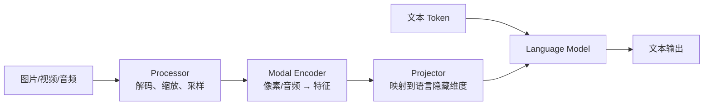
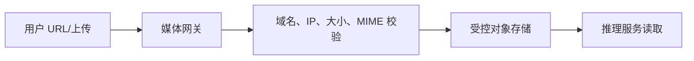

文本模型的输入成本大致由 Token 数决定，多模态模型却多了一条隐藏流水线：图片要下载、解码、缩放、切 Patch，再经过 Vision Encoder 变成向量，最后才能与文本 Token 一起进入语言模型。
因此，“同样 500 个文字 Token”的两个请求，可能因为一张 4K 图片和一张缩略图而拥有完全不同的 TTFT、CPU 开销与显存峰值。
本节不按模型名单罗列支持项，而是沿数据路径解释每一层的机制与缓存。
<!-- more -->

## 1. VLM 比 LLM 多了什么
典型 VLM 可以抽象成：

不同模型架构差异很大：
- 有的图片固定切 Patch；
- 有的按分辨率动态切块；
- 有的额外生成缩略图；
- 视频模型会抽帧；
- 音频模型先做频谱特征；
- 有的 Encoder 可独立运行，有的与 Decoder 深度交织。
所以多模态容量不能只用“图片张数”衡量，还要考虑像素、帧数、音频长度和模型处理规则。
类比一下：文本请求像已装箱的标准快递，进入仓库就能扫描；图片像散装货，必须先拆包、称重、重新装成标准托盘。托盘最终也进入同一仓库，但前处理成本完全不同。
---

## 2. 从图片到语言 Token
### 2.1 Processor
Processor 在 CPU 侧完成的工作通常包括：
- 下载或读取媒体；
- 图片解码和颜色空间转换；
- Resize、Crop、Normalize；
- 动态分辨率或 Tile 规划；
- 视频抽帧；
- 构造模型要求的占位 Token 与元数据。
它可能成为 CPU 瓶颈。GPU 利用率低不一定是模型慢，也可能是媒体还没处理完。
### 2.2 Vision Encoder
处理后的像素 Tensor 进入 Vision Transformer 或其他 Encoder，产生视觉 Embedding。
计算量通常随 Patch 数增长。对固定 Patch 尺寸的简化估算：
$$ N_{\text{patch}} \approx \frac{H}{P_h} \times \frac{W}{P_w} $$
若模型会切多个 Tile，还要乘以 Tile 数。原图像素翻倍并不总是只让成本翻倍，预处理规则可能导致阶梯式增长。
### 2.3 Projector
Encoder 输出维度与语言模型隐藏维度通常不同，需要 Projector 映射。有些模型还会压缩视觉 Token，降低进入语言 Decoder 的序列长度。
### 2.4 Language Decoder
视觉 Embedding 最终占据上下文位置，和文本一起进入语言模型。它会影响：
- Prefill 计算；
- KV Cache 占用；
- 最大上下文；
- 后续 Decode 可用显存。
📌 **关键点**：媒体成本分成两部分——Encoder 的一次性成本，以及视觉 Token 进入语言模型后的 Prefill/KV 成本。
---

## 3. vLLM OpenAI 多模态请求
先启动一个当前受支持的 VLM：
```bash
vllm serve Qwen/Qwen2.5-VL-3B-Instruct \
  --limit-mm-per-prompt '{"image": 2, "video": 0}'
```
模型支持情况、输入上限和必要参数会变化，应以当前 vLLM Supported Models 与模型说明为准。
### 3.1 图片 URL
```python
from openai import OpenAI
client = OpenAI(base_url="http://localhost:8000/v1", api_key="EMPTY")
response = client.chat.completions.create(
    model="Qwen/Qwen2.5-VL-3B-Instruct",
    messages=[
        {
            "role": "user",
            "content": [
                {"type": "text", "text": "描述图片中的安全风险"},
                {
                    "type": "image_url",
                    "image_url": {
                        "url": "https://assets.example.com/site/a.jpg"
                    },
                },
            ],
        }
    ],
)
```
### 3.2 Data URL
小图片也可使用 Base64 Data URL，但会放大请求体和网关内存：
```python
{
    "type": "image_url",
    "image_url": {
        "url": "data:image/jpeg;base64,..."
    },
}
```
Base64 体积约比原始二进制大三分之一。高并发大图场景更适合受控对象存储 URL，而不是把媒体塞进 JSON。
### 3.3 Chat Template 的占位
多模态 Chat Template 会在文本中插入图片占位，并保证占位数量与媒体输入对应。
常见失败包括：
- 消息有两张图，模板只产生一个占位；
- 模型要求图片在文本前，模板顺序错误；
- 使用了文本模型的 Template；
- Processor Revision 与模型 Revision 不匹配。
OpenAI 请求形状正确，只说明 API 层收到了数据，不保证模型模板正确消费。
---

## 4. 三类容易混淆的 Cache
多模态服务里至少有三类 Cache。
### 4.1 Processor Cache
缓存媒体预处理结果，主要避免同一图片重复解码、Resize 和 Tokenization。
普通 URL 请求仍要取得媒体内容，才能计算 Hash 并确认缓存身份，因此不能默认把“命中 Processor Cache”解释成“跳过下载”。它主要节省 CPU 预处理；当前 vLLM 提供 `mm_processor_cache_gb` 等配置，并可能支持不同缓存类型。
### 4.2 Encoder Cache
缓存 Vision/Audio Encoder 的输出 Embedding，避免同一媒体重复做 GPU Encoder Forward。
它主要节省 Encoder 计算和 TTFT，但缓存项可能很大，取决于视觉 Token 数与隐藏维度。
### 4.3 Language KV Cache
缓存语言模型 Attention 的 Key/Value，服务于后续 Decode 或 Prefix Cache。
它与 Encoder Cache 不是同一对象：
| Cache | 输入 | 保存内容 | 主要节省 |
|---|---|---|---|
| Processor Cache | 原始媒体 | 预处理 Tensor/元数据 | CPU、I/O |
| Encoder Cache | 预处理 Tensor | 模态 Embedding | Encoder GPU 计算 |
| KV Cache | 语言序列 | Attention K/V | LLM Prefill/Decode |
类比一座餐厅：
- Processor Cache 是洗好切好的食材；
- Encoder Cache 是做好的半成品酱汁；
- KV Cache 是桌上已经上过的菜和点单上下文。
它们都叫“缓存”，但命中条件、存储位置和淘汰代价完全不同。
---

## 5. Hash 与重复媒体复用
要复用同一媒体，系统需要稳定的缓存键。常见思路是对媒体内容或预处理结果做 Hash。
### 5.1 URL 不是内容身份
同一 URL 的内容可能变化，不同 URL 也可能指向相同内容。只拿 URL 字符串做键会出现：
- 内容更新但错误命中旧缓存；
- 签名 URL 每次变化导致无法命中；
- 多个 CDN 地址重复保存相同图片。
更稳妥的是对实际字节或规范化内容做 Hash，并把影响处理结果的配置纳入键：
```text
cache_key = hash(
  media_bytes,
  processor_revision,
  resize_config,
  model_revision
)
```
### 5.2 Hash 也有成本
大视频计算内容 Hash 会消耗 CPU 并延迟开始时间。可根据可信边界选择：
- 客户端提供可信内容 ID；
- 对象存储 ETag + 版本号；
- 服务端流式计算 Hash；
- 禁用跨请求缓存。
客户端提供的 Hash 若未经验证，只能当 Hint，不能直接当可信内容证明。
### 5.3 缓存失效
模型、Processor 或图像变换参数升级后，旧 Embedding 不一定兼容。缓存键必须包含版本信息，或发布时整体清空。
📌 **关键点**：正确命中比高命中更重要。错用旧 Embedding 的结果往往不会报错，只会悄悄降低质量。

### 5.4 用 UUID 显式引用已缓存媒体
当前 vLLM 的多模态接口可为媒体提供稳定的 `multi_modal_uuids`。只有客户端明确引用服务端已缓存的 UUID，并按该版本 API 允许的方式省略媒体数据时，才可能连传输/抓取一起跳过。

这条路径有严格前提：UUID 必须与媒体、Processor 和模型版本绑定；若服务端缓存未命中而请求又没有携带媒体数据，请求应失败，而不是猜测内容。它更像受控对象句柄，不是客户端随意填写的可信 Hash。
---

## 6. 输入限制与显存预算
### 6.1 limit_mm_per_prompt
当前 vLLM 使用 `limit_mm_per_prompt` 限制每个 Prompt 的媒体数量：
```python
from vllm import LLM
llm = LLM(
    model="Qwen/Qwen2.5-VL-3B-Instruct",
    limit_mm_per_prompt={"image": 3, "video": 1},
)
```
不使用的模态可设为 0，避免为不可能出现的输入做不必要预留。
当前版本还支持带尺寸 Hint 的配置形式，例如图片宽高、视频帧数。官方说明这类 Hint 主要影响内存 Profiling，不等于运行时自动 Resize 或硬限制。
### 6.2 不能只限制张数
“最多 4 张图”仍可能允许四张超大图片。网关和媒体服务还应限制：
- 单文件字节数；
- 解码后像素数；
- 宽高比；
- 视频时长与帧数；
- 音频时长和采样率；
- 全请求媒体总预算。
### 6.3 显存竞争
VLM 显存近似分为：
$$ M = M_{\text{LLM weights}} + M_{\text{encoder weights}} + M_{\text{encoder activations}} + M_{\text{encoder cache}} + M_{\text{KV cache}} + M_{\text{workspace}} $$
增加 Encoder Cache 或多模态激活预留，可能挤压语言 KV Cache，降低可服务并发。
### 6.4 mm_processor_cache_gb
官方配置允许调整多模态 Processor Cache 大小：
```bash
vllm serve Qwen/Qwen2.5-VL-3B-Instruct \
  --mm-processor-cache-gb 2
```
多进程、数据并行和缓存类型会改变总 CPU/共享内存占用。不要把参数值简单理解为整个集群唯一的一份 2 GiB。
---

## 7. Encoder 并行与性能
### 7.1 TP 不一定是最佳 Encoder 策略
语言模型常用 Tensor Parallel 切权重。多模态 Encoder 也可以随 TP 切分，但某些 Encoder 算子通信占比高，未必高效。
当前 vLLM 对部分模型提供多模态 Encoder 的数据并行式执行选项，例如通过 `mm_encoder_tp_mode="data"` 让不同 TP Rank 处理不同媒体样本。
是否支持取决于模型实现。不能看到参数就假设所有 VLM 可用。
### 7.2 CPU Pipeline
生产中建议把阶段指标拆开：
```text
fetch_ms
decode_ms
processor_ms
encoder_queue_ms
encoder_ms
llm_prefill_ms
first_token_ms
```
如果只记录 TTFT，你只知道“慢”，不知道慢在下载、CPU 解码、Encoder 排队还是 LLM Prefill。
### 7.3 缓存对 TTFT 的影响
同一请求至少测三种状态：
1. **全冷**：媒体、Processor、Encoder 都未命中；
2. **Processor 热**：跳过重复预处理，普通 URL 路径仍可能下载媒体；只有受控 UUID 命中路径才可省略传输；
3. **Encoder 热**：直接复用 Embedding。
把热缓存成绩当成所有请求性能，会严重高估真实容量。
---

## 8. 远程媒体与安全
让推理服务自行抓取 URL 会引入 SSRF 风险。攻击者可能请求：
- 云元数据地址；
- 内网管理端；
- 本机回环地址；
- 巨大文件或压缩炸弹；
- 重定向到禁止域名；
- 伪造 MIME 的恶意文件。
### 8.1 推荐架构

媒体网关应：
- 只允许 HTTP(S) 或直接禁止任意 URL；
- 解析 DNS 后阻止内网、回环和 Link-local；
- 限制重定向次数并逐跳复验；
- 边下载边限制字节数；
- 解码后检查像素和帧数；
- 设置连接和读取超时；
- 扫描文件并生成不可变对象 ID。
### 8.2 allow list 不是万能
vLLM 提供的远程媒体相关选项会随版本变化。即使有允许域名配置，也应把推理服务放在网络出口策略之后。
应用层域名白名单防不了 DNS Rebinding、错误代理配置或后续重定向，网络层 Egress Policy 才是最后一道墙。
### 8.3 隐私与日志
图片可能包含人脸、证件和屏幕内容。不要在普通请求日志中保存：
- 原始 Base64；
- 带签名 URL；
- 未脱敏 OCR；
- 可反推内容的长期缓存键映射。
为 Processor/Encoder Cache 设置明确的租户隔离与保留期限。
---

## 9. 压测和工程权衡
### 9.1 压测维度
| 维度 | 典型取值 |
|---|---|
| 图片数 | 0、1、上限 |
| 分辨率 | 小图、常见、极限 |
| 视频 | 短、长、不同帧数 |
| 缓存 | 全冷、Processor 热、Encoder 热 |
| 文本 | 短 Prompt、长 Prompt |
| 输出 | 短回答、长回答 |
| 并发 | 单请求、稳态、突发 |
关注：
- 端到端 TTFT 与 P99；
- Processor CPU 利用率；
- Encoder GPU 时间；
- 缓存命中率和淘汰；
- KV Cache 可用块；
- 下载失败、解码失败和输入拒绝率。
### 9.2 质量与成本
降低图片分辨率、视频帧数或视觉 Token 能减少延迟与显存，但可能损失小字、细节和时序信息。
正确做法是按任务建立评测：
- OCR 看字符准确率；
- 图表问答看数值正确率；
- 视频理解看关键事件召回；
- 通用问答看任务成功率。
然后在质量约束下寻找最低媒体预算，而不是盲目追求最高吞吐。
### 9.3 与 SGLang 比较
后续 SGLang 专章会展开其多模态路径。比较时应固定媒体内容、预处理配置、模型 Revision、缓存状态和输入限制；若两边 Processor 不同，所谓“同一张图”可能已经变成不同数量的视觉 Token。
---

## 📝 总结
- VLM 在语言模型前增加媒体下载、Processor、Encoder 和 Projector 链路。
- 媒体成本既包括 Encoder 一次性计算，也包括视觉 Token 带来的 LLM Prefill 与 KV Cache。
- Processor Cache、Encoder Cache、语言 KV Cache 保存不同对象，优化不同阶段。
- 媒体缓存键应包含内容与处理版本，URL 字符串本身不是可靠内容身份。
- `limit_mm_per_prompt`、尺寸 Hint 和 `mm_processor_cache_gb` 要结合目标版本理解。
- 远程媒体必须防 SSRF、压缩炸弹和隐私泄漏，推理服务不应成为任意 URL 代理。
- 多模态压测要区分冷、温、热缓存，并按真实分辨率和帧数建模。

## 🎯 自我检验清单
- 能画出媒体从输入到语言 Decoder 的完整路径
- 能解释视觉 Token 同时影响 Prefill 和 KV Cache
- 能区分 Processor Cache、Encoder Cache 与 KV Cache
- 能设计包含版本信息的媒体缓存键
- 能说明 `limit_mm_per_prompt` 为什么不能替代像素和字节限制
- 能估算 VLM 主要显存组成
- 能定位 TTFT 慢在下载、Processor、Encoder 还是 LLM
- 能为远程媒体设计 SSRF 防护
- 能构造冷、温、热缓存压测
- 能在质量约束下选择分辨率或帧数预算

## 📚 官方参考
- [vLLM — Multimodal Inputs](https://docs.vllm.ai/en/latest/features/multimodal_inputs/)
- [vLLM — Multimodal Examples](https://docs.vllm.ai/en/latest/examples/generate/multimodal/)
- [vLLM — Conserving Memory](https://docs.vllm.ai/en/latest/configuration/conserving_memory/)
- [vLLM — Optimization and Tuning](https://docs.vllm.ai/en/latest/configuration/optimization/)
- [vLLM — Supported Models](https://docs.vllm.ai/en/latest/models/supported_models/)
