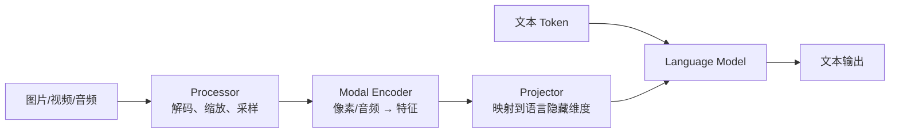
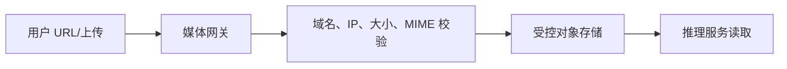

文本模型的输入成本大致由 Token 数决定，多模态模型却多了一条隐藏流水线：图片要下载、解码、缩放、切 Patch，再经过 Vision Encoder 变成向量，最后才能与文本 Token 一起进入语言模型。
因此，“同样 500 个文字 Token”的两个请求，可能因为一张 4K 图片和一张缩略图而拥有完全不同的 TTFT、CPU 开销与显存峰值。
本节不按模型名单罗列支持项，而是沿数据路径解释每一层的机制与缓存。
<!-- more -->

## 1. VLM 比 LLM 多了什么
典型 VLM 可以抽象成：

不同模型架构差异很大：
- 有的图片固定切 Patch；
- 有的按分辨率动态切块；
- 有的额外生成缩略图；
- 视频模型会抽帧；
- 音频模型先做频谱特征；
- 有的 Encoder 可独立运行，有的与 Decoder 深度交织。
所以多模态容量不能只用“图片张数”衡量，还要考虑像素、帧数、音频长度和模型处理规则。
类比一下：文本请求像已装箱的标准快递，进入仓库就能扫描；图片像散装货，必须先拆包、称重、重新装成标准托盘。托盘最终也进入同一仓库，但前处理成本完全不同。
---

## 2. 从图片到语言 Token
### 2.1 Processor
Processor 在 CPU 侧完成的工作通常包括：
- 下载或读取媒体；
- 图片解码和颜色空间转换；
- Resize、Crop、Normalize；
- 动态分辨率或 Tile 规划；
- 视频抽帧；
- 构造模型要求的占位 Token 与元数据。
它可能成为 CPU 瓶颈。GPU 利用率低不一定是模型慢，也可能是媒体还没处理完。
### 2.2 Vision Encoder
处理后的像素 Tensor 进入 Vision Transformer 或其他 Encoder，产生视觉 Embedding。
计算量通常随 Patch 数增长。对固定 Patch 尺寸的简化估算：
$$ N_{\text{patch}} \approx \frac{H}{P_h} \times \frac{W}{P_w} $$
若模型会切多个 Tile，还要乘以 Tile 数。原图像素翻倍并不总是只让成本翻倍，预处理规则可能导致阶梯式增长。
### 2.3 Projector
Encoder 输出维度与语言模型隐藏维度通常不同，需要 Projector 映射。有些模型还会压缩视觉 Token，降低进入语言 Decoder 的序列长度。
### 2.4 Language Decoder
视觉 Embedding 最终占据上下文位置，和文本一起进入语言模型。它会影响：
- Prefill 计算；
- KV Cache 占用；
- 最大上下文；
- 后续 Decode 可用显存。
📌 **关键点**：媒体成本分成两部分——Encoder 的一次性成本，以及视觉 Token 进入语言模型后的 Prefill/KV 成本。
---

## 3. 沿张量维度走一遍图片路径

下面用 ViT 风格 Encoder 做机制推导。具体模型可能动态切块、压缩 Token 或插入特殊位置，最终 Shape 要以目标 Processor 和模型代码为准。

### 3.1 URL 到字节

远程图片首先是一个不可信资源描述：

```text
https://assets.example.com/a.jpg
```

Fetcher 得到压缩字节 $B_{\text{compressed}}$。这个大小与解码后内存没有线性保证。一张 8 MiB 压缩图片解码成 RGB 可能是：

$$
M_{\text{decoded}}=H\times W\times C
$$

例如 $8192\times8192\times3$：

$$
8192^2\times3\approx192\text{ MiB}
$$

还未算解码库临时缓冲。因此下载字节上限与解码像素上限必须同时存在。

### 3.2 Media Processor 的 Shape

假设 Processor 将图像 resize/crop 为 $H=336,W=336$，归一化后组成：

$$
X_{\text{pixel}}\in\mathbb{R}^{B\times C\times H\times W}
=\mathbb{R}^{B\times3\times336\times336}
$$

若 dtype 为 FP32，单图 Tensor：

$$
3\times336\times336\times4\approx1.29\text{ MiB}
$$

CPU 侧可能先有 uint8 HWC，再创建 float CHW，所以峰值不是最终 Tensor 大小。

动态分辨率模型可能产生 $N_{\text{tile}}$ 个 Tensor：

$$
X_{\text{pixel}}\in
\mathbb{R}^{(\sum_i N_{\text{tile},i})\times C\times H_t\times W_t}
$$

Batch 维已经不再等于请求数，需要 `image_grid_thw`、tile offsets 或类似元数据恢复归属。

### 3.3 Patch Embedding

Patch size $P=14$，每边 Patch 数：

$$
H_p=W_p=\frac{336}{14}=24
$$

每图视觉 Token：

$$
N_p=24\times24=576
$$

Patch flatten 后维度 $3P^2=588$，线性投影到视觉隐藏维度 $D_v$，例如 1024：

$$
X_0\in\mathbb{R}^{B\times576\times1024}
$$

若加 CLS Token 则是 577；若模型使用二维位置编码、patch merge 或任意分辨率，数量会不同。

### 3.4 Vision Encoder

经过 $L_v$ 层后：

$$
H_v=\operatorname{ViT}(X_0)
\in\mathbb{R}^{B\times N_v\times D_v}
$$

FP16/BF16 输出大小：

$$
M_{\text{encoder output}}
=B\times N_v\times D_v\times2
$$

单图 $576\times1024$ 约 1.125 MiB。训练时 Attention 激活很大；推理也有 Q/K/V、Attention workspace 和层间临时张量，但生命周期通常短于 Cache。

### 3.5 Projector

语言模型隐藏维度设为 $D_l=4096$。最简单的线性投影：

$$
H_l=H_vW_p,\quad
W_p\in\mathbb{R}^{D_v\times D_l}
$$

得到：

$$
H_l\in\mathbb{R}^{B\times576\times4096}
$$

BF16 约 4.5 MiB/图。有些 Projector 会把每 $2\times2$ Patch merge，Token 数从 576 降到 144，同时通道拼接后再投影。此时：

$$
H_l\in\mathbb{R}^{B\times144\times4096}
$$

不要把 Encoder 输出 Token 数直接当 LLM 视觉 Token 数；Projector/Resampler 是中间的容量闸门。

### 3.6 与文本 Embedding 拼接

文本 Token：

$$
E_t\in\mathbb{R}^{B\times N_t\times D_l}
$$

视觉占位被替换或扩展后，LLM 输入：

$$
E_{\text{llm}}\in
\mathbb{R}^{B\times(N_t+N_{\text{vision}})\times D_l}
$$

如果 200 个文本 Token 加 576 个视觉 Token，Prefill 长度为 776，而不是 201 个“文本 + 一张图”。

### 3.7 视觉 Token 对 KV 的影响

对标准 MHA，每层 KV 元素：

$$
N_{\text{KV/layer/token}}
=2\times n_{\text{kv-heads}}\times d_{\text{head}}
$$

整个模型：

$$
M_{\text{KV}}
=N_{\text{tokens}}\times L
\times2\times n_{\text{kv-heads}}\times d_{\text{head}}
\times b
$$

若 $L=32,n_{\text{kv-heads}}=8,d_{\text{head}}=128,b=2$：

```text
KV/token = 32 * 2 * 8 * 128 * 2
         = 131,072 bytes = 128 KiB
```

576 个视觉 Token 约占：

```text
576 * 128 KiB = 72 MiB/request
```

四张同规格图片就是约 288 MiB/request，仅视觉部分就可能显著降低并发。

---

## 4. vLLM OpenAI 多模态请求
先启动一个当前受支持的 VLM：
```bash
vllm serve Qwen/Qwen2.5-VL-3B-Instruct \
  --limit-mm-per-prompt '{"image": 2, "video": 0}'
```
模型支持情况、输入上限和必要参数会变化，应以当前 vLLM Supported Models 与模型说明为准。
### 4.1 图片 URL
```python
from openai import OpenAI
client = OpenAI(base_url="http://localhost:8000/v1", api_key="EMPTY")
response = client.chat.completions.create(
    model="Qwen/Qwen2.5-VL-3B-Instruct",
    messages=[
        {
            "role": "user",
            "content": [
                {"type": "text", "text": "描述图片中的安全风险"},
                {
                    "type": "image_url",
                    "image_url": {
                        "url": "https://assets.example.com/site/a.jpg"
                    },
                },
            ],
        }
    ],
)
```
### 4.2 Data URL
小图片也可使用 Base64 Data URL，但会放大请求体和网关内存：
```python
{
    "type": "image_url",
    "image_url": {
        "url": "data:image/jpeg;base64,..."
    },
}
```
Base64 体积约比原始二进制大三分之一。高并发大图场景更适合受控对象存储 URL，而不是把媒体塞进 JSON。
### 4.3 Chat Template 的占位
多模态 Chat Template 会在文本中插入图片占位，并保证占位数量与媒体输入对应。
常见失败包括：
- 消息有两张图，模板只产生一个占位；
- 模型要求图片在文本前，模板顺序错误；
- 使用了文本模型的 Template；
- Processor Revision 与模型 Revision 不匹配。
OpenAI 请求形状正确，只说明 API 层收到了数据，不保证模型模板正确消费。
---

### 4.4 URL 获取边界

“接口支持 URL”不代表推理进程应直接访问互联网。生产路径最好是：

```text
untrusted URL/upload
 -> media gateway fetch and validate
 -> immutable object + content id
 -> inference service reads approved object
```

若因部署限制必须由 vLLM 直接抓取，至少在网络层限制 Egress，并按目标版本核对允许域名、本地路径和重定向配置。应用级 allow-list 不能替代网络策略。

---

## 5. 三类容易混淆的 Cache
多模态服务里至少有三类 Cache。
### 5.1 Processor Cache
缓存媒体预处理结果，主要避免同一图片重复解码、Resize 和 Tokenization。
普通 URL 请求仍要取得媒体内容，才能计算 Hash 并确认缓存身份，因此不能默认把“命中 Processor Cache”解释成“跳过下载”。它主要节省 CPU 预处理；当前 vLLM 提供 `mm_processor_cache_gb` 等配置，并可能支持不同缓存类型。
### 5.2 Encoder Cache
缓存 Vision/Audio Encoder 的输出 Embedding，避免同一媒体重复做 GPU Encoder Forward。
它主要节省 Encoder 计算和 TTFT，但缓存项可能很大，取决于视觉 Token 数与隐藏维度。
### 5.3 Language KV Cache
缓存语言模型 Attention 的 Key/Value，服务于后续 Decode 或 Prefix Cache。
它与 Encoder Cache 不是同一对象：
| Cache | 输入 | 保存内容 | 主要节省 |
|---|---|---|---|
| Processor Cache | 原始媒体 | 预处理 Tensor/元数据 | CPU、I/O |
| Encoder Cache | 预处理 Tensor | 模态 Embedding | Encoder GPU 计算 |
| KV Cache | 语言序列 | Attention K/V | LLM Prefill/Decode |
类比一座餐厅：
- Processor Cache 是洗好切好的食材；
- Encoder Cache 是做好的半成品酱汁；
- KV Cache 是桌上已经上过的菜和点单上下文。
它们都叫“缓存”，但命中条件、存储位置和淘汰代价完全不同。

### 5.4 三类 Cache 的键

一个合理的概念键：

```text
processor_key = hash(
  media_content_id,
  processor_revision,
  decode/resize/crop/frame_sampling_config
)

encoder_key = hash(
  processor_key,
  encoder_weight_revision,
  encoder_runtime_config,
  output_dtype
)

kv_prefix_key = hash(
  exact_llm_input_token_ids_or_embeddings,
  llm_revision,
  adapter_revision,
  positional_state
)
```

三者不能共用一个裸 URL Hash。Processor 相同但 Encoder 权重升级时，只能复用前者；Encoder Embedding 相同但 Prompt 中图片位置改变时，LLM KV 未必可复用。

### 5.5 Cache 大小推导

Processor Cache 项可能保存像素 Tensor：

$$
M_p\approx N_{\text{tile}}\times C\times H_t\times W_t\times b_p
$$

Encoder Cache：

$$
M_e\approx N_{\text{vision}}\times D_l\times b_e
$$

语言 KV：

$$
M_{kv}\approx N_{\text{context}}\times
L\times2n_{kv}d_h\times b_{kv}
$$

若 Projector 后单图为 `576 x 4096 x BF16`，Encoder Cache 约 4.5 MiB；对应 32 层 GQA LLM KV 约 72 MiB。缓存 Encoder 输出节省重复编码，但不自动消除本次请求在语言模型中的 KV。

### 5.6 生命周期与租户隔离

同一公开图片可跨租户去重吗？技术上可以，安全上未必。内容 Hash 命中可能形成侧信道：攻击者通过延迟判断某媒体是否被其他租户处理过。

敏感系统应把 `tenant_id` 或安全域加入 Cache namespace，并统一限制：

- TTL；
- 最大项和总字节；
- 命中可见性；
- 驱逐日志；
- 删除/合规请求；
- 发布时版本失效。

---

## 6. Hash、UUID 与重复媒体复用
要复用同一媒体，系统需要稳定的缓存键。常见思路是对媒体内容或预处理结果做 Hash。
### 6.1 URL 不是内容身份
同一 URL 的内容可能变化，不同 URL 也可能指向相同内容。只拿 URL 字符串做键会出现：
- 内容更新但错误命中旧缓存；
- 签名 URL 每次变化导致无法命中；
- 多个 CDN 地址重复保存相同图片。
更稳妥的是对实际字节或规范化内容做 Hash，并把影响处理结果的配置纳入键：
```text
cache_key = hash(
  media_bytes,
  processor_revision,
  resize_config,
  model_revision
)
```
### 6.2 Hash 也有成本
大视频计算内容 Hash 会消耗 CPU 并延迟开始时间。可根据可信边界选择：
- 客户端提供可信内容 ID；
- 对象存储 ETag + 版本号；
- 服务端流式计算 Hash；
- 禁用跨请求缓存。
客户端提供的 Hash 若未经验证，只能当 Hint，不能直接当可信内容证明。
### 6.3 缓存失效
模型、Processor 或图像变换参数升级后，旧 Embedding 不一定兼容。缓存键必须包含版本信息，或发布时整体清空。
📌 **关键点**：正确命中比高命中更重要。错用旧 Embedding 的结果往往不会报错，只会悄悄降低质量。

### 6.4 用 UUID 显式引用已缓存媒体
当前 vLLM 的多模态接口可为媒体提供稳定的 `multi_modal_uuids`。只有客户端明确引用服务端已缓存的 UUID，并按该版本 API 允许的方式省略媒体数据时，才可能连传输/抓取一起跳过。

这条路径有严格前提：UUID 必须与媒体、Processor 和模型版本绑定；若服务端缓存未命中而请求又没有携带媒体数据，请求应失败，而不是猜测内容。它更像受控对象句柄，不是客户端随意填写的可信 Hash。

### 6.5 下载边界的精确定义

普通 URL 流程通常是：

```text
URL -> fetch bytes -> hash/identify -> processor cache lookup
```

因此 Processor Cache 命中不天然省下载。若系统先信任 URL 字符串并跳过获取，会在 URL 内容变化时错误复用。

只有受控句柄流程：

```text
UUID -> authenticated cache/object lookup -> existing immutable bytes/result
```

才可能省去客户端上传或服务端重新抓取。即便如此，查找、授权和 Cache miss 处理仍有成本。

### 6.6 UUID 注册协议

平台可以把 UUID 注册设计为：

```text
POST media
 -> gateway validates bytes
 -> stores immutable object
 -> computes content hash
 -> pre-process/encode optionally
 -> returns opaque UUID + expiry + model/processor scope
```

推理请求引用 UUID 时检查：

- 租户是否有权访问；
- 是否过期；
- 模态类型；
- Processor/模型 Scope；
- 内容对象是否仍存在；
- Cache miss 时是否允许从对象存储恢复。

UUID 不应直接暴露本地路径、对象存储 Key 或内容 Hash。

---

## 7. VLM 容量手算
### 7.1 limit_mm_per_prompt
当前 vLLM 使用 `limit_mm_per_prompt` 限制每个 Prompt 的媒体数量：
```python
from vllm import LLM
llm = LLM(
    model="Qwen/Qwen2.5-VL-3B-Instruct",
    limit_mm_per_prompt={"image": 3, "video": 1},
)
```
不使用的模态可设为 0，避免为不可能出现的输入做不必要预留。
当前版本还支持带尺寸 Hint 的配置形式，例如图片宽高、视频帧数。官方说明这类 Hint 主要影响内存 Profiling，不等于运行时自动 Resize 或硬限制。
### 7.2 不能只限制张数
“最多 4 张图”仍可能允许四张超大图片。网关和媒体服务还应限制：
- 单文件字节数；
- 解码后像素数；
- 宽高比；
- 视频时长与帧数；
- 音频时长和采样率；
- 全请求媒体总预算。
### 7.3 显存竞争
VLM 显存近似分为：
$$ M = M_{\text{LLM weights}} + M_{\text{encoder weights}} + M_{\text{encoder activations}} + M_{\text{encoder cache}} + M_{\text{KV cache}} + M_{\text{workspace}} $$
增加 Encoder Cache 或多模态激活预留，可能挤压语言 KV Cache，降低可服务并发。
### 7.4 mm_processor_cache_gb
官方配置允许调整多模态 Processor Cache 大小：
```bash
vllm serve Qwen/Qwen2.5-VL-3B-Instruct \
  --mm-processor-cache-gb 2
```
多进程、数据并行和缓存类型会改变总 CPU/共享内存占用。不要把参数值简单理解为整个集群唯一的一份 2 GiB。

### 7.5 单请求预算例子

假设：

```text
LLM: 32 layers, 8 KV heads, head_dim=128, BF16 KV
text prompt: 512 tokens
output budget: 256 tokens
images: 2
vision tokens/image after projector: 576
encoder cache output: 576 x 4096 x BF16
```

总上下文预算：

$$
N=512+2\times576+256=1920
$$

单 Token KV 为 128 KiB，因此请求走到最大长度时：

$$
M_{kv}=1920\times128\text{ KiB}=240\text{ MiB}
$$

两张图 Encoder Cache：

$$
M_e=2\times576\times4096\times2
=9\text{ MiB}
$$

仅这两项约 249 MiB。若 GPU 有 20 GiB 可用于 KV/Encoder Cache，忽略碎片和其他预留的理论并发：

$$
\left\lfloor\frac{20\times1024}{249}\right\rfloor=82
$$

这不是可部署并发，因为还缺 Encoder 激活、workspace、Block 对齐、调度水位和请求长度分布。若保留 25% 安全余量：

```text
usable = 20 GiB * 0.75 = 15 GiB
rough concurrent requests = 15*1024/249 ≈ 61
```

再用目标负载压测校准。

### 7.6 Encoder 激活峰值

Vision Attention 的中间矩阵可能随 $N_v^2$ 增长。把图片边长从 336 提到 672，Patch 数约变为 4 倍；朴素 Attention score 元素可变为 16 倍。虽然 FlashAttention 等实现避免物化完整矩阵，计算和 workspace 仍显著增加。

容量 Profiling 必须覆盖允许的最大分辨率/Tile，而不是只用平均图片。

### 7.7 CPU 与网络容量

设 QPS 为 $Q$，平均压缩媒体大小 $\bar B$，缓存前下载带宽：

$$
BW_{\text{ingress}}\approx Q\times\bar B
$$

20 QPS、每请求 2 张平均 3 MiB 图片：

```text
20 * 2 * 3 MiB/s = 120 MiB/s ≈ 0.94 Gibit/s
```

还未计重试和峰值。推理 GPU 有余量时，1 Gbit/s 网络和图片解码 CPU 已可能先饱和。

---

## 8. Encoder 并行与性能
### 8.1 TP 不一定是最佳 Encoder 策略
语言模型常用 Tensor Parallel 切权重。多模态 Encoder 也可以随 TP 切分，但某些 Encoder 算子通信占比高，未必高效。
当前 vLLM 对部分模型提供多模态 Encoder 的数据并行式执行选项，例如通过 `mm_encoder_tp_mode="data"` 让不同 TP Rank 处理不同媒体样本。
是否支持取决于模型实现。不能看到参数就假设所有 VLM 可用。
### 8.2 CPU Pipeline
生产中建议把阶段指标拆开：
```text
fetch_ms
decode_ms
processor_ms
encoder_queue_ms
encoder_ms
llm_prefill_ms
first_token_ms
```
如果只记录 TTFT，你只知道“慢”，不知道慢在下载、CPU 解码、Encoder 排队还是 LLM Prefill。
### 8.3 缓存对 TTFT 的影响
同一请求至少测三种状态：
1. **全冷**：媒体、Processor、Encoder 都未命中；
2. **Processor 热**：跳过重复预处理，普通 URL 路径仍可能下载媒体；只有受控 UUID 命中路径才可省略传输；
3. **Encoder 热**：直接复用 Embedding。
把热缓存成绩当成所有请求性能，会严重高估真实容量。

### 8.4 阶段队列要分开

如果 Processor 和 Encoder 共用一个无界请求队列，大视频会阻塞小图片。可以分别设置：

- fetch 并发与字节预算；
- decode worker 池；
- Processor 像素/帧预算；
- Encoder token budget；
- LLM scheduler token budget。

拒绝应发生在昂贵解码前。已经知道 `Content-Length`、图片头尺寸或视频时长超限时，不要等进入 GPU 才失败。

---

## 9. 可复现实验：分解 TTFT 与三类 Cache

### 9.1 固定实验资产

准备三张无隐私、不可变图片：

```text
small.jpg   336x336
wide.jpg    1344x336
large.jpg   2048x2048
```

计算 SHA-256，放入本地受控 HTTP 服务或对象存储 Versioned URL。不要用会变化的公共网页图片。

### 9.2 记录 Processor 输出 Shape

先独立运行模型 Processor：

```python
from PIL import Image
from transformers import AutoProcessor

model_id = "<PINNED_VLM_ID>"
revision = "<PINNED_REVISION>"
processor = AutoProcessor.from_pretrained(model_id, revision=revision)

for name in ["small.jpg", "wide.jpg", "large.jpg"]:
    image = Image.open(name).convert("RGB")
    batch = processor(images=image, text="描述图片", return_tensors="pt")
    print(name)
    for key, value in batch.items():
        shape = getattr(value, "shape", None)
        print(" ", key, shape, getattr(value, "dtype", None))
```

这一步确认实际 Pixel Tensor、grid/tile 元数据和文本长度。不同 VLM 的参数名不同，实验输出本身就是容量输入。

### 9.3 服务端实验矩阵

对每张图片发送相同 Prompt、`temperature=0`、固定 `max_tokens=64`，每种状态运行至少 30 次：

```text
cold URL/content
same URL repeated
different URL, same bytes
registered UUID hit
UUID miss without media
processor revision changed
model/encoder revision changed
```

普通 URL 重复时单独记录下载字节，不能因 TTFT 下降就声称跳过了 Fetch。

### 9.4 客户端计时骨架

```python
import time
from openai import OpenAI

client = OpenAI(base_url="http://127.0.0.1:8000/v1", api_key="EMPTY")

def run(image_url):
    start = time.perf_counter()
    first = None
    stream = client.chat.completions.create(
        model="<PINNED_VLM_ID>",
        messages=[{
            "role": "user",
            "content": [
                {"type": "text", "text": "客观描述图片，最多三点。"},
                {"type": "image_url", "image_url": {"url": image_url}},
            ],
        }],
        temperature=0,
        max_tokens=64,
        stream=True,
    )
    text = []
    for chunk in stream:
        delta = chunk.choices[0].delta.content
        if delta:
            first = first or time.perf_counter()
            text.append(delta)
    end = time.perf_counter()
    return {
        "ttft_ms": (first - start) * 1000,
        "e2e_ms": (end - start) * 1000,
        "text": "".join(text),
    }
```

客户端只能测端到端。服务端 Trace 要补齐 `fetch_ms` 到 `llm_prefill_ms`。

### 9.5 观测指标

```text
media_fetch_seconds{source,result}
media_fetch_bytes{source}
media_decode_seconds{format,result}
media_decoded_pixels{modality}
mm_processor_seconds{model}
mm_processor_cache_hit_total{tenant,processor_revision}
mm_encoder_seconds{model}
mm_encoder_tokens{model,modality}
mm_encoder_cache_hit_total{tenant,encoder_revision}
llm_prefill_tokens{type=text_or_multimodal}
kv_cache_bytes_or_blocks
mm_rejected_total{reason}
```

关联键包括 `media_content_id` 的脱敏短前缀、Processor/Encoder Revision、视觉 Token 数和缓存状态。不要记录签名 URL 或原始 Base64。

### 9.6 质量侧实验

性能优化必须同时跑任务指标：

- OCR：character error rate；
- 图表：数值/单位 exact match；
- 文档：字段提取 F1；
- 通用问答：人工或黄金答案准确率。

降低分辨率或抽帧后，如果 TTFT 降 30% 但小字准确率从 95% 降到 70%，不是有效优化。

---

## 10. 远程媒体与安全
让推理服务自行抓取 URL 会引入 SSRF 风险。攻击者可能请求：
- 云元数据地址；
- 内网管理端；
- 本机回环地址；
- 巨大文件或压缩炸弹；
- 重定向到禁止域名；
- 伪造 MIME 的恶意文件。
### 10.1 推荐架构

媒体网关应：
- 只允许 HTTP(S) 或直接禁止任意 URL；
- 解析 DNS 后阻止内网、回环和 Link-local；
- 限制重定向次数并逐跳复验；
- 边下载边限制字节数；
- 解码后检查像素和帧数；
- 设置连接和读取超时；
- 扫描文件并生成不可变对象 ID。
### 10.2 allow list 不是万能
vLLM 提供的远程媒体相关选项会随版本变化。即使有允许域名配置，也应把推理服务放在网络出口策略之后。
应用层域名白名单防不了 DNS Rebinding、错误代理配置或后续重定向，网络层 Egress Policy 才是最后一道墙。
### 10.3 隐私与日志
图片可能包含人脸、证件和屏幕内容。不要在普通请求日志中保存：
- 原始 Base64；
- 带签名 URL；
- 未脱敏 OCR；
- 可反推内容的长期缓存键映射。
为 Processor/Encoder Cache 设置明确的租户隔离与保留期限。

### 10.4 生产失败模式

**下载成功但内容变化**：URL 未变、内容更新，裸 URL Cache 错命中。使用不可变对象版本和内容身份。

**解码炸弹**：压缩字节很小，像素/帧极大。读取文件头和流式解码时执行像素、帧、内存预算。

**重定向绕过**：首 URL 在 allow-list，302 指向内网。每一跳重新解析 DNS、检查 IP 和协议。

**Processor/模型漂移**：Processor Revision 更新，Encoder Cache 仍命中旧 Embedding。把所有处理版本放入键，并在发布中失效。

**占位数量错配**：媒体列表与模板占位不一致。请求在进入 Encoder 前明确失败，记录数量而非原内容。

**UUID 悬空**：Cache 被驱逐且请求不带媒体。返回可识别 Cache miss，不回退到猜 URL 或空图片。

**Encoder OOM**：平均图片能跑，最大 Tile Batch 激活峰值溢出。Admission control 使用视觉 Token/像素预算，而不只图片数。

**Cache 隐私泄漏**：跨租户命中造成延迟侧信道或删除后仍可访问。按安全域 Namespace，并为 UUID 做授权。

**媒体顺序错乱**：异步 Fetch 完成顺序与消息顺序不同。通过稳定 index 关联，不能按 Future 完成顺序拼接。

**取消后仍下载**：客户端已断开，大视频仍占带宽和 CPU。把取消信号传到 Fetch/Decode/Encoder 队列。

---

## 11. 版本边界、压测和工程权衡
### 11.1 版本边界

以下项目随 vLLM、Transformers 和模型实现变化：

- OpenAI 多模态消息类型及视频/音频字段；
- `limit_mm_per_prompt` 与尺寸 Hint 语义；
- `mm_processor_cache_gb`、缓存类型及进程间共享；
- `multi_modal_uuids` 的请求形状、允许省略数据的条件；
- URL、本地路径、允许域名相关配置；
- Encoder Cache 生命周期；
- `mm_encoder_tp_mode` 支持模型；
- Prefix Cache 与多模态 Embedding 的组合；
- Processor 参数透传方式。

机制推导可迁移，参数名和支持矩阵必须在锁定版本上验证。

### 11.2 压测维度
| 维度 | 典型取值 |
|---|---|
| 图片数 | 0、1、上限 |
| 分辨率 | 小图、常见、极限 |
| 视频 | 短、长、不同帧数 |
| 缓存 | 全冷、Processor 热、Encoder 热 |
| 文本 | 短 Prompt、长 Prompt |
| 输出 | 短回答、长回答 |
| 并发 | 单请求、稳态、突发 |
关注：
- 端到端 TTFT 与 P99；
- Processor CPU 利用率；
- Encoder GPU 时间；
- 缓存命中率和淘汰；
- KV Cache 可用块；
- 下载失败、解码失败和输入拒绝率。
### 11.3 质量与成本
降低图片分辨率、视频帧数或视觉 Token 能减少延迟与显存，但可能损失小字、细节和时序信息。
正确做法是按任务建立评测：
- OCR 看字符准确率；
- 图表问答看数值正确率；
- 视频理解看关键事件召回；
- 通用问答看任务成功率。
然后在质量约束下寻找最低媒体预算，而不是盲目追求最高吞吐。
### 11.4 与 SGLang 比较
后续 SGLang 专章会展开其多模态路径。比较时应固定媒体内容、预处理配置、模型 Revision、缓存状态和输入限制；若两边 Processor 不同，所谓“同一张图”可能已经变成不同数量的视觉 Token。
---

## 📝 总结
- VLM 在语言模型前增加媒体下载、Processor、Encoder 和 Projector 链路。
- 媒体成本既包括 Encoder 一次性计算，也包括视觉 Token 带来的 LLM Prefill 与 KV Cache。
- Processor Cache、Encoder Cache、语言 KV Cache 保存不同对象，优化不同阶段。
- 媒体缓存键应包含内容与处理版本，URL 字符串本身不是可靠内容身份。
- `limit_mm_per_prompt`、尺寸 Hint 和 `mm_processor_cache_gb` 要结合目标版本理解。
- 远程媒体必须防 SSRF、压缩炸弹和隐私泄漏，推理服务不应成为任意 URL 代理。
- 多模态压测要区分冷、温、热缓存，并按真实分辨率和帧数建模。

## 🎯 自我检验清单
- 能画出媒体从输入到语言 Decoder 的完整路径
- 能解释视觉 Token 同时影响 Prefill 和 KV Cache
- 能区分 Processor Cache、Encoder Cache 与 KV Cache
- 能设计包含版本信息的媒体缓存键
- 能说明 `limit_mm_per_prompt` 为什么不能替代像素和字节限制
- 能估算 VLM 主要显存组成
- 能定位 TTFT 慢在下载、Processor、Encoder 还是 LLM
- 能为远程媒体设计 SSRF 防护
- 能构造冷、温、热缓存压测
- 能在质量约束下选择分辨率或帧数预算

## 📚 官方参考
- [vLLM — Multimodal Inputs](https://docs.vllm.ai/en/latest/features/multimodal_inputs/)
- [vLLM — Multimodal Examples](https://docs.vllm.ai/en/latest/examples/generate/multimodal/)
- [vLLM — Conserving Memory](https://docs.vllm.ai/en/latest/configuration/conserving_memory/)
- [vLLM — Optimization and Tuning](https://docs.vllm.ai/en/latest/configuration/optimization/)
- [vLLM — Supported Models](https://docs.vllm.ai/en/latest/models/supported_models/)
